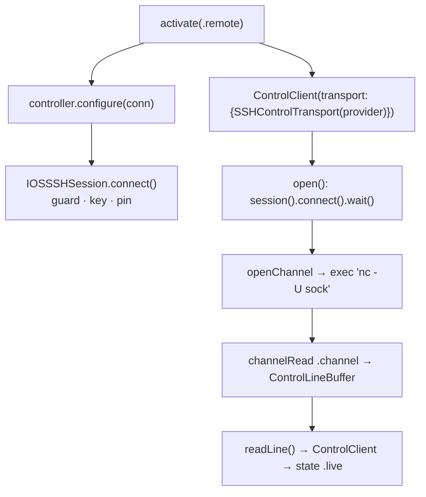
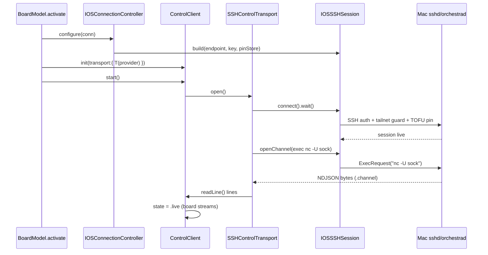
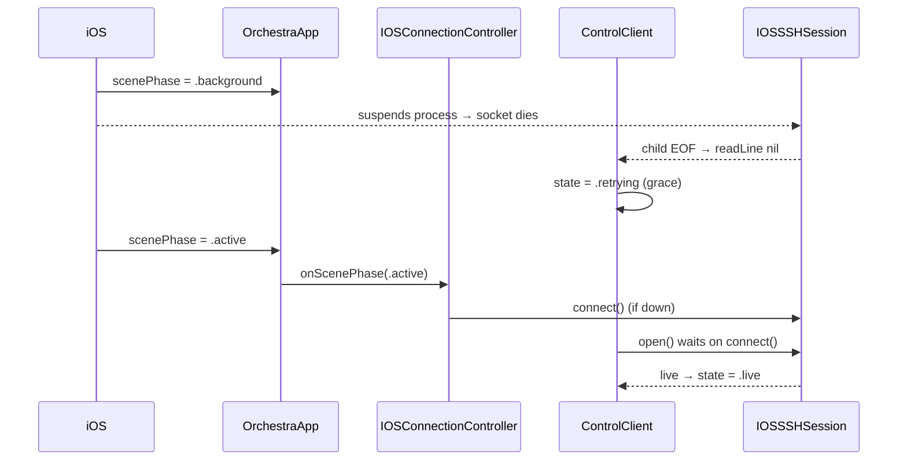

# Layer 3 — Implementation: iOS on a real phone

> The **how**. Written with [[04-tests]], one combined gate. Scope: **P1 in full** (board over SSH);
> P2–P4 sketched and refined when reached. Contracts: [[02-contract]].

## Implementation approach (per component)

### P1.1 `ControlLineBuffer` (new — `Sources/OrchestraKit/Control/ControlLineBuffer.swift`) ✅ DONE
Pure, dependency-free, fully unit-testable — build first.

> **Deviation (implemented):** placed in `OrchestraKit/Control/` (not `App-iOS/Terminal/`) — it's generic
> NDJSON buffering, a sibling of `LineReader`, and this lets it be TDD'd via fast offline `swift test`
> (`Tests/OrchestraCoreTests/ControlLineBufferTests.swift`) instead of the slow Simulator XCTest path.
> 6/6 tests green (incl. the concurrent EOF-wake).
- `NSCondition`-guarded `Data` accumulator + a queue of complete lines.
- `append(_ bytes:)`: append, split on `0x0A`, enqueue each complete line (without `\n`), `signal()`.
- `readLine() -> Data?`: `wait()` until a line is queued or EOF; pop + return, or `nil` at EOF.
- `signalEOF()`: set EOF, `broadcast()`. On EOF **drop any incomplete trailing frame** (mirrors
  `LineReader` at `Sources/OrchestraKit/Control/UDSSocket.swift`).

### P1.2 `IOSSSHSession` (new — `App-iOS/Terminal/IOSSSHSession.swift`)
Hoists the **connection half** of `SSHPTYChannel.start` (`:206–257`). Reuses `PubkeyAuthDelegate`,
`PinningHostKeyDelegate`, `HostKeyGate`, `ChannelBox` **verbatim** (make them non-`private`/shared).
- `connect()`: tailnet guard (`SSHEndpoint.tailnetRejectionReason` unless `isTestLoopbackAllowed`) →
  `NIOSSHPrivateKey(ed25519Key: try SSHKeyStore.loadOrCreateIdentity())` → `ClientBootstrap(group:)`
  with `SSHClientConfiguration(userAuthDelegate:serverAuthDelegate:)` → `.connect(host:port:)` →
  `parent.pipeline.handler(type: NIOSSHHandler.self)` → store `(parent, handler)`.
- **Connect-once:** a single in-flight `EventLoopFuture<Void>` shared by concurrent callers; `.live`
  short-circuits. State machine `connecting/live/retrying/down` + backoff (250 ms→5 s, copy
  `ControlClient.backoffMillis`). On `parent.closeFuture` → `.retrying` → reconnect.
- `openChannel(_ init:)`: hop to `parent.eventLoop` → `handler.createChannel(promise, channelType: .session, init)`
  (the API is **loop-only**, `NIOSSHHandler.swift:274`). Returns the child `Channel` future.
- **Host-key fan-out:** `PinningHostKeyDelegate` reports to the session's subscriber list (lock-guarded
  arrays), not a single terminal `bridge`. `onStateChange`/`onHostKeyChanged` append callbacks.

### P1.3 `SSHControlTransport` (new — `App-iOS/Terminal/SSHControlTransport.swift`)
- `open()`: `guard let s = session() else { throw }` → `try s.connect().wait()` (safe — off-loop) →
  `s.openChannel { ch in ch.setOption(.allowRemoteHalfClosure, true).flatMap { ch.pipeline.addHandler(ControlChannelHandler(command: bridgeCommand, buffer: buffer)) } }.wait()` → store `ChannelBox`.
- `ControlChannelHandler: ChannelInboundHandler` (`InboundIn = SSHChannelData`): `channelActive` triggers
  **`ExecRequest(command: bridgeCommand, wantReply: false)`** (NO `PseudoTerminalRequest` → raw stdio);
  `channelRead` forwards **only `.channel`** bytes → `buffer.append`; `.stdErr` → diagnostic log;
  `channelInactive` → `buffer.signalEOF()`.
- **`bridgeCommand`** (nc primary + socat fallback + `~` expansion):
  `sh -lc 'exec nc -U "<sock>" 2>/dev/null || exec socat - UNIX-CONNECT:"<sock>"'`.
- `write`: `childBox.sendBytes(Array(data))` (`writeAndFlush(SSHChannelData(type:.channel,...))` on the loop).
- `readLine`: `buffer.readLine()`. `close`: `childBox.close()` + `buffer.signalEOF()` — **child channel
  only**, never `session.close()`.

### P1.4 `Connection` + `SSHEndpoint.resolve` (`Sources/OrchestraKit/Connection.swift`, `App-iOS/Terminal/SSHEndpoint.swift`)
- ✅ **`Connection.mac(...)` + `defaultMacSocketPath` DONE** (OrchestraKit, 3/3 green via `swift test`).
- `Connection.sshEndpoint` lives in **App-iOS** (SSHEndpoint is iOS-only): `sshTarget.flatMap(SSHEndpoint.init(target:))`.
- **P1** adds `resolve(connection:env:)` returning `connection?.sshEndpoint` (env loopback override for
  Simulator). The board uses it; terminals keep the old `resolve(env:defaults:)`. **P2** deletes
  `orch_ssh_target` and migrates terminals.

### P1.5 `IOSConnectionController` (new — `App-iOS/Terminal/IOSConnectionController.swift`)
- `@MainActor ObservableObject`; owns a `CurrentSessionBox` (`@unchecked Sendable`, `NSLock` around
  `IOSSSHSession?`). `sessionProvider = { [box] in box.current() }`.
- `configure(_ conn:)`: build `IOSSSHSession` from `conn.sshEndpoint!`, `box.set(session)`, wire
  `session.onStateChange` → `@Published state` (hop to main), tear down the previous session.
- `onScenePhase(.active)`: if `state == .down`, `session.connect()`. `.background`: note (socket dies).
- `teardown()`: `box.set(nil)` + `session.close()`.

### P1.6 `BoardModel.activate` (iOS) + app wiring (`Sources/OrchestraUI/BoardModel.swift`, `App-iOS/OrchestraApp.swift`)
- iOS `BoardModel` gains `controller: IOSConnectionController` (instantiated in the iOS init branch).
- `activate` per [[02-contract]]: `.remote` + `sshEndpoint` → `controller.configure(conn)`, capture
  `controller.sessionProvider`, build `ControlClient(transport:)`; else the Simulator/dev `socketPath:` path.
- `OrchestraApp`: observe `@Environment(\.scenePhase)` → `controller.onScenePhase(phase)`.

## Edge cases & error handling

| Case | Handling |
|------|----------|
| `nc` missing on Mac | `socat` fallback in `bridgeCommand`; both missing → exec fails → channel closes → `open()` throws → `ControlClient` retries → board shows Disconnected; `.stdErr` logged |
| Host-key changed mid-session | `PinningHostKeyDelegate` fails closed → session `.down` + `onHostKeyChanged` fan-out → UI alert; user resets pin in Settings |
| Background suspension mid-stream | parent socket dies → child EOF → `readLine` nil → `ControlClient` retry; foreground `onScenePhase(.active)` reconnects; grace before "Disconnected" |
| Connection switch while live | `activate` re-runs → `controller.configure(new)` tears down old session + builds new; old `ControlClient` closed; new factory reads new box |
| `openChannel` before parent live | shared in-flight `connect()` future; `openChannel` chains on it |
| Partial NDJSON frame across chunks | `ControlLineBuffer` accumulates; multiple lines per chunk all enqueued; incomplete trailing dropped at EOF |
| `~` in socket path | `sh -lc` login shell expands it on the Mac (direct exec would not) |
| Double backoff (session vs ControlClient) | session owns parent-connection backoff; `ControlClient.open()` waits on `connect()` — retries compose, don't fight |

## Sequencing / build order

1. **`ControlLineBuffer`** + its unit tests (pure, no SSH).
2. **`IOSSSHSession`** — share the delegates/`ChannelBox` out of `SSHPTYChannel` (don't yet refactor
   `SSHPTYChannel` itself — that's P2).
3. **`SSHControlTransport`** + `ControlChannelHandler` (uses session + buffer).
4. **`Connection.mac`/`sshEndpoint`** + `SSHEndpoint.resolve(connection:)`.
5. **`IOSConnectionController`** + `CurrentSessionBox`.
6. **`BoardModel.activate` (iOS)** wiring + `OrchestraApp` `scenePhase`.
7. **Loopback e2e harness** ([[04-tests]]) → board live over SSH on the Simulator.

## Diagrams

### Bird's-eye (implementation path)

### Detailed (sequence) — board goes live over SSH

### Detailed (sequence) — background → foreground reconnect

## Traceability → Layer 2 contracts

| L2 contract | Implemented by |
|-------------|----------------|
| `IOSSSHSession` | P1.2 — connection-half hoist + connect-once + `openChannel` + fan-out |
| `SSHControlTransport` | P1.3 — `open`/`write`/`readLine`/`close` + `ControlChannelHandler` |
| `ControlLineBuffer` | P1.1 — condvar line buffer |
| `Connection` extension | P1.4 — `mac()` + `sshEndpoint` |
| `SSHEndpoint.resolve(connection:)` | P1.4 — new overload (P2 deletes `orch_ssh_target`) |
| `IOSConnectionController` | P1.5 — owner + box + `scenePhase` |
| `BoardModel.activate` (iOS) | P1.6 — delegate + provider capture |
| Onboarding surface | **P3** (sketch below) |
| Entitlements split | **P3** (sketch below) |
| Terminal fold | **P2** (sketch below) |

## P2–P4 sketch (refined when reached)

- **P2 — terminals on the shared session:** refactor `SSHPTYChannel.start` to call
  `controller.currentSession().openChannel { … PTYChannelHandler … }` instead of its own bootstrap;
  drop the per-channel connect/auth/guard (now at session). Delete `orch_ssh_target`/`targetDefaultsKey`
  + `TerminalTargetSettingsSection`; re-source `SecuritySettingsSection.host` from the active connection;
  migrate terminals to `resolve(connection:)`. `IOSTerminalHost` reads the controller from the environment.
- **P3 — onboarding + free device build:** `OnboardingModel` flow (prereqs → `authorizedKeyLine()` copy →
  target entry w/ `settingsRejectionReason` → Test via `IOSSSHSession.connect()` + `version` RPC → persist
  `Connection.mac`). Launch gate on "no configured connection" in `OrchestraApp` (none today). Settings
  "Mac connection" replaces `TerminalTargetSettingsSection`. **Entitlements split:** `OrchestraiOS-nopush.entitlements`
  (no `aps-environment`) selected via a `project.yml` build config for the free personal-team device lane.
- **P4 — real push (optional/deferred, paid-only):** `DaemonLifecycle.install()` + plist inject
  `EnvironmentVariables` (`ORCH_APNS_*`) + drop-point logging; re-add `aps-environment`; owner supplies `.p8`.

## Concerns / decisions for review

- **Sharing `SSHPTYChannel`'s private delegates** into `IOSSSHSession` means widening their access.
  Acceptable — they're already file-scoped helpers; move them to a shared `SSHClientPrimitives.swift`.
- **`connect().wait()` inside `open()`** blocks a `ControlClient` connect thread (not the NIO loop) — safe,
  and matches how `UDSTransport.open()` blocks on `UDS.connect`.
- **Session vs ControlClient reconnect layering** — verified non-fighting (session owns parent backoff;
  ControlClient's open() waits). Called out so review confirms no thundering reconnect.

## Open questions — need your call

- [ ] None blocking for P1. P2 terminal-fold specifics (host-key event routing to multiple terminal UIs)
      will be refined at the P2 pass.
