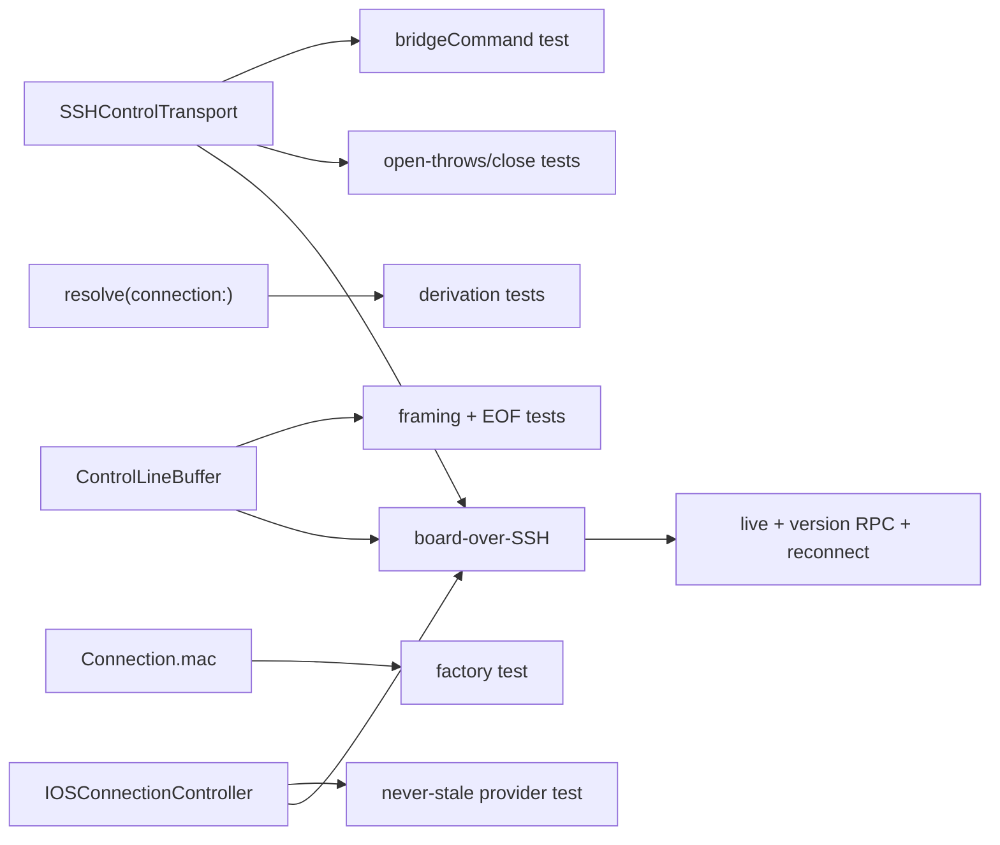

# Layer 3 — Test Design: iOS on a real phone

> Written with [[03-implementation]], same gate. Scope: **P1**. Completed before any code.

## Test strategy & philosophy

Three levels, confidence concentrated on the **framing + derivation logic** (pure, deterministic) and
one **loopback e2e** proving the board actually goes live over SSH without a device.

- **Unit (XCTest, offline on a booted Simulator):** the pure pieces — line framing, bridge-command
  construction, connection/endpoint derivation, the session-provider "never cache" invariant. These are
  where subtle bugs live and where tests pay off.
- **Loopback e2e:** the real SSH path (`SSHControlTransport` → throwaway `sshd` → `nc -U` → isolated
  `orchestrad`) reaching `.live` + a `version` RPC. The one integration proof.
- **Real device (manual):** the human-in-the-loop confirmation.

**Deliberately NOT unit-tested:** the live NIO child-channel byte pump (needs a real SSH server — covered
by the loopback e2e, not mocked); real APNs (out of scope, P4); real-device signing (manual).

## Framework / tooling

- **XCTest**, run offline on a booted Simulator — the established path ([[ios-unit-tests-offline-run]]):
  unsandboxed + `-clonedSourcePackagesDirPath`. Extend `App-iOS/Tests/TransportTests.swift`; add
  `ControlTransportTests.swift`, `ConnectionControllerTests.swift`.
- **Loopback harness:** a new `scripts/ios-board-over-ssh-verify.sh` modeled on
  `scripts/t4-takeover-verify.sh` (isolated daemon via `scripts/orch-test.sh`) + a throwaway `sshd`; the
  actual SSH connect asserted from an XCTest case gated on `ORCH_SSH_ALLOW_LOOPBACK=1` (the Simulator
  shares the host network, so `127.0.0.1:<port>` reaches the Mac's throwaway `sshd`).

## Unit tests (per contract)

| L2 contract | Test cases |
|-------------|-----------|
| `ControlLineBuffer` | one line; multiple lines in one `append`; frame split across appends; empty lines preserved; **incomplete trailing dropped at `signalEOF`**; blocked `readLine` woken with `nil` on EOF; no-trailing-newline-at-EOF |
| `SSHControlTransport.bridgeCommand(sock:)` | exact `sh -lc 'exec nc -U … \|\| exec socat …'`; `~`-path preserved (not locally expanded); quoting/escape of the socket path |
| `SSHControlTransport.open()` | throws when `session()` returns `nil`; `close()` idempotent; `write` returns `false` after close |
| `SSHEndpoint.resolve(connection:)` | derives endpoint from `conn.sshTarget`; `nil` when target nil; DEBUG loopback override via env; **precedence unchanged for the legacy `resolve` until P2** |
| `Connection.mac(...)` | `kind == .remote`; `sshTarget`/`remoteSocketPath` defaults; `sshEndpoint` parses tailnet target |
| `IOSConnectionController` / `CurrentSessionBox` | thread-safe get/set; `configure` sets box; `teardown` clears; **provider returns the NEW session after reconfigure (never stale)** — the core invariant |
| Onboarding validation | reuses `settingsRejectionReason` (already covered) — assert the onboarding VM surfaces the same reason strings |

## Integration / end-to-end tests

- **Loopback board-over-SSH (the key proof):** `scripts/ios-board-over-ssh-verify.sh` stands up an
  isolated `orchestrad` (own HOME + UDS) and a throwaway `sshd` (temp host key, `AuthorizedKeysFile` =
  the app device pubkey, high port). An XCTest (`ORCH_SSH_ALLOW_LOOPBACK=1`) builds
  `ControlClient(transport:{ SSHControlTransport(session:{ sessionTo(127.0.0.1:port) }, remoteSocketPath: isoSock) })`,
  calls `start()`, and asserts: reaches **`.live`**, a `version` RPC round-trips, a board snapshot arrives.
  Then background→foreground: drop the child channel, assert `.retrying` → `.live` on reconnect.
- **Reuse** the isolated-daemon plumbing from `orch-test.sh`; clean up sshd + temp dirs in-script.

## Edge & error cases

- `nc` absent → `socat` branch taken (simulate by a PATH without `nc`): board still reaches `.live`.
- Both absent → `open()` throws → `ControlClient` stays `.retrying` (assert never `.live`).
- Host-key change → point the pin store at a mismatching fingerprint → session `.down` +
  `onHostKeyChanged` fired; after `reset(host:)`, reconnect succeeds.
- Non-tailnet target on device (no loopback allowance) → `connect()` rejected with the tailnet reason.

## Fixtures / mocks / test data

- **`FakeSession`** conforming to a minimal session-provider seam so `SSHControlTransport` unit tests
  drive `readLine` framing without real NIO (feed synthetic `.channel` byte chunks into `ControlLineBuffer`).
- Throwaway `UserDefaults(suiteName:)` for `resolve`/onboarding (pattern already in `TransportTests`).
- Temp `sshd` host key + `authorized_keys` (app device pubkey via `SSHKeyStore.authorizedKeyLine()`).

## Coverage map

## Traceability → L2 contracts + L3 components

| Contract / component | Covering tests |
|----------------------|----------------|
| `ControlLineBuffer` (P1.1) | framing + EOF unit suite |
| `IOSSSHSession` (P1.2) | loopback e2e (connect/guard/pin/openChannel); tailnet-guard unit (existing) |
| `SSHControlTransport` (P1.3) | `bridgeCommand`/`open`-throws units + loopback e2e for the live pump |
| `Connection` + `resolve(connection:)` (P1.4) | derivation + factory units |
| `IOSConnectionController` (P1.5) | never-stale provider + teardown units; reconnect in e2e |
| `BoardModel.activate` (P1.6) | loopback e2e (board reaches `.live`) |

## Decisions made

| Decision | Why | Rejected |
|----------|-----|----------|
| Live byte pump proven by e2e, not a NIO mock | Mocking `NIOSSHHandler` is brittle/low-value | Full mock of the SSH stack |
| Loopback e2e over the real SSH path | Proves "board over SSH" without a device; catches integration bugs | Only unit tests (misses the wiring) |
| Extend `TransportTests` + `t4`-style harness | Reuse established offline-XCTest + isolated-daemon infra | New bespoke test rig |
| `FakeSession` seam for framing units | Deterministic `readLine` tests without a server | Real socket in unit tests |

## Implementation notes (as built — deviations from the sketch)

| What the sketch assumed | What shipped | Why |
|-------------------------|--------------|-----|
| "An XCTest gated on `ORCH_SSH_ALLOW_LOOPBACK=1`" — env just present | Config injected via the **`TEST_RUNNER_` prefix** (`xcodebuild` strips it into the Simulator test runner's env); the test **`XCTSkip`s** when `ORCH_E2E_SSH_TARGET`/`ORCH_E2E_DAEMON_SOCK` are unset | `xcodebuild test` has no other clean way to pass runtime env into a Simulator XCTest; skip keeps ordinary offline unit runs green |
| Single test run | **Two-pass**: `build-for-testing` (ad-hoc **signed**, so the Keychain entitlement applies) → launch the app once to generate+export the device pubkey → `test-without-building` with no rebuild | The sshd's `authorized_keys` needs the device pubkey *before* the test connects; signing is required or `SecItem` returns `-34018` (per `t1-live-attach.sh`) |
| `FakeSession` seam for framing units | Not needed — `ControlLineBuffer` is already directly unit-tested (`ControlLineBufferTests`, 6/6); the live pump is covered by the e2e | Avoided a redundant seam; the buffer's public API is testable as-is |
| `ORCH_SSH_ALLOW_LOOPBACK` matches `.start()` | API is `ControlClient.connect()` (synchronous first open, throws on hard fail) | Matched the real client API |

Files: `App-iOS/Tests/BoardOverSSHE2ETests.swift` (2 cases: live+version RPC; drop→retry→reconnect+RPC),
`scripts/ios-board-over-ssh-verify.sh` (self-contained throwaway sshd + isolated `orchestrad`). **2/2 green.**

## Open questions — need your call

- [ ] None blocking. Whether the loopback e2e runs in CI or dev-only depends on `sshd` availability on
      the runner — default **dev-only** (gated on `ORCH_SSH_ALLOW_LOOPBACK`), documented in the script.
