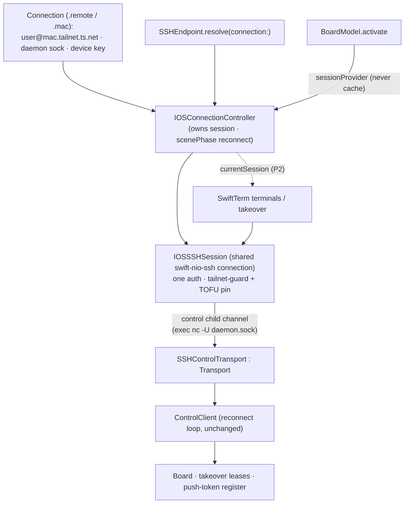

# iOS on a real phone — one setup, everything works — Design Index

> Make the Orchestra iOS app usable on a **physical iPhone** against a Mac over Tailscale, with
> **one** first-launch setup (a single tailnet target) that lights up **every** feature — board,
> terminals, takeover, push — plus a re-setup entry in Settings. No feature needs a second setting.
>
> Full spec (SSOT): [[ios-real-device-onboarding-and-transport]]. This folder is the layered
> **plan** that turns its phases P1–P4 into gated, buildable layers.

## Layers

| Layer | Document | Status |
|-------|----------|--------|
| 1 — Initial design | [[01-design]] | approved |
| 2 — Contract | [[02-contract]] | approved |
| 3 — Implementation | [[03-implementation]] | approved |
| 3 — Tests | [[04-tests]] | approved |

**All layers approved (2026-07-06).** Implementing P1; P2–P4 refined when reached.

<!-- Status values: not started · draft · in-review · approved · skipped -->

**Depth:** full (Layers 1–3). Phases **P1–P4** are the sequencing axis *inside* the layers: L1/L2
cover the whole arc; L3 impl+tests specify **P1 in full**, P2–P4 sketched + refined when reached.
The Layer-3 combined gate **is** the "gate before implementing P1".

## Phase roadmap

| Phase | Goal | Gains |
|-------|------|-------|
| **P1** | Board live over SSH: `IOSSSHSession` + `SSHControlTransport` (exec-bridge) + `BoardModel.activate` wiring | Board works on a device — unblocks everything |
| **P2** | Terminals + takeover on the shared session; delete standalone `orch_ssh_target` | One session vends board + PTYs; single config |
| **P3** | Onboarding + re-setup UX + **free-personal-team device build** (strip `aps-environment`) | First-launch → green; installs on a real iPhone, no paid membership |
| **P4** *(optional, deferred)* | Real push — paid signing, `aps-environment`, daemon `ORCH_APNS_*` env-injection, `.p8` | Not pursued (no paid membership; alerts via Claude/Codex apps) |

**Base branch:** this work is based on `mobile-impl-orchestration` (`67a293d`) — includes the four
landed sibling cards (#4 SSH-target surface, #3 `listDir` RPC, #5 push send/receive proven).

## Current picture

<!-- Current picture = Layer 2 component view (most useful at-a-glance; reflects IOSConnectionController). -->

## Open questions (rolled up)

- [ ] None blocking — the 4 design decisions are resolved (see [[01-design]] Decisions).
