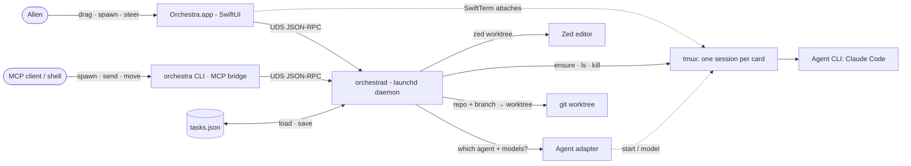
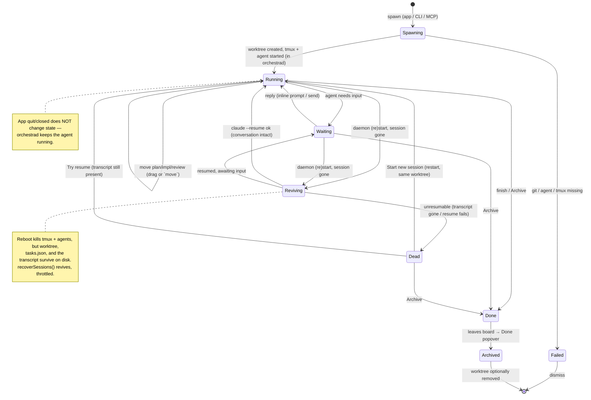

# Layer 1 — Initial Design: Orchestra

> The **what**, not the how. **Revised 2026-06-23 (#2)** to a **native macOS app** (was a localhost
> web app). Product behaviour matches the Orchestra UI prototype; only the delivery changes.

## Purpose & problem

Allen runs many coding-agent tasks across many local repos. Today that state is scattered: which task
is being worked on, which one is waiting on a decision, which model it's using, and where the work
physically lives are all in his head or buried in terminal scrollback.

**Orchestra** is a personal command center: a **native Mac app** whose board shows, at a glance,
**what's in flight, what's waiting on him, and which model each agent uses** — and that lets him jump
straight into the work (attach the running agent terminal, open a shell, or open the worktree in Zed)
without hunting through terminals and folders. It runs only on his Mac, for him alone, under the
workspace label "**Personal**".

Three things define Orchestra:

- **Native app, not a browser tab.** A real `Orchestra.app` (SwiftUI) with a dock icon, menu bar, and
  a native window — no `localhost`, no browser. Terminals are rendered natively with **SwiftTerm**.
- **A background daemon that outlives the window.** The real state — tasks, git worktrees, and the
  tmux agent sessions — lives in **`orchestrad`**, a **launchd** background agent that keeps running
  when the app is closed. Quitting the window never stops the agents; reopening just re-attaches.
- **Three clients over one control plane.** The same daemon is driven from the **app**, the
  **`orchestra` CLI**, and an **MCP bridge** (so another Claude — or any MCP client — can spawn/steer
  agents), all speaking one local **unix-socket / JSON-RPC** protocol. The board is one client; the
  CLI and MCP are peers.

Each agent works in its own **git worktree** (its own branch) inside a tmux session; "View changes" is
just that worktree's diff in Zed. The concrete agent is **Claude Code** (model selectable from what the
agent reports); the core stays agent-agnostic via a small adapter.

## Goals / non-goals

**Goals**
- A **native macOS app** (`Orchestra.app`, SwiftUI) — launched from the dock/Spotlight, real window
  chrome, **Light/Dark** following the system (with a manual toggle), titled **Orchestra · Personal**.
- A **background daemon** `orchestrad`, run as a per-user **launchd LaunchAgent** (`RunAtLoad` +
  `KeepAlive`), that **owns all state and keeps agents running when the app is closed**. On first
  launch the app **prompts** to install the helper (explaining why), then installs/loads it on
  approval; it can also be managed via `orchestra daemon …`.
- A Kanban board with **three columns: Plan → Implementation → Review**. **Done is not a column** —
  finished agents are **archived** and reachable from a **Done** popover.
- **Cards** show: a **status pill** (`waiting` · `running` · `done` · `dead`) with a live dot (running
  shimmer; `dead` shows a muted/alert dot — session lost, awaiting recovery);
  a one-line **title** (**derived, not typed**: seeded from the prompt at spawn, **re-titled from your
  first prompt after a restart or `/clear`**, and updated if you `/rename` the agent — it also seeds the
  agent's session name via `--name`, but the card title is the source of truth and the two **won't always
  match** — keeping the Claude session name identical is best-effort only); a live
  **description** (what the agent is doing now); and a footer with **repo · branch** (mono) +
  **column-specific meta** (e.g. diff stat in Review). Both title and description are generated, not
  entered: the user only ever writes the **initial prompt** (see Spawn).
- **Drag-and-drop** between the three columns; column + order **persist** (in the daemon's `tasks.json`).
- **Spawn / steer / archive** agents from the app. "**+ New agent**" opens a **Spawn a new agent**
  sheet whose only free-text field is the **Initial prompt** (what the agent should start working on);
  plus **Repository**, **Branch**, **Model** (choices from the agent adapter), a read-only computed
  **Worktree** path, and **Start in: Plan | Implementation**, with a live **CLI-equivalent** preview.
  **The user does not name or describe the card** — the **title** (seeded from the prompt, re-titled by
  your first prompt after a restart/`/clear`, or by a `/rename`) and **description** (live, from the
  agent's activity) are derived. Spawning **eagerly starts the agent working** on that prompt.
- **Cards map 1:1 to agent sessions** — one card *is* one agent in one worktree in one tmux session;
  a session created via CLI/MCP surfaces as a new card.
- **Per-task git worktree** — spawning resolves **repo + branch → an isolated git worktree** (the
  daemon shells out to `git`); archiving can clean it up.
- **tmux as the session substrate** — one tmux session per card on a dedicated socket; **all agents
  run in tmux windows**. Sessions survive app quit, **daemon restart**, and laptop sleep, and can be
  attached from any terminal (`orchestra shell <id>` / iTerm).
- **Reboot/crash recovery** — a reboot (or anything that kills the tmux server) ends the live agents, but
  the work is on disk: the **worktree**, the card **metadata** (`tasks.json`), and the agent's
  **conversation transcript** (`~/.claude/projects/…`) all survive. On daemon start Orchestra **eagerly
  revives** every non-archived card whose session is gone — recreating the tmux window in its worktree and
  relaunching the agent with **`claude --resume <id>`** so it picks up exactly where it left off
  (conversation intact). Revival is **throttled** (a launch storm of `claude` processes is the only cost —
  resume itself makes no model call until prompted) and runs after a daemon-only crash too (where it's a
  no-op, since the external tmux server outlived the crash). A session that **can't** be revived (no
  tracked id, the transcript is gone, or resume fails) is marked **`dead`** rather than silently shown as
  running — see the next two bullets.
- **Mid-life session loss** — separately from a reboot, a *single* agent can die while the daemon is up
  (the user quits it, it crashes, or its tmux session is killed). Orchestra notices — via the agent's
  end-of-session signal, or the daemon's own liveness check — and marks that card **`dead`** so it's
  surfaced for recovery immediately, not shown as still running. Unlike a reboot, Orchestra does **not**
  auto-revive a mid-life death (it may have been intentional); the user decides via the Recovery panel.
- **A `dead` status for lost sessions** — the status pill gains a fourth state, **`dead`**: the card's
  agent is no longer running (reboot with no revival, or a mid-life exit/crash). It is
  **not** the same as `done` (finished) — the work in the worktree is intact and the user still has to
  decide what to do. A `dead` card stays on the board (it isn't archived) so it's visible and actionable.
- **A Recovery panel for dead cards** — clicking a `dead` card shows, in place of the live terminal, a
  small **Recovery panel** that explains **why** it died — the agent exited, the session crashed/was
  killed, it was lost on reboot, or a resume attempt failed (with the specific error) — notes the worktree
  is preserved, and offers two
  clear actions: **Start new session** (spin a fresh **blank** agent in the *same* worktree — the original
  prompt is *not* re-sent; the panel shows it as "Originally asked:" for context, and the user drives the
  new agent) or **Archive** the card. If a transcript still exists, a **Try resume** action also
  appears (re-attempt the `claude --resume`, continuing the exact conversation). One click gets the card
  back to a sensible state. **A mid-life-`dead` card (an agent that exited/crashed, not a reboot) is
  normally resumable** — its transcript + session id survive — so **Try resume** is the expected path
  there; it's the same revival as reboot, just user-triggered rather than automatic.
- **Inspector** (in the app) shows, for the selected card:
  - **Agent terminal** — the live tmux `agent` window rendered with **SwiftTerm**, attaching to tmux
    **directly** (no byte-proxying through the daemon), with an **inline prompt** to message the agent,
    a **context-window gauge**, and a header (model chip · repo · branch · status).
  - A **breadcrumb** with **Copy chat link** (copies the card's **ref** — see below), **Copy worktree
    path**, **Copy tmux target** (`orchestra-<id>:agent`, ready for `tmux attach`), and **Copy session
    id** (the agent-native id — e.g. the Claude Code session UUID — with its transcript path).
  - **Shell tabs** — a resizable area of independent **shell** terminals (each a tmux window), via
    "New terminal", with a tab ribbon + minimize.
  - **View changes** (open the worktree in **Zed**), **Archive**, and close.
- **MCP bridge + `orchestra` CLI share one interface** — a single command set
  (`list` · `spawn` · `move` · `send` · `status` · `archive` · `restart` · `resume` · `shell` · `exec` ·
  `sessions` · `batch-spawn`), exposed **identically** as MCP tools and CLI subcommands (both generated
  from one definition). `restart`/`resume` recover a `dead` card (fresh blank session / re-attempt the
  conversation). A
  green **MCP chip** in the toolbar shows the bridge is live. `batch-spawn` pipes many prompts in at
  once (one spawn each); **`exec`** runs a one-shot command in a worktree and returns captured output; **`shell`**
  attaches the tmux session (interactive in the CLI; returns the tmux target over MCP, which has no TTY).
- **Card refs (agent handles)** — every card has a stable **ref** `orchestra://task/<shortId>-<slug>`
  (also addressable by bare UUID/shortId). It's the primary way **agents cross-reference cards** ("I
  made this card — here it is"), and for debugging. Every command that takes a card accepts the ref;
  `spawn` returns it; the app registers the `orchestra://` URL scheme so a posted ref opens the card.
- **Debug handles from a ref (`sessions`)** — given just a card ref, an agent or user can resolve
  **everything needed to jump into the card and debug it**: its **tmux targets** (the dedicated socket,
  the `orchestra-<id>` session, and every window — `agent` + each `shell-N` — with a ready-to-run
  `tmux attach` line per window), plus the **agent-native session id** (e.g. Claude Code's session
  UUID) and the **path to that agent's transcript** so the run can be searched, tailed, or resumed from
  outside Orchestra. Exposed as a `sessions` command on **both CLI and MCP** (CLI prints the attach
  lines + ids; MCP returns them structured) and surfaced in the inspector as **Copy session id** /
  **Copy tmux target** next to Copy chat link. This turns a card ref into a debugging entry point, not
  just a pointer.
- **Activity feed** — a toolbar popover with two tabs: **Live** — a scannable, newest-first stream of
  recent **events** (a card spawned/moved/archived, an agent flipping waiting↔running or going dead/
  recovered, an MCP/CLI command landing), each row clicking through to its card — and **CLI** (the
  command reference + a batch-spawn example). Live is the daemon's discrete event stream, not the noisy
  per-tick status churn.
- **Settings** — a native Settings window for **managed config**: **worktrees root** (default
  `~/.orchestra/worktrees/<repo>/<branch>`), repos root, default model, the repo allowlist, theme,
  daemon controls, and the **agent terminal status bar** (see next bullet). Settings are
  **daemon-owned** (the daemon uses them) and edited over the control plane.
- **Agent status-bar choice** — because Orchestra injects its own managed Claude Code statusLine to
  push live fields (`ctxPct`/model), that statusLine *replaces* the user's own inside agent sessions
  (it's a wholesale override). Settings therefore lets the user pick what the terminal bar **displays**
  (the push still happens regardless): **Passthrough** their global `~/.claude` statusLine (Orchestra
  runs it for them and shows its output), a **Custom** line they write in Settings, or the **Orchestra
  default** (`model · ctx%`) — which is also the automatic fallback if a passthrough/custom choice has
  nothing to render. *Per-project* statusLines (a worktree's own `.claude/settings.json`) are a **future
  feature**; v1 honors only the global one.
- **Designed for a future iOS client over SSH-over-Tailscale** — the control plane is
  **transport-agnostic**: v1 is local (UDS), and the *same* JSON-RPC runs over an **SSH-forwarded unix
  socket** remotely, with terminals carried by SSH's own PTY (`ssh … tmux attach`). So an iOS app
  reaches `orchestrad` remotely with **no new daemon surface** (an optional WebSocket transport remains
  a fallback if a pure-WS client is ever preferred). Built later; shaped now.

**Non-goals (v1)**
- No multi-user, no accounts. **v1 is local-only** — the control plane is a **user-only unix socket**
  (no TCP); the optional MCP HTTP endpoint binds **loopback only**. *Remote access is a planned axis,
  not v1:* a future iOS app reaches the daemon over **SSH-over-Tailscale** (already set up) — SSH
  forwards the unix socket for control and carries terminals natively (`ssh … tmux attach`), so the
  daemon needs **no network listener, no open port, and no terminal proxy**, and auth is SSH keys. v1
  exposes nothing beyond the local machine.
- Not a code editor — the embedded terminals are for the agent/shell, not file editing (Zed covers that).
- **No container/sandbox isolation in v1** — worktrees give *filesystem* isolation between agents, not
  a security sandbox; agents run as local processes under attended use.
- **No structured/rich agent UI in v1** (e.g. ACP) — terminal-based.
- No iOS/iPad/Catalyst target, no responsive web — **macOS desktop only**.
- v1 does **not** auto-derive a card's column from agent activity; the agent (or user) moves it.
- **No root privileges** — `orchestrad` is a per-user LaunchAgent, not a system daemon.

## Scope

**In scope:** the SwiftUI app (board + inspector + Spawn sheet + popovers), the `orchestrad` daemon
(the core + control server + launchd lifecycle), the **WorktreeManager** (git), the **SessionManager**
(tmux), the **AgentRegistry**, **PathResolver**, the shared **CommandRegistry**, the **MCP bridge**,
the **`orchestra` CLI**, SwiftTerm terminal views, **View changes** (Zed), and the Activity feed.

**Out of scope (v1):** in-browser/in-app file editing, PR/merge automation, notifications, container
isolation, ACP mode, multiple agents per card, and any non-macOS target.

## Inputs & outputs

| Direction | Description | Type / shape | Notes |
|-----------|-------------|--------------|-------|
| Input | App interactions | drag, click, spawn/steer/move/archive | Board + inspector + sheet |
| Input | CLI invocations | `orchestra list/spawn/move/send/status/archive/shell/exec/batch-spawn` | Terminal + pipelines |
| Input | MCP calls | same command set as tools (stdio bridge / loopback HTTP) | External MCP client drives agents |
| Input | Persisted tasks | `tasks.json` (daemon, Application Support) | Loaded at daemon start |
| Input | Agent adapters | registry config (built-in + user) | How to run each agent + its models |
| Input | Config | reposRoot, worktreesRoot, socket path, port (opt) | repo + branch → worktree |
| Input | Local tools | agent CLI (`claude`), `git`, `tmux`, `zed` | Must exist on PATH |
| Output | Native UI | SwiftUI window + SwiftTerm terminals | Light/Dark; prototype aesthetic |
| Output | Control plane | UDS JSON-RPC: commands + state + events | App/CLI/MCP clients |
| Output | git worktrees | `git worktree add/remove` per task | Isolated branch checkout |
| Output | tmux sessions | create/attach/kill (one per card; `agent` + N `shell` windows) | Survive daemon restart |
| Output | Spawned processes | agent CLI in tmux; `zed <worktree>` | Scoped to the worktree |
| Output | LaunchAgent | `com.orchestra.daemon` plist + load | Background lifecycle |

## Expected behaviour

**Happy path (spawn from the app):** open `Orchestra.app` → it ensures `orchestrad` is installed/loaded
→ click **+ New agent** → type an **Initial prompt** and pick **Repository / Branch / Model** + **Start
in: Plan** → the sheet shows the **CLI equivalent** → confirm → the daemon **creates a git worktree**,
opens a tmux session in it, starts the agent on that prompt (begin in plan mode), and a **card appears
in Plan** with status **running** and a provisional **title** (derived from the prompt). The agent works;
its **description** and **context gauge** update live (and the **title** if the agent is renamed). When it needs a
decision the card flips to **waiting**. Allen clicks the card → the inspector shows the live agent
terminal (SwiftTerm on tmux); he replies at the inline prompt → the agent continues. He opens a shell
tab, clicks **View changes** (Zed on the worktree), drags the card **Plan → Implementation → Review**,
then **Archive** (or the agent sets itself **done**) → the card leaves the board into the **Done**
popover. He **quits the app** — the agent keeps running in `orchestrad`; reopening re-attaches.

**Happy path (CLI/MCP, app closed):** with the app not running, another Claude calls the MCP `spawn`
tool (or Allen runs `orchestra batch-spawn` piping a todo list) → `orchestrad` creates worktrees +
sessions; opening the app later shows the new cards. `send`/`move`/`status`/`archive`/`exec` work the
same from any client.

**Live state (the agent pushes it):** Orchestra gives the agent a managed **statusLine + hooks** (via
Claude Code's `--settings`) that report to the daemon as the agent works — the statusLine feeds the
**context gauge** (`ctxPct`) and model, and `PreToolUse`/`PostToolUse`/`Notification` hooks feed the
**description** ("Editing X", "Running tests") and the **status** pill (`Notification` → `waiting`). The
daemon merges these and pushes **events** to subscribed clients so the board updates live. Reading
`tmux ls` + parsing the pane is a **fallback** when the push channel is silent.

**Reboot/recovery path:** Allen restarts his Mac. The tmux server and every `claude` process die, but
`tasks.json`, the worktrees, and the agents' transcripts are on disk. At login launchd relaunches
`orchestrad`, which runs **`recoverSessions()`**: for each non-archived card whose tmux session is gone
it recreates the window in the worktree and relaunches the agent with **`claude --resume <id>`**
(throttled, a few at a time). Most cards return to **running**/**waiting** with their conversation
intact — opening the app, Allen finds his board as he left it. A card whose session can't be revived
(transcript gone, etc.) shows as **`dead`**; clicking it opens the **Recovery panel** where he picks
**Start new session** (fresh blank agent in the same worktree, no prompt re-handed) or **Archive**.

**Stateful part — per-card lifecycle:** spawn → worktree + agent started (**running**); may go
**waiting** and back; moves across Plan/Implementation/Review; finishing → **done** → **archived**
(worktree optionally removed). On daemon (re)start a card whose session vanished is **revived**
(`claude --resume`) or, if unrevivable, marked **`dead`** → recovered via **Start new session**
(`restart`) or **Archive**. A session can be stopped (killed) without deleting the card. All of this
persists in the daemon regardless of the app's window state.

## Complexity & risks

- **Native terminal stack** — **SwiftTerm** + a Swift PTY: the agent terminal is SwiftTerm running
  `tmux attach`. Two layers of terminal emulation (tmux inside SwiftTerm) need careful **resize
  propagation** and a **stripped embedded tmux config** so tmux doesn't grab the agent's keys.
- **Daemon + launchd lifecycle** — installing/loading a LaunchAgent on first run, keeping it alive,
  versioning it across app updates, and a clean **uninstall**. Trust/first-run UX matters.
- **One UDS control plane, three clients** — app, CLI, and MCP bridge all mutate the same state through
  the daemon; the protocol (commands + state + event subscription) must be the single source of truth
  so nothing diverges. No business logic in the clients.
- **Swift MCP** — exposing the command set as MCP tools (official `swift-sdk` vs. a hand-rolled stdio
  relay), and the stdio-bridge-to-socket plumbing.
- **git worktree lifecycle** — branch-exists vs. new branch, branch-in-use, dirty-on-remove, metadata
  cleanup. The riskiest new surface; needs real-git tests.
- **Security of a local control plane that spawns processes** — even local, `orchestrad` runs agent
  binaries and `git`/`zed`, and exposes `exec`. Bind the socket to the user (file perms, no TCP),
  allowlist every repo/worktree path, keep `exec` scoped to the worktree, and never run as root.
- **Context gauge + chat link fidelity** — depend on what Claude Code exposes; degrade gracefully
  (gauge hidden, link omitted) rather than fabricate.
- **tmux / git availability** — graceful errors if missing or too old.

Rough sizing: a multi-weekend project. The board + persistence is small; the **daemon + control plane**,
the **SwiftTerm/tmux bridge**, and the **worktree + adapter** logic are where the risk and care live.

## Diagrams

### Bird's-eye (context)

### Detailed (per-card lifecycle — independent of the app window)

## Decisions made

- **Native macOS app (SwiftUI), not a localhost web UI** — a real `.app`, native window, SwiftTerm
  terminals; no browser, no `127.0.0.1` page.
- **Background daemon under launchd** — `orchestrad` is the source of truth and runs independent of the
  window, so agents persist across app quit. Per-user LaunchAgent (no root).
- **Transport-agnostic JSON-RPC control plane, three clients** — app, CLI, MCP bridge all drive the
  daemon over one protocol; **v1 transport = UDS** (local, no port). Defined apart from its transport so
  a **WebSocket-over-Tailscale** path adds a future iOS client unchanged. (XPC was dropped — macOS-/
  app-only; a socket serves the CLI + a language-agnostic MCP bridge uniformly.)
- **Terminals attach to tmux directly** — SwiftTerm (app) / `tmux attach` (CLI) locally, and **over SSH
  remotely** (`ssh … tmux attach`); the control plane carries commands + state + events, not PTY bytes.
  No daemon terminal-proxy needed (it's only a fallback if the WS transport is ever chosen for iOS).
- **Remote = SSH-over-Tailscale, not a new listener** — reuse the existing SSH+Tailscale setup: forward
  the daemon's UDS over SSH for control, SSH PTY for terminals, SSH keys for auth. The daemon stays
  UDS-only (no port, no token, no tailnet-interface binding).
- **Settings are managed** — a native Settings window edits daemon-owned `Config` (worktrees root, repos
  root, default model, allowlist, theme) over the control plane; worktrees default to
  `~/.orchestra/worktrees/<repo>/<branch>`.
- **tmux substrate retained** — survives daemon restart, enables attach-from-terminal, gives per-card
  agent + shell windows; belt-and-suspenders with the daemon for resilience.
- **Reboot recovery = eager `claude --resume`, throttled; unrevivable → `dead`** — on daemon start,
  revive every non-archived card whose session is gone by recreating its tmux window in the (on-disk)
  worktree and relaunching with `claude --resume <id>`. Verified safe to do en masse — resume is **inert
  until prompted** (no model call on revival, so no rate-limit storm); the cap (`maxConcurrentRevivals`)
  only smooths *process*-launch load. The transcript (`~/.claude/projects/…`) survives reboot, so the
  conversation comes back intact. A session that can't be revived (no tracked id / transcript gone /
  resume exits non-zero) becomes **`dead`** — a new fourth status meaning "lost, work preserved, not
  running" (≠ `done`). **Recovery is the user's call:** a `dead` card opens a **Recovery panel** with
  **Start new session** (`restart` — fresh **blank** session in the same worktree, **no prompt re-handed**;
  the panel shows the original prompt for context) or **Archive** (+ **Try resume** when a transcript still
  exists). The same `--resume`
  flag, the tracked `agentSessionId`, and the transcript-on-disk that power `sessions` are reused here.
- **Card ref = agent handle** — `orchestra://task/<shortId>-<slug>` (or bare UUID/shortId) is accepted
  by every command and returned by `spawn`, so agents reference cards and the URL scheme makes a posted
  ref clickable. It's what "Copy chat link" copies.
- **Daemon install = prompt on first launch**; **worktree archive = remove dir, keep branch**.
- **A card ref resolves to debug handles (`sessions`)** — one command turns a ref into the card's tmux
  targets (socket · session · every window, each with an attach line) **and** the agent-native session
  id + transcript path + resume argv, so debugging from a ref is first-class on CLI and MCP alike. The
  agent id comes from the adapter (Claude Code → its session UUID under `~/.claude/projects/…`). It's
  **seeded at spawn and kept current for the card's whole life** — if the agent's session rolls over
  (e.g. the user runs `/clear`), Orchestra tracks the new id automatically (and keeps the old ones), so
  the handle never goes stale and earlier transcripts stay searchable. (Mechanism in L2/L3: a launch-time
  `--session-id` seed + a `--settings` SessionStart hook reporting each new id back to the daemon. That
  hook channel generalizes to a two-way agent ↔ Orchestra link — see the **Design note** in [[index]].)
- **MCP = official `swift-sdk`, stdio + optional loopback HTTP** — stdio is the v1 surface; the HTTP
  endpoint is built loopback-bound and reusable for tailnet exposure later.
- **Everything else preserved** — 3 columns + Done archive, per-task worktrees, eager spawn with
  Start-in, model selectable from the adapter, `waiting/running/done`/`dead` pills, the shared command set
  incl. `exec`, context gauge, card ref, Activity feed, Light/Dark, the light/linear aesthetic.

## Open questions — need your call

_Resolved this round:_ chat link → **agent-facing card ref** (`orchestra://task/<ref>`) · daemon
install → **prompt on first launch** · worktree archive → **remove dir, keep branch** · MCP →
**`swift-sdk` stdio (+ optional loopback HTTP)** · **worktrees root → managed setting** (default
`~/.orchestra/worktrees/<repo>/<branch>`) · **remote → SSH-over-Tailscale** (UDS forwarded over SSH;
no new daemon surface; SSH-key auth) · **reboot recovery → eager `claude --resume` on daemon start,
throttled; unrevivable sessions → new `dead` status + a Recovery panel (Start new session / Archive)**.

- [x] (L3) Confirm Claude Code's resume flags — **`claude --resume <id>`** revives a *specific* session
  by id (vs `--continue` = most-recent), composes with `--settings`/`--name`/`--model`, must run from the
  worktree cwd, and is **inert until prompted** (no model call on revival — verified). Missing id →
  exit non-zero / "No conversation found" → treat as `dead`.
- [x] (L3) How `ctxPct` is sourced — **statusLine `context_window.used_percentage`** (verified,
  pre-computed), pushed via `report`; gauge hidden only if the push channel is silent.
- [x] (L3) tmux agent-start mechanism → **`new-window` with argv** (decided 2026-06-24). The agent
  command (`claude --session-id … --name … --settings … --model … "<prompt>"`) is the tmux window's
  command directly, so the agent's exit *is* the window's exit (crisp SessionEnd/liveness detection),
  with no shell-prompt race or keystroke-timing fragility. The **initial prompt** is delivered as the
  **launch positional arg** (`claude … "<prompt>"`) — once, at spawn, and naturally *not* re-handed on
  restart/resume (matching the blank-restart recovery design); not via SessionStart `initialUserMessage`.
