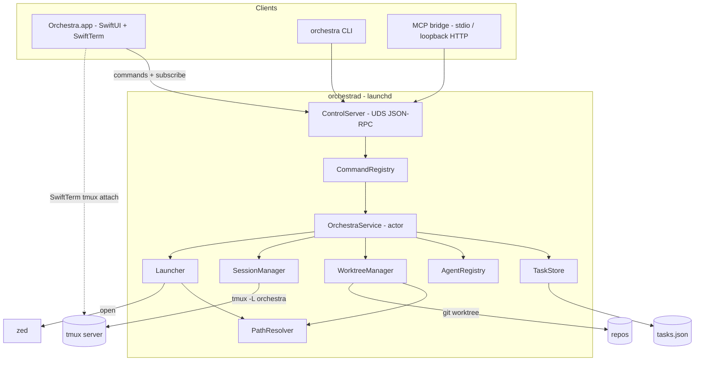
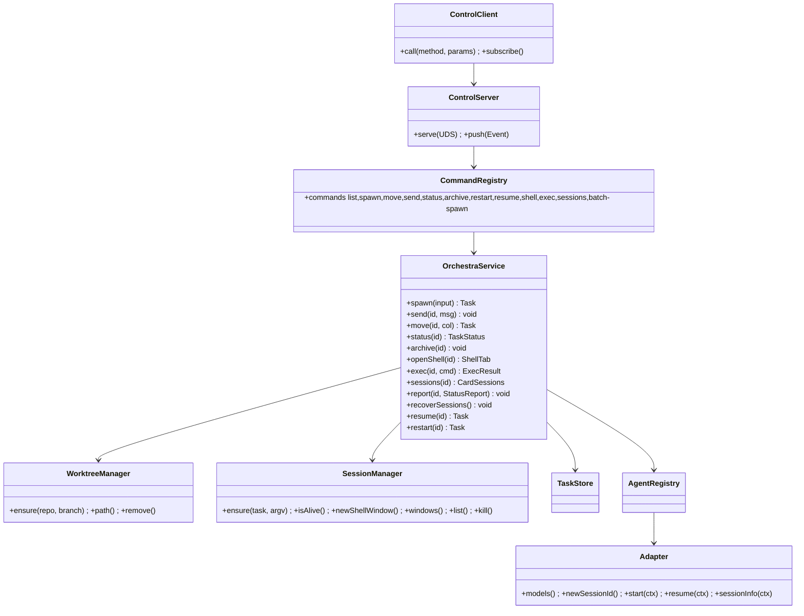

# Layer 2 — Contractual Design: Orchestra

> The **interfaces**. **Revised 2026-06-23 (#2)** for the native-macOS architecture (Swift daemon +
> SwiftUI app + UDS control plane). Module *responsibilities* carry over from the web design; the
> language is Swift and the transport is a unix-domain socket, not HTTP/ws.

## Architecture overview

Orchestra is one **`OrchestraCore`** Swift library wrapped by a **background daemon** and consumed by
**three thin clients**:

- **`orchestrad`** — a per-user **launchd** background agent. It links `OrchestraCore` and runs a
  **`ControlServer`** on a **unix-domain socket** speaking **JSON-RPC 2.0** (commands + state +
  event subscription). It owns all state and keeps agents running when the app is closed.
- **`Orchestra.app`** (SwiftUI) — a `ControlClient` for board state/commands, rendering live terminals
  with **SwiftTerm** that attach to tmux **directly** (not proxied through the daemon).
- **`orchestra`** (CLI, Swift) — a `ControlClient`; the same command set; `shell` execs `tmux attach`.
- **MCP bridge** — a small process exposing the command set as MCP tools over **stdio** (and optionally
  **loopback HTTP**), relaying to the daemon socket.

`OrchestraCore` is a handful of modules: `TaskStore` (Codable atomic JSON), `AgentRegistry` (adapters +
models), `WorktreeManager` (repo + branch → git worktree), `SessionManager` (tmux), `Launcher`
(`zed <worktree>`), `PathResolver` (security boundary). `OrchestraService` (an `actor`) is the façade
the `CommandRegistry` calls; `ControlServer`, the CLI, and the MCP bridge are all generated from /
drive that one registry.

A card is **1:1 with a tmux session** `orchestra-<id>` (dedicated tmux socket `-L orchestra`); the
session has an `agent` window (0) and **zero or more `shell` windows**. Sources of truth: `tasks.json`
for metadata, `tmux ls` for liveness, git for the worktree.

## Major types / modules (Swift)

| Name | Kind | Responsibility |
|------|------|----------------|
| `OrchestraCore` | library | Shared core linked by the daemon (and unit-tested directly) |
| `OrchestraService` | `actor` | The core API: spawn/send/move/status/archive/openShell/exec — used by `CommandRegistry` |
| `CommandRegistry` | struct | The **canonical command set** (name + params + handler) both MCP and CLI are generated from |
| `TaskStore` | `actor` | Load/save/CRUD `Task` in `tasks.json` (atomic write via temp + rename) |
| `AgentRegistry` | struct | Look up / list adapters; list an agent's models |
| `Adapter` | protocol | How to launch one agent (bin + argv builders + `models()`) |
| `WorktreeManager` | struct | repo + branch → git worktree (ensure / path / remove) via `Process` |
| `SessionManager` | struct | tmux: ensure / list / newShellWindow / kill / capture via `Process` (`-L orchestra`) |
| `Launcher` | struct | `openInZed(worktree)` via `NSWorkspace`/`Process` |
| `PathResolver` | struct | Resolve + allowlist-check repo & worktree paths (realpath prefix) |
| `ControlServer` | class | UDS JSON-RPC server in the daemon; dispatches `CommandRegistry`; pushes events |
| `ControlClient` | class | UDS JSON-RPC client (shared by app, CLI, MCP bridge) |
| `DaemonLifecycle` | struct | Install/load/unload the `com.orchestra.daemon` LaunchAgent |
| `BoardModel` | `@MainActor ObservableObject` (app) | Subscribes to `ControlClient`; drives SwiftUI views |
| `AgentTerminalView` | SwiftUI/SwiftTerm (app) | `LocalProcessTerminalView` running `tmux attach` for a card |

## Data model

```swift
enum Column: String, Codable { case plan, impl, review }   // board columns; "done" = archive, not a column
enum AgentStatus: String, Codable { case waiting, running, done, dead }  // live pill (dot + running shimmer).
  // `dead` = the session is no longer running and the card is awaiting user recovery — work in the
  // worktree is intact. Two paths: (1) a reboot killed tmux and `recoverSessions` couldn't auto-revive
  // via `claude --resume` (startup); (2) **mid-life session loss** while the daemon is up — the agent
  // exited/crashed/was killed (detected by `SessionEnd` genuine-exit or the poll's liveness reconcile);
  // mid-life we do NOT auto-resume (could be intentional). Distinct from `done` (finished + archivable).
  // Cleared by restart()/resume().
  // Observable on ALL surfaces: it's a `Task.status` value, so `list`/`status`/`sessions` return it over
  // CLI and MCP exactly as the app sees it (a headless client can spot dead cards and call `restart`/`resume`).

// WHY a card went `dead` — set alongside `status = .dead`, surfaced by the Recovery panel + over CLI/MCP.
enum DeadReason: String, Codable, Sendable {
  case agentExited       // SessionEnd reason exit/logout — the agent quit (mid-life, usually resumable)
  case sessionVanished   // poll liveness reconcile: tmux session gone, no SessionEnd (crash / `tmux kill`)
  case rebootUnrevived   // reboot sweep couldn't auto-revive (no id / transcript gone / resume failed at boot)
  case resumeFailed      // a `resume` attempt (auto or user "Try resume") failed — see `deadDetail`
}
enum StartIn: String, Codable { case plan, impl }          // Spawn sheet "Start in"

struct Task: Codable, Identifiable, Sendable {
  let id: UUID            // tmux session = "orchestra-\(id)"
  var title: String      // short card heading — DERIVED, never typed. Seeded from the prompt's first line
                         // at spawn (also passed to `claude --name` as the session's initial name). The
                         // card title is **display-authoritative**; `session_name` is kept in sync
                         // **best-effort** — a `/rename` flows back via the statusLine `session_name`
                         // mirror, but Orchestra does NOT force the Claude session name on demand (see
                         // Decisions: best-effort binding). Re-titled from the first prompt after a
                         // restart/`/clear` when `titleProvisional` (below).
  var titleProvisional: Bool  // true => `title` is a placeholder (the seed/old title) eligible to be
                              // replaced by the next user prompt. Set on spawn? no — spawn's prompt already
                              // titled it (false). Set true by `restart` and by `SessionStart(clear)`;
                              // cleared by the first re-title or by an explicit `/rename` mirror.
  var desc: String       // live blurb of what the agent is doing now — pushed from PreToolUse/PostToolUse
                         // hooks (e.g. "Editing Foo.swift", "Running tests"); pane-parse fallback
  var repo: String       // repo root (allowlisted); shown as repo name
  var branch: String     // working branch
  var worktree: String   // abs path to the git worktree (derived: repo + branch)
  var agentId: String    // -> AgentRegistry (default "claude-code")
  var model: String      // selected model (from the adapter's list, e.g. "claude-sonnet-4-5")
  var startIn: StartIn   // where the agent began
  var column: Column     // board column
  var order: Int         // sort within a column
  var status: AgentStatus  // waiting/running/done — pushed from hooks (Notification idle/permission =>
                           // waiting; tool/prompt activity => running); tmux-liveness fallback
  var deadReason: DeadReason?  // set with `status = .dead` (nil otherwise) — WHY it died; shown in the
                               // Recovery panel + returned over CLI/MCP. Cleared when status leaves `.dead`.
  var deadDetail: String?      // optional human detail for `.resumeFailed` (e.g. "claude exited 1: No
                               // conversation found", "no SessionStart callback in 15s", "transcript gone")
  var ctxPct: Double     // context-window usage 0...100 (gauge); 0/absent => gauge hidden. Sourced from
                         // the statusLine JSON `context_window.used_percentage` (verified), pushed live
  var agentSessionId: String?  // the CURRENT agent-native id (e.g. Claude Code session UUID). SEEDED at
                               // spawn (`--session-id <uuid>`) then MAINTAINED across `/clear`, `/compact`
                               // & resume by the SessionStart hook (it can change mid-life). Powers `sessions`.
  var priorSessionIds: [String]  // superseded ids (e.g. after `/clear`), newest-last — so the whole run's
                                 // transcripts stay searchable even after the live id rolls over.
  var initialPrompt: String  // the spawn prompt, persisted verbatim. Source of the spawn-time `title`
                             // seed, and SHOWN in the Recovery panel so the user recalls what the card was
                             // for when deciding restart vs archive. NOT re-sent to a `restart`ed agent —
                             // restart begins a blank fresh session (see OrchestraService.restart).
  var archived: Bool     // true => off the board, listed in the Done popover
  var createdAt: Date; var updatedAt: Date

  // Card reference — the agent-facing handle ("Copy chat link" copies `ref`). Used by agents to
  // cross-reference cards ("I made this card, here it is") and for debugging.
  var shortId: String { String(id.uuidString.prefix(6)).lowercased() }   // readable handle
  func ref(slugging title: Bool = true) -> String {                      // orchestra://task/<shortId>-<slug>
    "orchestra://task/\(shortId)" + (title ? "-\(slugify(self.title))" : "")
  }
}

// A card can be addressed by full UUID, shortId, or the orchestra://task/... URI. Every command that
// takes `{id}` actually accepts a TaskRef; the resolver keys on UUID/shortId and ignores any slug.
enum TaskRef { case uuid(UUID), short(String), uri(String) }
func resolve(_ ref: TaskRef, in tasks: [Task]) throws -> Task   // throws UnknownTask

struct ExecResult: Codable, Sendable { let stdout: String; let stderr: String; let exitCode: Int32 }
struct ShellTab: Codable, Sendable { let window: String; let label: String; let pwd: String }

// --- Debug handles resolved from a card ref (the `sessions` command) ---
enum WindowKind: String, Codable, Sendable { case agent, shell }

// One attachable tmux window inside the card's session, with a ready-to-run attach line.
struct TmuxTarget: Codable, Sendable {
  let socket: String     // tmux -L socket (e.g. "orchestra")
  let session: String    // "orchestra-<id>"
  let window: String     // "agent" | "shell-1" | ...
  let kind: WindowKind   // .agent (window 0) | .shell
  let target: String     // "orchestra-<id>:agent"  (a `tmux … -t` target)
  let attach: String     // "tmux -L orchestra attach -t orchestra-<id>:agent"  (copy/paste)
}

// The agent's own identity for transcript search / resume / debugging — sourced from the Adapter.
struct AgentSessionInfo: Codable, Sendable {
  let agentId: String          // e.g. "claude-code"
  let sessionId: String?       // CURRENT agent-native id (e.g. Claude Code session UUID); nil if not yet known
  let transcriptPath: String?  // current ~/.claude/projects/<cwd-slug>/<sessionId>.jsonl  (to search/tail)
  let priorSessionIds: [String]    // earlier ids this card cycled through (post-/clear); newest-last
  let priorTranscripts: [String]   // their transcript paths (older parts of the same run, still searchable)
  let resumeCmd: [String]?     // argv to resume the CURRENT session (adapter.resume), for dead-session revival
}

// A live patch the agent pushes to the daemon (the "Orchestra status channel"): the statusLine and the
// hooks each map their stdin JSON to one of these and POST it over $ORCHESTRA_SOCK keyed by the card.
// All fields optional — only present ones are merged onto the Task.
struct StatusReport: Codable, Sendable {
  var seq: UInt64              // monotonic, stamped by _report before sending. report() keeps lastSeq[id]
                              //   and drops snapshot fields when seq <= lastSeq[id] (ordering guard +
                              //   stale-report coalescing). The statusLine send is a bounded SYNC call
                              //   (~50ms deadline, dropped on trip) — never detached — so per-card
                              //   generation order is preserved and children can't pile up.
  var sessionId: String?       // statusLine/SessionStart: current Claude Code session UUID
  var transcriptPath: String?  // statusLine/SessionStart: current transcript .jsonl
  var ctxPct: Double?          // statusLine: context_window.used_percentage (0...100)
  var model: String?           // statusLine: model.display_name
  var sessionName: String?     // statusLine: non-empty session_name (user `/rename`) -> updates `title` +
                               //   clears titleProvisional. Empty/absent is ignored (no clobber).
  var desc: String?            // Pre/PostToolUse: rendered activity ("Editing Foo.swift", "Running tests")
  var status: AgentStatus?     // Notification(idle/permission)=>waiting; prompt/tool activity=>running
  var promptText: String?      // UserPromptSubmit: the submitted prompt -> if titleProvisional, re-title
                               //   the card to its first line (post restart/clear); else ignored
}

// Everything needed to jump into a card and debug it, resolved from just its ref.
struct CardSessions: Codable, Sendable {
  let ref: String              // orchestra://task/<shortId>-<slug>
  let id: UUID
  let worktree: String
  let tmuxSocket: String       // "orchestra"
  let session: String          // "orchestra-<id>"
  let running: Bool            // from tmux liveness
  let targets: [TmuxTarget]    // the agent window + every shell window
  let agent: AgentSessionInfo
}

// Daemon-owned, user-managed settings (edited from the app's Settings window via getConfig/setConfig,
// persisted to config.json). Worktree path = "\(worktreesRoot)/\(repo)/\(branch)".
struct Config: Codable, Sendable {
  var reposRoot: String        // default ~/Documents/Projects
  var worktreesRoot: String    // default ~/.orchestra/worktrees   (managed setting)
  var defaultModel: String?    // pre-selected in the Spawn sheet
  var allowlist: [String]      // extra allowed repo roots
  var maxConcurrentRevivals: Int   // default 4 — cap on parallel `claude --resume` launches in
                                   // recoverSessions() (smooths process-launch load; resume itself is
                                   // inert until prompted, so this is NOT about API/rate limits)
  var revivalGraceSeconds: Int     // default 15 — how long resume() waits for the SessionStart(resume)
                                   // hook callback before declaring the revival failed (-> `.dead`)
  var statusLineMode: StatusLineMode  // default .passthroughGlobal — what the agent's terminal status
                                      // bar shows (our managed statusLine always runs to side-channel
                                      // the report; this only governs what it *displays*)
  var customStatusLine: String?    // mode .custom: a shell command run like Claude's (sh -c, same stdin
                                   // JSON, inherits the statusLine env incl. CLAUDE_PROJECT_DIR); its
                                   // stdout is the bar. Ignored unless statusLineMode == .custom.
  // socketPath / tmuxSocket / dataDir are derived, not user-facing
}

enum StatusLineMode: String, Codable, Sendable {
  case passthroughGlobal  // render the user's ~/.claude/settings.json statusLine verbatim (we exec its
                          // `command`, sh -c + same stdin + inherited env, and pass its stdout through).
                          // statusLine is ALWAYS type:"command" (verified — no static/text type exists),
                          // so the only fallback triggers are: no statusLine set / empty / non-zero exit /
                          // timeout -> .orchestraDefault. PROJECT-LEVEL statusLine (a worktree's
                          // .claude/settings.json) is NOT resolved in v1 — only the global user one.
                          // (Future feature.)
  case custom             // render Config.customStatusLine (written in the app Settings). Empty/fails
                          // -> .orchestraDefault.
  case orchestraDefault   // a minimal built-in line (model · ctx%). Also the universal fallback for the
                          // two modes above when nothing renders.
}
struct TaskStatus: Codable, Sendable { let task: Task; let running: Bool }  // status() result

// One entry in the Activity feed's **Live** tab: a discrete, human-readable record of a notable event
// (a card spawned/moved/archived, an agent flipping waiting↔running or going dead/recovered, or an
// MCP/CLI command landing). The daemon emits one as `Event.activity` *alongside* the state change, and
// ring-buffers the last ~200 so a freshly-subscribed client backfills the recent feed. This is NOT the
// per-tick statusLine stream — only listable transitions, so the feed stays scannable.
struct ActivityItem: Codable, Sendable, Identifiable {
  let id: UUID
  let at: Date
  let taskId: UUID?            // the card it concerns (nil for daemon-wide events); → `ref` for click-through
  let ref: String?            // orchestra://task/<shortId>-<slug> when taskId set (opens the card)
  let source: ActivitySource  // who caused it: app · cli · mcp · agent · daemon
  let kind: ActivityKind
  let text: String            // rendered one-liner ("Spawned 'Fix login'", "→ Review", "agent waiting", "exec ✓")
}
enum ActivitySource: String, Codable, Sendable { case app, cli, mcp, agent, daemon }
enum ActivityKind: String, Codable, Sendable {
  case spawned, moved, archived, statusChanged, dead, recovered, command
}

// Pushed to subscribed clients so the board updates live:
enum Event: Codable, Sendable {
  case taskUpserted(Task), taskRemoved(UUID), activity(ActivityItem)
}
```

`Column` has no `done` case by design: finishing sets `status = .done` + `archived = true`, removing
the card from the board into the Done popover.

### Activity feed events (`Event.activity`)
The same subscription that carries `taskUpserted`/`taskRemoved` also carries `activity(ActivityItem)` —
the **Live** tab's source. The daemon emits one `ActivityItem` *alongside* the state change at each
**listable** moment, never on a bare statusLine tick:
- `spawn` → `.spawned`, `move` → `.moved`, `archive` → `.archived` (`source` = the calling client —
  `app`/`cli`/`mcp`).
- `report` → `.statusChanged` **only on an actual `status` transition** (waiting↔running), `source:
  agent` — `ctxPct`/`desc`-only updates still emit `taskUpserted` but **no** activity (keeps the feed
  scannable).
- `recoverSessions`/`resume`/`restart` → `.dead` / `.recovered` as a card flips into or out of `.dead`.
- every public `CommandRegistry` verb invoked over **MCP or CLI** → `.command` (`source: mcp`/`cli`,
  `text` = the verb + card) — the "recent agent/MCP events" the tab promises.

The daemon (`ControlServer`) keeps the last ~200 in a ring buffer; `subscribe()` **replays** them to a
newly-connected client so the Live tab is populated immediately. It is **live-only** — a feed, not
history — and is not persisted across daemon restarts.

## Function / method contracts

### `OrchestraService` (actor — the core; `CommandRegistry` calls this)
- `func spawn(_ input: SpawnInput) async throws -> Task` — `SpawnInput {prompt, repo, branch, model?,
  startIn?}` (**the user supplies only `prompt`** — no title/desc): `PathResolver` the repo →
  `WorktreeManager.ensure(repo, branch)` → `adapter.newSessionId()` (mint the agent's session id, if it
  can assign one) → `TaskStore.create` (column from `startIn`, status `.running`, `agentSessionId` =
  the minted id, **`title` seeded from `prompt`** — first line, truncated — `initialPrompt` = the full
  `prompt` (persisted for `restart`), and `desc` empty) →
  `SessionManager.ensure(task)` (start the agent **with `prompt` as its first message** and `ctx.sessionId`,
  begin in plan/impl mode) → emit `taskUpserted` → return. The agent then drives `desc`/`ctxPct`/`status`
  live via the status channel (and `title` mirrors any `/rename`). **Eager**: agent starts at once, on the prompt.
- `func send(_ id: UUID, _ message: String) async throws` — write to the card's tmux `agent` window
  (same as the inspector inline prompt). *This is the "message the agent" command.*
- `func move(_ id: UUID, to column: Column) async throws -> Task` — set column + recompute `order`.
- `func status(_ id: UUID) async throws -> TaskStatus` / `func list(_ filter: Column?) async throws ->
  [Task]` — current state incl. derived `running`.
- `func archive(_ id: UUID) async throws` — set `.done` + `archived`; detach/kill session per policy;
  optionally `WorktreeManager.remove`.
- `func openShell(_ id: UUID) async throws -> ShellTab` — add a `shell` tmux window in the worktree.
- `func sessions(_ id: UUID) async throws -> CardSessions` — resolve the card's **debug handles**:
  enumerate its tmux windows (`SessionManager.windows`) into `[TmuxTarget]` (agent + shells, each with
  an attach line) and ask the card's `Adapter.sessionInfo` for the agent-native session id / transcript
  path / resume argv. Read-only (creates nothing); returns `running: false` with empty `targets` if the
  session is dead, but still returns the persisted `agentSessionId` + transcript so a finished/archived
  card stays searchable. *This is the "give me the tmuxes + the Claude session for this card" command.*
- `func report(_ id: UUID, _ patch: StatusReport) async throws` — the **live status callback** behind
  the agent's statusLine + hooks. Merges any present fields onto the `Task`: `ctxPct`/`desc`/`status`/
  `model` update in place; a changed `sessionId` rolls the old onto `priorSessionIds` (+ transcript to
  the history) and sets the new current; a **non-empty** `sessionName` updates `title` and clears
  `titleProvisional` (an explicit `/rename` wins; empty is ignored); a `promptText` **while
  `titleProvisional`** re-titles `title` to its first line and clears the flag (the post-restart/`/clear`
  re-title), otherwise it's ignored. Persists + emits `taskUpserted` only when something actually changed
  (idempotent — statusLine fires often). Internal —
  not a public CLI/MCP verb; reached via a hidden `orchestra _report --event <kind>` helper that the
  statusLine/hooks run (it reads the event's JSON on stdin, maps it to a `StatusReport`, keyed by
  `$ORCHESTRA_TASK_ID`). This is the single inbound channel; session-id tracking is just its `sessionId`/
  `transcriptPath` fields.
- `func exec(_ id: UUID, _ cmd: String, timeout: Duration? = nil) async throws -> ExecResult` — run a
  **one-shot, non-interactive** command in the card's **worktree** (`/bin/sh -c cmd`, cwd = worktree,
  adapter env), capped by timeout + max output; returns `{stdout, stderr, exitCode}` (non-zero exit is
  a normal result, not a throw). Identical on app/CLI/MCP; cf. `shell` (interactive). See Security.

#### Recovery (reboot/crash survival)
- `func recoverSessions() async` — the **daemon-startup recovery pass** (called once by `orchestrad`
  after `TaskStore.load`, *not* a public verb). For every non-archived card whose tmux session is **not
  alive** (`SessionManager.isAlive` false — true for *all* cards after a reboot; a **no-op** after a
  daemon-only crash, since the external tmux server outlived it): if the card is **resumable** (has an
  `agentSessionId` whose transcript file exists) it is queued for a **throttled** `resume` (bounded by
  `Config.maxConcurrentRevivals`); otherwise it is marked **`.dead`** immediately (`deadReason
  = .rebootUnrevived`, persist + emit `taskUpserted`). Idempotent and safe to re-run. Resume is **inert
  until prompted** (no model call on revival — verified), so the cap only smooths process-launch load.
- `func resume(_ id: UUID) async throws -> Task` — revive **this** card's existing session: recreate the
  tmux session in its worktree and relaunch via `Adapter.resume(ctx)` = `claude --resume <agentSessionId>
  --settings … --name …` (**no** `--session-id`, **no** prompt — history holds it). Success is confirmed
  when the `SessionStart`(`resume`) hook calls back `report` within `Config.revivalGraceSeconds`; on success
  the card becomes **`.waiting`** (revived agent idle until prompted) and `deadReason`/`deadDetail` are
  **cleared**. On failure it is set **`.dead`** with **`deadReason = .resumeFailed`** and a `deadDetail`
  naming the cause (no `agentSessionId`/transcript → "transcript gone"; `claude` non-zero → its stderr;
  no callback in the grace window → "no SessionStart callback in {grace}s"), emit, **and the throw
  surfaces** to the caller (app toast / CLI non-zero exit / MCP error). The card stays on the board, still
  `.dead`, with the panel now showing the failure reason; **Start new** and **Archive** remain, and **Try
  resume** is offered again only if a transcript still exists.
  Used by `recoverSessions` (per card) and by the Recovery panel's **Try resume**.
- `func restart(_ id: UUID) async throws -> Task` — **Start a new session** for a `dead` (or any) card in
  the **same worktree**: mint a **fresh** `agentSessionId` (old current id appended to `priorSessionIds`),
  `SessionManager.ensure` a new tmux session, launch the agent **fresh** with `Adapter.start(ctx)` where
  **`ctx.prompt = nil`** and **`ctx.name = task.title`** — i.e. a **blank** session with **no first
  message** (the original prompt is *not* re-handed; the user drives the new agent at the terminal), but
  named with the preserved title as the new session's initial name. Set **`status = .waiting`** (blank,
  idle awaiting the first prompt), **`titleProvisional = true`** (so the user's first prompt re-titles
  the card), and **clear `deadReason`/`deadDetail`**; persist, emit `taskUpserted`. Reuses
  repo/branch/worktree/column/title; does **not** touch the worktree contents (work-in-progress is
  preserved and the fresh agent sees it on disk).

### Command interface (shared by MCP **and** CLI)
A single **`CommandRegistry`** is the canonical interface; **both** the MCP bridge and the CLI are
generated from it (same verbs, params, results). Each command = `{ name, params (JSON schema),
run(params) async throws -> Codable }`, delegating to `OrchestraService`. Wherever a param is `ref`
below, it is a **`TaskRef`** — full UUID, `shortId`, or an `orchestra://task/...` URI (so agents can
address a card by whatever handle they hold). `spawn`/`batch-spawn` results include the card `ref`.

| Command | Params | Result |
|---------|--------|--------|
| `list` | `{col?}` | `[Task]` |
| `spawn` | `{prompt, repo, branch, model?, col?}` (`col` ∈ `plan`/`impl` = "Start in"; **only `prompt` is free text — no title/desc**) | `Task` (incl. `ref`) |
| `move` | `{ref, col}` (`plan`/`impl`/`review`) | `Task` |
| `send` | `{ref, message}` | `{ok}` |
| `status` | `{ref}` | `TaskStatus` |
| `archive` | `{ref}` | `{ok}` |
| `restart` | `{ref}` | `Task` — Start a new **blank** session in the same worktree (fresh id, **no prompt re-handed**); the **Recovery panel** action for a `dead` card |
| `resume` | `{ref}` | `Task` — re-attempt `claude --resume` of the card's existing session; **Try resume** in the Recovery panel (throws → `dead`) |
| `shell` | `{ref}` | `{session, window}` — tmux shell target (interactive) |
| `exec` | `{ref, cmd, timeout?}` | `{stdout, stderr, exitCode}` — one-shot command in the worktree |
| `sessions` | `{ref}` | `CardSessions` — tmux targets (socket · session · windows + attach lines) **and** the agent session id / transcript / resume argv |
| `batch-spawn` | `{tasks: [SpawnParams]}` (each `SpawnParams` = the `spawn` params, i.e. `{prompt, repo, branch, model?, col?}`) | `[Task]` (each incl. `ref`) |

**Only transport differs** (the command set, names, params, results are identical). `exec` is the
non-interactive companion to `shell`; the lone seam is `shell` (inherently interactive):
- **CLI** — params from argv flags (`--prompt`, `--repo`, `--branch`, `--model`, `--col`); `batch-spawn`
  also reads a JSON array / **one-prompt-per-line** list from **stdin**; `exec` prints output + exits with the code;
  `shell <id>` **attaches** the tmux session (interactive TTY).
- **MCP** — params arrive as JSON tool arguments; `batch-spawn` takes the `tasks` array; `exec` returns
  `{stdout, stderr, exitCode}`; `shell` **returns** the tmux target (no TTY over MCP — use `exec` to run).
- **`sessions`** — same `CardSessions` payload on both surfaces, differing only in rendering: the **CLI**
  prints a human block (the agent session id + transcript path, then one copy/paste `tmux … attach -t`
  line per window) and exits; **MCP** returns the structured `CardSessions` so a calling agent can pick a
  `target.attach` to run via `exec`/`shell` or open the `transcriptPath` to search the run. Read-only.

### Control protocol (JSON-RPC 2.0, transport-agnostic) — `ControlServer` ⇄ `ControlClient`
The protocol is defined independently of its transport so the same `ControlClient` works locally and,
later, remotely (a future **iOS app over Tailscale**).
- **Transport (v1):** a **unix-domain socket** at `~/Library/Application Support/Orchestra/
  orchestrad.sock` (dir `0700`, user-only). No TCP. Used by the app, CLI, and MCP stdio bridge.
- **Transport (remote, v-next): SSH-over-Tailscale (no new daemon surface).** The planned iOS client
  reaches the daemon **over SSH** (already set up on the tailnet), so the daemon stays **UDS-only** —
  no network listener, no open port, no token, no interface binding:
  - *Control:* SSH **stream-local forwarding** exposes the daemon's UDS on the client
    (`ssh mac -L /tmp/orchestrad.sock:~/Library/Application Support/Orchestra/orchestrad.sock`), or the
    client simply runs `orchestra <cmd>` over SSH. Either way it's the **same JSON-RPC** — the
    transport-agnostic protocol pays off (UDS locally, SSH-forwarded UDS remotely).
    *Auth = SSH keys* (per-device, stronger than trusting the whole tailnet).
  - *Terminals:* carried by SSH's own PTY — `ssh mac tmux -L orchestra attach -t orchestra-<id>` — so
    **no daemon terminal-proxy is needed** for the SSH path.
  - *Optional fallback:* a **WebSocket listener bound to the Tailscale interface** (trust-the-tailnet,
    no token) + the `attachTerminal` proxy methods below — only if a pure-WebSocket iOS client is ever
    preferred over bundling an SSH library. Not the primary plan.
  Neither path ships in v1; the method set + framing need no change when remote lands.
- **Methods:** every `CommandRegistry` command (above), plus:
  - `subscribe()` — stream `Event`s (task upserts/removals + activity) so any client updates live.
  - `getConfig()` / `setConfig(patch)` — read/update **daemon-owned settings** (`reposRoot`,
    `worktreesRoot`, default model, theme, `statusLineMode` + `customStatusLine`, …); the app's
    **Settings** window edits these over the control plane, and the daemon persists + applies them
    (a changed `statusLineMode`/`customStatusLine` re-renders the managed `claude-hooks.json` so new
    sessions pick it up). (Settings live in the daemon because it's what actually uses
    `worktreesRoot`/`reposRoot`.)
  - `ping()` / `version()` — health + handshake.
  - `report(ref, StatusReport)` — **internal**, the live status callback behind the agent's statusLine +
    hooks (drives `ctxPct`/`desc`/`status`/`title`/`model` and session-id tracking across `/clear`/
    `/compact`/resume — see `OrchestraService.report`). Reached via the hidden `orchestra _report` helper;
    not a public CLI/MCP tool.
  - `attachTerminal(ref, window)` / `writeTerminal` / `resizeTerminal` — **reserved, only for the
    optional WebSocket fallback**: the daemon runs the `tmux attach` PTY and proxies bytes. **Unused by
    the primary paths** — local clients attach tmux directly, and the SSH remote path carries terminals
    over SSH's own PTY. Kept in the protocol so a WS iOS client could render terminals if ever chosen.
- **Notifications:** the server pushes `Event` (and, for remote attaches, terminal-output) notifications.
- **Card refs / URL scheme:** the app registers the `orchestra://` URL scheme; opening
  `orchestra://task/<ref>` focuses that card (so an agent's posted ref is clickable). `ControlClient`
  also exposes `resolve(TaskRef)` for non-UI clients.

### `TaskStore` (actor)
- `func load() async -> [Task]` — read+decode `tasks.json`; `[]` if absent; malformed → `.bak` + `[]`.
- `func save(_ tasks: [Task]) async throws` — **atomic** (write temp + `FileManager.replaceItem`).
- `create/update/remove` — fill id/timestamps/order; merge allowed fields; persist (serialized by the actor).

### `AgentRegistry` + `Adapter`
```swift
struct AdapterContext { let cwd: String; let model: String?; let startIn: StartIn?; let sessionId: String?; let prompt: String?; let name: String? /* card title -> `claude --name`; reasserted on resume */ }
protocol Adapter {
  var id: String { get }; var name: String { get }; var icon: String { get }
  var bin: String { get }; var enabled: Bool { get }
  func models() -> [String]                      // model ids this agent exposes (Spawn sheet)
  func newSessionId() -> String?                 // mint an id this agent will launch with, or nil if it can't assign
  func start(_ ctx: AdapterContext) -> [String]  // argv to start fresh, in plan/impl mode (embeds ctx.sessionId)
  func resume(_ ctx: AdapterContext) -> [String]? // argv to resume a SPECIFIC session by id (dead-session revival)
  func sessionInfo(_ ctx: AdapterContext) -> AgentSessionInfo?  // agent-native id + transcript + resume
  var env: [String: String] { get }
}
```
- **Assign, then track (the primary path).** The agent's session id is **seeded** at spawn and then
  **maintained for the card's whole life**, because it can change mid-life (`/clear` rolls to a new id;
  `/compact` & resume keep it — verified):
  - *Seed:* `newSessionId()` mints the id up front; `spawn` stores it on `Task.agentSessionId` and passes
    it via `ctx.sessionId` to `start`, which bakes it into the launch argv. `ClaudeCodeAdapter` returns a
    fresh **UUID** and `start` emits `["claude","--session-id",id,"--settings",hooksPath, …]` (both
    verified flags — `--session-id` accepts a caller UUID for a fresh session; `--settings` loads an
    Orchestra-managed settings file **per-session without touching the user's repo or `~/.claude`**).
  - *Track (one managed file, two surfaces):* the same settings file registers a custom **`statusLine`**
    *and* a set of **hooks**, all of which run the hidden `orchestra _report` helper that POSTs a
    `StatusReport` to the daemon (`report`, below) over `$ORCHESTRA_SOCK`, keyed by `ORCHESTRA_TASK_ID`
    in the launch env (`cwd`→card fallback):
    - **statusLine** (fires after each assistant message / `/compact` / mode change, 300ms-debounced —
      verified) → `ctxPct` (`context_window.used_percentage`), `model`, the live `session_id` +
      `transcript_path`, and `session_name`. *Its stdout is display-only (verified)*, so the helper both
      prints a status line **and** side-channels the JSON to the daemon.
    - **`SessionStart`** (`startup`·`resume`·`clear`·`compact` — verified) → the current `session_id` +
      `transcript_path`, so a mid-session `/clear` rolls `agentSessionId` over (old → `priorSessionIds`)
      with no scraping, no relaunch (these fire in-process). On `source ∈ {clear, resume}` it also sets
      `status: waiting` and clears the stale `desc` (the agent comes up idle awaiting input); on
      `source: clear` it additionally sets **`titleProvisional: true`** so the next prompt re-titles the
      card. **Best-effort naming:** after `/clear` the Claude session is **nameless** (`session_name`
      wiped, new id — verified) and Orchestra does **not** try to force it back — the card title is
      display-authoritative and the next prompt re-titles it (`/clear`'s picker fallback shows the
      first-prompt anyway). No `sessionTitle` re-assert, no `send-keys` hack. An in-session `/resume` to a
      *different* session adopts that session's name/id/transcript (Orchestra never renames it).
    - **`UserPromptSubmit`** → `status: running` + `promptText` (re-titles the card iff `titleProvisional`);
      **`PreToolUse`/`PostToolUse`** → `status: running` + `desc` ("Editing X", "Running tests").
      **`Notification`** (`idle_prompt`/`permission_prompt`) → `status: waiting`; **`Stop`** → end-of-turn
      (waiting on user); **`SessionEnd`** keyed on `reason` → transition (`clear`/`resume`/`compact`)
      ignored; genuine termination (`exit`/`logout`/`other`) → `status: dead` (mid-life loss → Recovery
      panel, no auto-resume). (`done` stays user/agent-driven, not auto-set.)
  - *Resume:* `resume(ctx)` = `["claude","--resume",id,"--settings",hooksPath,"--name",ctx.name]` (resumes
    that *specific* session, re-arming the hook + setting the revived session's initial name). Adapters
    that can't assign/track return `nil` from `newSessionId()`.
- `sessionInfo(ctx)` exposes that identity for `sessions`: `sessionId` = the live `Task.agentSessionId`,
  `transcriptPath = ~/.claude/projects/<cwd-slug>/<id>.jsonl`, `priorSessionIds`/`priorTranscripts` from
  the card, `resumeCmd = resume(ctx)`. For sessions Orchestra didn't start (no hook) it **falls back to
  discovery** — newest `cwd`-matched transcript under `~/.claude/projects/<cwd-slug>/` — and returns
  `nil` only if nothing is found (never a fabricated id). Pure tmux scraping is not an option — Claude
  Code sets no session env var, terminal title, or stdout marker (verified); the hook is the live source.
- `get(_ id) throws -> Adapter` (throws `UnknownAgent`); `list() -> [Adapter]` (enabled).
- Built-in `ClaudeCodeAdapter`: `bin "claude"`, `models()` = Claude Code's selectable models,
  `newSessionId()` = a fresh UUID, `start` builds argv from `model` + `startIn` + `--session-id
  ctx.sessionId` + `--settings <managed hooks file>` + **`--name <ctx.name ?? title-seed-of-prompt>`**
  (short `-n`; `ctx.name` when set — e.g. `restart` passes the preserved title — else the prompt's first
  line, so the Claude **session name == the card title** from the start — aids retracking) + **the initial
  `ctx.prompt`** (delivered as the agent's first message — the **launch positional prompt**, once at spawn,
  *not* re-handed on restart/resume; **not** the SessionStart hook's `initialUserMessage` — decided #12),
  `resume` = `--resume <id> --settings <…> --name <title>` (re-asserts the
  card label on the card's own revived session; **no prompt** — the conversation history holds the task).
  Argv is always **`[String]`** (no interpolated shell string). The managed `--settings` file also defines
  the **statusLine + hooks** that drive `ctxPct`/`desc`/`status`/`title` (see "Assign, then track"). The
  launch **env** carries `ORCHESTRA_TASK_ID` (+ `ORCHESTRA_SOCK`) so the statusLine/hooks can attribute
  their `report` callbacks to the card (set by `SessionManager.ensure`, not the static adapter `env`).

### `WorktreeManager`
- `ensure(repo, branch) throws -> (worktree: String, created: Bool)` — compute the path under
  `config.worktreesRoot` (`<root>/<repo>/<branch>`); if absent: `git -C repo worktree add <path>
  <branch>` (with `-b` when the branch is new). Idempotent.
- `path(repo, branch) -> String` (pure — powers the sheet field + `worktree` command).
- `remove(worktree) throws` — `git worktree remove` (guard dirty trees per policy).
- All paths pass `PathResolver.assertAllowed`.

### `PathResolver` (security boundary)
- `resolveRepo(_ repo) throws -> String` — realpath; `assertAllowed`.
- `assertAllowed(_ absPath) throws` — throws `PathNotAllowed` unless inside `reposRoot` /
  `worktreesRoot` / an allowlist entry (realpath prefix check, symlink-escape safe).

### `SessionManager` (tmux via `Process`, socket `-L orchestra`, `-f embedded.conf`)
- `sessionName(_ id) -> "orchestra-\(id)"`.
- `ensure(_ task, argv: [String]) throws -> (name, created)` — if absent: `new-session -d -s name -c
  worktree`, `rename-window agent`, start the given adapter **`argv`** (from `Adapter.start` **or**
  `Adapter.resume`) **with `ORCHESTRA_TASK_ID`/`ORCHESTRA_SOCK` in the launch env** (so the SessionStart
  hook can call `report` for this card). (Shell windows added on demand.) The `argv` parameter is what
  lets `resume()` reuse this for `claude --resume …` instead of a fresh `start`.
- `isAlive(_ name) throws -> Bool` — `has-session -t name` (exit 0). The liveness check
  `recoverSessions` keys on: false for every card after a reboot, true after a daemon-only crash.
- `newShellWindow(name, cwd) throws -> String` — `new-window -n shell-N -c cwd`.
- `windows(_ name) throws -> [TmuxTarget]` — `list-windows -t name -F …` → one `TmuxTarget` per window
  (kind `agent` for window 0 / name `agent`, else `shell`), each with its `-t` target + attach line.
  Empty if the session is dead. Powers `sessions`.
- `list() throws -> [SessionInfo]` — `list-sessions -F …` filtered to `orchestra-*` (derived `running`).
- `capture(name, window) throws -> String` — `capture-pane -p` (drives `desc`/`ctxPct` heuristics).
- `kill(name) throws`.
- **Attach is client-side, not here:** `AgentTerminalView` (app) runs `tmux -L orchestra attach -t
  name` in SwiftTerm; CLI `shell` execs the same. tmux `window-size latest` follows the active client.

### `Launcher`
- `openInZed(_ worktree) throws` — `assertAllowed` → open the worktree in Zed (`NSWorkspace.open` or
  `Process` `zed <worktree>`); typed `ZedMissing` if unavailable. ("View changes".)

### `DaemonLifecycle`
- `install()` — write `~/Library/LaunchAgents/com.orchestra.daemon.plist` (`RunAtLoad`, `KeepAlive`,
  `ProgramArguments → orchestrad`) and `launchctl bootstrap`/`enable`.
- `ensureRunning()` — app/CLI call this on launch; install+load if needed, else `ping()`.
- `uninstall()` — `bootout` + remove plist.

## Library / framework decisions

| Decision | Choice | Rationale | Alternatives |
|----------|--------|-----------|--------------|
| UI | **SwiftUI** (AppKit where needed) | native macOS app, the chosen direction | Catalyst, web |
| Terminal | **SwiftTerm** (`LocalProcessTerminalView`) | mature Swift terminal; runs `tmux attach` locally | hand-rolled VT |
| Background lifecycle | **launchd LaunchAgent** (per-user) | standard way to persist a background task | login item, manual |
| Control plane | **unix-domain socket + JSON-RPC 2.0** | best multi-client compat (app/CLI/MCP), no TCP | XPC (app-only), loopback HTTP |
| Socket server/client | `Network.framework` (or SwiftNIO) | native async UDS | raw POSIX sockets |
| MCP | official **`swift-sdk`**, **stdio + optional streamable-HTTP** (loopback v1, tailnet-bindable later) | matches how MCP clients connect; HTTP path is reusable for remote | hand-rolled relay, TCP-only |
| Session substrate | **tmux** (`Process`, `-L orchestra`) | detach/restart survival, attach-from-terminal | direct PTYs only |
| Worktrees | **git worktree** (`Process`) | isolates branches per agent | clone-per-task |
| Persistence | **`tasks.json`** via `Codable`, atomic write | single-user, human-readable | SQLite/GRDB |
| IDs | `UUID()` | built-in | — |

**Security (first-class):** control socket is a **user-only UDS** (dir `0700`, no TCP) · the optional
MCP HTTP endpoint binds **loopback only** · all *structured* spawns (agent, git, zed) use **`[String]`
argv, never interpolated shell strings** · every repo/worktree path passes `PathResolver.assertAllowed`
(realpath prefix, symlink-safe) · `orchestrad` runs as the **user** (LaunchAgent, never root) · adapter
config is trusted-local-only.

`exec` is the **one deliberate command-execution surface** (`/bin/sh -c cmd` in the worktree). It adds
no power beyond what already exists — the agent runs arbitrary code, and CLI `shell` already grants an
interactive shell — so it's the non-interactive, MCP-reachable form of the same access, bounded by
**cwd pinned to an allowlisted worktree**, a **timeout + max-output cap**, the **user-only socket**, and
attended use. The `cmd` is the *intended payload* (not untrusted data interpolated elsewhere), so
`sh -c` is correct here. If unattended/auto-approve is ever added, `exec` (and `shell`) gate first.

## Diagrams

### Bird's-eye (daemon + three clients over one socket)



### Detailed (types)



## Traceability → Layer 1

| L1 goal | Covered by |
|---------|-----------|
| Native SwiftUI app | `Orchestra.app` (`BoardModel` + views) |
| Background daemon, agents survive app quit | `orchestrad` + `DaemonLifecycle` (launchd) |
| Board: 3 columns, drag-drop, Done archive | SwiftUI views + `TaskStore` + `move`/`archive` |
| Spawn sheet (prompt-only + repo/branch/model/start-in) | SwiftUI sheet + `spawn` (`{prompt,…}`) + adapter `models()` |
| Title/desc derived (not user-entered) | `title` seeded from `prompt` at spawn; `desc` live; `title` re-titled by first prompt after restart/`/clear` (`titleProvisional` + `StatusReport.promptText`) or a `/rename` mirror |
| Eager spawn starts the agent | `OrchestraService.spawn` (ensure session immediately) |
| Per-task git worktree | `WorktreeManager` |
| tmux substrate, one session per card | `SessionManager` (`orchestra-<id>`) |
| Agent terminal + inline prompt + context gauge | `AgentTerminalView` (SwiftTerm) + `Task.ctxPct` |
| Card ref ("Copy chat link") for agent cross-reference | `Task.ref`/`shortId` + `TaskRef` + `orchestra://` URL scheme |
| Debug handles from a ref (tmux targets + agent session id) | `sessions` cmd → `OrchestraService.sessions` + `SessionManager.windows` + `Adapter.sessionInfo` → `CardSessions` |
| Session id stays correct across `/clear`/`/compact`/resume | `--session-id` seed + `--settings` SessionStart hook → `report` → `Task.agentSessionId`/`priorSessionIds` |
| Live `ctxPct`/`desc`/`status` from the running agent | managed `--settings` statusLine + UserPromptSubmit/Pre/PostToolUse/Notification/Stop hooks → `orchestra _report` → `OrchestraService.report` → `StatusReport` merge |
| Shell tabs | `SessionManager.newShellWindow` + `openShell` |
| View changes (Zed on worktree) | `Launcher.openInZed` |
| Status waiting/running/done/**dead** + archive | `Task.status` (`+ .dead`) + `archive` |
| Reboot recovery (eager `claude --resume`, throttled) | `OrchestraService.recoverSessions`/`resume` + `SessionManager.isAlive`/`ensure(_,argv)` + `Adapter.resume` + `Config.maxConcurrentRevivals`/`revivalGraceSeconds` |
| `dead` status for unrevivable sessions + Recovery panel | `AgentStatus.dead` set by `recoverSessions`/`resume`; `restart` (blank fresh session) + `archive` from the inspector Recovery panel (which displays `Task.initialPrompt` for context) |
| MCP + CLI share one interface | `CommandRegistry` → MCP bridge + `orchestra` CLI |
| `exec` / `shell` | `OrchestraService.exec` / client tmux attach |
| Activity feed (Live + CLI) | `ActivityItem` + `Event.activity` (emitted by spawn/move/archive/`report`-transition/recovery/command) + `ControlServer` ring-buffer replay on `subscribe` → `ActivityPopover` **Live** tab; **CLI** tab = static command reference |
| Control plane, multi-client | `ControlServer` (UDS JSON-RPC) + `ControlClient` |
| Security: user-only socket, allowlist, no root | `ControlServer` perms + `PathResolver` + LaunchAgent |

## Decisions made

- **`OrchestraCore` is one shared library** — the daemon links it; the app, CLI, and MCP bridge are
  thin `ControlClient`s. All mutations funnel through `OrchestraService`, so the three clients never
  drift and there is no business logic outside the daemon.
- **Control plane = transport-agnostic JSON-RPC** — v1 runs over a **UDS** (local, no TCP) for all
  clients; the protocol is defined apart from its transport so a **WebSocket transport over Tailscale**
  (for a future iOS app) drops in later with no method changes. Carries commands + state + an event
  subscription.
- **Terminals bypass the control plane locally** — local clients attach to tmux directly (SwiftTerm /
  `tmux attach`), so the daemon never proxies PTY bytes. A **`attachTerminal` proxy method is reserved
  for remote clients** (iOS over Tailscale), where direct tmux attach isn't possible.
- **Card ref is an agent handle** — `orchestra://task/<shortId>-<slug>` (and bare UUID/shortId) is a
  `TaskRef` accepted by every command and returned by `spawn`, so agents can cross-reference cards and
  the app's `orchestra://` URL scheme makes a posted ref clickable. ("Copy chat link" copies it.)
- **`sessions` makes a ref a debug entry point** — one read-only command resolves a card ref to its
  tmux targets (socket · `orchestra-<id>` · every window, each with a copy/paste attach line) **and**
  the agent-native session id + transcript path + resume argv. The tmux side comes from
  `SessionManager.windows`; the agent side from `Adapter.sessionInfo` (agent-agnostic).
- **Assign the agent session id at spawn, then track it for the card's life** — minting it (`claude
  --session-id <uuid>`, verified) gives a known id at spawn (unique even when two cards share a
  worktree), but the id **can change mid-life** (`/clear` rolls it; `/compact` & resume keep it —
  verified), so a one-time assignment isn't enough. Orchestra launches with `--settings <managed file>`
  (verified flag — per-session, doesn't touch the user's repo or `~/.claude`) registering a `SessionStart`
  hook that fires on `startup`/`resume`/`clear`/`compact` (all verified) with the live `session_id` +
  `transcript_path`, and calls back `report` so `Task.agentSessionId` stays current (old ids kept
  in `priorSessionIds` so the whole run stays searchable). The card is keyed by `ORCHESTRA_TASK_ID` in
  the launch env (`cwd`→card fallback). The id can't be scraped from tmux (no session env var/title/
  stdout — verified); transcript discovery is only a fallback for sessions Orchestra didn't start. This
  **resolves** the earlier "how does `sessions` learn the id" question.
- **Live card fields are pushed by the agent, not scraped** — one managed `--settings` file gives the
  agent a **statusLine** (→ `ctxPct` from the verified `context_window.used_percentage`, plus `model` and
  the live session id) and **hooks** (`Pre/PostToolUse` → `desc`; `Notification`/`Stop` → `status`), all
  POSTing a `StatusReport` to the daemon's internal `report` over `$ORCHESTRA_SOCK`. This is the agent →
  Orchestra direction of the hook channel; the `capture-pane` poll drops to a **fallback**. Verified
  gotcha: statusLine stdout is display-only, so the helper side-channels the data (it doesn't rely on
  stdout).
- **Title ↔ `session_name` is best-effort, card title is display-authoritative** — Orchestra seeds the
  title from the prompt and sets it at launch / restart / resume via `claude --name`, and a user `/rename`
  flows back via the statusLine `session_name` mirror. But it does **not** force the Claude session name
  on demand: there's no supported mid-session rename, and after `/clear` the session goes nameless (verified
  — new id + `session_name` wiped). We **chose best-effort over** (a) a `tmux send-keys "/rename"` hack
  (unsupported, transcript noise) and (b) depending on the contradicted `sessionTitle`-on-`clear`. The
  card stays correct on its own surface; cross-surface searchability is still served by the tracked
  **`session_id`** (always) + the `/resume` picker's first-prompt fallback. (No readable AI summary exists
  — verified.)
- **Re-title from the first prompt after a restart/`/clear`** — those are the moments the seeded/old title
  may no longer fit. `restart` and `SessionStart(clear)` set `titleProvisional`; the next `UserPromptSubmit`
  re-titles the card to that prompt's first line and clears the flag (an explicit `/rename` also clears it
  and wins). A normal `/clear`-to-continue just gets re-titled by your next message; a `/rename` is the
  lag-free override. (Best-effort means the Claude `session_name` may then differ from the new card title
  until the next launch/`--name`; accepted.)
- **Spawn takes only a prompt** — the user writes one **initial prompt**; `spawn`'s sole free-text param
  is `prompt` (no `title`/`desc`). `title` is **seeded** from the prompt (first line, truncated) at spawn
  (`titleProvisional = false` — the prompt already titled it); `desc` runs live over the status channel,
  never typed by the user. The prompt is delivered to the agent as its first message.
- **Worktree archive cleanup = remove dir, keep branch** — frees disk on archive without risking
  unmerged work; branch deletion is left to the user.
- **Daemon install = prompt on first launch** — the app explains the background helper and installs
  the LaunchAgent on approval (transparent, low friction).
- **MCP = official `swift-sdk`, stdio (+ optional loopback HTTP)** — stdio is the v1 surface; the HTTP
  endpoint is built but loopback-bound, reusable for tailnet exposure later.
- **Settings are daemon-owned + app-managed** — `Config` (reposRoot, **worktreesRoot**, default model,
  allowlist) lives in the daemon (`config.json`) and is edited from the app's Settings window over
  `getConfig`/`setConfig`. Worktrees root defaults to `~/.orchestra/worktrees/<repo>/<branch>`.
- **Remote (v-next) = SSH-over-Tailscale, no new daemon surface** — forward the UDS over SSH for
  control, SSH PTY for terminals, SSH keys for auth. The daemon stays UDS-only; a tailnet-bound
  WebSocket + terminal-proxy is an optional fallback only.
- **MCP + CLI share one command set** — generated from `CommandRegistry` (identical verbs/params/
  results); differ only in transport, plus `shell` (CLI attaches a TTY; MCP returns the tmux target).
- **`shell` (interactive) + `exec` (one-shot) are complementary** — `exec` gives MCP/scripts an
  identical way to *run* a command without a TTY.
- **tmux + daemon both for resilience** — daemon owns lifecycle; tmux survives daemon restarts and
  enables attach-from-terminal.
- **Reboot recovery = eager `claude --resume` on daemon start, throttled; unrevivable → `dead` + a
  Recovery panel** — `orchestrad` runs `recoverSessions()` after load: any non-archived card whose tmux
  session isn't alive (`SessionManager.isAlive`) is revived by relaunching `claude --resume <id>` in its
  worktree (conversation transcript survives reboot on disk). Safe en masse because **resume is inert
  until prompted** (verified — no model call on revival), so `Config.maxConcurrentRevivals` (default 4)
  only paces process launches, not API load. The same pass is a **no-op after a daemon-only crash** (the
  external tmux server outlived it → sessions still alive). Unrevivable cards (no `agentSessionId`,
  transcript gone, `claude` exits non-zero, or no `report` within `revivalGraceSeconds`) become
  **`AgentStatus.dead`** — work preserved, not running, ≠ `done`. The user recovers a dead card from an
  inspector **Recovery panel**: **`restart`** (new session id in the same worktree, **blank — no prompt
  re-handed**; the panel shows `Task.initialPrompt` for context) or **`archive`** (+ **`resume`** retry
  when a transcript still exists).
  `restart`/`resume` are public `CommandRegistry` verbs (also CLI/MCP). Reuses the existing
  `Adapter.resume`, the tracked `agentSessionId`, and the on-disk transcript that already power `sessions`.
- **`Codable` JSON persistence** — simplest durable store for one user.

## Open questions — need your call

_Resolved this round:_ card-ref/"chat link" → `orchestra://task/<ref>` `TaskRef` (agent handle) ·
worktree archive cleanup → **remove dir, keep branch** · daemon install → **prompt on first launch** ·
MCP → **`swift-sdk` stdio + optional loopback HTTP** · app↔daemon link → **uniform UDS** (XPC dropped) ·
**worktrees root → managed setting**, default `~/.orchestra/worktrees/<repo>/<branch>` · **remote →
SSH-over-Tailscale** (UDS forwarded over SSH; SSH-key auth; no new daemon surface).

_Resolved this round:_ **agent session id is assigned at spawn** (`claude --session-id <uuid>`) **and
tracked across its life** by a `--settings` SessionStart hook (fires on `startup`/`resume`/`clear`/
`compact`) that reports the live id to `report` — so `/clear`/`/compact`/resume never stale the
handle (old ids kept in `priorSessionIds`); **resume = `claude --resume <id>`** (verified, same id);
all flags/behaviors verified; the id cannot be scraped from tmux (no session env var / title / stdout).

_Resolved this round (live fields):_ **`ctxPct`** ← statusLine `context_window.used_percentage`
(verified, pre-computed); **`desc`/`status`** ← `UserPromptSubmit`/`Pre`/`PostToolUse` (→ running) +
`Notification`/`Stop` (→ waiting) hooks; all pushed via `report`. statusLine stdout is display-only, so
the helper side-channels to the daemon.

_Resolved this round (title binding):_ **best-effort, card-title display-authoritative.** `--name` sets
the session name at launch/restart/resume; a `/rename` mirrors back; Orchestra does **not** force the name
mid-session (no supported rename; `/clear` goes nameless — verified). **First prompt after restart/`/clear`
re-titles the card** (`titleProvisional`). Dropped: the `send-keys "/rename"` hack and the contradicted
`sessionTitle`-on-`clear` re-assert. Searchability via tracked `session_id` + picker first-prompt fallback.

_Resolved this round (recovery):_ **reboot/crash recovery** = `recoverSessions()` on daemon start eagerly
revives non-archived cards whose session is gone via **`claude --resume <id>`** in the worktree, **throttled**
by `Config.maxConcurrentRevivals` (resume is **inert until prompted** — verified — so the cap is only for
process-launch load, not API/rate limits); unrevivable sessions → new **`AgentStatus.dead`**; recovery via a
**Recovery panel** offering **`restart`** (fresh **blank** session, same worktree, **no prompt re-handed**)
or **`archive`** (+ **`resume`** retry when a transcript exists). `restart`/`resume` are public CLI/MCP verbs.
