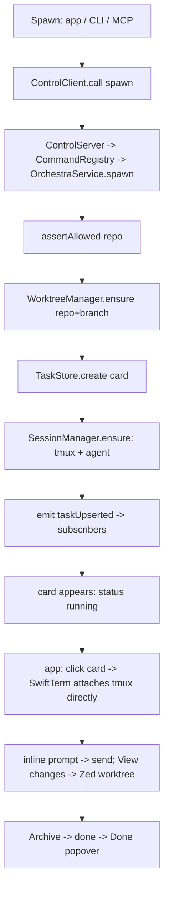

# Layer 3 — Implementation: Orchestra

> The **how**. Written together with [[04-tests]]. **Revised 2026-06-23 (#2)** for the native-macOS
> build: a Swift package with daemon / app / CLI / MCP-bridge targets over a shared `OrchestraCore`.

## Project layout

```
Orchestra/                         # Swift Package (Package.swift) + an Xcode app target
├── Package.swift                  # products: OrchestraCore (lib), orchestrad, orchestra, orchestra-mcp
├── Sources/
│   ├── OrchestraCore/             # the shared core (linked by the daemon; unit-tested directly)
│   │   ├── Model.swift            # Task, Column, AgentStatus, StartIn, ExecResult, ShellTab, Event,
│   │   │                          #   TmuxTarget, AgentSessionInfo, CardSessions (debug handles),
│   │   │                          #   ActivityItem/ActivityKind/ActivitySource (Live feed)
│   │   ├── TaskRef.swift          # ref (orchestra://task/<shortId>-<slug>), slugify, resolve(TaskRef)
│   │   ├── Config.swift           # reposRoot, worktreesRoot, socketPath, dataDir, tmux socket
│   │   ├── PathResolver.swift     # resolve + assertAllowed (realpath prefix, symlink-safe)
│   │   ├── TaskStore.swift        # actor; Codable atomic JSON (temp + replaceItem)
│   │   ├── WorktreeManager.swift  # repo + branch -> git worktree (Process)
│   │   ├── Agents/
│   │   │   ├── AgentRegistry.swift
│   │   │   └── ClaudeCodeAdapter.swift   # models() + start/resume argv
│   │   ├── SessionManager.swift   # tmux verbs via Process (-L orchestra -f embedded.conf)
│   │   ├── Launcher.swift         # openInZed(worktree)
│   │   ├── OrchestraService.swift # actor: spawn/send/move/status/archive/openShell/exec/recoverSessions/resume/restart + Event
│   │   ├── Commands.swift         # CommandRegistry: the one command set MCP + CLI are generated from
│   │   └── Control/
│   │       ├── ControlServer.swift   # UDS JSON-RPC server; dispatch CommandRegistry; push events
│   │       ├── ControlClient.swift   # UDS JSON-RPC client (shared by app/CLI/bridge)
│   │       └── DaemonLifecycle.swift  # launchd LaunchAgent install/load/ensureRunning/uninstall
│   ├── orchestrad/                # executable: links OrchestraCore, runs ControlServer (the daemon)
│   │   └── main.swift
│   ├── orchestra/                 # executable: the CLI (ControlClient) — argv -> CommandRegistry calls
│   │   └── main.swift
│   └── orchestra-mcp/             # executable: MCP bridge (stdio; optional loopback HTTP) -> ControlClient
│       └── main.swift
├── App/                          # Xcode app target: Orchestra.app (SwiftUI)
│   ├── OrchestraApp.swift         # @main; ensureRunning(daemon); BoardModel
│   ├── BoardModel.swift           # ObservableObject; ControlClient + subscribe -> @Published state
│   ├── Views/
│   │   ├── ToolbarView.swift      # MCP chip, Done, Activity, Light/Dark, New agent
│   │   ├── BoardView.swift        # 3 columns + cards + drag-drop
│   │   ├── CardView.swift         # status pill + title + desc + repo·branch + meta
│   │   ├── InspectorView.swift    # header + context gauge + breadcrumb + shell tabs + View changes
│   │   ├── RecoveryView.swift     # shown for status==.dead: Start new session (restart) / Archive / Try resume
│   │   ├── AgentTerminalView.swift# SwiftTerm LocalProcessTerminalView running tmux attach (agent)
│   │   ├── ShellTabsView.swift    # SwiftTerm tabs (shell windows)
│   │   ├── SpawnSheet.swift       # initial-prompt + repo/branch/model/start-in + CLI-equivalent preview
│   │   ├── DonePopover.swift  ActivityPopover.swift
│   │   ├── SettingsView.swift     # Settings scene: worktrees root, repos root, default model, allowlist, theme
│   │   └── Theme.swift            # light/linear tokens + Light/Dark
│   └── Assets.xcassets
├── Resources/
│   ├── embedded.conf              # tmux: status off, prefix none-ish, window-size latest
│   ├── claude-hooks.json          # managed Claude Code --settings: statusLine + hooks -> orchestra _report
│   └── com.orchestra.daemon.plist # LaunchAgent template (RunAtLoad, KeepAlive)
└── Tests/
    ├── OrchestraCoreTests/        # PathResolver, TaskStore, AgentRegistry, Commands (unit)
    ├── IntegrationTests/          # WorktreeManager (real git), SessionManager (real tmux), Control round-trip
    └── Fixtures/                  # fake-agent.sh, a throwaway git repo
```

`tasks.json`, config, and the socket live under `~/Library/Application Support/Orchestra/`;
worktrees default to `~/.orchestra/worktrees`. (runtime, not committed.)

## Implementation approach (per component)

- **`Config.swift`** — daemon-owned, user-managed settings persisted to `dataDir/config.json`.
  Defaults: `reposRoot = ~/Documents/Projects`, `worktreesRoot = ~/.orchestra/worktrees` (→ worktree
  path `worktreesRoot/<repo>/<branch>`), `defaultModel = nil`, `allowlist = [reposRoot, worktreesRoot]`.
  Derived (not user-facing): `dataDir = ~/Library/Application Support/Orchestra`, `socketPath =
  dataDir/orchestrad.sock` (short enough for `sun_path`), `tmuxSocket = "orchestra"`. Read/written via
  the control plane's `getConfig`/`setConfig`; also overridable by env on first run.
- **`PathResolver.swift`** — `assertAllowed`: `realpath` must equal or sit under an allowlist entry.
  Pure + synchronous; the lynchpin of security for repos and worktrees.
- **`TaskStore.swift`** — an `actor` (serializes writes). `Codable`; **atomic save** = write
  `tasks.json.tmp` then `FileManager.replaceItemAt`. Malformed file → move to `.bak`, start `[]`, log.
- **`WorktreeManager.swift`** — `ensure(repo, branch)`: compute `worktreesRoot/<repo>/<branch>`; if
  missing → `Process` `git -C repo worktree add <path> <branch>` (fall back to `… add -b branch path`
  when new). `path()` is pure (sheet field + `worktree` lookup). `remove()` → `git worktree remove`
  (guard dirty per policy). **Archive removes the worktree dir but keeps the branch** (no `branch -D`).
  Every path via `assertAllowed`.
- **`Agents/*`** — `AgentRegistry` is a dictionary; `ClaudeCodeAdapter` returns `models()` (Claude
  Code's list — not hardcoded in the core). **`newSessionId()`** returns a fresh `UUID().uuidString`.
  **`start(ctx)`** builds argv as `["claude"] + modelFlag(model) + startInPrompt(startIn) +
  ["--session-id", ctx.sessionId!, "--settings", hooksPath, "--name", ctx.name ?? titleSeed(ctx.prompt)] +
  promptArg(ctx.prompt)` — where `--name` sets the Claude **session name** to `ctx.name` when provided
  (e.g. `restart` passes the preserved `Task.title`), else the prompt's first line (the same value the
  service writes to `Task.title` at spawn), so the card and the agent session carry one label from the
  start; statusLine then mirrors any `/rename` back. `--session-id`
  and `--settings` are both **verified** flags (`--session-id` accepts a caller UUID for a fresh session;
  `--settings` loads a JSON file **per-session, overriding/merging without touching the user's repo or
  `~/.claude/settings.json`**), and `promptArg` delivers the **initial prompt** as the agent's first
  message — the **launch positional prompt** (`claude … "<prompt>"`), delivered once at spawn and *not*
  re-handed on restart/resume; **not** via the SessionStart hook's `initialUserMessage` (decided #12). So Orchestra
  **seeds** the id, arms the tracking hook, *and* hands the agent its prompt in one launch. **`resume(ctx)`** = `["claude","--resume", ctx.sessionId!,
  "--settings", hooksPath, "--name", ctx.name!] + modelFlag(ctx.model)` (verified flag —
  revives a *specific* session by id and re-arms the hook + statusLine; **no `--session-id`** — the id is
  the resume target, not a new seed; **no `promptArg`** — the conversation history already holds the task;
  `--name`/`--model` re-assert the card's label + model on the revived session, and all three compose with
  `--resume`, verified; `--continue` only reopens the most-recent and isn't used). Used by reboot recovery
  and the Recovery panel's **Try resume**. Resume is **inert until prompted** (no model call on revival —
  verified), so reviving many at once costs only process launches. Argv is always `[String]`.
  - **`hooksPath`** = the daemon-written managed settings file (`dataDir/claude-hooks.json`, rendered
    from `Resources/claude-hooks.json` on daemon start so it points at the live `orchestra` binary). It
    wires the agent's **statusLine + hooks** to the hidden **`orchestra _report --event <kind>`** helper,
    which reads that event's JSON from stdin, reads `$ORCHESTRA_TASK_ID` from the launch env, maps the
    fields to a `StatusReport`, and `call`s the daemon's `report` over `$ORCHESTRA_SOCK`. One managed file
    serves all cards (keyed by env), nothing per-card. The wiring (all **verified** surfaces):
    - **`statusLine`** → `_report --event statusline`: maps `context_window.used_percentage`→`ctxPct`,
      `model.display_name`→`model`, `session_id`/`transcript_path`→ id tracking, and a **non-empty**
      `session_name`→`title` (a `/rename` mirror; empty is ignored — no clobber). **statusLine stdout is
      display-only (verified)** — the helper prints a one-line status to stdout *and* side-channels the
      `StatusReport` to the daemon (the daemon socket, not stdout). Fires after each assistant message /
      `/compact` / mode change, **300ms-debounced**. **`ctxPct` is delivered _only_ to the statusLine's
      stdin** (not to hooks), so the statusLine is the sole source for the gauge — the helper must read it
      from there. **Critical: an in-flight statusLine command is _cancelled_ when the next update fires
      (verified)** — so the send here is a **bounded synchronous call with a ~50ms deadline, _not_
      fire-and-forget/detached** (decided 2026-06-24). On a local UDS the `report` round-trip is sub-ms, so
      it finishes far inside both the 50ms deadline and the 300ms gap — the command exits before the next
      tick (nothing to cancel), and the bar text is printed right after. If the deadline trips (daemon
      momentarily busy) the report is **dropped, not retried** — correct because every statusLine field is
      a self-healing *snapshot* and the next tick (300ms later) re-reports current truth; a stale value must
      never land late. This is deliberately chosen over a detached send: detaching avoids drops but
      reintroduces **child pile-up under a daemon stall** and **out-of-order arrival** (a slow `ctxPct=42`
      landing after a fresh `ctxPct=43`, ticking the gauge backwards). Synchronous = generation order = no
      reordering, at most one in-flight send per card, self-limiting. The drop window is bounded and
      self-heals — see the `report` **monotonic seq guard** + the *no-heavy-work-on-the-report-path* rule
      below. (Hook-driven reports don't share this hazard: hooks fire one-at-a-time and Claude Code waits
      for each, so they're naturally ordered — they send synchronously with no deadline drop.)
    - **`SessionStart`** (`startup`·`resume`·`clear`·`compact`) → `_report --event session`: current
      `session_id` + `transcript_path`, so a mid-session `/clear` rolls the id over (in-process, no
      relaunch). For `source ∈ {clear, resume}` it also sets `status: waiting` and clears the stale `desc`
      (agent idle); on `source: clear` it additionally sets **`titleProvisional: true`** so the next prompt
      re-titles the card. **Naming is best-effort (decided):** `/clear` wipes `session_name` and changes
      the id (both verified 2026-06-24), leaving the session nameless — and Orchestra does **not** try to
      re-name it. We deliberately **do not** use a `sessionTitle`-on-`clear` re-assert (its behavior is
      contradicted across research passes) nor a `tmux send-keys "/rename"` hack (unsupported, transcript
      noise). The card title is display-authoritative and the next prompt re-titles it; cross-surface
      searchability rides the tracked `session_id` + the picker's first-prompt fallback. Nothing special on
      `resume` — an in-session `/resume` to a *different* session adopts that session's name/id/transcript.
    - **`UserPromptSubmit`** → `_report --event prompt`: set `status:running` and pass `promptText`; the
      daemon re-titles the card to the prompt's first line **iff `titleProvisional`** (post restart/`/clear`),
      else ignores it (so a text-only turn still flips to running). **`PreToolUse`/`PostToolUse`** →
      `_report --event tool`: `status:running` + render `tool_name`+`tool_input` into a `desc` ("Editing
      Foo.swift", "Running tests", "Web search: …").
    - **`Notification`** → `_report --event notify`: `idle_prompt`/`permission_prompt` ⇒ `status:waiting`
      (+ `desc` = the message); **`Stop`** → `_report --event notify` ⇒ end-of-turn (waiting on user).
    - **`SessionEnd`** → `_report --event sessionend`, keyed on `reason`: **transition** reasons
      (`clear`/`resume`/`compact`) are **ignored** (the matching `SessionStart` handles them and the
      process lives on); a **genuine termination** (`logout`/`exit`/`other`) is **mid-life session loss**
      → the daemon marks the card **`.dead`** with **`deadReason = .agentExited`** (work preserved; the
      Recovery panel offers *Try resume* / *Start new* / *Archive*). We do **not** auto-resume mid-life
      (the quit may be intentional) — eager resume is reserved for startup/reboot. (The poll's liveness
      reconcile is the safety net when no `SessionEnd` fires — a hard crash / `tmux kill` → that path uses
      `deadReason = .sessionVanished`.) `done` stays
      archive/explicit-move only (v1 doesn't auto-finish).
  - **`sessionInfo(ctx)`** is exact from the tracked state: `sessionId =` the live `Task.agentSessionId`,
    `transcriptPath = ~/.claude/projects/<cwd-slug>/<id>.jsonl` (slug = abs `cwd` with `/`→`-`),
    `priorSessionIds`/`priorTranscripts` from the card, `resumeCmd = resume(ctx)`. **Fallback** (sessions
    Orchestra didn't start, or no hook callback yet): newest `*.jsonl` under that dir whose first record's
    `cwd` matches the worktree; `nil` only if nothing matches — never a guessed id. Pure filesystem read.
    *Why not scrape tmux:* verified Claude Code exposes no session env var, terminal title, or stdout
    marker — the hook callback (push) is the live source, with discovery as the only fallback.
- **`SessionManager.swift`** — control verbs via `Process` `["tmux","-L",socket,"-f",
  "embedded.conf", …]`; `ensure(task, argv)`: `has-session`; if absent → `new-session -d -s name -c
  worktree` (window 0) → `rename-window agent` → start the supplied **`argv`** (the adapter's `start`
  **or** `resume` output) **with `ORCHESTRA_TASK_ID=<id>` +
  `ORCHESTRA_SOCK=<socketPath>` exported in the window env** (`new-session`/`new-window -e KEY=VAL`, or
  a `set-environment` before the agent runs) so the SessionStart hook's `_report` can attribute
  the callback to this card. **Attribution chain (verified 2026-06-24):** `$ORCHESTRA_TASK_ID` is the
  **primary key** because it's *stable across the card's whole life* — it survives the `/clear`
  **session-id rollover** that `session_id` cannot bootstrap (a freshly-cleared session reports a *new*
  id the daemon hasn't seen, so id alone can't say which card fired the hook; the stable task id can).
  Env inheritance into hook subprocesses **works in practice but is undocumented**, so it's hardened two
  ways: (1) the **SessionStart hook writes `ORCHESTRA_TASK_ID` into `$CLAUDE_ENV_FILE`** (the *documented*
  persist-a-var mechanism) so every later hook + the statusLine get it guaranteed; (2) every `_report`
  *also* carries the **`session_id` read from the hook's stdin** (guaranteed present on every hook, equal
  to our seeded `--session-id <uuid>`), letting the daemon corroborate via the spawn-time `uuid → task`
  map. **Last-resort fallback = the SessionStart `cwd`**, which in Orchestra is a *reliable* discriminator
  (the generic "two sessions can share a cwd" caveat doesn't apply here — **1 card = 1 worktree = 1
  unique cwd**, by construction). A one-line on-device smoke test confirms raw env inheritance before we
  lean on it; the `CLAUDE_ENV_FILE` + `session_id` + `cwd` fallbacks make attribution correct regardless.
  (Threading `argv` through `ensure` is what lets `resume` reuse the exact
  same session-creation path with `claude --resume …` instead of a fresh `start`.) **`isAlive(name)`** →
  `has-session -t name` (exit-0 → true) — the cheap liveness check `recoverSessions` keys on (false for
  every card after a reboot; true after a daemon-only crash, since the tmux server is a separate process).
  `newShellWindow` → `new-window -n
  shell-N -c cwd`. Liveness via `list-sessions -F`. **`windows(name)`** → `list-windows -t name -F
  '#{window_index} #{window_name}'`, mapping each row to a `TmuxTarget` (kind `.agent` for index 0 /
  name `agent`, else `.shell`; `target = "name:window"`; `attach = "tmux -L <socket> attach -t
  <target>"`); `[]` if the session is gone. **No attach here** — clients attach to tmux directly.
- **`OrchestraService.swift`** — an `actor`. `spawn(prompt, repo, branch, …)` (**user supplies only
  `prompt`**): assertAllowed repo → `worktreeManager.ensure` → `adapter.newSessionId()` (mint the agent
  session id) → `taskStore.create` (column from `startIn`, status `.running`, **`agentSessionId` = the
  minted id, `title` seeded from `prompt`** via first-line/truncate (`titleProvisional = false` — the
  prompt already titled it), **`initialPrompt` = the full `prompt`** (persisted for the `title` seed +
  Recovery-panel display; *not* re-sent on restart), `desc` empty) →
  `sessionManager.ensure(task, adapter.start(ctx))`
  (`ctx` carries `.sessionId` **+ `.prompt`** so the launch is `claude --session-id <id> …
  <prompt>`, delivering the prompt as the agent's first message) → emit `taskUpserted` → return. `title`
  later follows a `/rename` (`session_name` mirror) or a post-restart/`/clear` first-prompt re-title; `desc`/
  `ctxPct`/`status` are pushed live (below). `send` → write to the agent window. `move` → column + reorder. `status`/`list` → store +
  derived `running`. `archive` → `.done` + `archived`, detach/kill, optional worktree removal.
  `openShell` → new shell window. `exec(id, cmd, timeout)` → `Process` `/bin/sh -c cmd` with cwd =
  worktree, adapter env, a timeout (kill on expiry) + output cap → `ExecResult` (non-zero exit is a
  value, not a throw). `sessions(id)` → resolve the `Task`, call `sessionManager.windows("orchestra-
  \(id)")` for `[TmuxTarget]` (empty ⇒ `running:false`), call `adapter.sessionInfo(ctx)` with
  `ctx.sessionId = task.agentSessionId` (so the assigned id gives an exact transcript/resume), and
  assemble `CardSessions` (ref/id/worktree/socket/session/running/targets/agent). Read-only —
  spawns/creates nothing; works on a dead/archived card (empty targets, but the persisted current + prior
  ids + transcripts + resume still return). `report(id, patch: StatusReport)` — invoked by the agent's
  statusLine + hooks via `_report`: merge each present field onto the `Task` — `ctxPct`/`desc`/`status`/
  `model` in place; a changed `sessionId` appends the old to `priorSessionIds` (+ path to
  `priorTranscripts`) and sets the new current; a **non-empty** `sessionName` updates `title` + clears
  `titleProvisional` (empty ignored); `promptText` **while `titleProvisional`** re-titles `title` to its
  first line + clears the flag (post restart/`/clear`), else ignored; set `updatedAt`. Persist + emit
  `taskUpserted` **only if something changed** (idempotent — statusLine fires per message).
  **Ordering guard (per-card monotonic seq):** each `StatusReport` carries a `seq` stamped by `_report`
  *before* it sends (a monotonic clock read — the statusLine path serializes per session in Claude Code, so
  `seq` faithfully reflects generation order); `report` keeps `lastSeq[id]` and **drops any report with
  `seq <= lastSeq[id]`** for the snapshot fields (`ctxPct`/`desc`/`status`/`model`/`title`). This makes a
  late or duplicate arrival a no-op, and — crucially — if several reports for one card queue up during a
  brief stall, the stale ones **coalesce away** on apply, so the daemon **snaps straight to the latest
  value** instead of replaying old gauges. (Genuine state transitions carried by hooks — `sessionId`
  rollover, `dead`, title-from-prompt — are *not* seq-gated; they're event-ordered already.)
  **Report ingestion must stay off the heavy-op critical path:** `report` is microseconds of work and its
  only realistic stall is head-of-line blocking behind a long actor section (a `spawn`'s `git worktree
  add`, a mass `recoverSessions`). So those slow operations run their git/tmux/process-launch I/O as
  **async work that doesn't hold the actor's execution** — keeping critical sections short so `report` is
  always serviced within a millisecond or two and the 50ms statusLine deadline effectively never trips.
  This is what bounds the gauge-freeze window to (at worst) the duration of a heavy op, after which the
  seq guard snaps every card to current. The
  background poll (`capture-pane` + `list-sessions`) is now a **fallback only**: tmux liveness for
  `running`, and best-effort `desc`/`ctxPct`/`sessionInfo`-discovery if the push channel is silent
  (misconfigured statusLine/hooks, or a non-Claude agent). It also **reconciles liveness continuously**:
  if a non-archived, non-`done`/non-`dead` card's tmux session is no longer alive — agent exited, crashed,
  or was killed mid-life while the daemon is up (anything `recoverSessions` would otherwise catch only at
  startup) — the poll marks it **`.dead`** (`deadReason = .sessionVanished`) + emits, so the Recovery
  panel surfaces it without a daemon restart. This is the safety net for terminations where no `SessionEnd`
  fires (a hard crash / `tmux kill`); it's **guarded against cards mid-`resume`/`restart`** (those
  recreate the session) so it can't race them into a false `.dead`. Then emits events.
  - **Activity events.** Alongside the `taskUpserted`/`taskRemoved` events above, the service emits
    `Event.activity(ActivityItem)` at **listable** moments only: `spawn`/`move`/`archive` (`source` = the
    calling client), a `report` **status transition** (waiting↔running → `source: agent`; *not* the
    `ctxPct`/`desc`-only ticks that fire every statusLine debounce), `recoverSessions`/`resume`/`restart`
    flipping a card into/out of `.dead` (`.dead`/`.recovered`), and every public `CommandRegistry` verb
    arriving over **MCP/CLI** (`.command`, `source: mcp`/`cli`). Each carries the card `ref` for
    click-through. This is the Activity **Live** tab's source; `ctxPct` churn never reaches it.
  - **Recovery — `recoverSessions()` / `resume(id)` / `restart(id)`.** `recoverSessions()` runs once at
    daemon start (from `orchestrad/main`, after `taskStore.load`): for each non-archived `Task`, if
    `sessionManager.isAlive("orchestra-\(id)")` is false, decide per card — **resumable** (`agentSessionId
    != nil` *and* `FileManager` finds its transcript `~/.claude/projects/<cwd-slug>/<id>.jsonl`) → add to a
    revival queue; **else** → set `status = .dead` (`deadReason = .rebootUnrevived`), persist, emit
    `taskUpserted`. The queue drains through a bounded-concurrency runner (a Swift `TaskGroup` gated to
    `config.maxConcurrentRevivals`, default 4, so 10–30 cards don't fork a `claude` storm) calling
    `resume(id)` each. **No-op after a daemon-only crash** (every `isAlive` is true → nothing to do).
    `resume(id)`: build `ctx` (cwd = worktree, `sessionId = agentSessionId`, model, `name = title`),
    `sessionManager.ensure(task, adapter.resume(ctx))` (→ `claude --resume <id> --settings <hooks> --name
    <title> [--model …]`, **no `--session-id`, no prompt** — history holds it), then **await confirmation**:
    the `SessionStart`(`resume`) hook fires in the revived agent and calls `report`, which the service
    awaits up to `config.revivalGraceSeconds` (default 15). On callback → `status = .waiting`, **clear
    `deadReason`/`deadDetail`**, emit `taskUpserted`. On timeout / non-zero `claude` exit / missing
    transcript → `status = .dead`, **`deadReason = .resumeFailed`** + a `deadDetail` (the grace timeout,
    the captured stderr, or "transcript gone"), persist, emit, **and throw** (the panel/CLI/MCP shows it).
    Whether invoked by the boot sweep or the user's *Try resume*, failure leaves a `.dead` card with the
    reason recorded. `restart(id)`:
    mint a **fresh** `agentSessionId` (old current → `priorSessionIds`), `sessionManager.kill` any stale
    session, then `sessionManager.ensure(task, adapter.start(ctxFresh))` with **`ctxFresh.prompt = nil`** and
    **`ctxFresh.name = task.title`** — a **blank** fresh session with **no first message** (the original
    prompt is *not* re-handed; the user drives the new agent, which sees the preserved worktree state on
    disk), named with the preserved title as the new session's initial name; set **`status = .waiting`**
    (blank, idle awaiting the first prompt) and **`titleProvisional = true`** (the user's first prompt
    re-titles the card), persist, emit. Reuses repo/branch/worktree/column/title; **never touches
    worktree contents**. `recoverSessions` is internal; `resume`/`restart` are public (CLI/MCP + the Recovery panel).
- **`Commands.swift` (`CommandRegistry`)** — the single source of truth: an array of `{ name, params
  (JSON schema), run(params) }` for `list/spawn/move/send/status/archive/restart/resume/shell/exec/
  sessions/batch-spawn`, each delegating to `OrchestraService`. **Both** the MCP bridge and the CLI iterate
  this one registry, so adding/changing a command updates both surfaces at once. `shell` returns `{session,
  window}`; `exec` returns `{stdout, stderr, exitCode}`; `sessions` returns `CardSessions`; `restart`/
  `resume` each return the updated `Task` (a thrown error from `resume` carries that the card went `.dead`).
- **`TaskRef.swift`** — `Task.ref`/`shortId` + `slugify(title)`; `resolve(_ ref:in:)` parses a full
  UUID, a `shortId`, or an `orchestra://task/<shortId>[-slug]` URI → `Task` (throws `UnknownTask`).
  `OrchestraService`/`CommandRegistry` resolve a `TaskRef` at the start of every card-addressed command.
- **`Control/ControlServer.swift`** — a `Network.framework` (or NIO) **UDS** listener at `socketPath`
  (create `dataDir` `0700` first). Decode JSON-RPC requests → dispatch to `CommandRegistry` (+
  `subscribe`/`getConfig`/`setConfig`/`ping`/`version`); encode results/errors; push `Event`
  notifications. Keeps a bounded **activity ring buffer** (~200 `ActivityItem`s): every
  `Event.activity` the service emits is appended and fanned out to subscribers, and `subscribe()`
  **replays** the buffer to a newly-connected client so the Activity **Live** tab populates at once
  (live-only — not persisted across daemon restarts). **Transport-agnostic dispatch:** the same handler is fed by a UDS connection. **Remote
  (v-next) rides SSH-over-Tailscale** — the client SSH-forwards this UDS (`ssh -L localpath:socketPath`)
  or runs `orchestra` over SSH, so the daemon needs **no network listener**. A WebSocket listener
  (tailnet-bound) + the `attachTerminal` proxy methods are an **optional fallback only**; nothing
  network ships in v1, and the handler needs no change when remote lands.
- **`Control/ControlClient.swift`** — connect to `socketPath`; `call(method, params)` (async
  request/response) and `subscribe()` (async stream of `Event`). Shared by app/CLI/bridge.
- **`Control/DaemonLifecycle.swift`** — `install()` writes `~/Library/LaunchAgents/
  com.orchestra.daemon.plist` (`ProgramArguments → orchestrad`, `RunAtLoad`, `KeepAlive`) and
  `launchctl bootstrap gui/$UID` + `enable`. `ensureRunning()`: `ping()`; if dead, **the app shows a
  first-run prompt explaining the background helper, then** install/load on approval (the CLI installs
  non-interactively). `uninstall()`: `bootout` + remove plist.
- **`orchestrad/main.swift`** — build `OrchestraService`, **render `dataDir/claude-hooks.json`** from
  `Resources/claude-hooks.json` (so the `--settings` file always exists + its statusLine/hooks point at
  the current `orchestra` binary). At render time it **resolves the statusLine display per
  `Config.statusLineMode`**: for `.passthroughGlobal` it reads the user's **global**
  `~/.claude/settings.json` and extracts **`.statusLine.command`** (statusLine is always `type:"command"`,
  verified — no static type to handle; absent → mark as default), and bakes the resolved command into the
  managed file/env so `_report --event statusline` can delegate to it; for `.custom` it bakes `customStatusLine`; `.orchestraDefault` needs nothing. *(Project-level
  `.claude/settings.json` in a worktree is **not** resolved in v1 — future feature.)* `setConfig`
  re-renders this file when the mode/custom string changes, so new sessions pick it up. **`await service.recoverSessions()`** (revive/`dead`-mark cards whose
  tmux session didn't survive — the reboot-recovery pass; a no-op after a daemon-only crash), start the
  background poll (now a fallback), run `ControlServer`; log to `dataDir/orchestrad.log`. Idle-safe
  (KeepAlive restarts it). Recovery runs **before** accepting client connections only loosely — it's fired
  on the actor and clients see cards flip from their persisted state → revived/`dead` via `taskUpserted`
  events as each card settles, so a slow revival never blocks the daemon coming up.
- **`orchestra/main.swift` (CLI)** — a thin client over the **same** `CommandRegistry`: map argv
  (`orchestra <cmd>` + flags) onto each command's params and `call` the daemon (`ensureRunning()`
  first). `batch-spawn` reads JSON/lines from stdin; `exec` prints `stdout`/`stderr` and exits with
  `exitCode`; `shell <id>` execs `tmux -L orchestra attach -t orchestra-<id>` (the only command that
  takes over the terminal); `sessions <id>` prints the `CardSessions` as a human block — the agent
  session id + transcript path (+ any prior ids), then one copy/paste `tmux … attach -t` line per window
  (`--json` emits the raw struct for scripting). A hidden **`_report --event <kind>`** subcommand (run
  *by the agent's statusLine + hooks*, not by users) reads the event JSON from stdin, takes the card from
  `$ORCHESTRA_TASK_ID` (env), maps fields to a `StatusReport`, and `call`s `report` on the daemon at
  `$ORCHESTRA_SOCK` (the statusline send is the **bounded ~50ms sync** call). For `--event statusline`
  it **also prints the display line** per `Config.statusLineMode` (baked into the managed file at render
  time — see `main.swift`): **`.passthroughGlobal`** → run the user's resolved statusLine **command** the
  way Claude does (`sh -c "<cmd>"`, the *same* stdin JSON piped in, **inheriting our env** so
  `~`/`$CLAUDE_PROJECT_DIR` expand for free, with a short `timeout` so a hung user script can't wedge the
  bar) and pass its stdout through; **`.custom`** → same execution path on `Config.customStatusLine`;
  **`.orchestraDefault`** → emit `model · ctx%`. **Any miss falls through to `.orchestraDefault`** — no
  user statusLine set, an empty `customStatusLine`, a non-zero exit, or a timeout — so the bar never
  blanks. (No static-type handling: statusLine is always `type:"command"`, verified.) The report side-channel fires **regardless of
  mode** (display choice never affects the push). Plus `orchestra daemon install|start|stop|status`.
- **`orchestra-mcp/main.swift` (MCP bridge)** — built on the official **`swift-sdk`**; for each
  `CommandRegistry` command, register an MCP tool of the same name + param schema whose handler `call`s
  the daemon. Runs over **stdio** (what MCP clients spawn); an optional `--http` mode serves **loopback**
  streamable-HTTP (reachable remotely later via SSH-forward or, if ever wanted, a tailnet bind). `shell` returns the tmux
  target; `exec` returns the captured result; `sessions` returns the structured `CardSessions` (so a
  calling agent can run a `target.attach`, `send` to a window, or open `transcriptPath` to search the
  run); card-addressed tools accept a `TaskRef`.
- **App (`OrchestraApp` + `BoardModel` + Views)** — `@main` ensures the daemon is running, opens a
  `ControlClient`, `subscribe`s, and renders. `BoardModel` holds `@Published [Task]` updated from
  events; drag-drop calls `move`; the Spawn sheet has a single multiline **Initial prompt** field (no
  title/desc) plus repo/branch/model/start-in, pulls adapter `models()` + repos, live-updates the
  **Worktree** field + **CLI-equivalent** string (`orchestra spawn --prompt "…" --repo … --branch …`),
  and calls `spawn`. `BoardModel` also keeps a `@Published [ActivityItem]` (the `subscribe()` backfill
  plus streamed `Event.activity`, capped to the buffer size); `ActivityPopover` renders two tabs —
  **Live** (that feed, newest-first, each row clicking through to its card via `ref` → `orchestra://task/…`)
  and **CLI** (a static command reference + a `batch-spawn` example). `InspectorView` shows the context
  gauge from `ctxPct`, Copy chat link / Copy worktree path, "New terminal" → `openShell` then a
  SwiftTerm shell tab, **View changes** → `openInZed`, **Archive** → `archive`, Copy chat link copies
  `task.ref`. The breadcrumb's **Copy tmux target** / **Copy session id** call `sessions` and copy
  `targets[agent].target` / `agent.sessionId` (+ transcript path) respectively — the same handles the
  CLI/MCP `sessions` command returns. `AgentTerminalView` hosts a SwiftTerm `LocalProcessTerminalView` running `tmux -L
  orchestra attach -t orchestra-<id>`. **When `task.status == .dead`, `InspectorView` renders a
  `RecoveryView` in place of `AgentTerminalView`** (a `RecoveryView.swift`): a calm panel — title "Session
  lost", a **"why" line rendered from `task.deadReason`** (+ `deadDetail`): `.agentExited` → "The agent
  exited."; `.sessionVanished` → "The session stopped unexpectedly (crashed or was killed).";
  `.rebootUnrevived` → "Lost on reboot and couldn't be auto-resumed."; `.resumeFailed` → "Resume failed —
  {deadDetail}." — then a line that the worktree's work is preserved (showing `repo · branch`, the
  worktree path, and **`task.initialPrompt` as "Originally asked:"** so the user recalls what the card was
  for before deciding), and primary buttons **Start new session** → `restart(ref)` (launches a **blank**
  fresh agent — the original prompt is *not* re-sent; the live terminal returns as the card goes `.running`)
  and **Archive** → `archive(ref)`; a secondary **Try resume** → `resume(ref)` is shown only when a
  transcript still exists (from `sessions`’ `agent.transcriptPath != nil`), with a spinner while it runs;
  **on failure the card stays `.dead` and the "why" line updates to the new `.resumeFailed` + `deadDetail`**
  (an inline toast also surfaces the error), so a failed Try resume tells you *why* and leaves Start
  new / Archive available.
  The card's status pill renders `.dead` as a muted/alert style (distinct from the `done` checkmark). The app registers the **`orchestra://` URL scheme**
  (`CFBundleURLTypes`); opening `orchestra://task/<ref>` resolves a `TaskRef` and focuses that card. A
  SwiftUI **`Settings` scene** (`SettingsView`) reads/writes `Config` via `getConfig`/`setConfig` (the
  daemon persists + applies it) — worktrees root, repos root, default model, allowlist, theme.

## Edge cases & error handling

- `git` / `tmux` / `claude` / `zed` missing → typed error → control-error → app toast (agent/tmux
  failures also show in the terminal pane).
- **Daemon not running / socket stale** → `ControlClient` retries `ensureRunning()`; a leftover socket
  file is unlinked + recreated on daemon start.
- Branch already checked out in another worktree → "branch in use" error from `ensure`; no duplicate.
- Dirty worktree on archive → no silent delete; confirm (policy) or keep the worktree.
- **Reboot (tmux + agents gone)** → on daemon start `recoverSessions()` finds `isAlive` false for every
  non-archived card and **eagerly revives** each via `claude --resume <id>` in its worktree (transcript
  survived on disk), throttled to `config.maxConcurrentRevivals` — conversation comes back intact. Safe en
  masse because resume is **inert until prompted** (no model call on revival — verified). A daemon-only
  crash hits the same pass but every session is still alive → no-op.
- **Unrevivable session** (no `agentSessionId`, transcript missing, `claude --resume` exits non-zero /
  "No conversation found", or no `SessionStart`(`resume`) callback within `revivalGraceSeconds`) → card
  set to **`.dead`** (work preserved, not running). User recovers from the inspector **Recovery panel**:
  **Start new session** (`restart` — fresh **blank** session, same worktree, **no prompt re-handed**) or **Archive**;
  **Try resume** offered when a transcript still exists. Detection is deterministic (transcript-existence
  pre-check + exit code + grace-window timeout) — Orchestra never fabricates a revival.
- **Revival storm avoided** → `recoverSessions` drains its queue through a `TaskGroup` capped at
  `maxConcurrentRevivals` (default 4); 10–30 cards revive in small waves, not all at once.
- **Corrupt/truncated transcript** (agent killed mid-tool-call by the reboot) → `claude --resume` fails →
  caught by the same `.dead` path; the worktree is untouched, so **Start new session** recovers cleanly.
- SwiftTerm tmux attach drops → the view reconnects (`tmux attach` is cheap); the session is untouched.
- Concurrent writes (app + CLI + MCP all mutating) → all go through `OrchestraService` (an actor) +
  the `TaskStore` actor; `move`/reorder recompute `order` per column.
- Path escape / symlink (repo or worktree) → `PathNotAllowed` → error, nothing spawned.
- `exec` runaway → **timeout** kills the child; **output cap** truncates; non-zero exit returns
  `{exitCode}` (no throw); unknown id → typed error before anything runs.
- `ctxPct` unavailable from the agent → gauge hidden (no fabricated value). The card **ref** is always
  available (derived from the id), so "Copy chat link" never degrades.
- `sessions` on a **dead/archived** card → tmux `windows` returns `[]` and `running:false`, but the
  persisted `agentSessionId` + prior ids + transcript paths (and `resumeCmd`) are still returned so the
  run stays searchable/revivable; if the agent never wrote a transcript, `agent.sessionId`/`transcriptPath`
  are `nil` (the tmux targets and ref still resolve). Adapter slug-mismatch → `sessionInfo` falls back to
  the `cwd`-match scan; worst case it returns `nil`, never a wrong session.
- **Session id changes mid-life** (`/clear` → new id; `/compact`/resume-same → same id) → the SessionStart
  hook fires in-process and `report` rolls `agentSessionId` forward (old id → `priorSessionIds`), so
  `sessions`/resume always point at the *live* session and old transcripts stay searchable. `/compact` &
  resume-same report the same id ⇒ idempotent no-op. After `/clear` the session is nameless (best-effort —
  not re-named); the card keeps its title (empty `session_name` ignored) until the next prompt re-titles it.
- **`/clear` then a new prompt** → `SessionStart(clear)` sets `titleProvisional`; the first
  `UserPromptSubmit` re-titles the card to that prompt's first line. A `/clear`-to-continue thus picks up a
  fresh title from your next message; a `/rename` is the explicit override (and wins, clearing the flag).
- **In-session `/resume` to a *different* session** → statusLine + SessionStart(`resume`) report the
  *other* session's id/transcript/name, so the card **adopts** it (old id → `priorSessionIds`, title
  follows the adopted non-empty `session_name`). Orchestra never renames the adopted session. If it's
  nameless, the "ignore empty `session_name`" guard keeps the prior title.
- **Push channel silent / `$ORCHESTRA_TASK_ID` missing** (env not inherited, an **enterprise
  `managed-settings.json`** overrides our statusLine or sets `allowManagedHooksOnly` — *not* the user's
  global config, which our `--settings` strictly outranks; verified — or a non-Claude agent) → no `report`; the card keeps
  its **spawn-seeded** id + prompt-seeded `title`, the gauge hides (no `ctxPct`), and the **poll fallback**
  supplies `running` (tmux liveness) + best-effort `desc`/`ctxPct` and `sessionInfo` discovery. Degrades,
  never wrong. `_report` is best-effort — failures are logged, never block the agent (and never touch its stdout beyond the statusLine line).
- **statusLine debounce / churn** — statusLine fires per assistant message (300ms-debounced) and `report`
  no-ops when nothing changed, so `ctxPct` updates are frequent but cheap; `taskUpserted` only emits on a
  real delta. A `/rename` arrives as `session_name` on the next statusLine tick and upgrades `title`.
- App quit while agents run → **nothing happens to the agents** (daemon owns them); reopen re-attaches.

## Sequencing / build order

1. `Package.swift`, `Config.swift`, `PathResolver.swift` (+ tests) — security core first.
2. `TaskStore.swift` (+ tests).
3. `WorktreeManager.swift` over real git (+ integration tests with the repo fixture).
4. `Agents/*` (+ tests).
5. `SessionManager.swift` over the dedicated tmux socket (+ integration tests w/ `fake-agent.sh`).
6. `OrchestraService.swift` wiring 2–5 together (+ tests) — the core actor (incl. `recoverSessions`/
   `resume`/`restart` once `SessionManager.isAlive`/`ensure(_,argv)` and `Adapter.resume` exist).
7. `Commands.swift` (`CommandRegistry`), then `Control/*` (`ControlServer`/`ControlClient` over a temp
   socket) (+ round-trip tests).
8. `orchestrad` daemon + `DaemonLifecycle` (launchd) — background lifecycle end-to-end; wire
   `recoverSessions()` into startup (kill-tmux → restart-daemon reboot simulation in integration tests).
9. `orchestra` CLI and `orchestra-mcp` bridge generated from `CommandRegistry` (+ parity tests) —
   `restart`/`resume` ride along for free as registry commands.
10. App: `BoardModel` + board (3 columns + pills incl. `dead` + drag-drop) → Spawn sheet → `InspectorView`
    (+ `RecoveryView` for `dead` cards) → `AgentTerminalView`/`ShellTabsView` (SwiftTerm on tmux) → Done &
    Activity popovers → Light/Dark.
11. Polish: toasts/errors, `embedded.conf`, first-run daemon install UX, app notarization, README.

## Diagrams

### Bird's-eye (spawn → working agent, app optional)



### Detailed (sequence — spawn / attach / archive)

```mermaid
sequenceDiagram
    participant CL as Client (app/CLI/MCP)
    participant CS as ControlServer (orchestrad)
    participant SVC as OrchestraService
    participant WT as WorktreeManager
    participant SM as SessionManager
    participant TX as tmux
    CL->>CS: JSON-RPC spawn(prompt, repo, branch, model, startIn)
    CS->>SVC: spawn(...)
    SVC->>WT: ensure(repo, branch)
    WT-->>SVC: worktree
    SVC->>SM: ensure(task) (tmux new + agent argv)
    SM->>TX: new-session -d ; rename-window agent ; start agent
    SVC-->>CS: Task (running)
    CS-->>CL: result + push taskUpserted
    Note over CL,TX: App renders by attaching SwiftTerm to tmux directly (no proxy)
    CL->>CS: archive(id)
    CS->>SVC: archive(id)
    SVC->>SM: detach/kill ; WT.remove (policy)
    CS-->>CL: push taskRemoved
```

### Detailed (sequence — reboot recovery: revive or mark dead)

```mermaid
sequenceDiagram
    participant LD as launchd
    participant D as orchestrad/main
    participant SVC as OrchestraService
    participant SM as SessionManager
    participant TX as tmux (fresh after reboot)
    participant CA as claude --resume
    LD->>D: RunAtLoad (login after reboot)
    D->>SVC: recoverSessions()
    loop each non-archived card (throttled: maxConcurrentRevivals)
        SVC->>SM: isAlive(orchestra-id)?
        SM-->>SVC: false (tmux died in reboot)
        alt resumable (agentSessionId + transcript on disk)
            SVC->>SM: ensure(task, adapter.resume(ctx))
            SM->>TX: new-session -c worktree ; start claude --resume id
            TX->>CA: launch (inert until prompted)
            CA-->>SVC: SessionStart(resume) hook -> report (within graceSeconds)
            SVC-->>D: taskUpserted (status restored: running/waiting)
        else unresumable (no id / transcript gone / resume fails / grace timeout)
            SVC-->>D: taskUpserted (status = dead)
        end
    end
    Note over SVC,CA: Later: user clicks a dead card -> RecoveryView -> restart (new session) or archive
```

## Traceability → Layer 2 contracts

| L2 contract | Implemented by |
|-------------|----------------|
| `OrchestraService.*` | `Sources/OrchestraCore/OrchestraService.swift` |
| `TaskStore.*` | `TaskStore.swift` |
| `WorktreeManager.*` | `WorktreeManager.swift` |
| `AgentRegistry` / `Adapter` (+ `models()`) | `Agents/AgentRegistry.swift`, `ClaudeCodeAdapter.swift` |
| `PathResolver.*` | `PathResolver.swift` |
| `SessionManager.*` (+ shell windows, `windows()`, `isAlive()`, `ensure(_,argv)`) | `SessionManager.swift` |
| `sessions` (tmux targets + agent session id) | `OrchestraService.sessions` + `SessionManager.windows` + `Adapter.sessionInfo` (→ `CardSessions`) |
| Reboot recovery + `dead` + Recovery panel (`recoverSessions`/`resume`/`restart`, `AgentStatus.dead`, `Task.initialPrompt`) | `OrchestraService.{recoverSessions,resume,restart}` + `SessionManager.isAlive` + `Adapter.resume` + `orchestrad/main` startup call + `App/Views/RecoveryView.swift` + `Config.{maxConcurrentRevivals,revivalGraceSeconds}` |
| Session id tracked across `/clear`/`/compact`/resume | `claude-hooks.json` (SessionStart, `--settings`) + `orchestra _report` → `OrchestraService.report` |
| Live `ctxPct`/`desc`/`status`/`title` from the agent | `claude-hooks.json` statusLine + Pre/PostToolUse/Notification hooks → `orchestra _report` → `OrchestraService.report` (poll = fallback) |
| `CommandRegistry` (shared command set) | `Commands.swift` |
| Control protocol (UDS JSON-RPC) | `Control/ControlServer.swift`, `ControlClient.swift` |
| Daemon lifecycle (launchd) | `Control/DaemonLifecycle.swift` + `orchestrad/main.swift` |
| MCP bridge (one tool per command) | `orchestra-mcp/main.swift` |
| CLI (same command set) | `orchestra/main.swift` |
| `Launcher.openInZed` | `Launcher.swift` |
| Board / Inspector / Spawn sheet / terminals | `App/Views/*` + `AgentTerminalView` (SwiftTerm) |
| Activity feed (Live + CLI) | `ActivityItem`/`ActivityKind`/`ActivitySource` (`Model.swift`) + `Event.activity` emitted by `OrchestraService` (spawn/move/archive/`report`-transition/recovery/command) + `ControlServer` ring buffer & `subscribe` replay + `BoardModel.activity` → `App/Views/ActivityPopover.swift` |

## Concerns / decisions for review

- **The daemon is the keystone** — app, CLI, and MCP must not reimplement spawn/move/etc.; all go
  through `OrchestraService` via `CommandRegistry`/`ControlServer`.
- **launchd + first-run install** — the app installs/loads the LaunchAgent; needs a clean trust/UX and
  versioning across app updates (and a tested uninstall).
- **SwiftTerm ↔ tmux** — resize propagation and the stripped `embedded.conf`; verify SwiftTerm's
  `LocalProcessTerminalView` drives `tmux attach` cleanly (open question, validated in step 10).
- **Swift MCP** — official `swift-sdk` vs. hand-rolled stdio relay; whether loopback-HTTP ships in v1.
- **Socket path length** — keep `socketPath` under the `sun_path` limit (~104 chars).
- **Session-id tracking depends on the SessionStart hook + launch-env attribution** — verify on-device
  that (a) `$ORCHESTRA_TASK_ID` reaches the hook command (else fall back to keying on the SessionStart
  `cwd`), and (b) the `--settings` hook isn't suppressed by the user's global Claude config. The seeded
  `--session-id` + discovery fallback keep it correct (if coarser) even if the hook is silent.
- **The status channel (statusLine + hooks → `report`) is the live-field backbone** — `ctxPct`/`desc`/
  `status`/`title`/session-id all flow through the one managed `--settings` file + `orchestra _report`,
  with the `capture-pane` poll demoted to fallback. It's the agent → Orchestra half of the general
  two-way link. The reverse half in v1 is `send` (steer the tmux `agent` window) + the spawn-time
  positional prompt (#12); the **deferred extension** is `SessionStart` **`additionalContext`** injecting
  context on (re)start (the **interactive-compatible** field — so a cleared/compacted session re-learns its
  task). The sibling `initialUserMessage` is **non-interactive `-p`-only**, so it would not fire in
  Orchestra's interactive tmux sessions and is **not used** (the reason #12 keeps the initial prompt on the
  positional arg). Verify the statusLine side-channel + hook env attribution on-device; see the **Design
  note** in [[index]].
- **Reboot recovery reuses the session-id machinery; confirm safety knobs on-device** — `recoverSessions`
  leans entirely on already-designed pieces (`agentSessionId`, the on-disk transcript, `Adapter.resume`,
  the SessionStart`(resume)` hook → `report`). Two things to validate on a real machine: (a) `claude
  --resume` revival is **inert until prompted** at our scale (research-verified; confirm no surprise API
  call / MCP-startup cost makes a 10–30 card wave heavy — tune `maxConcurrentRevivals`), and (b) the
  `SessionStart(resume)` callback reliably lands within `revivalGraceSeconds` so success/`dead` detection
  is crisp (else lengthen the grace or fall back to a tmux pane-alive check). Resume must run from the
  worktree cwd (session lookup is directory-scoped, verified) — our `ensure` already sets `-c worktree`.

## Open questions — need your call

_Resolved this round:_ daemon install → **prompt on first launch** · MCP → **`swift-sdk` stdio (+ opt
loopback HTTP)** · worktree archive → **remove dir, keep branch** · chat link → **`orchestra://task`
card ref** · **worktrees root → managed `Config` setting** · remote → **SSH-over-Tailscale** (UDS
forwarded over SSH; no new daemon surface) · **reboot recovery → eager `claude --resume` on daemon start
(`recoverSessions`, throttled by `maxConcurrentRevivals`); unrevivable → `AgentStatus.dead` + a
`RecoveryView` (`restart` = blank fresh session, no prompt re-handed / `archive` / `resume`);
`Task.initialPrompt` persisted for the title seed + Recovery-panel display**.

- [x] tmux agent-start mechanism → **`new-window` with argv** (decided 2026-06-24): the
  `claude … "<prompt>"` invocation is the window's command, so agent-exit = window-exit (clean liveness/
  SessionEnd detection), no shell-prompt race. The **initial prompt** is the **launch positional arg**,
  delivered once at spawn and *not* re-handed on restart/resume (not SessionStart `initialUserMessage`).
_Resolved (`/clear` behavior, verified 2026-06-24):_ `/clear` **starts a new session id** (so the
`priorSessionIds`/`priorTranscripts` rollover in `report` *does* fire — confirmed, no longer "tolerates
both") **and wipes `session_name` to empty** (stays empty through the first prompt).

_Resolved (title binding = best-effort, decided 2026-06-24):_ the title↔`session_name` question is
**settled as best-effort**, so the mid-session-rename gap is no longer blocking. `--name` sets the name at
launch/restart/resume; a `/rename` mirrors back via statusLine; Orchestra does **not** force the name on
demand. We **rejected** both the `tmux send-keys "/rename"` hack and depending on the contradicted
`sessionTitle`-on-`clear`. After `/clear` the session is nameless and the card title is
display-authoritative; the **first prompt re-titles the card** (`titleProvisional`). Cross-surface
searchability rides the tracked `session_id` + the picker first-prompt fallback. (Confirmed along the way:
no CLI rename subcommand; `/rename` interactive-only; `session_name` not in an accessible on-disk file.)

_Resolved (live fields):_ **`ctxPct`** ← statusLine `context_window.used_percentage` (verified, pushed
via `report`); **`desc`/`status`** ← `UserPromptSubmit`/`Pre`/`PostToolUse` (→ running) + `Notification`/
`Stop` (→ waiting) hooks; the `capture-pane` poll is now a fallback. After `/clear` & `/resume` the
session hook also sets `status: waiting` + clears `desc` (agent idle), and `/clear` sets `titleProvisional`.
**`title`** — seeded from the prompt, set at launch via `claude --name` (verified; short `-n`), updated by
a `/rename` mirror or the post-restart/`/clear` first-prompt re-title; **display-authoritative** (best-effort
binding, above). No readable AI summary exists (verified). statusLine stdout is display-only, so `_report`
side-channels over `$ORCHESTRA_SOCK`.

_Resolved (session id, seed + track):_ **seed** it at spawn with `claude --session-id <uuid>` (verified
flag), then **track** it for the card's life via `--settings <managed file>` (verified — per-session,
doesn't touch the user's repo/`~/.claude`) registering a **`SessionStart`** hook (fires on `startup`/
`resume`/`clear`/`compact`, all verified, carrying the live `session_id` + `transcript_path`) whose
`orchestra _report` command pushes the current id to `report`, keyed by `ORCHESTRA_TASK_ID`
in the launch env. So `/clear` (new id), `/compact`/resume (same id) never stale the handle — old ids land
in `priorSessionIds`. **Resume = `claude --resume <id>`** (verified, same id; `--continue` is "most-recent"
only). The id can't be scraped from tmux (no session env var/title/stdout — verified); `cwd`-matched
transcript discovery is the fallback for sessions Orchestra didn't start or if the hook never fires.
_Open:_ confirm on a real machine that launch-env vars reach hook commands (else key the hook on `cwd`).
