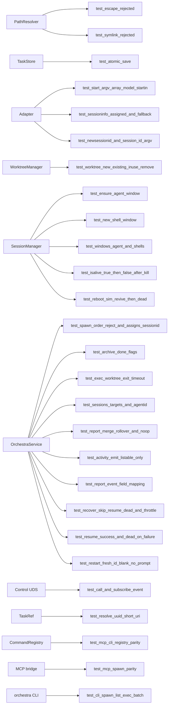

# Layer 3 — Test Design: Orchestra

> Dedicated test plan, written with [[03-implementation]]. **Revised 2026-06-23 (#2)** for the
> native-macOS build (Swift package; daemon + clients).

## Test strategy & philosophy

- **Unit-test the logic and the security boundary** — `PathResolver`, `TaskStore`, `AgentRegistry`/
  adapter argv (incl. `models()`), `CommandRegistry`, and `OrchestraService` orchestration with its
  collaborators stubbed. Fast, deterministic, highest value. (`OrchestraCore` is a plain library, so
  it's testable without the app or launchd.)
- **Integration-test the real-tool contracts** against throwaway resources:
  - `WorktreeManager` against a **real git** repo fixture (create / path / branch-in-use / remove).
  - `SessionManager` against a **real tmux** on a throwaway socket, driving a **fake agent** (ensure /
    list / shell windows / kill).
  - `ControlServer` ⇄ `ControlClient` over a **temp unix socket** (round-trip a command; receive a
    pushed `Event` from `subscribe`).
- **Surface-parity tests** — the MCP bridge's tool set and the CLI's subcommand set each equal
  `CommandRegistry`'s commands (same names + param schemas), and a functional smoke proves app-path
  (direct `call`), CLI, and MCP bridge produce **identical** daemon state.
- **Not automated:** SwiftTerm rendering, drag-drop visuals, the context gauge / chat-link UI, launchd
  install on a real machine, and real `claude`/`zed` launches — verified manually (adapter argv is
  unit-tested; we never spawn real Claude in CI).
- **Confidence target:** security + persistence + adapter + service + command logic fully unit-covered;
  git, tmux, and the socket protocol covered by integration; daemon/UI by manual smoke.

## Framework / tooling

- **`swift-testing`** (with **XCTest** where needed) — `swift test`. Async tests for the actors and the
  socket round-trip.
- **A temp unix socket** per `ControlServer` test; the in-process `ControlClient` connects to it.
- **An MCP client** (the `swift-sdk` in-process client, or a stdio harness) for the bridge test;
  child-process invocation of the `orchestra` binary for the CLI test.
- **git** required for `WorktreeManager`; **tmux** for `SessionManager` — `XCTSkip` / `.disabled`
  with a clear message if absent, so the unit suite stays green without them.
- Each integration test uses a unique tmux socket, a **temp git repo**, a temp `worktreesRoot`, and a
  temp `dataDir`/socket, and **cleans up worktrees + kills its sessions** in teardown (no leakage).

## Unit tests (per contract)

| L2 contract | Test cases |
|-------------|-----------|
| `PathResolver.assertAllowed` | allows inside reposRoot / worktreesRoot; **rejects `../` escape**; **rejects symlink outside**; rejects absolute outside allowlist |
| `TaskStore` create/update/remove | create fills id+timestamps+order+`.running`; update merges only allowed fields; **atomic save survives a mid-write crash sim**; load: empty when absent, **malformed → `.bak` + `[]`** |
| `AgentRegistry` / `Adapter` | `get` unknown throws; `list` only enabled; `models()` returns ids; `start(ctx)` is `[String]` carrying the model + plan/impl flag + `--session-id` + `--settings` + **the initial `ctx.prompt`**; no shell string |
| `OrchestraService.spawn` | takes **only `prompt`** (no title/desc); **seeds `title` from the prompt**, **persists `initialPrompt` = the full prompt**, + leaves `desc` empty; calls worktree.ensure then session.ensure (order); column from `startIn`; status `.running`; **mints `agentSessionId` via `adapter.newSessionId()` and the launch argv carries `--session-id <that id>` + the prompt**; **rejects a non-allowlisted repo before creating anything**; emits `taskUpserted` |
| `OrchestraService.move/archive` | `move` sets column ∈ plan/impl/review + reorders; `archive` sets `.done`+`archived` and triggers detach/kill (+ worktree remove per policy); emits events |
| `Event.activity` emission (Activity feed) | `spawn`/`move`/`archive` each emit **one** `activity` (`kind` = `.spawned`/`.moved`/`.archived`, `source` = caller, `ref` set); a `report` **status transition** (waiting↔running) emits `.statusChanged` (`source: agent`) but a **`ctxPct`/`desc`-only report emits none**; `recoverSessions`/`resume`/`restart` emit `.dead`/`.recovered`; an MCP/CLI command emits `.command`; the `ControlServer` **ring buffer is bounded (~200, newest-last)** and replayed on `subscribe` |
| `CommandRegistry` | every command has a JSON-schema for params; `run` dispatches to the right `OrchestraService` call |
| `TaskRef.resolve` | full UUID, `shortId`, and `orchestra://task/<shortId>-<slug>` all resolve to the right `Task`; **slug is ignored**; ambiguous/unknown ref throws; `spawn` result includes a round-trippable `ref` |
| `Adapter` session id | `newSessionId()` returns a valid UUID; `start(ctx)` with `ctx.sessionId` set includes `--session-id <id>`, `--settings <hooksPath>`, **and `--name <title-seed>` (= the prompt's first line, matching `Task.title`)**; `resume(ctx)` is `["claude","--resume",id,"--settings",…,"--name",ctx.name]` (+ model flag) — **specific session, re-armed hook, NO `--session-id`, NO prompt** (history holds it) |
| `OrchestraService.report` | merges only present fields; a **new** `sessionId` rolls the old into `priorSessionIds` (+ transcript into `priorTranscripts`); a **non-empty** `sessionName` updates `title` + clears `titleProvisional` (**empty `sessionName` ignored**, no clobber); a `promptText` **while `titleProvisional`** re-titles `title` to its first line + clears the flag, **else ignored**; **no-delta report = no persist, no event** (idempotent); unknown ref throws |
| `_report` field mapping | `--event statusline` maps `context_window.used_percentage`→`ctxPct`, `model.display_name`→`model`, non-empty `session_name`→`title` (+ prints a display line to stdout); `--event prompt` (UserPromptSubmit) → `status:running` + `promptText`; `--event tool` → `desc`+`status:running`; `--event notify` `idle_prompt`/`permission_prompt`→`status:waiting`; **`--event session` source `clear` → `status:waiting` + cleared `desc` + `titleProvisional:true` (NO title re-assert); source `resume` → `status:waiting`, adopts reported `session_name`**; **`--event sessionend` reason `clear`/`resume`/`compact` → ignored (no status change); reason `exit`/`logout`/`other` → `status:.dead` + `deadReason:.agentExited`**; missing `$ORCHESTRA_TASK_ID` → no-op, non-zero-free |
| Re-title after restart/`/clear` | with `titleProvisional` true, the **first** `--event prompt` sets `title` = prompt's first line + clears the flag; a **second** prompt does **not** change `title`; a `/rename` (`session_name`) arriving first clears the flag so the later prompt won't re-title |
| `report` **seq guard** (ordering / coalescing) | reports applied in `seq` order **1 → 3 → 2**: the `seq:2` (stale) report's **snapshot fields are dropped** (`ctxPct`/`desc`/`status`/`model`/`title` keep the `seq:3` values — the gauge never ticks backward); a **duplicate** `seq` is a no-op; `lastSeq[id]` is **per-card** (a low `seq` on card B isn't blocked by card A's higher `seq`); **event-ordered transitions are NOT seq-gated** (a `sessionId` rollover / `.dead` / title-from-prompt still applies even if its `seq` is low) |
| statusLine display mode (`Config.statusLineMode`) | **`.passthroughGlobal`**: a fixture `~/.claude/settings.json` (temp `HOME`) with a `type:"command"` statusLine → `_report --event statusline` runs it (`sh -c`, same stdin JSON, inherited env) and the rendered file's display passes its stdout through; **no statusLine / non-zero exit / timeout → falls back to `model · ctx%`**. **`.custom`**: `Config.customStatusLine` runs the same way; empty/fails → fallback. **`.orchestraDefault`**: emits `model · ctx%`. **`setConfig` re-renders** `claude-hooks.json` so a mode change takes effect for new sessions. The **report side-channel fires regardless of mode** (assert the daemon still gets the `StatusReport` under all three) |
| `Adapter.sessionInfo` | **assigned** (`ctx.sessionId` set) → exact `sessionId` + `~/.claude/projects/<slug>/<id>.jsonl` transcript + `resumeCmd`; **fallback** (no `ctx.sessionId`, fixture `~/.claude/projects/<slug>/` under temp `HOME`) → newest `cwd`-matched `.jsonl` stem; **returns `nil` when nothing matches** (no fabricated id) |
| `OrchestraService.sessions` | assembles `CardSessions` from `SessionManager.windows` + `Adapter.sessionInfo`; window 0/`agent` → kind `.agent`, others `.shell`, each `attach` line well-formed; **dead session → `running:false` + empty `targets` but still returns persisted `agentSessionId`/transcript**; unknown ref throws; creates nothing |
| `OrchestraService.recoverSessions` (stubbed `SessionManager`/`Adapter`) | **live session (`isAlive` true) → skipped** (no relaunch — daemon-crash no-op); **session gone + `agentSessionId` whose transcript exists → queues `resume`** (relaunch argv = `adapter.resume`); **session gone + no id / transcript missing → status `.dead` + `deadReason == .rebootUnrevived` + `taskUpserted`** (no relaunch); **archived cards skipped**; **concurrency never exceeds `maxConcurrentRevivals`** (assert peak in-flight with a gated stub); idempotent on re-run |
| `OrchestraService.resume` | success path: `report` callback within `revivalGraceSeconds` → status **`.waiting`**, **`deadReason`/`deadDetail` cleared**, emits `taskUpserted`, **does not** mint a new id; **failure** (no callback before grace / relaunch throws / no transcript) → sets `.dead` + **`deadReason == .resumeFailed` + a non-nil `deadDetail`** (asserts the cause string), emits, **throws**; relaunch argv is `adapter.resume` (no `--session-id`/prompt, **carries `--name <title>`**) |
| `OrchestraService.restart` | mints a **fresh** `agentSessionId` (old current → `priorSessionIds`), kills any stale session, relaunches with `adapter.start` where **`ctx.prompt == nil`** and **`ctx.name == task.title`** — **a blank session, no first message re-handed but named with the preserved title** (assert the launch argv carries `--name <title>` and **no** positional prompt); status → **`.waiting`**, **`titleProvisional == true`**, **`deadReason`/`deadDetail` cleared**; **reuses repo/branch/worktree/column/title**, **leaves `initialPrompt` intact**, **never removes worktree contents**, emits `taskUpserted`; works from `.dead` and from a live card |
| `AgentStatus.dead` / `DeadReason` | both `Codable`-round-trip; `status()`/`list()`/`sessions` surface `status` + `deadReason` + `deadDetail` over CLI/MCP; `TaskStatus(running:false, status:.dead)` distinguishable from `.done`; `restart`/`resume`-success clear status **and** `deadReason`/`deadDetail` |
| Mid-life liveness reconcile (poll, stubbed `SessionManager`) | a non-archived, non-`done`/`dead` card whose `isAlive` flips to **false** mid-run (no `SessionEnd`, e.g. crash/`tmux kill`) → poll marks it **`.dead`** + **`deadReason == .sessionVanished`** + emits `taskUpserted`; a card **mid-`resume`/`restart`** (session being recreated) is **not** falsely marked `.dead`; `done`/`archived`/already-`dead` cards untouched |

## Integration / end-to-end tests

- **WorktreeManager (real git):** `ensure` creates a worktree on a new branch (`-b`) and an existing
  branch; `path()` matches; **branch already checked out → typed error, no duplicate**; `remove()`
  deletes the worktree + tidies git metadata.
- **SessionManager (real tmux):** `ensure(task, argv)` creates a session with an **`agent`** window in the
  **worktree** cwd running the supplied `argv`; second `ensure` idempotent; `newShellWindow` adds a
  `shell-N` window; `list()` filters to `orchestra-*`; `kill()` removes it; **`isAlive` is true for a live
  session and false after `kill`**; **`windows()` after a `newShellWindow` returns the
  `agent` window (kind `.agent`) + each `shell-N` (kind `.shell`) with correct `target`/`attach`
  strings**, and `[]` once the session is killed. (Attach is client-side and exercised manually.)
- **Reboot recovery (real tmux + fake agent, simulating a reboot by killing tmux):** spawn a card with
  the `fake-agent.sh` fixture (writes a stub transcript honoring `--resume`); **`kill` its session to
  simulate the post-reboot world** (tmux gone); run `recoverSessions()` → the card is **revived**
  (`isAlive` true again, relaunched with `--resume <id>`, status restored, a `taskUpserted` observed); then
  **delete the stub transcript and kill again** → `recoverSessions()` marks the card **`.dead`** (no
  relaunch, `taskUpserted` with `.dead`). A **second card whose session is still alive is left untouched**
  (daemon-crash no-op). With N>`maxConcurrentRevivals` killed cards, **peak concurrent relaunches stays
  within the cap** (instrument the fake agent's start count). Then `restart(<dead id>)` brings it back
  (fresh **blank** session — assert no positional prompt in the relaunch argv) and `archive(<dead id>)`
  removes it.
- **Mid-life loss (daemon up, real tmux):** with the daemon running, **`tmux kill-session`** on one live
  card's session (no `SessionEnd`) → the next poll tick marks that card **`.dead`** + emits, **without**
  auto-reviving it (mid-life ≠ reboot); other live cards untouched. Separately, feeding a `SessionEnd`
  with `reason:exit` via `_report` flips it to `.dead` immediately (event-driven path).
- **Control round-trip (temp socket):** start a `ControlServer` on a temp UDS; a `ControlClient`
  `call`s `spawn`/`status`/`move`/`archive` and gets correct results; `subscribe` receives a pushed
  `taskUpserted` after a spawn from another client. A second connection sees the same state, and a
  **fresh `subscribe` backfills the recent `activity` ring buffer** (it receives the prior spawn's
  `.spawned` item without having been connected when it happened).
- **Status channel (statusLine/hooks → daemon):** with `ORCHESTRA_TASK_ID`/`ORCHESTRA_SOCK` set at a
  temp socket, pipe representative event JSON to `orchestra _report`: a **statusline** payload updates
  `ctxPct`/`model` (+ session id) and pushes `taskUpserted`; a **prompt** payload sets `running`; a
  **tool** payload sets `desc`+`running`; a **notify** `permission_prompt` sets `waiting`; a **session**
  payload (`source:clear`) with a **different** id rolls the prior id into `priorSessionIds`, sets
  `waiting`, clears `desc`, and sets `titleProvisional` (**no** title re-assert); the **next prompt**
  payload then re-titles the card to its first line and clears the flag; a **session** payload
  (`source:resume`) carrying a *different* non-empty `session_name` is **adopted** (title follows it),
  while an **empty** `session_name` leaves the title unchanged; a repeated no-delta payload is a no-op.
  `sessions` then returns the live id + the prior id; the card reflects the pushed fields.
- **`exec` (real worktree):** `exec(id, "git rev-parse --abbrev-ref HEAD")` returns the card's branch
  on `stdout`, `exitCode 0`; a failing command returns `stderr` + non-zero `exitCode` **without
  throwing**; `cwd` is the worktree; a long command hits the **timeout** and is killed; oversized
  output is **capped**. Identical via direct call, CLI, and MCP.
- **Registry parity:** the MCP bridge's tool list and the CLI's subcommand list each equal
  `CommandRegistry`'s command names + param schemas (none extra, none missing).
- **MCP smoke:** call the `spawn` tool → a card appears identical to a direct/app spawn; `send`/`move`/
  `status`/`archive`/`exec`/**`restart`**/**`resume`** mutate/report the same daemon state (`restart` on a
  card returns it `.running` with a fresh `agentSessionId`; `resume` of a still-resumable card succeeds);
  `batch-spawn` (array arg) creates N;
  **`sessions` returns a `CardSessions` whose `agent` window target round-trips to a real tmux window
  and whose `agent.transcriptPath` (from the fake-agent fixture) exists**.
- **CLI smoke:** `orchestra spawn --prompt "…" --repo … --branch …` creates a card (title seeded from
  the prompt, no title/desc flags); `orchestra list --col plan` shows it; `orchestra
  move`/`archive` mutate it; `orchestra exec <id> "<cmd>"` prints output and **exits with the command's
  code**; `orchestra restart <id>` reports a `.running` card with a new session id; `orchestra resume
  <id>` revives (or reports `.dead` on failure); `orchestra sessions <id>` prints the agent session id +
  transcript + a copy/paste attach line per window (and `--json` emits the struct); `orchestra batch-spawn`
  from a piped JSON list creates N. Parity with the MCP path.

## Edge & error cases

- `assertAllowed` symlink escape for a repo path and a worktree path.
- `WorktreeManager.ensure` when the branch is in use → typed error, nothing created.
- `archive` on a **dirty** worktree → no silent delete (policy-guarded).
- Concurrent `spawn`/`move` from two clients don't corrupt the store (service + store actors).
- `ensure` when tmux missing / `worktree` when git missing → typed error (skipped if tool absent).
- **Stale socket file** on daemon start → unlinked + recreated; `ControlClient` against a dead daemon →
  `ensureRunning()` path tested (mocked launchd).
- `openInZed` with a disallowed worktree → throws, opens nothing.
- `exec` non-zero exit / timeout / output cap / unknown id (all above).
- `ctxPct` absent from the agent → gauge hidden (no fabricated value); the card `ref` is always present.

## Fixtures / mocks / test data

- `Tests/Fixtures/fake-agent.sh` — prints a banner, echoes stdin in a loop (stands in for `claude`,
  registered as a temp adapter so no real Claude is spawned); it honors a `--session-id <uuid>` arg and
  writes a stub `<temp-HOME>/.claude/projects/<slug>/<that-uuid>.jsonl` so `sessionInfo` (assigned and
  fallback paths) has a transcript to find. It also honors **`--resume <uuid>`**: it **exits non-zero if
  that transcript is absent** (modelling `claude`'s "No conversation found" → drives the `.dead` path) and,
  when present, **fires a SessionStart(`resume`) callback** (`orchestra _report --event session`) so the
  recovery success path is exercised; a counter file lets a test assert peak concurrent launches against
  `maxConcurrentRevivals`.
- `Tests/Fixtures/repo/` — a throwaway git repo (seeded with a commit), copied to a temp dir per test.
- Temp `worktreesRoot`, temp `dataDir` + UDS path, unique tmux socket per test file.
- A `LaunchdMock` so `DaemonLifecycle` logic is testable without touching the real user agent.

## Coverage map

## Traceability → L2 contracts + L3 components

| Contract / component | Covering tests |
|----------------------|----------------|
| `PathResolver` | `OrchestraCoreTests` (escape, symlink, allow) |
| `TaskStore` | `OrchestraCoreTests` (atomic, malformed, CRUD) |
| `WorktreeManager` | `IntegrationTests` (new/existing/in-use/remove) |
| `AgentRegistry`/`Adapter` | `OrchestraCoreTests` (argv, models, get/list) |
| `OrchestraService` | `OrchestraCoreTests` (spawn order/reject, move, archive, exec, **sessions**, **recoverSessions/resume/restart**, events) |
| Reboot recovery + `dead` + Recovery panel | `OrchestraCoreTests` (`recoverSessions` skip/resume/dead/throttle, `resume` success+dead, `restart` fresh-id + **blank (no prompt re-handed)**, `AgentStatus.dead` round-trip) + `IntegrationTests` (reboot-sim: revive-then-dead, live-card-untouched, cap honored) + CLI/MCP smoke (`restart`/`resume`); `RecoveryView` UI = manual smoke |
| `SessionManager` | `IntegrationTests` (ensure(argv)/**isAlive**/shell/**windows**/list/kill) |
| `Adapter.sessionInfo` / `sessions` (debug handles) | `OrchestraCoreTests` (sessionInfo assigned/fallback) + service `sessions` + CLI/MCP smoke |
| Live status channel (`report` + `_report` statusLine/hooks) | `OrchestraCoreTests` (`report` merge/rollover/no-op + **seq-guard ordering/coalescing** + `_report` field mapping) + Control round-trip (`_report` → daemon) |
| statusLine display modes (`statusLineMode`) | `OrchestraCoreTests` (passthroughGlobal runs+falls-back / custom / orchestraDefault / `setConfig` re-render; report fires regardless of mode) |
| `ControlServer`/`ControlClient` | `IntegrationTests` (call + subscribe round-trip, stale socket) |
| Activity feed (`Event.activity` + `ActivityItem`) | `OrchestraCoreTests` (emit on spawn/move/archive/`report`-transition/recovery/command; `ctxPct`-only → no emit) + Control round-trip (`subscribe` replays the buffer); `ActivityPopover` UI = manual smoke |
| `TaskRef` (card-ref resolution) | `OrchestraCoreTests` (uuid/shortId/uri resolve, slug ignored, unknown throws) |
| `CommandRegistry` (shared MCP/CLI interface) | MCP + CLI parity tests |
| MCP bridge | `test_mcp_*` — parity across the **full** set (list/spawn/move/send/status/archive/restart/resume/shell/exec/sessions/batch-spawn) |
| CLI | `test_cli_*` — parity across the **full** set (list/spawn/move/send/status/archive/restart/resume/shell/exec/sessions/batch-spawn) |
| `DaemonLifecycle` | unit w/ `LaunchdMock` (install/ensureRunning/uninstall) |
| `Launcher`, app views, SwiftTerm, launchd-on-device | manual smoke (documented in README) |

## Decisions made

- **`OrchestraCore` is library-first** — the whole core is unit-testable without the app, launchd, or a
  socket; the daemon is a thin executable around it.
- **Real git + real tmux + temp socket, fake agent** — exercise the genuine contracts where the risk
  is, but never spawn real Claude/Zed or touch the user's real LaunchAgent in CI.
- **Surface-parity tests** — MCP and CLI assert identical state to the direct path, proving the
  one-command-set design.
- **Skip-not-fail without git/tmux** — unit suite stays green anywhere; integration runs where tools exist.
- **Reboot is simulated by killing tmux, not rebooting** — `recoverSessions` keys on `SessionManager.isAlive`,
  so `kill`-ing the fixture's session reproduces the post-reboot world deterministically in CI; the
  `fake-agent.sh` `--resume` behaviour (exit-non-zero when the transcript is gone, SessionStart callback
  when present) lets one fixture drive both the **revive** and **dead** branches without real Claude. The
  `RecoveryView` UI itself is manual smoke; its actions (`restart`/`resume`/`archive`) are covered headlessly.

## Open questions — need your call

_Resolved this round:_ archive cleanup → **remove worktree dir, keep branch** (so `archive` tests
assert the dir is gone and the branch still exists); card refs gain `TaskRef` resolution tests.

- [x] Test framework → **`swift-testing` everywhere** (decided 2026-06-24) — standardize on it for
  consistency across the async actor/control-plane tests, accepting the rough edges where XCTest would
  have been marginally simpler.
- [x] launchd/daemon-install test coverage → **mock + manual real check** (decided 2026-06-24): the
  install *logic* is tested against a `LaunchdMock`; the real plist load (`RunAtLoad`/`KeepAlive`) is
  verified once **manually**, not driven by `launchctl` in CI (avoids slow, stateful, machine-polluting
  tests).
- [ ] (v-next) Remote = SSH-over-Tailscale, so little new server testing — mostly a manual check that
  an SSH-forwarded UDS + `ssh … tmux attach` work; WS-fallback/terminal-proxy tests only if that path
  is ever built.
