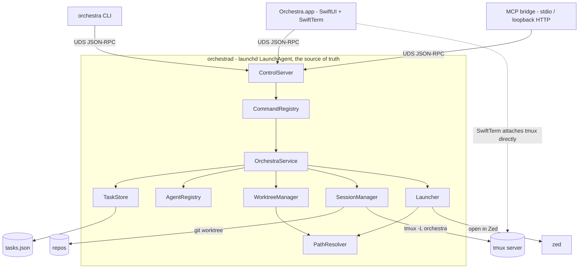

# Orchestra — Design Index

> A local-only, single-user **native macOS app** — **Orchestra** — that orchestrates many coding
> agents across repos from one board. The real work lives in a **background daemon** (`orchestrad`,
> a launchd LaunchAgent) that owns the tasks, git worktrees, and tmux agent sessions and **keeps
> running whether or not the app window is open**. Three clients drive it over one local
> **unix-socket / JSON-RPC** control plane: the **SwiftUI app**, the **`orchestra` CLI**, and an
> **MCP bridge**. Each agent runs in its own **git worktree** (its own branch) in a tmux session;
> the app's inspector renders that session live with **SwiftTerm**, attaching to tmux directly.

> **Revision (2026-06-23, #2):** re-architected from a localhost web app (Node + Express + ws +
> browser at `127.0.0.1`) to a **native macOS app**: **SwiftUI** front end, a **Swift `orchestrad`
> background daemon** under **launchd**, a **unix-domain-socket JSON-RPC** control plane, **SwiftTerm**
> terminals attaching straight to tmux, an **MCP stdio bridge** (+ optional loopback HTTP), and a
> **Swift CLI**. The Node/web/localhost stack is dropped. Product behaviour (3 columns, Done archive,
> per-task worktrees, `waiting/running/done` pills, model selection, Spawn sheet, inspector, the shared
> command set incl. `exec`) is unchanged. All layers remain **in-review**.

> **Revision (2026-06-23, #4):** added a **`sessions`** command to the shared CLI/MCP set so a card
> **ref** resolves to its **debug handles** — every tmux target (socket · `orchestra-<id>` session ·
> `agent` + `shell-N` windows, each with a copy/paste attach line) **plus** the agent-native session id
> (e.g. Claude Code's session UUID), its transcript path, and a resume argv. New types `TmuxTarget` /
> `AgentSessionInfo` / `CardSessions`, `SessionManager.windows`, `Adapter.sessionInfo`,
> `OrchestraService.sessions`, a persisted `Task.agentSessionId`, and inspector **Copy tmux target** /
> **Copy session id**. Lets an agent or user jump from a ref straight into attaching, tailing, searching,
> or resuming a card's run. **The session id is _seeded_ at spawn** (`claude --session-id <uuid>`) **and
> _tracked_ for the card's whole life**: a `--settings` SessionStart hook (fires on `startup`/`resume`/
> `clear`/`compact`, all verified) calls back `report` so `/clear` (new id), `/compact`/resume
> (same id) never stale the handle — superseded ids are kept in `priorSessionIds` so old transcripts stay
> searchable. Resumes via `claude --resume <id>`. It can't be scraped from tmux (no session env var/
> title/stdout — verified); transcript discovery is a fallback only. New: `priorSessionIds`,
> `OrchestraService.report`, a managed `claude-hooks.json`, and a hidden `orchestra _report`.

## Layers

| Layer | Document | Status |
|-------|----------|--------|
| 1 — Initial design | [[01-design]] | in-review |
| 2 — Contract | [[02-contract]] | in-review |
| 3 — Implementation | [[03-implementation]] | in-review |
| 3 — Tests | [[04-tests]] | in-review |

<!-- Status values: not started · draft · in-review · approved · skipped -->

## Current picture



> **Revision (2026-06-23, #5):** the Spawn flow now takes a **single Initial prompt** — the user no
> longer types a task name or description. `spawn`'s only free-text param is `prompt` (`{prompt, repo,
> branch, model?, col?}`); the card **`title`** is seeded from the prompt (no readable AI summary
> exists — see #6), and **`desc`** is live — both derived, never user-entered. The prompt
> is delivered to the agent as its first message. Touches the Spawn sheet, `SpawnInput`/`spawn` params,
> `--prompt` CLI flag, `batch-spawn` (one prompt per line), and `AdapterContext.prompt`.

> **Revision (2026-06-23, #6):** the live card fields are now **pushed by the agent**, not scraped. One
> managed Claude Code `--settings` file gives the agent a **statusLine** (→ `ctxPct` from the verified
> `context_window.used_percentage`, + `model` + the live session id) and **hooks** (`Pre/PostToolUse` →
> `desc`; `Notification`/`Stop` → `status`), all POSTing a `StatusReport` to the daemon's internal
> `report` (which also subsumes the earlier session-id callback) via a hidden `orchestra _report`. The
> `capture-pane` poll drops to a fallback. **`title` is bound to the agent's session name** (no readable
> AI summary exists, verified): seeded from the prompt, set at launch via `claude --name`, and mirrored
> from the live `session_name` (so `/rename` updates the card) — one label spans the board, `claude
> --resume`, and logs, easing session retracking. Resolves the long-standing `ctxPct` question.

> **Revision (2026-06-23, #7):** **reboot/crash recovery is now a committed v1 behaviour** (was "a later
> add"). On daemon start, **`recoverSessions()`** walks every non-archived card whose tmux session is no
> longer alive (true for all after a reboot; skipped after a daemon-only crash, since the external tmux
> server outlives it) and **eagerly revives** it: recreate the tmux window in the still-on-disk worktree
> and relaunch the agent with **`claude --resume <id>`** (the conversation transcript under
> `~/.claude/projects/…` survives reboot). Verified safe to do en masse — **resume is inert until
> prompted** (no API call on revival), so the only cost is process launch, which is **throttled**
> (`Config.maxConcurrentRevivals`, default 4, small stagger). When a session is **unresumable** (no
> `agentSessionId`, transcript gone, or `claude --resume` exits non-zero / the hook never reports within a
> grace window — all detectable), the card flips to a new **`AgentStatus.dead`** state ("session lost,
> work preserved, not running" — distinct from `done`). Clicking a **dead** card opens an inspector
> **Recovery panel** (in place of the live terminal): **Start new session** (`restart` — a fresh **blank**
> session id in the *same* worktree, **no prompt re-handed**; the panel shows the persisted
> **`Task.initialPrompt`** as context) or **Archive**; a **Try
> resume** affordance appears when a transcript still exists. New: `AgentStatus.dead`, `Task.initialPrompt`,
> `OrchestraService.recoverSessions`/`restart`/`resume`, a public `restart` command (CLI/MCP), Config
> recovery tunables, and the Recovery panel. See [[01-design]], [[02-contract]], [[03-implementation]],
> [[04-tests]].

> **Revision (2026-06-24, #8):** resolved the title↔`session_name` question as **best-effort, card-title
> display-authoritative** (supersedes #6's "bound" framing). `--name` sets the session name at
> launch/restart/resume and a `/rename` mirrors back, but Orchestra does **not** force the name
> mid-session — verified there's no supported mid-session rename and `/clear` goes nameless (new id +
> `session_name` wiped). **Dropped** the `sessionTitle`-on-`clear` re-assert (contradicted) and the
> `tmux send-keys "/rename"` hack. **Added: re-title the card from the first prompt after a restart or
> `/clear`** via a new `Task.titleProvisional` flag + `StatusReport.promptText` (`UserPromptSubmit` →
> re-title iff provisional; `restart`/`SessionStart(clear)` set the flag; a `/rename` clears it). Also
> wired `UserPromptSubmit` → `running`. Searchability now rides the tracked `session_id` + the picker's
> first-prompt fallback. Touches all four layers.

> **Revision (2026-06-24, #9):** **mid-life session loss is now handled** (previously only reboot, at
> startup). If a *single* agent exits/crashes/is killed while the daemon is up, the card flips to **`dead`**
> + Recovery panel — **not** auto-revived (mid-life death may be intentional; eager resume stays
> reboot-only). Two detectors: **`SessionEnd` keyed on `reason`** (transition reasons `clear`/`resume`/
> `compact` ignored; genuine `exit`/`logout`/`other` → `dead`) for the event-driven path, and the
> **background poll's continuous liveness reconcile** (non-archived, non-`done`/`dead` card whose tmux
> session vanished → `dead`) as the safety net when no hook fires (hard crash / `tmux kill`), guarded
> against cards mid-`resume`/`restart`. Fixes the prior "`SessionEnd` ⇒ idle" underspecification and the
> stale-`running` gap. Touches L1–L4.

> **Revision (2026-06-24, #10):** the Recovery panel now **shows *why* a card died** and a failed *Try
> resume* explains itself. Added **`DeadReason`** (`agentExited` / `sessionVanished` / `rebootUnrevived` /
> `resumeFailed`) + **`Task.deadReason`/`deadDetail`**, set alongside every `status = .dead` (SessionEnd
> exit → `agentExited`; poll reconcile → `sessionVanished`; boot sweep unrevivable → `rebootUnrevived`;
> any failed `resume` → `resumeFailed` + a `deadDetail` like "claude exited 1" / "no SessionStart callback
> in 15s" / "transcript gone"). `RecoveryView` renders a "why" line from it; **`resume`/`restart` success
> clears it**. A failed `resume` (auto or user-triggered) leaves the card `.dead` with the reason recorded
> and surfaces over app/CLI/MCP. Touches L1–L4.

> **Revision (2026-06-24, #11):** the **Activity feed**'s Live tab is now fully specified (was referenced
> but undefined). New **`ActivityItem`** (+ `ActivityKind`/`ActivitySource`) and a rule for emitting
> `Event.activity`: the daemon pushes one *alongside* the state change at **listable** moments only —
> `spawn`/`move`/`archive`, a `report` **status transition** (waiting↔running; *not* per-tick `ctxPct`/
> `desc`), recovery (`dead`/`recovered`), and every **MCP/CLI command** — so the feed stays scannable.
> `ControlServer` keeps a ~200-item **ring buffer** that `subscribe()` **replays** to a new client
> (live-only, not persisted across restarts); `BoardModel` holds it and `ActivityPopover` renders it
> newest-first with click-through to each card's `ref`. Closes the long-standing "`ActivityItem`
> referenced but undefined" gap. See [[01-design]], [[02-contract]], [[03-implementation]].

## Design notes

> **The Orchestra hook protocol — a two-way agent ↔ Orchestra channel (2026-06-23, updated 2026-06-24).**
> The machinery added for session-id tracking — a per-card launch env (`ORCHESTRA_TASK_ID`/`ORCHESTRA_SOCK`),
> one Orchestra-managed Claude Code `--settings` file (a defined **statusLine + hook set**), and a daemon
> callback (`report` via the hidden `orchestra _report` helper carrying tagged `StatusReport` events) — is
> **general-purpose**, not session-id-specific. It's now v1's **live-field backbone**, a reliable **push**
> channel in both directions:
> - **Agent → Orchestra (the state-update path — primary mechanism, rev #6):** every live card field is
>   *reported by the agent*, not scraped from the terminal. `_report` sends a `StatusReport` over the
>   control socket → `OrchestraService.report`, which merges only the present fields and emits a
>   `taskUpserted` event (so app/CLI/MCP update live). Sources: **statusLine** → `ctxPct` (the *only* carrier
>   of `context_window.used_percentage`) + `model` + `session_id`/`title`; **hooks** → `desc`
>   (`Pre/PostToolUse`), `status` (`UserPromptSubmit`/`Notification`/`Stop`), session-id rollover
>   (`SessionStart`), and mid-life death (`SessionEnd`). Two correctness rules: the statusLine send is a
>   **bounded ~50ms synchronous call** (it's cancelled on the next tick, so never detached — drops on a stall
>   and self-heals next tick), and a **per-card monotonic `seq` guard** drops/coalesces stale snapshot
>   reports so a slow `ctxPct` can't land after a fresh one. The `capture-pane` poll is a **fallback only**
>   (tmux liveness + best-effort discovery) when the push channel is silent. The agent (or its tools) can
>   emit further structured signals through the same helper over `$ORCHESTRA_SOCK`.
> - **Orchestra → Agent (steer live now; richer injection later):** in **v1** the reverse channel is
>   `send` (write to the tmux `agent` window) to steer the agent mid-run, plus the initial prompt delivered
>   once at spawn as a **launch positional arg** (#12). The **open extension** is structured context
>   injection on (re)start via the `SessionStart` hook's **`additionalContext`** output — the
>   interactive-compatible field — so a cleared/compacted session could re-learn the card's task without a
>   re-handed prompt. Note: the sibling field **`initialUserMessage`** is **non-interactive (`-p`) only**, so
>   it would *not* fire in Orchestra's interactive tmux sessions and is **not used** (this is why #12 keeps
>   the initial prompt on the positional arg, not `initialUserMessage`).
>
> So the agent → Orchestra state path is fully v1; the Orchestra → agent side ships `send` + the spawn
> prompt in v1, with `additionalContext` context-injection as the deferred extension. Details in
> [[03-implementation]] (`report`/`_report`); see also [[01-design]] (Decisions).

> **Card title ≠ Claude session name (best-effort, by design) — 2026-06-24.** The card **`title`** and the
> Claude **`session_name`** are no longer guaranteed to match. Orchestra keeps them aligned **best-effort**
> only: it sets the name via `claude --name` at launch/restart/resume, and a `/rename` mirrors back to the
> card. But there's no supported way to rename a *running* session, and `/clear` leaves it nameless (new
> id + `session_name` wiped, verified) — and the card may then be **re-titled by your next prompt**, so the
> two legitimately diverge. The **card title is the source of truth** for the board; the Claude session
> stays findable via the tracked **`session_id`** (+ the `/resume` picker's first-prompt fallback) rather
> than by a guaranteed-matching name. (Decided in revision #8; we rejected the `send-keys "/rename"` hack
> that would have forced equality.)

> **Control-plane data flow — one coordinator, but federated truth (2026-06-24).** Every client (the
> SwiftUI app, the `orchestra` CLI, the MCP bridge) is **thin, with no business logic**. Each holds its
> own `ControlClient` that serializes calls to **JSON-RPC 2.0** and sends them over **one unix-domain
> socket** to the daemon's single `ControlServer`, which dispatches the canonical **`CommandRegistry`**
> (the one definition both CLI subcommands and MCP tools are generated from) into the **`OrchestraService`**
> actor — the *core runner / single coordinator*. So serialization is **per-client**, not one shared
> pre-daemon box; the convergence point is the server side.
> ```
> app  ─ ControlClient ─┐
> CLI  ─ ControlClient ─┼─ UDS / JSON-RPC ─→ ControlServer → CommandRegistry → OrchestraService → {TaskStore · WorktreeManager · SessionManager · …}
> MCP  ─ ControlClient ─┘
> ```
> - **Commands in, events out.** `OrchestraService` runs every mutation, then emits `Event`s
>   (`taskUpserted`/`taskRemoved`/`activity`) that `ControlServer` pushes to every `subscribe()`d client —
>   the live board update. No client mutates state itself.
> - **Agent updates arrive over the *same* socket.** Live fields (`ctxPct`/`desc`/`status`/session id) are
>   *pushed by the agent* via the managed statusLine + hooks → the hidden `orchestra _report` helper (itself
>   just another socket client) → `ControlServer.report` → `OrchestraService.report`, which merges the patch
>   and emits an event. The inbound path is the control plane, not a private back-channel.
> - **Two caveats on "single source of truth":** (1) **terminal/PTY bytes bypass the daemon entirely** —
>   SwiftTerm and CLI `shell` attach to **tmux directly**; the control plane carries commands + state +
>   events, never PTY bytes (the `attachTerminal` proxy is a reserved remote-only fallback). (2)
>   `OrchestraService` is the single *coordinator*, but ground truth is **federated**: `tasks.json` for
>   metadata, **`tmux ls` for liveness**, **git for the worktree** — it reads liveness from tmux rather than
>   trusting its own memory (exactly what reboot recovery relies on).

## Open questions (rolled up)

_Resolved 2026-06-23 (#3):_ chat link → **agent-facing card ref** `orchestra://task/<ref>` (`TaskRef`
accepted everywhere, returned by `spawn`, URL scheme) · daemon install → **prompt on first launch** ·
worktree archive → **remove dir, keep branch** · MCP → **`swift-sdk` stdio (+ optional loopback HTTP)**
· **worktrees root → managed `Config` setting** (default `~/.orchestra/worktrees/<repo>/<branch>`) ·
remote → **SSH-over-Tailscale** (control plane is transport-agnostic; the existing SSH+Tailscale setup
forwards the UDS + carries terminals, so the daemon needs **no network listener**; v1 stays local UDS).

_Resolved 2026-06-24 (#12):_ tmux agent-start → **`new-window` with argv** (agent command is the
window command, so agent-exit = window-exit; no `send-keys` race) · initial-prompt delivery → **launch
positional arg** (`claude … "<prompt>"`, delivered once at spawn, *not* re-handed on restart/resume; not
SessionStart `initialUserMessage`) · test framework → **`swift-testing` everywhere** · launchd-install
test coverage → **`LaunchdMock` for logic + a one-time manual real-install check** (no `launchctl` in CI).

_Resolved 2026-06-24 (#13, verified against Claude Code docs):_ settings precedence is `managed >
--settings > project local > project > user global`, merged **per-key**. **(a) Our `--settings`
statusLine always wins over the user's global `~/.claude/settings.json`** (scalar key = wholesale
override; global is strictly lower) — it cannot be suppressed by user config. **(b) Hooks merge
additively** — our `--settings` hooks always fire alongside the user's; identical handlers dedup, distinct
ones all run. **(c) statusLine stdout is display-only**; the data path is the command's **side effects** —
it reads the full session JSON (incl. `context_window.used_percentage`, `model`, `session_id`, `cwd`)
from **stdin** and POSTs/`call`s it out, which is what `_report` does. **Constraint folded into L3:** an
in-flight statusLine command is **cancelled on the next update**, so the `_report` send is a **bounded
synchronous call (~50ms deadline), not detached** (decided 2026-06-24) — sub-ms on local UDS, so it exits
before the next tick; on a trip it **drops** (snapshots self-heal on the next 300ms tick). Chosen over
fire-and-forget detaching, which would reintroduce **child pile-up** under a daemon stall and
**out-of-order arrival** (a stale `ctxPct` landing after a fresh one). Backed by a **per-card monotonic
`seq` guard** in `report` (drops/coalesces stale snapshot reports → daemon snaps to the latest, never
replays old gauges) and a rule that **report ingestion stays off the heavy-op critical path** (spawn/
recovery git·tmux·launch run async so the actor never blocks `report`), which bounds any gauge-freeze to a
heavy op's duration. **Only-caveat (a risk, not a blocker on a personal Mac):** an enterprise
**`managed-settings.json`** sits *above* `--settings` — its statusLine would override ours, and
`allowManagedHooksOnly: true` would disable our hooks. Allen's machine has no managed profile, so this is
noted as a degradation risk only.

_Resolved 2026-06-24 (#14, verified against Claude Code docs):_ hook commands are ordinary subprocesses
that **inherit the launch env in practice**, so `$ORCHESTRA_TASK_ID` *does* reach the SessionStart hook —
but it's **undocumented**, so it's confirmed by a one-line smoke test and **hardened**, not trusted blind.
Attribution is now layered: **`$ORCHESTRA_TASK_ID` is the primary key** (the only one stable across the
`/clear` **session-id rollover** — a freshly-cleared session reports a *new* id the daemon hasn't seen, so
id alone can't say which card fired the hook; the stable task id can); the **SessionStart hook persists it
into the documented `$CLAUDE_ENV_FILE`** so every later hook + the statusLine get it guaranteed; every
`_report` **also carries `session_id` from the hook's stdin** (always present, equal to the seeded
`--session-id`) for corroboration via the spawn-time `uuid → task` map; and the **last-resort `cwd`
fallback is reliable here** because **1 card = 1 worktree = 1 unique cwd** (the generic "two sessions can
share a cwd" caveat can't arise by construction). Detail in [[03-implementation]].

_Resolved 2026-06-24 (#15):_ since our managed statusLine **wholesale-overrides** the user's inside agent
sessions (scalar key) and `ctxPct` is delivered *only* to the statusLine (so we must own it), the agent
terminal's status bar becomes a **Settings choice** — **`Config.statusLineMode`** ∈ {**passthroughGlobal**
(run the user's `~/.claude` statusLine and show its output), **custom** (a command written in Settings),
**orchestraDefault** (`model · ctx%`)} + `customStatusLine`. **orchestraDefault is the universal fallback**
when a passthrough/custom choice renders nothing. The report side-channel fires **regardless of display
mode**. Delegation is faithful-by-construction (`sh -c`, same stdin JSON, **inherited env** → `~` and
`$CLAUDE_PROJECT_DIR` expand for free; a `timeout` guards a hung script). statusLine is **always
`type:"command"`** (verified — no static/text type exists), so there's only one shape to reproduce and the
fallback triggers are just: unset / empty / non-zero exit / timeout. **Per-project** statusLines (a
worktree's own `.claude/settings.json`) are a **future feature** — v1 honors only the global user one.
Touches L1–L3.

**✅ No open questions remain — every decision is made and every unknown is verified or has a designed,
correctness-preserving fallback.** The only items left are *empirical build-time tunings*, not unknowns:
- _(tuning, on-device)_ Set `maxConcurrentRevivals` / stagger by observation — `claude --resume` is inert
  until prompted (no API call on revival, verified), so the cap only smooths *process*-launch load (CPU /
  MCP startup) when reviving 10–30 cards at once after a reboot. **Start at 4 and adjust.**

_Resolved (L1):_ **native macOS app** (SwiftUI), not a localhost web UI · a **background `orchestrad`
daemon** under **launchd** owns all state and runs independent of the window · **one UDS/JSON-RPC
control plane** for app · CLI · MCP bridge · terminals via **SwiftTerm attaching tmux directly** ·
board = **3 columns** (Plan → Implementation → Review) · **Done = archive** popover · agents in
**per-task git worktrees** · **eager spawn** with **Start in: Plan | Implementation** · **model
selectable** (from the agent adapter) · status pills = **waiting · running · done** · context-window
gauge + chat link · Activity feed (Live + CLI) · Light/Dark · card↔session **1:1**.

_Resolved (L2):_ Swift everywhere (daemon + app + CLI), shelling out to **tmux/git/zed** · **SwiftTerm**
for terminals · `tasks.json` via Codable atomic write · **MCP + CLI share one command set** (incl.
`exec`), generated from `CommandRegistry` · `shell` interactive (attach tmux) vs. `exec` one-shot ·
**transport-agnostic JSON-RPC** over a unix socket (no TCP) in v1, **remote via SSH-over-Tailscale**
(forward the UDS over SSH; SSH PTY carries terminals; no new daemon surface) · **card ref**
`orchestra://task/<ref>` as the agent handle · worktree archive **removes the dir, keeps the branch** ·
worktrees root + repos root are **managed `Config` settings** · daemon **prompts to install** on first launch.
