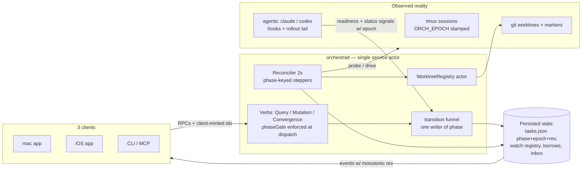

# Layer 1 — Initial Design: Card Lifecycle Convergence

> The **what**, not the how. This layer pins down what the redesigned lifecycle does, for whom, and
> under which failure conditions — before any interface or mechanism talk.

## Purpose & problem

Orchestra runs coding agents (Claude Code, Codex) as **cards**: each card owns a tmux session and
usually a git worktree, managed by a single daemon (`orchestrad`) that three clients (mac app, iOS
app, CLI/MCP) drive over JSON-RPC.

A card's lifecycle today is **edge-triggered**: verbs (spawn, archive, resume…) fire once and mutate
several uncoordinated variables (`status`, the in-memory `recovering` set) from many call sites. When
anything interrupts an edge — a race, a daemon restart, a stale signal, a clobbering write — the
variables disagree and **nothing repairs them**. A deep adversarial review of the (discarded)
`fix/spawn-hang-standalone` branch confirmed **15 lifecycle bugs** of this shape, including silent
worktree data-loss, a parent `wait` that hangs forever, zombie sessions, and unbounded daemon
freezes. A second adversarial round (2026-07-09, three reviewers) added: load-bearing state that
lives only in memory (watch registry, borrow registrations, handoff seeds, teardown progress), a
migration hole that would destroy pre-upgrade worktrees, and session-identity confusion across
relaunches.

The redesign makes the lifecycle **state-triggered and convergent**: one persisted `phase` per card
is the *intent*; a reconciler continuously drives reality (tmux sessions, worktrees) toward that
intent, idempotently, from any starting point — including a crash. Nothing load-bearing lives only
in memory.

## Goals / non-goals

**Goals**

- **One persisted lifecycle variable** (`phase`) with a single validated writer; the whole class of
  multi-variable disagreement becomes impossible.
- **Crash-equivalence:** a daemon SIGKILL / panic / reboot is not special — the next boot re-derives
  everything from persisted state plus re-observation, and re-drives in-flight work.
- **Deterministic staleness:** signals from dead/old sessions are discarded by construction
  (per-launch epochs), not by timers or grace windows.
- **Fail-safe resource handling:** never destroy a dirty/shared worktree, never kill a session
  without fresh epoch-stamped confirmation, never remove paths outside owned roots; on ambiguity,
  keep everything.
- **Kill all 15 review bugs + the round-2 findings** — each maps to a named behavior in this vault
  (traceability in later layers).
- **Non-blocking daemon:** no RPC and no periodic loop ever blocks the service actor on a subprocess;
  spawn returns immediately and the card visibly converges.
- **Typed verb contract:** every verb declares its kind and its phase-gate as data; adding verbs or
  phases forces explicit decisions.
- **Agent-agnostic:** every mechanism works for Claude Code *and* Codex through the existing
  `adapter.capabilities` seam; no `if agentId ==` in shared code.
- **Honest clients:** every surface renders from one `displayState(phase, connection)`; no
  fire-and-forget success toasts; missed events are detectable (board `rev`) and retries are safe
  (client-minted ids).

**Non-goals**

- No transport rewrite (stays newline-JSON-RPC over UDS; iOS stays on the SSH `nc -U` bridge).
- No per-card executors — the single `OrchestraService` actor stays.
- No cross-version client interop — daemon + all clients ship together (single-user tool). The
  **only** compat is a one-time on-disk `tasks.json` migration so Allen's live board survives.
- No change to the branch-tree feature's semantics (lineage SSOT, treeStat, merge-request, owning-
  agent rule) — the lifecycle must *coexist* with it, not absorb it.
- No 1:1 card↔worktree enforcement — main is deliberately N:1 (co-located sibling cards are a
  tested feature); 1:1 belongs to the separate worktree-coupling design.

## Scope

| In scope | Out of scope |
|---|---|
| The `Phase` state machine + `transition()` funnel + epochs (persisted) | Board columns (plan/impl/review — orthogonal to phase) |
| The reconciler: phase-keyed steppers, timeouts, sweeps, adoption | treeStat / lineage state machine (stays as-is, orthogonal) |
| `WorktreeRegistry`: all worktree + borrow lifecycle, one removal policy | The owning-agent rule (agents merge; daemon never does git surgery on branches) |
| Sync contract: board `rev`, client-minted ids, RPC deadlines, keepalive | Transport framing, auth, discovery |
| Actor hygiene: every subprocess/file-IO off the service actor | Rewriting adapters' internals (only their launch env + readiness wiring) |
| UI contract: `displayState`, honest toasts, terminal retry, Recovery copy | New UI features beyond honesty/gating |
| One-time on-disk migration (status→phase, marker stamping, reason preservation) | Any old-client wire compat |

## Inputs & outputs

| Direction | Description | Type / shape | Notes |
|-----------|-------------|--------------|-------|
| Input | Verb RPCs from 3 clients (32 registered verbs + fixed endpoints) | JSON-RPC over UDS / SSH bridge | Verbs classified Query / Mutation / Convergence |
| Input | Agent hooks (SessionStart, Stop, SessionEnd) + Codex rollout tail | Hook POSTs / file tail | Carry `ORCH_EPOCH` echo; drive readiness + status |
| Input | Observed reality: `tmux list-sessions`, worktree dirs, git state | Subprocess probes (bounded, off-actor) | The reconciler's second input besides intent |
| Input | Pre-upgrade `tasks.json` (once) | Legacy JSON | One-time migration; must not lose cards or trees |
| Output | Persisted board state: `tasks.json` (phase, epoch, timestamps, seeds), watch registry, borrow registrations | Atomic JSON files | Everything load-bearing is here |
| Output | Events with monotonic board `rev` + `boardSnapshot` | JSON-RPC notifications | Gap-detectable; stale events droppable |
| Output | Side effects: tmux sessions created/killed, worktrees created/released, inbox nudges, wakes | — | Only via steppers/registry (single policies) |

## Expected behaviour

**The phase machine** (see diagram): every card is in exactly one phase —
`creatingWorktree → launching → live(running|waiting) → relaunching → dead(reason) → archived(teardownComplete)`.
Key behaviors, each chosen deliberately:

- **All spawns enter `creatingWorktree`** ("materialize cwd": worktree add / scratch mkdir /
  borrowed no-op — instant for non-worktree cards). One entry point, no special cases; reopen
  re-enters the same way.
- **`launching → live` fires on a real readiness signal**, capability-gated per agent (Claude:
  SessionStart hook; Codex: rollout `session_meta`, time-scoped to the current launch), with an
  N=3-liveness-tick fallback. A prompted card lands `live(.running)`; a promptless card lands
  `live(.waiting(.humanTurn))`.
- **`relaunching → relaunching` is legal and means supersede** (newest resume/restart/wake wins;
  epoch++ deterministically orphans the in-flight attempt) — preserving today's tested semantics.
- **`dead` is terminal but revivable:** a dead card's session may legitimately survive (today's
  `.done` behavior); an epoch-current agent signal — never a verb — revives `dead → live`. This also
  self-heals timeout misclassifications.
- **`archived` carries teardown progress** (`pending → complete`): archive's seven-duty teardown is
  re-drivable after a crash without duplicate side effects.
- **Conclusions fire on non-terminal → terminal transitions only**, for **every** terminal reason —
  a parent's `wait` resolves whether the child completed, failed to spawn, or vanished (the durable
  bug-#2 fix), and never fires twice for `dead → archived`.
- **Messages to a being-born card park in the durable inbox** and are delivered by the funnel's
  entry into `live` — one structural release point.

**The reconciler** (every 2s + at boot): compares persisted phase against observed reality and
drives convergence — stepping transitional phases, enforcing timeouts from the persisted
`phaseChangedAt` (crash-surviving), sweeping orphan sessions (archived/nonexistent cards only),
verifying with fresh epoch-stamped probes before any kill, and adopting surviving sessions **only
when their stamped epoch matches** (a daemon crash must not kill working agents; a half-finished
restart must complete, not adopt the old session).

**Degraded-resource behavior** (the governing rule: self-heal toward intent if recoverable, else a
safe terminal `dead(reason)` — never crash, hang, or destroy):

| Missing thing | Behavior |
|---|---|
| Worktree under a relaunching card | Re-materialize from the branch + observable activity |
| Branch too | `dead(.spawnFailed/.resumeFailed)` |
| Worktree under a **live** agent | Surface only (badge + useful errors) — tmux won't die on cwd loss, and the agent may hold context worth a handoff; never auto-kill |
| Marker-less dir (clean) | Prune + re-create |
| Marker-less dir (**dirty**) | Never removed — `dead(.spawnFailed)` + "manual cleanup" activity |
| Corrupt `tasks.json` | Timestamped backup, boot empty in **conservative mode** (no removals until ownership re-established) |

## Complexity & risks

| Area | Why hard | Mitigation |
|---|---|---|
| Migration flag-day | One shot at Allen's live board; pre-upgrade trees are marker-less | Upgrade-fixture test incl. a dirty tree surviving byte-intact; markers stamped by migration |
| Session identity | tmux names are stable across epochs; adoption can grab a dying predecessor | `ORCH_EPOCH` readback before adopt/promote; relaunching+old-epoch → complete the relaunch |
| Supersede races | Steps acquire resources off-actor while newer intents land | One in-flight step per card + resource epilogue + orphan-session sweep as backstop |
| Teardown durability | Seven duties; crash mid-way must not double-nudge or leak sessions | `archived(teardownComplete)` + per-duty idempotency + inbox dedup keys |
| Test-suite churn | Non-blocking spawn breaks ~30 spawn-then-assert test files | `spawnAndAwaitLive` helper; migration in the same PR as non-blocking spawn |
| Coexistence with branch-tree | Parallel state machines, per-card loops, startup rebuild order | treeStat stays out of phase; boot order fixed; Teardown keeps archive's full duty list |
| Sizing | ~6 stages / ~10 PRs across daemon, kit, 3 clients, tests | Each PR independently reviewable; `swift test` green at every PR (see [[05-pr-tree]]) |

## Diagrams

### Bird's-eye (context)

### Detailed (the phase machine)

```mermaid
stateDiagram-v2
  [*] --> creatingWorktree: spawn (all card kinds)
  creatingWorktree --> launching: cwd materialized
  creatingWorktree --> dead: materialize failed (spawnFailed)
  launching --> live: Ready signal / N=3 liveness ticks
  launching --> dead: launch failed / timeout (spawnFailed)
  live --> live: status hook (running <-> waiting)
  live --> relaunching: resume / restart / handoff
  live --> dead: agent exited / session vanished / completed
  relaunching --> relaunching: supersede (newer intent; epoch++)
  relaunching --> live: relaunch confirmed
  relaunching --> dead: relaunch failed (resumeFailed)
  dead --> relaunching: restart
  dead --> live: REVIVAL — epoch-current agent signal only (never a verb)
  dead --> archived: archive
  live --> archived: archive
  creatingWorktree --> archived: archive (supersedes)
  launching --> archived: archive (supersedes)
  relaunching --> archived: archive (supersedes)
  archived --> archived: teardown pending → complete
  archived --> creatingWorktree: reopen (re-materialize)
  dead --> [*]
  archived --> [*]
```

## Decisions made

| Decision | Why | Rejected |
|----------|-----|----------|
| One persisted `phase`, one validated writer | Kills the multi-variable disagreement class | More guards on separate vars (today — the bug source) |
| Phase *is* the intent; reconciler converges | Crash-restart re-drives in-flight work for free | Edge-triggered verbs |
| Per-launch epoch, stamped into sessions, readable back | Deterministic staleness + session identity | Grace timers / `recovering` set (racy, in-memory) |
| Unified `creatingWorktree` entry for all card kinds | One entry point; fixes reopen asymmetry | Scratch/borrowed skipping to `launching` (special case) |
| `relaunching` self-edge = supersede | Preserves tested newest-wins; epoch makes it ~free | Deny-and-retry (wedges corrective restarts) |
| `dead → live` revival on signal only | Preserves `.done` re-prompt; self-heals misclassification | Kill session on completion (breaks inspection) |
| `archived(teardownComplete)` in the phase | Durable, re-drivable teardown, bounded boot re-drives | One-shot duty list; or unbounded re-drives |
| Conclude on non-terminal→terminal only, every reason | Parent `wait` resolves on any death; no double conclude | Clean-exit-only (bug #2); conclude-on-any-entry (dupes) |
| Everything load-bearing persisted (watch registry, borrows, seeds, timestamps) | The crash-equivalence goal is otherwise false | "Durable by construction" claims (round-2 disproved them) |
| Fail-safe pledge extends to migration + corrupt recovery | The upgrade and the worst-case boot are the riskiest moments | Marker-less re-create (eats pre-upgrade trees); recovery that can remove |
| Agent-agnostic via `adapter.capabilities` | Claude + Codex are both priority targets (repo rule) | Per-agent branches in shared code |
| Keep single service actor; hygiene via off-actor + dedicated actors | Avoids a concurrency rewrite | Per-card executors |
| N:1 worktrees kept; sibling counts computed on demand | Main is deliberately N:1; computed can't drift | 1:1 enforcement here; stored refcount map |

## Open questions — need your call

- (none — all prior open questions were resolved during finalization: see spec §11/§12 decision
  tables; gates in this vault are agentic per Allen's standing instruction)

## Traceability

Layer 1 is the root. Sources: finalized spec `notes/designs/2026-07-08-card-lifecycle-convergence.md`
(§1–§13) and plan `notes/plans/2026-07-08-card-lifecycle-convergence.md`, both already carrying the
15-bug table + the round-2 adversarial findings and their resolutions.
