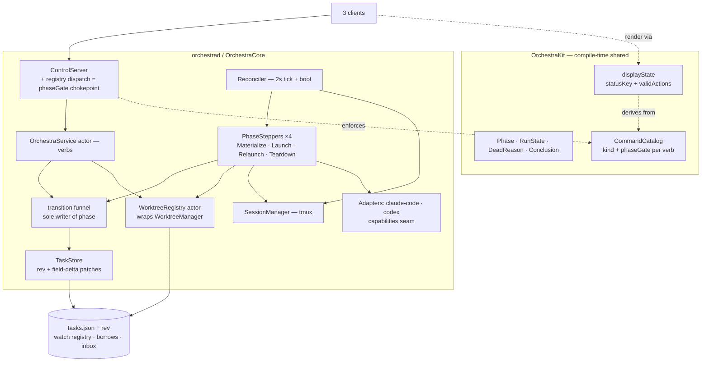
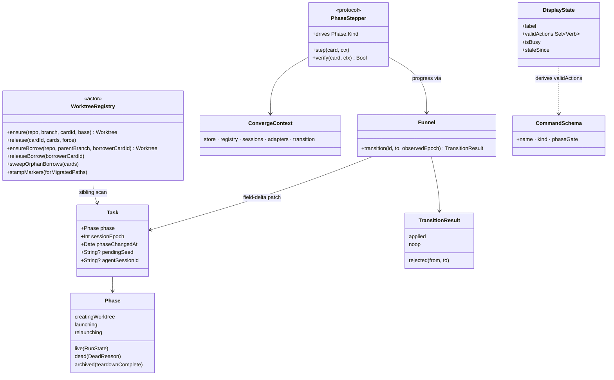

# Layer 2 — Contractual Design: Card Lifecycle Convergence

> The **interfaces**. The major types, actors, and functions from the finalized spec (§5–§6), with
> the contract of each and where it lives. Mechanics and sequencing belong to [[03-implementation]].

## Architecture overview

The design splits across two compile-time homes. **OrchestraKit** (shared by daemon + all three
clients) carries the vocabulary: the `Phase` model, the typed verb catalog (`CommandSchema` +
`kind` + `phaseGate`), the `Conclusion` payload, and `displayState` — so daemon policy and client
gating are one table that cannot drift. **The daemon** (`OrchestraCore` / `orchestrad`) carries the
machinery: the `transition()` funnel (the only writer of `phase`), the reconciler with four
phase-keyed steppers, the `WorktreeRegistry` actor, and the persisted files (`tasks.json` + watch
registry + borrow registrations + inbox). Verbs only persist intent; the reconciler converges
reality toward it. Clients speak a clean-break wire: `phase` replaces `status`, every event and
snapshot carries a monotonic `rev`, and `spawn`/`send` require client-minted ids.

## Major classes / modules

| Name | Responsibility | Collaborators |
|------|----------------|---------------|
| `Phase` (+ `RunState`, `WaitReason`, `DeadReason`) | The persisted lifecycle enum; the intent | `Task` model, funnel, `displayState` |
| `transition()` funnel | Sole writer of `phase`; validates edges, stamps `phaseChangedAt`, bumps epochs, fires conclusions + `wakeIfPending` | `TaskStore`, `MergeWatch`, inbox |
| `TaskStore` (existing actor) | State of record; monotonic `rev` per mutation; **field-delta patches only** (no whole-object writes); corrupt-file recovery | funnel, verbs, persistence files |
| Reconciler (extends `reconcileLiveness`) | 2s tick + boot: steps transitional cards, enforces `phaseChangedAt` timeouts, phase-gated liveness, orphan-session sweep, pre-kill fresh probes | steppers, `WorktreeRegistry`, `SessionManager` |
| `PhaseStepper` ×4 (Materialize / Launch / Relaunch / Teardown) | One stateless idempotent driver per transitional phase; verbs never drive | `ConvergeContext` |
| `ConvergeContext` | Plain dependency bundle (store, registry, sessions, adapters, `transition`) — steppers testable with stubs | steppers |
| `WorktreeRegistry` (new actor) | Sole owner of worktree + borrow lifecycle: serialized `ensure`, markers, one `release()` policy, path safety, persisted borrow registrations | `WorktreeManager` (internal), store |
| `CommandSchema` + `VerbSpec` fields (OrchestraKit) | Verb taxonomy as data: `kind` ∈ {Query, Mutation, Convergence} + `phaseGate: Set<Phase>` | registry dispatch, `displayState` |
| Registry dispatch chokepoint | Enforces `phaseGate` against the target card's phase before any handler runs; typed error on denial | `CommandRegistry`, `ControlServer` |
| `displayState(phase, connection)` (OrchestraKit) | One render contract for every surface; `validActions` **derived** from the catalog's phaseGates + UI-only extras | mac + iOS + CLI |
| Persisted registries | Watch registry `[watcherId: Set<childId>]` + borrow registrations `[borrowerCardId: path]`, atomic JSON beside the inbox | reconciler boot, `wait`, registry |
| `Config` knobs (new, additive-optional) | `worktreeAddTimeout` 600s · `sessionLaunchTimeout` 30s · `controlTimeout` 15s | registry, steppers, reconciler |
| Adapter capability seam (existing, extended) | Readiness per agent: Claude `SessionStart` hook; Codex rollout `session_meta` time-scoped to the launch; N=3-tick fallback for any agent | steppers, funnel |
| One-time on-disk migration (**as built, PR2**) | `status`/`waitReason` → `phase` seed; preserves `deadReason`; lives INSIDE `Task.init(from:)`. **Migrates card RECORDS only** — marker stamping is PR3b/Task 3.3, NOT here | `Task.init(from:)`; `TaskStore.load()` element-wise |

## Function / method contracts

### `transition(_ id: UUID, to: Phase, observedEpoch: Int? = nil, mutate: (inout Task) -> Void = {_ in}) async -> TransitionResult`
- **Does:** the single writer of `phase`. Validates the edge against the machine; applies it as a
  field-delta patch stamped with `phaseChangedAt`. **As built** it also takes a `mutate:` closure whose
  companion field-writes land in the *same* `store.update` patch as the phase write (restart clears
  `agentSessionId`, resume clears dead metadata, `markDead` writes the reason/detail) — atomic with it.
- **Inputs:** card id, target phase; `observedEpoch` on signal-driven calls (hooks, liveness); `mutate`.
- **Noop rule:** `to == from` is a `.noop` **except** the `relaunching → relaunching` supersede self-edge,
  which re-arms a fresh generation and falls through to apply.
- **Outputs:** `TransitionResult = .applied | .noop | .rejected(from:to:)` (`@discardableResult`).
  Verbs map `.rejected` → typed RPC error and `.noop` → idempotent success; async signals ignore it.
- **Epoch guard:** entering a launch-bound phase (`creatingWorktree`, direct `launching`,
  `relaunching` incl. the supersede self-edge) increments `sessionEpoch` *before* any launch work.
- **Stale signals:** `observedEpoch != current` → the signal is ignored, never applied.
- **Nil-epoch discipline:** kill-class signals with no epoch never transition a card directly —
  a fresh off-actor pre-kill probe must pass first; nil-epoch status signals may pass.
- **Wake on live:** entering `live` runs `wakeIfPending` — the one delivery point for messages
  parked while the card was being born.
- **Conclusions:** a non-terminal → terminal edge fires `concludeCard` (never `dead → archived`,
  never teardown completion); the wire `Conclusion` is `{kind, deadReason?}`.

### `static func isLegalEdge(from: Phase, to: Phase, viaSignal: Bool) -> Bool`
- **Does:** the pure, testable edge validator `transition()` consults — encodes spec §P1's machine;
  `viaSignal: true` admits the `dead → live` revival edge (verbs can never drive it).

### `PhaseStepper` protocol
```
protocol PhaseStepper {
  static var drives: Phase.Kind { get }              // creatingWorktree | launching | relaunching | archivedPending
  func step(_ card: Task, _ ctx: ConvergeContext) async throws   // idempotent: advance one edge
  func verify(_ card: Task, _ ctx: ConvergeContext) async -> Bool // target reached?
}
```
- **Does:** drives one transitional phase toward its target; the reconciler dispatches by phase.
- **Inputs:** the persisted card + `ConvergeContext` — no stored per-card state; crash recovery
  re-derives everything from disk.
- **Outputs:** progress via `transition()`; `verify()` is the crash-convergence test oracle.
- **Launch flavor** derives from persisted fields alone: `agentSessionId` + transcript → resume,
  else blank; `initialPrompt` only if never prompted.
- **Errors:** a throw feeds the reconciler's attempt counter + capped backoff — never a hot loop,
  never silent giving-up.

### `WorktreeRegistry` — the exact interface (plan Task 3.3)
```
func ensure(repo: String, branch: String, cardId: UUID, base: String? = nil) async throws -> Worktree
func release(cardId: UUID, cards: [Task], force: Bool) async throws
func ensureBorrow(repo: String, parentBranch: String, borrowerCardId: UUID) async throws -> Worktree // exactly-one-borrower
func releaseBorrow(borrowerCardId: UUID) async throws   // removes only the borrower's registration
func sweepOrphanBorrows(cards: [Task]) async            // liveness-guarded; runs AFTER phase reconciliation
func stampMarkers(forMigratedPaths: [String]) async     // one-time: pre-upgrade trees are marker-less (C1) — PR3b/Task 3.3, NOT PR2
```
- **`ensure` serializes:** same-branch requests join the existing tree — `git worktree add` runs
  once; every git invocation is bounded by the Config knobs.
- **Markers gate adoption:** only marker-complete trees are adopted; clean marker-less dir →
  prune + re-create.
- **Dirty marker-less dirs are never removed:** `ensure` throws a classified error (the caller
  transitions `dead(.spawnFailed)` + "manual cleanup needed" activity).
- **Path safety:** `ensure` rejects branch names whose computed path escapes the worktrees root;
  no cleanup path removes anything outside the owned roots (worktrees root + `orch-borrow-*`).
- **`release` is the one removal policy:** every teardown (spawn rollback, archive, reopen) routes
  here; siblings computed on demand from `cards` (a `dead` card still holds its reference).
- **`release` guards:** never removes a tree referenced by a non-archived sibling; never removes
  dirty without explicit `force`; idempotent to an already-missing tree (no-op success).
- **Borrows are registry-owned:** exactly-one-borrower keyed on canonical path; registrations
  persisted in the same call; the sweep keeps any dir whose registered borrower is non-terminal.
- **Owning-agent rule untouched:** agents merge inside borrow trees; the registry only owns the
  tree's lifecycle.

### `displayState(phase: Phase?, connection: ConnectionState) -> DisplayState`
- **Does:** the one render contract; every surface (mac, iOS, CLI presentation) consumes it —
  one `displayStatusKey`, no per-surface label logic.
- **Outputs:** `DisplayState { label, validActions: Set<Verb>, isBusy, staleSince }`.
- **Derived gating:** `validActions` comes from the catalog's phaseGates + UI-only extras;
  `isBusy` gates in-flight actions (the double-spawn guard); `staleSince` feeds the banner.
- **Purity:** no I/O — trivially table-testable. Recovery copy explains `dead(.spawnFailed)` with
  its `deadDetail` on both mac + iOS.

### `Inbox.enqueue(..., dedupKey: String? = nil)`
- **Does:** existing enqueue + an optional dedup key so re-driven duties can't re-spam
  (Teardown's child nudge uses `(childId, "parent-archived:<branch>")`).

### `wait` (Mutation) — durability contract
- **CLI transport:** holds the RPC open (in-memory continuation); deadline/keepalive tears down a
  dead call and the client re-issues; the daemon short-circuits on a persisted terminal phase.
- **MCP transport:** registers in the persisted watch registry and returns inline; boot reload
  delivers conclusions for already-terminal children.
- **Short-circuit hygiene:** an inline short-circuit on a terminal child unregisters that child
  from the caller's watch.

### Sync contract (wire)
- `TaskStore` stamps a board-global monotonic `rev`; every `Event` + `boardSnapshot` carries it.
  Clients apply iff `rev > lastSeen`; a gap → snapshot resync.
- **Client-minted ids** are required on `spawn`/`send`; a retried `spawn` returns the existing
  card as-is, whatever its phase; `batch-spawn` = N independent per-item ids.
- **Deadlines + keepalive:** `ControlClient.call` gains a per-RPC deadline; a periodic ping
  detects a dead-but-open tunnel.
- **No auto-retrier anywhere:** deadline expiry surfaces to the human/agent; idempotency makes
  manual re-issue safe.

## Library / framework decisions

| Decision | Why | Rejected |
|----------|-----|----------|
| No new dependencies | Swift actors + existing `Proc`/tmux/atomic-JSON already suffice | Any state-machine / persistence library |
| Worktree ops serialized by a dedicated actor (`WorktreeRegistry`) | Actor mailbox = the serialization; matches `BranchLineage` precedent | Locks inside `WorktreeManager` (struct, caller-actor bound) |
| Epoch transport = tmux env `ORCH_EPOCH` (stamped at launch, hook-echoed, readable back) | Agent-agnostic plumbing; enables identity readback | Session-name suffixes (breaks stable-name adoption) |
| Persistence = atomic JSON files beside the inbox (`replaceItemAt`) | Proven pattern in-repo; tiny data | SQLite / unified store rewrite |
| Verb taxonomy home = OrchestraKit's `CommandCatalog.swift` | Compile-time shared with all clients → `validActions` cannot drift from daemon policy | Daemon-only table + duplicated client knowledge |

## Diagrams

### Bird's-eye (module dependency — zooms Layer 1's daemon box)



### Detailed (key types)



## Traceability → Layer 1

| L1 goal | Covered by |
|---------|-----------|
| One persisted lifecycle variable | `Phase` on `Task`; `transition()` sole writer; store field-delta patches |
| Crash-equivalence | Stateless steppers + `phaseChangedAt` timeouts + persisted watch/borrow/seed registries |
| Deterministic staleness | Epoch bump in the funnel's launch-bound entries; `observedEpoch` guard; `ORCH_EPOCH` readback |
| Fail-safe resource handling | `WorktreeRegistry` marker arms, `release()` policy, path safety; nil-epoch kill discipline |
| Kill the 15 + round-2 bugs | Funnel conclusions (#2), gate chokepoint (#3), registry (#1/#6/#8/#12), `rev`+ids (#14/#15) — full map in [[04-tests]] |
| Non-blocking daemon | Reconciler owns driving; steppers off-actor; bounded Config knobs |
| Typed verb contract | `CommandSchema.kind` + `phaseGate` as data; dispatch chokepoint |
| Deny-by-default gating | `phaseGate: Set<Phase>` allow-set semantics |
| Agent-agnostic | Capability seam contract for readiness; epoch plumbing agent-neutral |
| Honest clients | `displayState` contract (pure, table-testable, derived `validActions`) |
| Detectable sync | `rev` on `Event`/`boardSnapshot`; client-minted ids; deadlines + keepalive |

## Decisions made

| Decision | Why | Rejected |
|----------|-----|----------|
| Taxonomy in OrchestraKit's `CommandCatalog` | One verb×phase table shared at compile time; UI gating can't drift | Daemon-only registry + hand-maintained client tables |
| `VerbSpec` = exactly `{name, kind, phaseGate}` | Pruned: no `capability` field (type doesn't exist), no `converger` field (dispatch is by phase) | Richer schema fields nothing reads |
| Gate enforcement at one dispatch chokepoint | Verbs declare their target-card param; gate checked before the handler; typed denial error | Per-handler checks (forgettable) |
| Steppers are stateless (`step(card:ctx:)`) | Crash recovery's premise: persisted card = whole input | Per-card converger instances with stored ids |
| `WorktreeManager` internal to the registry | "Nothing else touches git worktree" enforced by compile-time access control | A convention + a lint test |
| Watch registry + borrows persisted beside inbox | MCP `wait` is fire-and-forget (nothing to re-issue); a live borrow must survive a daemon-only crash | In-memory dicts ("durable by construction" was disproved) |
| `transition()` returns a 3-case result | Illegal edge = typed error; retry = visible success; silent drop impossible | Void return |
| Default gate policy derives ~30×8 cells | Verbs fit 6 policy groups; hand-cells only for exceptions | 250 hand-written cells |
| Knobs additive-optional in `Config` | Old `config.json` must still decode | Required keys (breaks existing config) |
| N=3 readiness fallback (≈6s) | Must sit well under `sessionLaunchTimeout` 30s or the fallback can never fire | Larger N (races the timeout) |

### As-built deviations folded in

| Decision (as built) | Why | Supersedes |
|----------|-----|------------|
| Migration lives INSIDE `Task.init(from:)` | Task 2.1 gave `Task` a custom tolerant decoder, so the per-record migrating init is uniform across the `{rev,tasks}` envelope and a bare array; never `.bak`, never throws (except an id-less record) | The plan's separate `LegacyStoredBoard`/structural-decode pass |
| Element-wise `FailableTask` load resilience | A single corrupt/id-less record drops itself (logged); the board reaches `.bak` ONLY on top-level-unparseable JSON. `id` is the sole required field | A whole-array decode that strands the board on one bad record |
| Garbage enum fields DEFAULT, never throw | `origin`/`access`/`model`/`startIn`/`column`/`deadReason` are `try?`-guarded to the memberwise-init default so a renamed rawValue can't drop a recoverable record | `decodeIfPresent` alone (would rethrow a present-but-garbage value) |
| **`pendingSeed` persistence DEFERRED to Stage 4** | The field + Codable round-trip exist (from 2.1) but there is NO writer/consumer in Stage 2 — the consumer is the Stage-4 reconciler; persisting it now is write-only dead state with no failing test. **Handoff still works** via `resume(seed:)` argv. **Stage 4 (PR3+) MUST wire write+consume together.** | Plan Task 2.5 Step 3.5 (persist `pendingSeed` in the same store patch) |
| `AgentStatus` deleted from the wire; `SnapshotReport` → `run: RunState?` | Retires the `status`/`waitReason` pair off the wire; `report()` maps `run` → a `.live(run)` funnel write. New **non-wire** `PhaseDisplayKey` + derived `Task.phaseDisplay`/`Task.waitReason` | Keeping `AgentStatus` on `SnapshotReport` |
| Funnel `mutate:` same-patch hook | Companion writes (fresh id, cleared dead metadata) land atomically with the phase write | A separate `store.update` before/after the transition (non-atomic) |
| Noop excludes the `relaunching → relaunching` supersede | The self-edge re-arms a fresh generation, so it must apply, not no-op | A blanket `to == from → noop` |
| Single epoch bump per (re)launch entry | Bump on `creatingWorktree` + every `relaunching` entry (incl. supersede); `launching` omitted (only entered from already-bumped `creatingWorktree`) | Bumping on `launching` too (double-bump) |
| `.died` push trigger excludes `.dead(.completed)` | A completing read-only child fires no death push (matches `NeedsYouQueue.reason`) | `prev != .dead && now == .dead → .died` unconditionally |
| `relaunchClaimed` splits `recovering`'s roles | Its grace-window role → epochs (funnel fence + phase-gated reconcile); its atomic-claim role → the narrow `relaunchClaimed` set (single wake/idle-resume winner) | The deleted `recovering` set |
| D1 `readinessConfirmation` covers launching + relaunching | One capability axis confirms BOTH being-born phases; N=3 universal fallback covers Codex `codex resume` (no rollout); Codex `.rolloutMeta` time-scoped to the launch | The spec's launch-only `resumeConfirmation` (spec amendment) |
| `isConcluded ≡ terminal phase`; `Conclusion` gains `deadReason` | Funnel is the sole concluder; a suspended `wait` resolves on every terminal death (`.exited(reason)`), not only a clean exit (bug-#2) | `report()`'s direct conclude; a reason-less `Conclusion` |
| restart's BLANK relaunch left immediate-live | In-scope per the 2.6 CRUX (gating scoped to `launchAndConfirm` + resume); safe (`reconcileLiveness` catches a session that never came up). **Follow-up:** route restart's blank through `launchAndConfirm(.blank)` to gate uniformly | — |
| **PR3b (Stage 3):** borrows persisted as `[String: String]` (borrower `uuidString` → path), keyed on `UUID` in memory | Swift's `Codable` encodes `[UUID: String]` as a flat array, not a JSON object; the string-keyed form round-trips as a clean object on disk while the registry still keys on `UUID` in memory | An implied `[UUID: String]` on-disk shape |
| **PR3b (Stage 3):** `orphanBorrowPaths` (list-only) replaces `pruneOrphanBorrows` (list+remove); removal is the registry's own liveness-guarded loop | The old boot-only prune force-removed **every** `orch-borrow-*` dir; the liveness-guarded sweep must never yank a live borrower's tree, so listing and guarded removal had to split into two functions | `WorktreeManager.pruneOrphanBorrows` as the removal path |
| **PR3b (Stage 3):** `WorktreeManager.swift` deleted; the struct moves into `WorktreeRegistry.swift` as `fileprivate` | The compile-time "nothing outside the registry touches git worktree ops" guarantee requires same-file `fileprivate` — Swift has no cross-file module-private-to-one-type | L2's "`WorktreeManager` (internal)" listed as its own file |
| **PR3b (Stage 3):** accepted trade-off — a crash between checkout and marker-write leaks a dir | `created ≡ marker` means a tree cut but not-yet-marked is never removed by `release`; a leaked dir (recovered only when a later `ensure` prunes + recreates it) is the fail-safe direction versus a `created` bit that could authorize removing an unverified tree | A `created` bit set at checkout-start (removable-but-unverified window) |
| **PR3b (Stage 3):** `sweepOrphanBorrows` requires POSITIVE terminal evidence (present + `archived`) to reclaim a registered borrow; empty/partial `cards` ⇒ no-op | Fail-safe pledge: an absent borrower is ambiguous (a partial store load), not proof-of-death — keep the tree. Truly-orphaned unregistered dirs are still reclaimed by the stray loop | A plain "not present ⇒ reclaim" sweep |
| **PR3b (Stage 3):** `WorktreeRegistry` gains an internal `run:` seam so PR3a's bounded-git timeout tests survive privatization | Keeps `WorktreeManager` `fileprivate` (the compile-time guarantee) while letting `@testable` tests inject a `run` recorder through the registry — no coverage lost | Tests constructing `WorktreeManager` directly |
| **PR3b (Stage 3):** `stampMigratedWorktreeMarkersOnce()` is `public` | `orchestrad` is a separate target and calls it from `main.swift`; an `internal` method isn't visible there | An `internal`-only migration entry point |

## Open questions — need your call

- (none — the contracts condense the finalized spec §5–§6; all open items were resolved there)

## Traceability

Sources: spec §5 (pillars P1–P6), §6 (verb contract + stepper protocol + gate policy), §P2/P3
function-level behavior. Layer 1: [[01-design]] (all goals mapped above).
