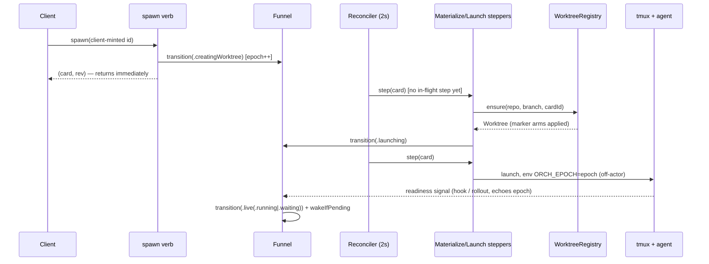

# Layer 3 — Implementation: Card Lifecycle Convergence

> The **how**: mechanics, edge cases, and build order. Written with [[04-tests]] and [[05-pr-tree]],
> reviewed at one combined gate. The task-by-task contract (TDD steps, anchors, commit messages) is
> the finalized plan `notes/plans/2026-07-08-card-lifecycle-convergence.md`; this layer condenses
> its mechanics and sequencing rationale.

## Implementation approach (per L2 contract)

| L2 contract | How it is built | Where (anchors @ `f1aa568`) |
|---|---|---|
| `Phase`/`RunState` types | Custom `Codable` as `{name, detail?}`; `Task` gains `phase`/`sessionEpoch`/`phaseChangedAt`/`pendingSeed`, **drops** `status`/`waitReason` | `OrchestraKit/Model.swift` |
| One-time migration | `Task.init(migratingFrom:)` in the `TaskStore` load path: legacy record (has `status`, lacks `phase`) mapped once; unknown record → `dead(.rebootUnrevived)`; markers stamped via `registry.stampMarkers` | `TaskStore.swift` load; plan Tasks 2.2/3.3 |
| `isLegalEdge` + `transition()` | Pure `Set<Edge>` lookup + a funnel in a new `OrchestraService+Lifecycle.swift`; persists via `store.update` patching only `phase`/`sessionEpoch`/`phaseChangedAt`; emits `.taskUpserted` | new file; `concludeCard` at `+Wake.swift:61` |
| Epoch plumbing | `SessionManager.ensure` env gains `ORCH_EPOCH=<sessionEpoch>`; hooks echo it → `handleHook` passes `observedEpoch`; `sessions.stampedEpoch(name:)` wraps `tmux show-environment` for identity readback | `+Report.swift:24-31`, `+Recovery.swift:236-243` |
| Steppers | New `PhaseStepper.swift`: Materialize (`registry.ensure` → `.launching`), Launch (`finishLaunch` off-actor, flavor rule, seed consume), Relaunch (kill-then-ensure, `created == true` required), Teardown (ordered duty list) | plan Tasks 4.1–4.3 |
| Reconciler discipline | Extend `reconcileLiveness`: per tick — batched off-actor `sessions.list()`, liveness for `live` only, step transitional cards (one in-flight step each), orphan-session sweep, `phaseChangedAt` timeouts, attempt counter + capped backoff | `+Recovery.swift:236`, `orchestrad/main.swift:47-53` |
| `WorktreeRegistry` | New actor absorbing `borrowedWorktrees`; marker = sentinel file written only after complete checkout; `WorktreeManager` becomes file-private to it (compile-time "nothing else touches git worktree") | `WorktreeManager.swift:29` (bare `fileExists` replaced) |
| Config knobs | Additive-optional fields; `Proc.run`'s existing wall-clock `timeout` is the enforcement primitive — no `Proc` changes | `Config.swift` |
| Verb catalog + chokepoint | `CommandSchema` gains `kind`+`phaseGate`; dispatcher resolves the declared target-card param, checks the gate, returns a typed error naming the phase | `CommandCatalog.swift:14-22`, `CommandRegistry.swift` |
| Persisted registries | `WatchRegistryStore.swift` (new) + borrow registrations: tiny atomic-JSON files beside the inbox; reload at boot delivers already-terminal conclusions | pattern: existing inbox persistence |
| Sync + idempotency | `TaskStore.currentRev` bumped in the single `persist()` funnel; `SpawnInput.id` required (server mint at `OrchestraService.swift:254` deleted); `ControlClient.call` deadline + ping (`probeVersion:117`) | Stage 1 + Stage 6 |
| `displayState` + UI | New `OrchestraKit/DisplayState.swift`; every surface renders from it; `SpawnSheet` `isSpawning` guard; mac terminal adopts the iOS retry policy extracted to a shared `TerminalReconnectPolicy` | `IOSTerminalView.swift:313-348` (the model) |
| Actor hygiene | Wrap each §9 site in the existing `offActor` hop; cache `gitRemotes` per repo; `boardSnapshot` reads the reconciler's observed-session cache | `+Recovery.swift:351` (the hop pattern) |

## Key mechanics (the load-bearing "how")

- **Spawn's sync part shrinks to three steps:** persist card → `transition(.creatingWorktree)` →
  return `(card, rev)`. Everything after is reconciler-driven (see the sequence diagram).
- **Interim Stage-2 shape:** spawn stays *synchronous* (walks phases inline) until Stage 4 — so a
  failure classifies inline while the reconciler doesn't exist yet; built exactly once.
- **Launch flavor is a pure derivation:** `agentSessionId` + transcript on disk → resume, else
  blank; `initialPrompt` submitted only if never prompted.
- **Same-patch rule:** restart clears `agentSessionId`, handoff persists `pendingSeed`, each in
  the same store patch as its transition.
- **Teardown duty order:** kill session (`OrchestraService.swift:689`) → release borrow →
  `release()` tree → cancel in-memory loops → nudge children → flip to `complete`.
- **Teardown idempotency:** loop cancels cover the debounces (`:671-672`) + remote watch +
  re-nudge timer; the child nudge carries dedup key `(childId, "parent-archived:<branch>")`.
- **Boot order** (`main.swift:47-53`): sweepOrphanScratch → phase reconciliation →
  sweepOrphanBorrows → watch-registry reload → remote watches → re-nudge timers → treeStat recompute.
- **Adoption identity:** before adopting or N-tick-promoting any surviving session, read back its
  stamped `ORCH_EPOCH`; `relaunching` + older epoch → *complete the relaunch* (kill + launch).
- **Resource epilogue:** after any resource-acquiring await inside a step, re-check phase on-actor;
  if a newer intent made the card terminal, release what was just acquired.
- **Conservative mode:** corrupt `tasks.json` → timestamped backup + boot empty; a flag makes
  `release()` perform no removals until ownership is positively re-established.

## Edge cases & error handling

| Case | Handling |
|---|---|
| Checkout failure / timeout | `dead(.spawnFailed)`; `deadDetail` = git stderr or an explicit "timed out after Ns" note |
| Worktree gone under launching/relaunching | Stepper's `ensure` re-materializes from the branch + "re-materialized" activity |
| Branch gone too | `dead(.spawnFailed)` when launching, `dead(.resumeFailed)` when relaunching; conclusion fires |
| Worktree gone under `live` | Cheap cwd-exists probe → badge + useful `send`/wake errors; never auto-kill (tmux survives cwd loss) |
| Archive during any launch-bound phase | Newer intent: funnel → `archived(pending)`; step's epilogue or the orphan-session sweep reclaims within a tick |
| Crash mid-teardown | `archived(pending)` re-drives the full duty list; dedup key prevents duplicate child nudges |
| Stale `SessionEnd` from a killed session | Carries the old epoch → funnel drops it deterministically |
| Nil-epoch kill-class signal (pre-upgrade session) | Never transitions directly — fresh off-actor pre-kill probe required first |
| Transient git failure (e.g. `index.lock`) | Attempt counter + capped backoff; visible activity; never a hot loop or silent give-up |
| Marker-less dir at the ensure path | Clean → prune + re-create; dirty → never removed, `dead(.spawnFailed)` + "manual cleanup" |
| Corrupt `tasks.json` | `tasks.json.corrupt-<ISO8601>` backup; empty board in conservative mode; unknown legacy record → `dead(.rebootUnrevived)` |

## Sequencing / build order

Stages ship in plan order; each leaves the full suite green. Rationale for the two
non-obvious orderings:

1. **Sync spawn first (Stage 2), non-blocking once (Stage 4).** Rebuilding spawn twice is churn —
   and an early non-blocking stage leaves a stuck `launching` card with no driver, timeout, or reconciler.
2. **The bug-#3 window and its gate land together (Stage 4).** Non-blocking spawn opens the
   pre-launch window; the verb `phaseGate` ships with it — and the gate PR merges first ([[05-pr-tree]]).
3. **Stage order:** 1 rev → 2 phase/funnel/migration → 3 knobs/registry → 4 reconciler/verbs →
   5 actor hygiene → 6 idempotency/UI. PR-level splits and parallelism: [[05-pr-tree]].

## Diagrams

### Bird's-eye (non-blocking spawn, the flagship flow)



### Detailed (crash-recovery boot — the convergence guarantee)

```mermaid
sequenceDiagram
  participant B as Boot (main.swift)
  participant REC as Phase reconciliation
  participant S as sessions (tmux)
  participant ST as Steppers
  participant W as Watch registry
  B->>B: sweepOrphanScratch
  B->>REC: reconcile all cards from persisted phase
  REC->>S: list() + stampedEpoch(name:) per candidate
  alt session alive, epoch matches
    REC->>REC: adopt at persisted epoch (live/launching)
  else relaunching + older epoch
    REC->>ST: complete the relaunch (kill + launch)
  else session gone
    REC->>ST: re-drive stepper (ensure re-materializes; pendingSeed delivered)
  end
  REC->>ST: archived(pending) → Teardown re-drive (dedup keys)
  B->>B: registry.sweepOrphanBorrows(cards)  [after reconciliation]
  B->>W: reload; deliver conclusions for already-terminal children
  B->>B: rebuildRemoteWatches → rebuildMergeRequestNudges → treeStat recompute
```

## Traceability → Layer 2 contracts

| L2 contract | Implemented by (plan task) |
|-------------|----------------------------|
| `Phase`/`RunState` + `Task` fields | 2.1, 2.2 (migration) |
| `isLegalEdge` + `transition()` funnel | 2.3 (+ epoch guard 2.4) |
| Readiness capability seam | 2.6 (Claude hook, Codex time-scoped rollout, N=3 fallback) |
| `PhaseStepper` + `ConvergeContext` | 4.1–4.3 |
| Reconciler driving discipline | 4.4 (+ interim liveness rules 2.5) |
| `WorktreeRegistry` full interface | 3.3–3.5 (knobs 3.1–3.2) |
| Verb catalog + dispatch chokepoint | 4.5 (matrix tests 4.6) |
| Persisted watch registry + borrows | 4.4 + 3.3 |
| Sync contract (`rev`, ids, deadlines) | 1.1–1.3, 6.1–6.3 |
| `displayState` + UI honesty | 6.4–6.5 |
| Actor hygiene (§9 list) | 5.1–5.3 |
| Docs SSOT updates | 1.4, 2.7, 3.6, 4.7, 5.4, 6.6 |

## Decisions made

| Decision | Why | Rejected |
|----------|-----|----------|
| Spawn stays synchronous in Stage 2; non-blocking built once in Stage 4 | Avoids build-twice churn; a stuck `launching` card always has a driver + timeout | Non-blocking on detached-task scaffolding in Stage 2 |
| The verb `phaseGate` merges before non-blocking spawn (PR4a → PR4b) | Bug #3's pre-launch window never exists ungated | One mega Stage-4 PR (correct but ~2× review surface) |
| Interim Stage-2 liveness rule (launching + vanished session → `dead(.spawnFailed)`) | Safe under sync spawn (session existed when the RPC returned); replaced by stepper timeouts in Stage 4 | Phase-gating liveness before the reconciler exists |
| Implementation deviations fold back into this vault's Decisions tables | The docs stay the truthful contract during execution | Silent divergence / chat-only notes |

## Concerns / decisions for review

- **Biggest churn:** Task 2.2 removes `status` — every reader in daemon + 3 clients updates in one
  PR; the suite gates it. Task 4.2's test migration (~30 files) is the second-biggest.
- **Anchor drift:** all `file:line` anchors were re-verified @ `f1aa568`; symbols are the fallback
  if lines drift by execution time.
- Deviations discovered during implementation get folded back into this vault (Decisions tables),
  per the layered-plan discipline.

## Open questions — need your call

- (none — mechanics come from the finalized plan; sequencing decisions are recorded above)
