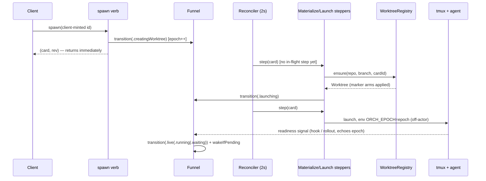

# Layer 3 — Implementation: Card Lifecycle Convergence

> The **how**: mechanics, edge cases, and build order. Written with [[04-tests]] and [[05-pr-tree]],
> reviewed at one combined gate. The task-by-task contract (TDD steps, anchors, commit messages) is
> the finalized plan `notes/plans/2026-07-08-card-lifecycle-convergence.md`; this layer condenses
> its mechanics and sequencing rationale.

## Implementation approach (per L2 contract)

| L2 contract | How it is built | Where (anchors @ `f1aa568`) |
|---|---|---|
| `Phase`/`RunState` types | Custom `Codable` as `{name, detail?}`; `Task` gains `phase`/`sessionEpoch`/`phaseChangedAt`/`pendingSeed`, **drops** `status`/`waitReason`; new non-wire `PhaseDisplayKey` (+ derived `phaseDisplay`/`waitReason`) | `OrchestraKit/Model.swift` |
| One-time migration (**as built, PR2**) | Lives INSIDE `Task.init(from:)` + `Task.migratedPhase(...)`: a record lacking `phase` is seeded from the legacy `status`/`waitReason`/`deadReason`/`archived` keys (read leniently as `String?`); unknown/nil status → `dead(.rebootUnrevived)`. `TaskStore.load()` decodes element-wise via `FailableTask` (id-less → dropped; `.bak` only on top-level-unparseable). **Migrates card RECORDS only — marker stamping is PR3b/Task 3.3, NOT here.** | `Model.swift` `Task.init(from:)`; `TaskStore.swift` load |
| `isLegalEdge` + `transition()` | Pure `Set<Edge>` lookup + a funnel in a new `OrchestraService+Lifecycle.swift`; persists via `store.update` patching only `phase`/`sessionEpoch`/`phaseChangedAt`; emits `.taskUpserted` | new file; `concludeCard` at `+Wake.swift:61` |
| Epoch plumbing | `SessionManager.ensure` env gains `ORCH_EPOCH=<sessionEpoch>`; hooks echo it → `handleHook` passes `observedEpoch`; `sessions.stampedEpoch(name:)` wraps `tmux show-environment` for identity readback | `+Report.swift:24-31`, `+Recovery.swift:236-243` |
| Steppers | New `PhaseStepper.swift`: Materialize (`registry.ensure` → `.launching`), Launch (`finishLaunch` off-actor, flavor rule, seed consume), Relaunch (kill-then-ensure, `created == true` required), Teardown (ordered duty list) | plan Tasks 4.1–4.3 |
| Reconciler discipline | Extend `reconcileLiveness`: per tick — batched off-actor `sessions.list()`, liveness for `live` only, step transitional cards (one in-flight step each), orphan-session sweep, `phaseChangedAt` timeouts, attempt counter + capped backoff | `+Recovery.swift:236`, `orchestrad/main.swift:47-53` |
| `WorktreeRegistry` | New actor absorbing `borrowedWorktrees`; marker = sentinel file written only after complete checkout; `WorktreeManager` becomes file-private to it (compile-time "nothing else touches git worktree") | `WorktreeManager.swift:29` (bare `fileExists` replaced) |
| Config knobs | Additive-optional fields; `Proc.run`'s existing wall-clock `timeout` is the enforcement primitive — no `Proc` changes | `Config.swift` |
| Verb catalog + chokepoint | `CommandSchema` gains `kind`+`phaseGate`; dispatcher resolves the declared target-card param, checks the gate, returns a typed error naming the phase | `CommandCatalog.swift:14-22`, `CommandRegistry.swift` |
| Persisted registries | `WatchRegistryStore.swift` (new) + borrow registrations: tiny atomic-JSON files beside the inbox; reload at boot delivers already-terminal conclusions | pattern: existing inbox persistence |
| Sync + idempotency | `TaskStore.currentRev` bumped in the single `persist()` funnel; `SpawnInput.id` required (server mint at `OrchestraService.swift:254` deleted); `ControlClient.call` deadline + ping (`probeVersion:117`) | Stage 1 + Stage 6 |
| `displayState` + UI | New `OrchestraKit/DisplayState.swift`; every surface renders from it; `SpawnSheet` `isSpawning` guard; mac terminal adopts the iOS retry policy extracted to a shared `TerminalReconnectPolicy` | `IOSTerminalView.swift:313-348` (the model) |
| Actor hygiene | Wrap each §9 site in the existing `offActor` hop; cache `gitRemotes` per repo; `boardSnapshot` reads the reconciler's observed-session cache | `+Recovery.swift:351` (the hop pattern) |

## Key mechanics (the load-bearing "how")

- **Spawn's sync part shrinks to three steps:** persist card → `transition(.creatingWorktree)` →
  return `(card, rev)`. Everything after is reconciler-driven (see the sequence diagram).
- **Interim Stage-2 shape:** spawn stays *synchronous* (walks phases inline) until Stage 4 — so a
  failure classifies inline while the reconciler doesn't exist yet; built exactly once.
- **Launch flavor is a pure derivation:** `agentSessionId` + transcript on disk → resume, else
  blank; `initialPrompt` submitted only if never prompted.
- **Same-patch rule:** restart clears `agentSessionId`, handoff persists `pendingSeed`, each in
  the same store patch as its transition.
- **Teardown duty order:** kill session (`OrchestraService.swift:689`) → release borrow →
  `release()` tree → cancel in-memory loops → nudge children → flip to `complete`.
- **Teardown idempotency:** loop cancels cover the debounces (`:671-672`) + remote watch +
  re-nudge timer; the child nudge carries dedup key `(childId, "parent-archived:<branch>")`.
- **Boot order** (`main.swift:47-53`): sweepOrphanScratch → phase reconciliation →
  sweepOrphanBorrows → watch-registry reload → remote watches → re-nudge timers → treeStat recompute.
- **Adoption identity:** before adopting or N-tick-promoting any surviving session, read back its
  stamped `ORCH_EPOCH`; `relaunching` + older epoch → *complete the relaunch* (kill + launch).
- **Resource epilogue:** after any resource-acquiring await inside a step, re-check phase on-actor;
  if a newer intent made the card terminal, release what was just acquired.
- **Conservative mode:** corrupt `tasks.json` → timestamped backup + boot empty; a flag makes
  `release()` perform no removals until ownership is positively re-established.

## Edge cases & error handling

| Case | Handling |
|---|---|
| Checkout failure / timeout | `dead(.spawnFailed)`; `deadDetail` = git stderr or an explicit "timed out after Ns" note |
| Worktree gone under launching/relaunching | Stepper's `ensure` re-materializes from the branch + "re-materialized" activity |
| Branch gone too | `dead(.spawnFailed)` when launching, `dead(.resumeFailed)` when relaunching; conclusion fires |
| Worktree gone under `live` | Cheap cwd-exists probe → badge + useful `send`/wake errors; never auto-kill (tmux survives cwd loss) |
| Archive during any launch-bound phase | Newer intent: funnel → `archived(pending)`; step's epilogue or the orphan-session sweep reclaims within a tick |
| Crash mid-teardown | `archived(pending)` re-drives the full duty list; dedup key prevents duplicate child nudges |
| Stale `SessionEnd` from a killed session | Carries the old epoch → funnel drops it deterministically |
| Nil-epoch kill-class signal (pre-upgrade session) | Never transitions directly — fresh off-actor pre-kill probe required first |
| Transient git failure (e.g. `index.lock`) | Attempt counter + capped backoff; visible activity; never a hot loop or silent give-up |
| Marker-less dir at the ensure path | Clean → prune + re-create; dirty → never removed, `dead(.spawnFailed)` + "manual cleanup" |
| Corrupt `tasks.json` | `tasks.json.corrupt-<ISO8601>` backup; empty board in conservative mode; unknown legacy record → `dead(.rebootUnrevived)` |

## Sequencing / build order

Stages ship in plan order; each leaves the full suite green. Rationale for the two
non-obvious orderings:

1. **Sync spawn first (Stage 2), non-blocking once (Stage 4).** Rebuilding spawn twice is churn —
   and an early non-blocking stage leaves a stuck `launching` card with no driver, timeout, or reconciler.
2. **The bug-#3 window and its gate land together (Stage 4).** Non-blocking spawn opens the
   pre-launch window; the verb `phaseGate` ships with it — and the gate PR merges first ([[05-pr-tree]]).
3. **Stage order:** 1 rev → 2 phase/funnel/migration → 3 knobs/registry → 4 reconciler/verbs →
   5 actor hygiene → 6 idempotency/UI. PR-level splits and parallelism: [[05-pr-tree]].

## Diagrams

### Bird's-eye (non-blocking spawn, the flagship flow)



### Detailed (crash-recovery boot — the convergence guarantee)

```mermaid
sequenceDiagram
  participant B as Boot (main.swift)
  participant REC as Phase reconciliation
  participant S as sessions (tmux)
  participant ST as Steppers
  participant W as Watch registry
  B->>B: sweepOrphanScratch
  B->>REC: reconcile all cards from persisted phase
  REC->>S: list() + stampedEpoch(name:) per candidate
  alt session alive, epoch matches
    REC->>REC: adopt at persisted epoch (live/launching)
  else relaunching + older epoch
    REC->>ST: complete the relaunch (kill + launch)
  else session gone
    REC->>ST: re-drive stepper (ensure re-materializes; pendingSeed delivered)
  end
  REC->>ST: archived(pending) → Teardown re-drive (dedup keys)
  B->>B: registry.sweepOrphanBorrows(cards)  [after reconciliation]
  B->>W: reload; deliver conclusions for already-terminal children
  B->>B: rebuildRemoteWatches → rebuildMergeRequestNudges → treeStat recompute
```

## Traceability → Layer 2 contracts

| L2 contract | Implemented by (plan task) |
|-------------|----------------------------|
| `Phase`/`RunState` + `Task` fields | 2.1, 2.2 (migration) |
| `isLegalEdge` + `transition()` funnel | 2.3 (+ epoch guard 2.4) |
| Readiness capability seam | 2.6 (Claude hook, Codex time-scoped rollout, N=3 fallback) |
| `PhaseStepper` + `ConvergeContext` | 4.1–4.3 |
| Reconciler driving discipline | 4.4 (+ interim liveness rules 2.5) |
| `WorktreeRegistry` full interface | 3.3–3.5 (knobs 3.1–3.2) |
| Verb catalog + dispatch chokepoint | 4.5 (matrix tests 4.6) |
| Persisted watch registry + borrows | 4.4 + 3.3 |
| Sync contract (`rev`, ids, deadlines) | 1.1–1.3, 6.1–6.3 |
| `displayState` + UI honesty | 6.4–6.5 |
| Actor hygiene (§9 list) | 5.1–5.3 |
| Docs SSOT updates | 1.4, 2.7, 3.6, 4.7, 5.4, 6.6 |

## Decisions made

| Decision | Why | Rejected |
|----------|-----|----------|
| Spawn stays synchronous in Stage 2; non-blocking built once in Stage 4 | Avoids build-twice churn; a stuck `launching` card always has a driver + timeout | Non-blocking on detached-task scaffolding in Stage 2 |
| The verb `phaseGate` merges before non-blocking spawn (PR4a → PR4b) | Bug #3's pre-launch window never exists ungated | One mega Stage-4 PR (correct but ~2× review surface) |
| Interim Stage-2 liveness rule (launching + vanished session → `dead(.spawnFailed)`) | Safe under sync spawn (session existed when the RPC returned); replaced by stepper timeouts in Stage 4 | Phase-gating liveness before the reconciler exists |
| Implementation deviations fold back into this vault's Decisions tables | The docs stay the truthful contract during execution | Silent divergence / chat-only notes |
| **PR1 (Stage 1):** `rev` bumps only on a **real state change** — `TaskStore.update` skips `persist()`/rev-bump on a no-op mutation (`guard task != before`), mirroring `report()`'s existing gate | A no-op `store.update` (badge-clear when unset, `recomputeTreeStat` inner-race early-return) would otherwise advance `rev` with no matching event, inflating the cursor with phantom bumps (final-review finding) | "Every persist bumps rev" (the original literal reading) — spurious rev inflation |
| **PR1 (Stage 1):** `rev` is monotonic **but may be sparse** — not every bump carries a client event (an event-less mutation absorbed by a following emit; ephemerals share the prior rev; a real change echoed at a duplicate rev). **Stage 6's gap-detector MUST treat `rev ≤ lastSeen` as already-applied and resync only on positive evidence of a missed event, never on a bare forward gap or a duplicate rev.** Also: `spawn`'s deferred emit (create → emit across awaits) makes delivered rev non-monotonic in wire order | The strict-binding design (rev captured atomically at the mutation) guarantees each event carries its own true rev, but not global density/ordering; a naive "resync on any forward gap / drop on rev≤lastSeen" client would spuriously resync or drop | A dense, strictly-ordered rev stream (would require serializing all emits + emitting on every persist) |

| **PR2 (Stage 2):** migration lives inside `Task.init(from:)`, not a separate `LegacyStoredBoard` | Task 2.1's custom tolerant decoder made a per-record migrating init the natural home; uniform across the `{rev,tasks}` envelope + a bare array, never `.bak`, never throws (except id-less). `TaskStore.load()` keeps element-wise resilience via `FailableTask`; garbage enum fields `try?`-default so only an id-less record drops | The plan's `LegacyStoredBoard`/structural-decode pass (assumed synthesized Codable throws `keyNotFound` on missing `phase`) |
| **PR2 (Stage 2):** `AgentStatus` off the wire — `SnapshotReport` → `run: RunState?` | Retires the `status`/`waitReason` pair from the wire; `report()` maps `run` → a `.live(run)` funnel write; clients render from the non-wire `PhaseDisplayKey` | Keeping `AgentStatus`/`status`/`waitReason` on the snapshot DTO |
| **PR2 (Stage 2):** funnel `mutate:` same-patch hook + single-bump epoch + noop-excludes-supersede | Companion writes land atomically with the phase write; the epoch bumps once per (re)launch entry (`creatingWorktree` + every `relaunching` incl. supersede; `launching` omitted); the `relaunching→relaunching` self-edge must apply (re-arms a generation), not no-op | Separate pre/post `store.update`; bumping on `launching`; a blanket `to==from→noop` |
| **PR2 (Stage 2):** `relaunchClaimed` replaces `recovering`'s atomic-claim role (epochs replace its grace-window role) | The funnel's epoch fence + phase-gated `reconcileLiveness` cover staleness; the narrow `relaunchClaimed` set ensures a single wake/idle-resume winner | The deleted `recovering` set (did both jobs) |
| **PR2 (Stage 2):** D1 → `readinessConfirmation` covers launching + relaunching; universal N=3 fallback | One capability axis confirms both being-born phases; Codex `.rolloutMeta` is time-scoped to the launch and a `codex resume` (no rollout) is caught by the N=3 tick fallback — keeping the relaunch on the readiness gate. **Recorded as a spec amendment** | The spec's launch-only `resumeConfirmation` |
| **PR2 (Stage 2):** `isConcluded ≡ terminal phase`; `Conclusion` gains `deadReason`; funnel is sole concluder | A suspended `wait` resolves on every terminal death (`.exited(reason)`), not only a clean exit (bug-#2); `report()`'s direct conclude deleted so no double-conclude. `.died` push excludes `.dead(.completed)` | `report()` concluding directly; a reason-less `Conclusion` |
| **PR2 (Stage 2):** `pendingSeed` persistence **DEFERRED to Stage 4** | Field + Codable test exist (2.1) but NO writer/consumer yet — the consumer is the Stage-4 reconciler; persisting it now is write-only dead state with no failing test and no recovery benefit while spawn/handoff are synchronous. **Handoff still works via `resume(seed:)` argv.** **Stage 4 MUST wire write+consume together.** | Plan Task 2.5 Step 3.5 (persist `pendingSeed` in the same store patch for crash-safety) |
| **PR3a (Stage 3):** the timeout knobs live in `Sources/OrchestraKit/Config.swift`, not `Sources/OrchestraCore/Config.swift` | `Config` actually lives in OrchestraKit (the plan's Stage-3 file table + Task-3.1 header cited Core); `OrchestraCore` already imports Kit so `WorktreeManager` reads `config.worktreeAddTimeout` with no new import | The plan's stated `Sources/OrchestraCore/Config.swift` path |
| **PR3a (Stage 3):** knobs are `Int` **seconds** + a custom `Config.init(from:)` (explicit `CodingKeys`, `decodeIfPresent ?? default` for the 3 new keys only; `encode`/`Equatable` stay synthesized) | Matches the existing `revivalGraceSeconds: Int` convention + a hand-edited `config.json` can set a bare number (`Duration`'s Codable can't). Synthesized `Decodable` throws `keyNotFound` on a missing non-optional key, so the custom decoder is **required** for `test_configForwardCompat` (old config decodes with defaults) | `Duration`-typed knobs (JSON-hostile); relying on synthesized decode (breaks the live board on upgrade) |
| **PR3a (Stage 3):** `WorktreeManager` gets a minimal injectable `run` seam typed **non-optional** `Duration` (default `{ try Proc.run($0, timeout: $1) }`) | Lets the unit tests assert the timeout argument deterministically with no real git; the non-optional `Duration` makes an **unbounded git op a compile error**, hardening "no unbounded `Proc.run`" beyond a test. `Proc` untouched | A `Duration?` seam (weaker invariant); no seam (timeout arg unobservable → weaker tests) |
| **PR3a (Stage 3):** **both** `git worktree add` sites (ensure **and** borrow) use `worktreeAddTimeout`; every other git op (list/remove/prune/rev-parse/status) uses `controlTimeout` | The plan's literal "controlTimeout to borrow ops" was ambiguous: a borrow's `worktree add` is a full checkout, so 15s risks a false timeout — the 600s checkout bound is fail-safe. "the git worktree add invocations" covers both adds; "borrow ops" = the borrow-sweep list/prune | Giving borrow's checkout the 15s `controlTimeout` (false-timeout risk on a large repo) |
| **PR2 (Stage 2):** restart's BLANK relaunch left immediate-live | In-scope per the 2.6 CRUX (gating scoped to `launchAndConfirm` + resume); safe (`reconcileLiveness` catches a session that never came up). **Follow-up:** route restart's blank through `launchAndConfirm(.blank)` to gate uniformly | — |
| **PR3b (Stage 3):** the marker lives OUTSIDE the worktree, in a registry-owned metadata dir (`Config.worktreeMarkersDir`), filename = the canonical path `%`/`/`-encoded | A marker inside the tree would show as untracked in `git status --porcelain` (every tree reads "dirty") and would mutate a dirty pre-upgrade tree, violating "survives byte-intact" | An in-tree sentinel file |
| **PR3b (Stage 3):** `created` ≡ materialized-marker-present, with no separate stored bit | The registry only writes a marker after a complete checkout or an explicit migration stamp, so "created/verified by us" is exactly "marker exists" — precisely what `release`'s `created` guard needs | A separate persisted `created: Bool` field on `Task` or in the registry |
| **PR3b (Stage 3):** serialization is the actor mailbox alone (no per-branch keyed lock); `ensure` is `await`-free between the marker check and the checkout | Simpler than a lock map; globally serializes worktree git ops (a conservative superset of "per branch"), acceptable for a single-user tool and matching this vault's "actor mailbox = the serialization" decision | A per-branch `[String: Lock]`/actor map |
| **PR3b (Stage 3):** `assertUnderWorktreesRoot` (stricter than `PathResolver.assertAllowed`) gates `ensure`/`release` before the general allowlist check | `assertAllowed` also admits `reposRoot`, so path-escape rejection for worktree ops needs the stricter worktrees-root-only check | Relying on `assertAllowed` alone for worktree path safety |
| **PR3b (Stage 3):** an in-flight holder set (`inflight: [path: Set<UUID>]`) supplements the store-derived sibling scan in `release` | Once `ensure` is `await`ed, the service actor can interleave two same-branch spawns; a store-only scan misses the in-flight (not-yet-persisted) adopter, so the first spawn's rollback could remove the tree out from under the second. Cleaned by `release`'s `defer`; a `store.create` failure strands an entry until restart (fail-safe, restart-healed, not data-loss) | L2's "siblings computed on demand from `cards`" taken as the sole reference count |
| **PR3b (Stage 3):** a `conservativeMode` flag + `setConservativeMode(_:)` seam on `WorktreeRegistry`, defaulted `false` and unused until Stage 4 | Reserves the post-corrupt-recovery "remove nothing until ownership is positively re-established" mode PR4b/Task 4.4 will set, without building that mode's logic now | Building the conservative-mode logic in PR3b |
| **PR3b (Stage 3):** reuses PR3a's `Config` knobs (`worktreeAddTimeout`/`controlTimeout`) via the injected `WorktreeManager` | PR3a already landed additive-optional timeout knobs in `OrchestraKit`; the registry's manager threads them into every bounded git call rather than defining its own | A second, registry-local set of timeout knobs |
| **PR3b (Stage 3):** marker stamping is ONE-TIME, gated by a persisted sentinel (`.migrated`), not every-boot | Every-boot stamping would, under a future Stage-4 non-blocking spawn, risk marking a half-created (mid-materialization) dir adoptable; the sentinel makes the migration run exactly once, at the first post-upgrade boot when every persisted tree is at-rest and complete | Re-running `stampMarkers` on every boot |
| **PR3b (Stage 3):** every test naming `WorktreeManager` migrates to `WorktreeRegistry` in Task 3.5 | `@testable import` can't see a `fileprivate` type, so the suite must compile against the registry's public/internal surface after `git rm WorktreeManager.swift` | Leaving tests constructing `WorktreeManager` directly (would no longer compile) |

## Concerns / decisions for review

- **Biggest churn:** Task 2.2 removes `status` — every reader in daemon + 3 clients updates in one
  PR; the suite gates it. Task 4.2's test migration (~30 files) is the second-biggest.
- **Anchor drift:** all `file:line` anchors were re-verified @ `f1aa568`; symbols are the fallback
  if lines drift by execution time.
- Deviations discovered during implementation get folded back into this vault (Decisions tables),
  per the layered-plan discipline.

## Decisions made — PR4b (Stage 4) as-built

| Decision (as built) | Why | Supersedes |
|----------|-----|------------|
| **Steppers are THIN orchestrators; `ConvergeContext` gained actor callbacks** (`materialize`/`finishLaunch`/`teardownActorDuties`/`emitActivity`/`inbox` + the `mutate:`-form `transition`) | PR4a's context couldn't reach the actor-private deps (`lineage`/`remoteParents`/`gitRemotes`/`recordSpawnBase`/`derivedCard`/`wake`) nor write companion fields atomically. The steppers delegate actor-bound work through callbacks (built by `convergeContext()`) rather than reaching it directly — keeping the funnel the sole writer and the actor state actor-owned | PR4a's minimal `ConvergeContext(store,worktrees,sessions,adapters,transition)` |
| **`Task.spawnBase: String?` carrier** (raw normalized base string; `materialize` re-derives `RemoteParentRef.parse` at materialize time) | Non-blocking spawn returns before the checkout, so the stepper must reproduce a spawn-with-base / remote-base from persisted state; a single raw string suffices (classification is re-derived, mirroring today's inline spawn) | Re-deriving base at materialize with no persisted carrier (impossible across a restart) |
| **Enabler-before-consumer task order** (steppers → reconciler-driving → non-blocking spawn → verb flips) | Keeps `swift test` green at every task boundary; the reconciler (the driver) must exist before the verbs that depend on it flip to intent-only. The vault plan's literal 4.2→4.3→4.4 order would strand non-blocking spawn without a driver | The plan's literal task ordering |
| **`archived` Bool stays a companion mirror** written in the same funnel patch as `.archivedPending`/`.archivedComplete` (74 readers depend on it); the Bool-bridge retired is specifically `gatedKind`'s special-case → `card.phase.kind` | Fully deriving `archived` from `phase` would touch 74 readers across daemon + 3 clients — out of scope; the funnel-patch companion write keeps them from diverging | "`phase` is the sole archived representation, `archived` Bool deleted" |
| **`reconcile()` ticks `launchReadyTicks` gated ONLY on phase+session-alive, NEVER on `inFlightSteps`** | A Codex `codex resume` (no rollout) / a missed hook is resolved ONLY by the N=3 tick; gating it on `inFlightSteps` would let a card holding an in-flight step never confirm → timeout → churn (a Codex-specific regression) | Gating the readiness tick on the same `inFlightSteps` guard as stepping |
| **Stepping iterates EXPLICITLY by `phase.kind`, not `!isTerminal`** | `.archivedPending` is `isTerminal == true` yet MUST be stepped by Teardown | A `!isTerminal` filter (would skip Teardown) |
| **`recoverSessions` folded into `reconcilePhasesAtBoot`**; provisional boot revival routes `.relaunching` (RelaunchStepper blank-restarts) | One boot owner, `inFlightSteps`-guarded (no double-drive); `.live→.creatingWorktree` is an illegal funnel edge, so a never-prompted card revives via `.relaunching` | A standalone `recoverSessions` loop; `.creatingWorktree` provisional revival |
| **Conservative mode = corrupt-boot daemon's LIFETIME, cleared only by a clean restart** | After a corrupt `tasks.json` the pre-existing trees' ownership is unknowable from an empty board; no in-session write "proves" ownership, so any auto-clear risks removing a tree a pre-crash live session uses. Leak-not-loss is fail-safe + restart-healed | The plan's "first `store.create` clears" trigger (GPT-5.5 R2 finding — premature) |
| **Orphan sweep keeps ALL `.dead` sessions** (not only `.dead(.completed)`) | Strictly more fail-safe (a leaked session vs killing a wanted one); a later archive sweeps it | Keeping only `.dead(.completed)` sessions |
| **Whole-branch review fixes:** (1) the reconciler adoption transition is **epoch-fenced** (passes the probed epoch as `observedEpoch`) — the off-actor probe suspends the actor, so a stale adoption must no-op if a concurrent restart bumped the epoch (single-winner); (2) the **watch registry lazy-loads on first access** (`ensureWatchRegistryLoaded()` in every mutate/iterate entry + a `loadFailed` posture) — the daemon accepts RPCs before boot reload, so a boot-window `wait`/`watch` must union onto disk state, not clobber it; (3) a legacy `.dead(.completed)+archived+phase-key` record **normalizes to `.archived(teardownComplete:true)` on decode** so it stays reopenable | Both reviewers caught (1) and (2) as real concurrency/ordering bugs the per-task reviews missed; (3) is the intermediate-stage-daemon migration edge | Adoption with `observedEpoch: nil`; eager reload-clobber; no legacy-with-phase-key normalize |
| **Test infra:** `setStepBackoff` seam pins a load-proof backoff window; `reconcilePollInterval` is a `public nonisolated let` read by the poll loop; `StubSessions.kill` records only genuinely-alive kills (mirrors tmux) | The full 793→815-test PARALLEL suite is environmentally flaky on real-tmux(PTY)/UDS-socket/timing tests under 153-suite contention — all pass in ISOLATION and a `--no-parallel` serial run is 815/815 green. The deterministic-stub guard suites (the doctrine's regression guard) are 106/106 in isolation | Wall-clock-dependent backoff assertion; a hardcoded poll interval the inequality test couldn't track |

## Decisions made — PR6a (Stage 6) as-built

| Decision (as built) | Why | Supersedes |
|----------|-----|------------|
| **`SpawnInput.id: UUID` is REQUIRED with NO Swift default** (first stored property; required decode in `init(from:)`; synthesized `CodingKeys`/`encode` pick it up automatically) | Clean wire break — no id-less spawn on the wire — and forcing every `SpawnInput(...)` construction site to name an id keeps mint responsibility explicit at each caller. Swept ~317 test construction sites with `id: UUID()` | A `id: UUID = UUID()` default (would let a site silently omit an id and re-introduce a server-side mint path) |
| **`TaskStore.createIfAbsent(_:) -> (task, rev, created)` is THE idempotency boundary** — get-then-append with **no `await` between** (actor owns `tasks`) | A check-then-act across the *service* actor is not atomic (every `await` re-enters), so two concurrent same-id spawns could both pass a bare `store.get`-then-`store.create`. Colocating the presence check + append inside one actor method with no suspension makes the single-winner guarantee real | A service-level `if await store.get(id) == nil { create }` guard (racy under reentrancy) |
| **`OrchestraService.spawn` = fast-path `store.get` exit + authoritative `createIfAbsent`** | The fast path skips all side effects (adapter resolve / `resolveRepo` / scratch mkdir / sibling scan) for the common sequential retry; `createIfAbsent` is the correctness backstop for the concurrent race the fast path can't cover. A losing concurrent call returns the winner's card AS-IS and emits nothing | Doing side-effect work then relying on `store.create` to dedup (it can't) |
| **Sibling-multiplicity warning = capture-before / emit-after-if-`wasCreated`** | Capturing the sibling boolean *before* `createIfAbsent` (this card not yet in the store → no self-match) and emitting only for the actual create-winner means a concurrent same-id *loser* never fires a spurious "second live card" warning (asserted by `test_concurrentSameIdSpawnCreatesOne`). Simply moving the scan *past* the create would self-match the winner's own new card | Emitting the warning inline before the create (loser warns), or moving the scan past the create with no `$0.id != id` guard (self-match) |
| **Caller-suppliable id at each client seam** — CLI `--id` (else mint), CLI `batch-spawn` + MCP bridge stamp an id **only when absent** (preserve a supplied one), BoardStore mints per-spawn, `CommandCatalog` advertises optional `id` on `spawn`/`batch-spawn` | Delivers the *wire mechanism* for retry-safety (reuse the same id → dedup) and makes it discoverable via `tools/list`. App-side reuse-on-retry (retaining a failed spawn's id) is PR6b's SpawnSheet UX — out of PR6a scope | Server-side mint (`let id = UUID()` in `spawn`); a bare per-invocation mint with no way for a caller to reuse it |
| **Task 6.2: `ControlClient` deadline = one `PendingCall{cont,timer,resolved}` record + a single `resolve(id:)` funnel** — continuation installed BEFORE the timer, timer attached-if-still-pending; `resolve` flips `resolved` + removes + cancels the timer under `stateLock`, then resumes the continuation OUTSIDE the lock; every site (reader / write-fail / timer / `failPending` / `close`) funnels through it | Guarantees exactly-once resolution: no double-`resume` (fatal), no leak on the timer-arm-before-insert race, and no self-deadlock on the non-recursive `NSLock` (never `resume` while holding `stateLock`). Verified by `test_callTimesOutNearZero` (1 ns deadline) | A bare `[Int: continuation]` map + ad-hoc removal (double-resume / leak / deadlock windows) |
| **Task 6.2: `probeVersion` bounded by a dedicated `probeTimeout` (default 15 s), NOT `callTimeout`** — watchdog `Task` `shutdown()`s the transport on expiry → `readLine()` nil → throw | First-connect can't hang on a dead-but-open tunnel, and an aggressive product `callTimeout` (or the 1 ns near-zero test) can't make first-connect flaky. Ping loop is async `Task.sleep(for: pingInterval)` (ms-accurate) and degrades to `.retrying` + `shutdown()` on a failed `version` ping | Reusing `callTimeout` for the probe (couples first-connect reliability to the call deadline); `Thread.sleep(components.seconds)` (truncates sub-second) |
| **Task 6.3: board apply gated PER-CARD** (`env.rev > max(baselineRev, appliedRev[id] ?? Int.min)`), not a board-global `lastSeenRev` | `rev` is sparse AND non-monotonic in wire order (spawn's deferred emit reorders), so a board-global cursor would drop a legit lower-rev event for a *different* card. Per-card gating drops only genuinely-stale same-card updates; `activity`/`owner`/`shells` ungated; `adoptSnapshotRev(rev)` re-baselines on a fresh snapshot | The plan's literal board-global `lastSeenRev` gate (drops cross-card-reordered updates until reconnect) |
| **Task 6.3: rev reaches the board via a NON-BREAKING `subscribeWithRev()`** (second `envelopeContinuation`), `subscribe()`'s `AsyncStream<Event>` element type unchanged; `readUntilEOF` yields to both under one lock scope; `close()` finishes both | Changing `subscribe()`'s element type would churn ~18 `Event`-matching test files and risk the parallel PR5 merge; a second continuation is zero-blast-radius | Changing `subscribe()` to yield `EventEnvelope` |
| **Task 6.3: subscribe→snapshot barrier is SUCCESS-GATED, and the reconnect re-subscribe is BREAK-FIRST** — `subscribeWithRev()` does not auto-issue; BoardStore awaits `call("subscribe")` before `boardSnapshot` and `forceReconnect()`s (no snapshot) on failure; the runLoop `break`s first, then success-gates `onReconnect` inside a detached `Task` (`onReconnect` only on ack success, else `forceReconnect`) | The daemon dispatches per-connection requests concurrently, so registration must be *acked* before snapshotting or a task event in the gap is lost (the ring replays activity only) — closing the only in-live-connection loss window (makes "reconnect is the only loss channel" true). Break-first is REQUIRED: parking the runLoop thread on the ack deadlocks (the runLoop thread is the sole reader → ack unread → 15 s false-fail → infinite loop); empirically confirmed — a semaphore bridge fails `test_subscribeSuccessFiresOnReconnect` | A failure-open `try?`-swallowed barrier (snapshots unsubscribed on subscribe failure); a semaphore-bridged reconnect barrier (deadlocks the reader) |
| **Task 6.3: `TransportReconnectTests.FakeTransport` now acks `subscribe`** (a third touched test file beyond the plan's two) | A necessary consequence of the success-gate: `onReconnect` now fires only after the re-subscribe ack, so a fake that never answers `subscribe` can no longer complete a reconnect (`onReconnectFiresOnlyOnReconnect` would false-fail). Mirrors the real daemon + `StubTransport.answerSubscribe`; does not weaken the file's other assertions (reviewer-confirmed, not a masked regression) | Leaving the fake non-acking (the existing reconnect test would break under the success-gate) |

## Open questions — need your call

- (none — mechanics come from the finalized plan; sequencing decisions are recorded above)
