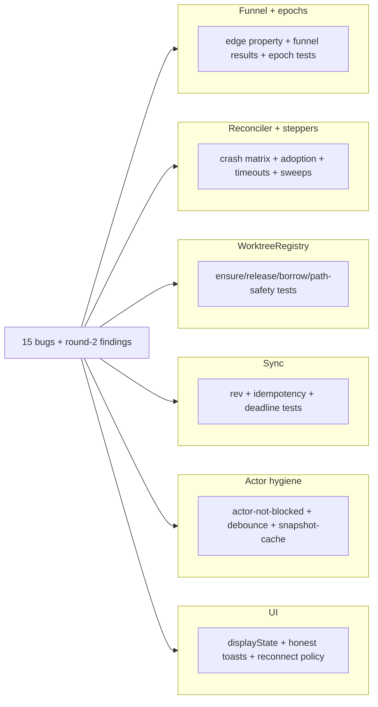

# Layer 3 — Test Design: Card Lifecycle Convergence

> Written with [[03-implementation]], reviewed at the same gate. Every test below is named in the
> finalized plan with its concrete assertion; this layer maps them to contracts and bugs.

## Test strategy & philosophy

- **Deterministic stubs are the regression guard; E2E is smoke.** The adversarial review found an
  E2E "regression test" that passed on unfixed code — race/crash proof comes from blockable seams.
- **Every lifecycle test runs for both agents** (claude-code + codex) via the capability seam;
  today's Claude-only provisioning tests get extended.
- **The suite stays green after every task** (~680 tests, `swift test`); each PR in [[05-pr-tree]]
  is independently green.
- **Deliberately not tested:** UI pixel output (displayState is the table-tested seam); transport
  framing (unchanged); agent-internal behavior beyond the readiness/hook seams.

## Framework / tooling

| Thing | Choice |
|---|---|
| Runner | `swift test` (swift-testing / XCTest, existing targets) |
| Race/crash seams | `Tests/OrchestraCoreTests/Stubs.swift` extended with `blockEnsure` / `ensureSleepMs` / `isAlive` / `removed` / `killed` / `ensureArgv` recorders |
| Async settling | `spawnAndAwaitLive` helper (poll store until `phase == .live`, ~3s cap); E2E polls `sessions <id> --json` for the `:agent` window (~15s cap) |
| Fixtures | Pre-upgrade `tasks.json` (incl. dirty worktree); ~28k-file slow repo (~9s checkout) |

## Unit tests (per L2 contract)

| L2 contract | Test cases (all named in the plan) |
|-------------|-----------------------------------|
| `Phase`/`RunState` Codable | `test_phaseRoundTrips` (every case incl. associated values, `{name, detail?}` encoding) |
| `isLegalEdge` (machine) | `test_illegalEdgesRejected` (property: exactly spec §P1's edges; revival only `viaSignal`) |
| `transition()` results | `test_transitionRejectsIllegalEdge`, `test_transitionNoopIsIdempotent` |
| Conclusions | `test_deadToArchivedDoesNotReconclude`, `test_waitShortCircuitsOnPersistedTerminalPhase` (+ unregister) |
| Wake-on-live | `test_sendDuringProvisioningDeliveredOnLive` (creatingWorktree **and** launching) |
| Epoch guard | `test_staleSessionEndIgnored`, `test_nilEpochKillSignalRequiresProbe` |
| Phase walk + landing states | `test_spawnDrivesPhases`, `test_promptedSpawnLandsRunning`, `test_provisionalSpawnLandsWaiting` |
| Supersede + revival edges | `test_relaunchSupersede`, `test_deadCompletedRevivesOnSignal` |
| Phase-gated liveness | `test_livenessSkipsBeingBornPhases` |
| Migration | `test_migratesLegacyTasksJson` (nil `waitReason` → `.humanTurn`; `deadReason` preserved), `test_statusFieldRemoved`, `test_migratesUnknownLegacyRecordToSafeTerminal`, `test_migrationStampsMarkers` + dirty-tree-byte-intact fixture |
| Registry `ensure` | `test_concurrentSameBranchEnsureJoins`, `test_markerlessCleanDirRecreated`, `test_markerlessDirtyDirNeverRemoved`, `test_ensureReMaterializesMissingTree`, `test_ensureRejectsPathEscape` |
| Registry `release` | `test_releaseNeverRemovesWhileReferenced` (incl. `dead` holder), `test_releaseNeverRemovesDirtyWithoutForce`, `test_releaseHonorsCreatedFlag`, `test_releaseIdempotentToMissingTree`, `test_releaseNeverRemovesOutsideOwnedRoots` |
| Borrows | `test_exactlyOneBorrower`, `test_borrowRegistrationSurvivesRestart` |
| Teardown routing | `test_archiveWithSiblingKeepsTree`, `test_spawnRollbackNeverForceRemovesSharedTree` (+ compile-time: `WorktreeManager` private to the registry) |
| Config knobs | `test_configTimeoutDefaults`, `test_configForwardCompat`, `test_worktreeAddIsBounded`, `test_pruneIsBounded`, `test_worktreeAddTimesOut` |
| Stepper protocol | `test_stepperStepIsIdempotent`, `test_launchFlavorDerivedFromState` |
| Non-blocking spawn | `test_spawnReturnsBeforeProvisioned`, `test_spawnFailureClassified`, `test_spawnStepperCrashRestart` (both agents) |
| Readiness (both agents) | `test_launchingToLive_onReady[claude]`, `test_launchingToLive_onReady[codex]`, `test_launchingToLive_fallback`, `test_codexRolloutBindingIsTimeScoped` |
| Verb contract | `test_everyVerbDeclaresKind`, `test_gateEnforcedAtDispatch`, `test_openShellDeniedWhileLaunching` (bug #3), `test_gatePolicyConformance` |
| Sync (`rev`) | `test_everyMutationBumpsRev`, `test_eventCarriesRev`, `test_boardSnapshotCarriesRev`, `test_staleEventDropped`, `test_revGapTriggersResync` |
| Idempotency + deadlines | `test_spawnWithClientIdIsIdempotent`, `test_batchSpawnRetryIsIdempotent`, `test_callTimesOut`, `test_pingDetectsDeadTunnel` |
| Report delta writes | `test_reportDoesNotClobberConcurrentFields` |
| `displayState` + UI | `test_displayStateActionsByPhase` (dead ≠ "Creating…"), `test_archiveFailureToastIsHonest`, `test_doubleSpawnGuarded`, `test_reconnectPolicyBackoff` |
| Store performance | `test_telemetryPersistDebounced`, `test_boardSnapshotDoesNotShell` |
| Actor hygiene | `test_actorNotBlockedByExec` / `_byDiff` / `_byPollTelemetry` / `_byTreeStatRecompute` / `_byLivenessList` |

## Crash / race battery (the design's core guarantee)

| Scenario | Tests |
|---|---|
| Stepper crash-convergence matrix | `test_everyStepperConvergesFromAnyBoundary` (kill at each `step` boundary × every phase) |
| Boot reconciliation | `test_startupReconcilesInFlightPhases`, `test_launchTimeoutSurvivesCrash`, `test_strandedTransitionalCardRedriven`, `test_stepFailureBacksOff` |
| Adoption identity | `test_adoptionChecksEpochIdentity`, `test_daemonCrashAdoptsLiveSession`, `test_launchingAdoptsSurvivingSession`, `test_machineRebootPath` |
| Missed readiness | `test_launchingMissedHookConvergesViaLiveness` (asserts `N × tick < sessionLaunchTimeout`) |
| Kill safety | `test_preKillProbeIsFresh`, `test_preKillProbeOffActor`, `test_orphanSessionSwept` (dead-card session NOT killed) |
| Supersede races (mined from the branch) | `test_archiveDuringMidCheckout`, `test_archiveDuringLaunching`, `test_archiveRacesLaunch_reclaimsSession` — each × worktree/scratch/borrowed |
| Teardown durability | `test_teardownFullDutyList` (ordered; session kill included), `test_teardownRedriveNoDuplicateNudges` |
| Relaunch degraded | `test_reopenCrashRestart` (resumes, never blank), `test_relaunchReMaterializesMissingWorktree`, `test_relaunchBranchGoneFailsSafe` |
| Seeds + registries | `test_handoffSeedSurvivesCrash`, `test_mcpWatchSurvivesRestart` |
| Corrupt store | `test_corruptTasksJsonRecovers` (timestamped backup + conservative mode) |

## Integration / end-to-end tests

- **Slow-repo E2E fixture** (`test_slowRepoSpawn`, both agents): race-free same-branch double
  spawn + non-frozen actor during a ~9s checkout + the full phase walk. Smoke, not proof.
- **CLI E2E smoke:** polls `sessions <id> --json` for the `:agent` window before driving `exec`.

## Fixtures / mocks / test data

- **Pre-upgrade board fixture:** cards with `status`/`waitReason` — incl. a nil-`waitReason`
  waiting card and a `deadReason: .resumeFailed` dead card.
- **Dirty-tree half of that fixture:** a dirty marker-less worktree that must survive byte-intact.
- **Stub seams:** blockable `ensure` (spawn-returns-early + mid-checkout races), sleep-injecting
  session stubs, kill-at-step hooks, argv/removal/kill recorders.
- **Slow-repo fixture:** ~28k files, scripted generation, both agents.

## Coverage map

## Traceability → the 15 bugs (+ round-2 findings)

| Bug | Killed by (tests) |
|---|---|
| #1 worktree data-loss | `release()` battery + `test_spawnRollbackNeverForceRemovesSharedTree` |
| #2 `wait` hangs | `test_waitShortCircuitsOnPersistedTerminalPhase`, conclusion tests, `test_mcpWatchSurvivesRestart` |
| #3 zombie shell claim | `test_openShellDeniedWhileLaunching` |
| #4 stale whole-object writes | `test_reportDoesNotClobberConcurrentFields` |
| #5 restart mid-provision | `test_startupReconcilesInFlightPhases`, `test_launchTimeoutSurvivesCrash` |
| #6 ensure races (+ Codex variant) | `test_concurrentSameBranchEnsureJoins`, `test_codexRolloutBindingIsTimeScoped` |
| #7 stale-snapshot kill | `test_preKillProbeIsFresh` |
| #8/#9 unbounded procs / no timeouts | Config-knob + bounded-git tests, `test_worktreeAddTimesOut` |
| #10 reopen freezes actor | `test_reopenCrashRestart` (+ actor-hygiene battery) |
| #11 no agent-up confirmation | readiness tests (both agents) + fallback |
| #12 half-created adoption | marker-arm tests |
| #13 whole-file writes | `test_telemetryPersistDebounced` |
| #14 no sync versioning | `rev` battery |
| #15 no idempotency/deadline | idempotency + deadline battery |
| Round-2: in-memory registries, marker migration hole, session identity, teardown durability, seeds | durable-registry, `test_migrationStampsMarkers`, adoption-identity, teardown, `test_handoffSeedSurvivesCrash` batteries |

## Decisions made

| Decision | Why | Rejected |
|----------|-----|----------|
| Deterministic stubs over E2E as the guard | The review proved an E2E test can pass on unfixed code | E2E-first regression suite |
| One `spawnAndAwaitLive` helper for the ~30-file migration | Non-blocking spawn breaks spawn-then-assert; one helper, one sweep | Per-test ad-hoc sleeps |
| Both-agent matrix on every lifecycle test | Repo rule: Claude + Codex are both priority targets | Claude-only (today's state) |
| Crash tests iterate phases, not verbs | The reconciler dispatches by phase — the real key | Per-verb crash tests (redundant per pruner A7) |
| Slow-repo E2E kept but labeled smoke | Exercises the real git/tmux path cheaply | Counting it as race proof |
| **PR6a Task 6.1: idempotency tests in `OrchestraCoreTests`** (not `IntegrationTests`) — `TestEnv.make()`/`env.svc` + `SpawnRaceTests` concurrent precedent + `EventBox` accumulator live there | The deterministic daemon harness and concurrent-spawn precedent are in that target; keeps the tests fast + deterministic | The spec's suggested `IntegrationTests` path (no harness there) |
| **PR6a Task 6.1: wire-path test drives the real `CommandRegistry` handler** (`CommandRegistry().command("spawn")?.run(env.svc, params, .mcp)`, twice with the same `id` param) | Proves the registry reads `id` from params and dedups — the brief's `env.dispatch` placeholder resolved to the existing `CommandsTests` registry-run precedent, no new harness | A full `ControlClient`↔`ControlServer` round trip (heavier, unnecessary for the registry-reads-`id` assertion) |
| **PR6a Task 6.2/6.3: `ControlClient` concurrency tested with a controllable `StubTransport`** — `answerVersion`/`answerSubscribe`/`reopenOnConnect` flags + a `writes` recorder + `feed(_:)`; `test_callTimesOutNearZero` uses a 1 ns `callTimeout` (arm-race) with the default `probeTimeout` | Deterministic exercise of the deadline arm-race, the bounded probe, the ping degrade, and the subscribe barrier without a live daemon | A live daemon round trip (non-deterministic timing; can't force the near-zero arm race or a never-acking subscribe) |
| **PR6a Task 6.3: `test_subscribeSuccessFiresOnReconnect` is the break-first regression guard** — subscribe answered → `onReconnect` fires under `callTimeout`; empirically FAILS on a semaphore-bridged reconnect (reader parked → ack unread → deadline-fail) and PASSES on break-first (~0.5 s) | A reader-parking reconnect bridge deadlocks; this positive-path test discriminates it, where the failure-only test (`test_subscribeFailureDoesNotFireOnReconnect`, asserts only "onReconnect not fired") would pass on the broken bridge | Only the failure-path test (masks the deadlock) |
| **PR6a Task 6.3: `test_forwardGapDoesNotResync` is a documented STRUCTURAL guard** — asserts the event applies through with no fetch; `apply(_ env:)` has no resync branch so it can't fail on the impl | Encodes the sparse-rev contract ("never resync on a bare forward gap") as an intent marker; a behavioral version would need a client-fetch spy BoardStore has no seam for | A behavioral resync-count assertion (no injection seam) |

## Open questions — need your call

- (none — every test comes from the finalized plan/spec with its assertion stated)
