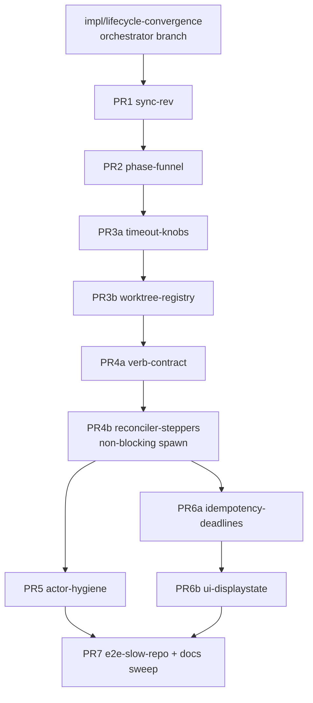

# Layer 3 — PR Tree: Card Lifecycle Convergence

> The change split into independently-reviewable PRs, with the order they must be created in.
> Reviewed at the combined Layer-3 gate with [[03-implementation]] + [[04-tests]].

## Execution model (Allen's standing workflow)

- An **orchestrator card** (Opus 4.8) on branch `impl/lifecycle-convergence` fans out one child
  PR card per row below (`spawn --base <parent PR branch>` — branch-tree lineage).
- Each PR card plans with `superpowers:writing-plans` (grounded in this vault + the plan's stage),
  then has that plan reviewed by Opus + GPT until clean.
- It then implements via `superpowers:subagent-driven-development` (high effort), has the diff
  reviewed by Opus + GPT until clean, and files a `merge-request` to the orchestrator.
- **`swift test` green at every PR**; both-agent tests wherever the PR touches agent behavior.
- After all PRs merge: the orchestrator runs a final whole-branch review (Opus + GPT until clean)
  and lands in the Review column for Allen.

## The PRs

| # | Branch | Base | Contents (plan tasks) | Independently green because |
|---|--------|------|----------------------|------------------------------|
| PR1 | `lc/1-sync-rev` | `impl/lifecycle-convergence` | Stage 1: board `rev` + event/snapshot stamping + `report()` field-delta (1.1–1.4) | Additive; interim clobber fix stands alone |
| PR2 | `lc/2-phase-funnel` | PR1 | Stage 2: `Phase` types, migration (drops `status`), funnel + `isLegalEdge`, epoch guard, sync spawn via funnel, readiness both agents (2.1–2.7) | Spawn stays synchronous — no reconciler needed yet |
| PR3a | `lc/3a-timeout-knobs` | PR2 | Stage 3: Config knobs + every `WorktreeManager` git invocation bounded (3.1–3.2) | Pure additive bounding |
| PR3b | `lc/3b-worktree-registry` | PR3a | Stage 3: `WorktreeRegistry` actor, marker arms, one `release()` policy, persisted borrows, path safety, all teardown routed (3.3–3.6) | Registry replaces call sites 1:1; sync spawn still drives it inline |
| PR4a | `lc/4a-verb-contract` | PR3b | Stage 4: `PhaseStepper` protocol skeleton + `CommandSchema.kind`/`phaseGate` + the dispatch chokepoint (4.1, 4.5) | Gate lands **before** the non-blocking window exists (bug-#3 ordering) |
| PR4b | `lc/4b-reconciler-steppers` | PR4a | Stage 4: the four steppers, **non-blocking spawn** + the ~30-file test migration, reconciler discipline + boot order, durable registries, conservative mode, crash battery (4.2–4.4, 4.6, 4.7) | The window opens with its gate already merged; reconciler ships with its tests |
| PR5 | `lc/5-actor-hygiene` | PR4b | Stage 5: off-actor sweep, snapshot-from-cache, telemetry debounce (5.1–5.4) | Perf-only; parallel with PR6a |
| PR6a | `lc/6a-idempotency-deadlines` | PR4b | Stage 6: client-minted ids, per-RPC deadline + ping, `rev`-gap resync (6.1–6.3) | Wire-level; parallel with PR5 |
| PR6b | `lc/6b-ui-displaystate` | PR6a | Stage 6: `displayState` + honest toasts + action gating + mac terminal retry (6.4–6.6) | Needs 6a's `ConnectionState`; UI-only |
| PR7 | `lc/7-e2e-slow-repo` | merged tip | Cross-cutting: slow-repo E2E fixture (both agents) + final docs sweep | Exercises Stages 2–5 end-to-end; smoke by doctrine |

## The tree (creation order top-down; ⇉ = parallelizable)

- **Merge order into the orchestrator branch:** PR1 → PR2 → PR3a → PR3b → PR4a → PR4b →
  {PR5 ⇉ PR6a} → PR6b → PR7. Children restack (branch-tree `synced`/restack) when a parent merges.
- **Sizing:** 10 PRs (matches Layer 1's "~6 stages / ~10 PRs" estimate); PR2 and PR4b are the two big ones
  (the `status` removal sweep and the test migration) — both are irreducible flag-days by design.

## Why these split points (and not others)

| Call | Why |
|---|---|
| Stage 2 is one PR | Removing `status` is a flag-day across daemon + 3 clients; splitting it leaves a half-migrated model no PR can gate |
| Stage 4 splits gate-first | Bug #3's fix requires the `phaseGate` to exist before non-blocking spawn opens the pre-launch window — the tree encodes the ordering the spec demands |
| Stage 3 splits knobs/registry | 3.1–3.2 are trivial + reviewable alone; the registry PR stays focused on the ownership move |
| PR5 ⇉ PR6a parallel | Disjoint regions (one shared file, non-overlapping sites); both base on PR4b |
| E2E fixture last | It exercises Stages 2–5; landing it earlier would test scaffolding that Stage 4 rewrites |

## Traceability → [[03-implementation]] / [[04-tests]]

| PR | L3 mechanics | L4 test batteries |
|---|---|---|
| PR1 | Sync + idempotency (rev half) | `rev` battery (store/event/snapshot) + report delta |
| PR2 | Types, migration, funnel, epochs, readiness | Codable round-trip (`test_phaseRoundTrips`), edge property, funnel results, epoch, migration, phase-walk, readiness |
| PR3a/3b | Config knobs; registry mechanics | Knob/bounded-git; ensure/release/borrow/path-safety |
| PR4a | Catalog + chokepoint | Verb-contract tests (`test_gateEnforcedAtDispatch`, bug #3) |
| PR4b | Steppers, reconciler, boot order, durable registries | Crash/race battery (matrix, adoption, sweeps, teardown, seeds, corrupt store) |
| PR5 | Actor hygiene | Actor-not-blocked + debounce + snapshot-cache |
| PR6a | Ids, deadlines, gap resync | Idempotency + deadline + gap tests |
| PR6b | displayState + UI honesty | displayState/toast/double-spawn/reconnect tests |
| PR7 | — | Slow-repo E2E (smoke) |

## Decisions made

| Decision | Why | Rejected |
|----------|-----|----------|
| Stack PRs linearly with two parallel branches | Review isolation with minimal restack churn | Full parallel fan-out (conflict storms in `OrchestraService.swift`) |
| 10 PRs at stage/half-stage granularity | Each independently green + reviewable; matches spec sizing | Per-task PRs (~35 — review overhead) or per-pillar mega-PRs |
| Gate PR (4a) strictly before spawn PR (4b) | The spec's "window and gate ship together" holds *per merge order* | One giant Stage-4 PR (still correct but ~2× the review surface) |

## Open questions — need your call

- (none — the split derives from the plan's stage gates + the spec's ordering constraints)
