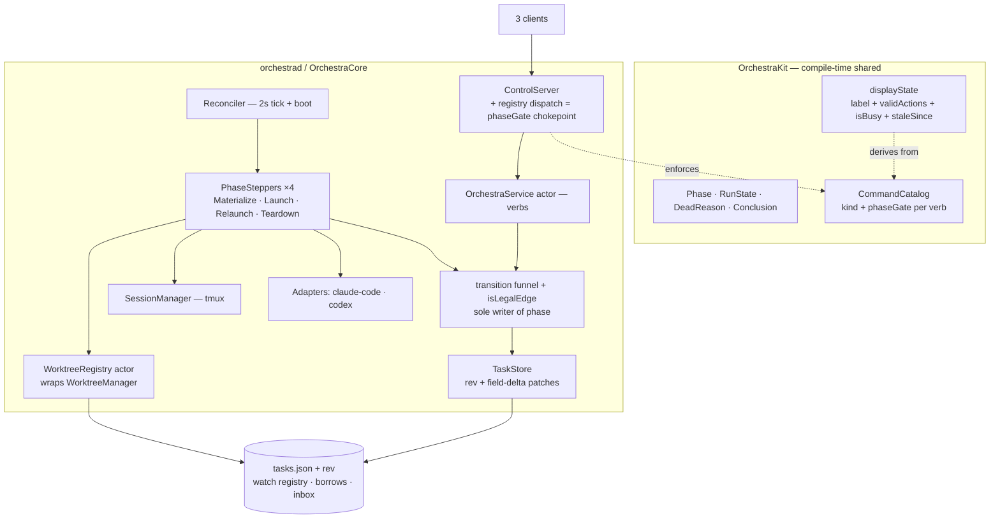

# Card Lifecycle Convergence — Design Index

> Replace Orchestra's edge-triggered, multi-variable card lifecycle with one persisted `phase` driven
> through a single validated funnel, per-launch epochs, and an idempotent phase-keyed reconciler —
> killing 15 confirmed lifecycle bugs plus the adversarial-review round's findings, agent-agnostically.

**Sources of truth this vault deepens:** the finalized spec [[../2026-07-08-card-lifecycle-convergence|spec]]
and plan `notes/plans/2026-07-08-card-lifecycle-convergence.md` (both re-grounded on `main` @ `f1aa568`,
2026-07-09, after a 3-adversary review round). Gate mode: **agentic** (Opus 4.8 + GPT 5.5 reviewers loop
until no complaints; no human gates — Allen's standing instruction).

## Layers

| Layer | Document | Status |
|-------|----------|--------|
| 1 — Initial design | [[01-design]] | approved (agentic gate: Opus 4.8 + GPT 5.5 clean, 2026-07-09) |
| 2 — Contract | [[02-contract]] | approved (agentic gate: Opus 4.8 + GPT 5.5 clean, 2026-07-09) |
| 3 — Implementation | [[03-implementation]] | approved (agentic gate: Opus 4.8 + GPT 5.5 clean, 2026-07-09) |
| 3 — Tests | [[04-tests]] | approved (same combined gate) |
| 3 — PR tree (execution order) | [[05-pr-tree]] | approved (same combined gate) |

<!-- Status values: not started · draft · in-review · approved · skipped -->

## Current picture (Layer 2 — modules; the L1 phase machine lives in [[01-design]])

## Open questions (rolled up)

- (none yet)
