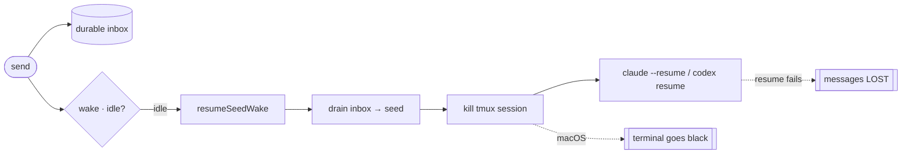
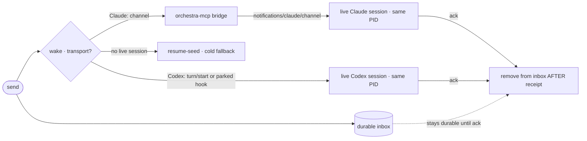

# Layer 1 — Initial Design: No-restart live wake + reliable send delivery

> **Status (2026-07-10): re-baselined on `main` — lifecycle-convergence (`f52e640`) + Layer A (`491109a`)
> + Codex hooks-parse fix (`70db66f`) are merged.** Layers **A (Codex busy-drain, now verified working
> end-to-end) and C (terminal reconnect) are DONE**; the Phase/epoch/reconciler/verb foundation is live.
> **Remaining: B → D → E**, built on `main` (see Scope & status).
>
> The **what**, not the how. Waking an idle card historically **killed and relaunched its agent session**
> (the old `resumeSeedWake` → `resumeInCard` → `kill + claude --resume` / `codex resume`). That relaunch is
> the jank: the UI blanks, sends get dropped, and Codex "often doesn't get woken." This redesign replaces
> restart-based wake with **in-place delivery** — a per-session control channel the daemon pushes into — and
> makes delivery **reliable at-least-once**. Realizes the deferred `controlChannel` seam named in
> [[../agent-provider-interface|agent-provider-interface]] §8 and retires the `codex-wake-delivery` relaunch cost.

## Purpose & problem

`send` to a card enqueues to a durable inbox (`Inbox.swift`) and calls `wake` (`OrchestraService.send`,
`OrchestraService.swift:516`). If the agent is **busy**, the **Stop hook** drains the inbox at turn-end as
a `decision:block` continuation — clean, in-session, no restart (F3, works). The pain is entirely in the
other two cases, which decompose into **three independent defects**:

### The three defects behind "janky send/wake"

**Defect 1 — waking an idle agent requires killing its session.** For *both* agents, `wake` →
`resumeSeedWake` → `resumeInCard` → `resume` **kills the tmux session and relaunches** the agent with
`--resume` / `codex resume`, folding the inbox into the opening turn (`OrchestraService+Wake.swift:98-131`,
`OrchestraService+Recovery.swift:55-141`). This is the "restart a card" the user hates: seconds of
relaunch, full replay, and the flakiness of resume (timeout, session-vanished, trust races).

**Defect 2 — the wake path drops sends (data loss + silent no-ops).** Ways a `send` is lost:
- **Drain-before-confirm data loss — LARGELY CLOSED by convergence.** Historically `resumeInCard` drained
  the durable inbox and folded it into an in-flight resume seed *before* the resume was confirmed; a failed
  resume lost the messages. Post-merge, `resume` is **intent-only** (`+Recovery.swift:28-40`): it persists the
  folded seed as **`pendingSeed`** atomically with the `→ .relaunching` transition, and the `RelaunchStepper`
  clears `pendingSeed` **only on confirmed readiness** (`PhaseStepper.swift:194`), retaining it across
  timeout/superseded/failed retries. So the drained inbox now survives a failed relaunch as durable state.
  **Residual narrow window:** `inbox.drain` still removes from the durable inbox (`+Recovery.swift:53`)
  *before* the transition persists `pendingSeed` (`:34-37`) — a daemon crash in that in-memory gap loses them.
  Closing it = persist the delivery intent **before** draining (Layer B).
- **Provisional / never-prompted strand.** A `send` to a freshly-spawned or just-restarted card that has
  never run a turn has no transcript → `isResumable` is false → `resumeSeedWake` returns at its
  `.waiting && isResumable` gate (`+Wake.swift:124`) → the message sits until a human types.
- **Codex idle-lag no-op.** Codex idle is detected from the 2 s rollout-tail poll, so a `send` arriving in
  the lag window sees a still-`.running` card and `wake` no-ops; delivery depends on a later turn that may
  never come.

**Defect 3 — the macOS terminal couldn't survive its session being killed. ✅ FIXED (merged).** Historically
`AgentTerminalView.processTerminated` was a no-op and the pane went **black until the user reselected the
card** when any lifecycle op recreated the session. Convergence fixed this (`757d719`/`d7d1a68`): a pure
phase-edge decision `TerminalReattachDecision.shouldReattachOnLiveEdge` drives a one-shot reattach on the
false→true →live edge (`AgentTerminalView.swift:97-109`). So the "UI temporarily breaks" symptom is already
resolved on `main`; the remaining work is only to stop *needing* the kill+recreate (the wake redesign).

### The Codex busy-path drain — was dead three ways, now ✅ FIXED (merged)

Empirically (Codex `0.142.5`), the clean **busy-path Stop drain never even ran** — so an idle Codex card
never picked up a queued `send`. It was dead **three** independent ways, all now fixed on `main`:
- **Hook-trust modal** — the build trust-gates hooks; the TUI blocked on a *"Hooks need review"* modal
  Orchestra never answered. **Fixed (`491109a`)**: build-probed `--dangerously-bypass-hook-trust`.
- **Stale `hooks.json` never replaced** — `installIfSafe` only overwrote a file with the newer sentinel, so
  a pre-change `orient` file was left in place and the `Stop` hook was never installed. **Fixed (`491109a`)**:
  broadened the "ours" marker to `_report --event`.
- **Codex rejected the whole file over `_comment`** — the rendered hooks JSON kept a `_comment` doc field
  that Codex's strict schema rejects (`expected 'description' or 'hooks'`), so *no* hooks registered even
  once installed. **Fixed (`70db66f`)**: `HooksRenderer.renderCodex` strips top-level `_comment` (mirrors
  Claude's `SettingsComposer`). *Verified on a real isolated Codex stack: a queued message is drained by the
  Stop hook at turn-end, Codex continues with no manual resume.*

So the Codex **busy-path (F3) now works end-to-end** — most sends (agent busy / just-finishing) deliver
in-place with **no restart**. Only a genuinely-idle-cold Codex send still needs the (Layer B / Layer E)
handling.

### The reframe

The single reliable "wake a live process without a restart" primitive is a **per-session control channel
the daemon pushes into**. Both agents now have one (via different transports), so we can retire
restart-for-wake instead of hardening it:

| Job | Replaced by | Empirically verified |
|-----|-------------|---------------------|
| Wake an idle **Claude** card (kill + `--resume`) | **Channel push** — the `orchestra-mcp` stdio bridge advertises `claude/channel` and emits `notifications/claude/channel`; the daemon pushes the inbox item over the existing control socket → injects a new turn in-place | **Yes** — real `claude` 2.1.206, idle→turn, **PID unchanged**, ~2 s |
| Wake an idle **Codex** card (kill + `codex resume`) | **blocking Stop-hook park** (near-term, TUI-preserving) *or* **App Server `turn/start`** (long-horizon control channel) | both **verified** — park keeps the TUI free; `turn/start` costs the attached TUI |
| Drain the inbox safely | Drain **after** delivery is confirmed, not before the resume | design change |
| Survive a session recreate in the UI | Per-launch **epoch** in the terminal `.id` + a `processTerminated` re-attach (port the iOS reconnect to macOS) | design change |

## Empirical evidence (every mechanism tested against the real binaries)

Per the "empirically test every feature" mandate. Versions: **Claude Code 2.1.206**, **Codex 0.142.5**.

| Mechanism | Result | Status |
|-----------|--------|--------|
| **Channel wakes idle Claude, no restart** | Idle pane + external POST → new turn answered, **PID 26236 unchanged**, ~2 s | ✅ EMPIRICAL |
| **Channel coalesces while busy** | 2 msgs 71 ms apart delivered into the running turn, both reached context | ✅ EMPIRICAL |
| **Orchestra Swift MCP can advertise `claude/channel` + wake idle claude** | Minimal Swift server on the vendored swift-sdk (0.12.1) advertised `claude/channel`, accepted by real claude 2.1.206 (`/mcp` connected), woke an idle agent from a separate process, **PID unchanged**. SDK patch = **3 lines** (one optional `experimental: [String:Value]?` on `Server.Capabilities`; synthesized Codable carries it; omitted when nil). `orchestra-mcp` then passes the capability + defines the notification + triggers `server.notify` over the existing control socket. | ✅ EMPIRICAL |
| **Claude parked Stop-hook holds session, typing OK** | Composer stays live, typed text uncorrupted, Enter **queues** + auto-submits on release; same `session_id` | ✅ EMPIRICAL |
| **Claude Stop-hook default timeout** | ≥400 s (a 400 s hook completed, not killed); `timeout` field shortens; no override needed for a multi-minute park | ✅ EMPIRICAL |
| **Claude `decision:block` continuation** | Continues in-session, new turn on the `reason`; renders as a red "Stop hook error" (cosmetic); model injection-defense can refuse spoofed-"SYSTEM" text → use neutral wording | ✅ EMPIRICAL |
| **Claude `nativeReinvoke` from idle prompt** | Background task completes (any exit code) → harness auto-reinvokes into a new turn from a genuinely idle prompt, **PID unchanged** | ✅ EMPIRICAL |
| **Reinvoke preserves a human draft** | Unsubmitted draft stayed intact across the reinvoke turn, submitted cleanly after | ✅ EMPIRICAL |
| **`background_tasks`/`session_crons` in Stop payload** | Present natively in the Stop-hook stdin JSON | ✅ EMPIRICAL |
| **Wake-only latches at turn-end** | No Stop/reinvoke during permission prompt, plan-mode, compaction, fresh session, post-`/clear` | ✅ EMPIRICAL |
| **Codex Stop hook `decision:block` + park** | TUI + `exec`: `decision:block` starts a fresh turn; an 8 s hook parked the turn 8.1 s; `stop_hook_active` flips true on the continuation | ✅ EMPIRICAL |
| **Codex has NO auto-reinvoke** | No harness re-invoke concept; only no-restart in-process wake is a blocking hook | ✅ EMPIRICAL |
| **Codex "won't wake" root cause** | Hook-trust modal + stale-`hooks.json` install bug → Stop hook never runs → inbox never drains | ✅ EMPIRICAL |
| **Codex idle detection markers** | `task_complete`/`turn_complete` → `.waiting` (rollout tail, 2 s poll) | ✅ EMPIRICAL |
| **Codex App Server `turn/start` no-restart wake** | `turn/start` on an idle loaded thread → new turn, **same PID** (5 turns); `turn/steer` ~3 ms coalesce, `turn/interrupt` ~86 ms. A real control channel — no park needed | ✅ EMPIRICAL |
| **Codex app-server + attachable TUI** | Plain `app-server` (stdio/unix) is **single-client** (can't co-host JSON-RPC + a `--remote` TUI). Multi-client co-drive needs the `remote-control` **broker**, whose socket is **Noise-encrypted, not plain JSON-RPC** (only Codex's own `--remote` completes it). So: Option A (Orchestra owns app-server, renders UX from the event stream, no attached TUI) or Option B (broker + `--remote` SwiftTerm TUI, but implement the Noise handshake) | ✅ EMPIRICAL |
| **TUI + automation co-presence is a known upstream gap** | Transport-specific: **stdio/unix are single-client**; **WS is multi-client but "experimental/unsupported"**, and even there stock co-presence event fanout is incomplete — open **RFC [#21551]** (3-file fanout patch, unmerged, no maintainer reply) + issues [#24398]/[#25914]/[#11166]. The TUI is *already* an app-server client (in-process), so the ecosystem is converging on "everything is an app-server client." **Option A sidesteps co-presence entirely** (sole client, render from the event stream); only Option B depends on the unmerged fanout. | ✅ WEB (openai/codex) |
| **`nativeReinvoke` general idle wake + re-arm friction** | Auto-reinvoke reliable (5 cycles, PID stable, ~4–5 s) **but the agent must re-arm a background wait every turn** or it goes permanently dormant. → model-cooperation burden; channels preferred as the *primary* Claude path, nativeReinvoke reserved for the watcher/orchestrator pattern | ✅ EMPIRICAL |
| **Channel-consent auto-accept at spawn** | 3/4 startup dialogs config-skippable (`hasTrustDialogAccepted`, `bypassPermissionsModeAccepted`, `enableAllProjectMcpServers`); the dev-channels warning has no config flag → one `Enter`/launch via the existing `tmux send-keys` choreography (content-match — bypass-warning default is *exit*) | ✅ EMPIRICAL |

## Goals / non-goals

**Goals**
- **Retire restart-for-wake.** An idle `send` delivers in-place — no `kill + resume` — for both agents.
- **Never drop a send.** Remove from the durable inbox **only after** the agent has provably received it.
- **Fix the macOS terminal** so a session recreate (from any lifecycle op) re-attaches instead of going black.
- **Restore Codex's busy-path drain** (hook-trust + stale-file install) — a cheap, high-impact quick win.
- **Stay agent-agnostic behind the `wakeTransport` capability seam** — Claude and Codex both work; no
  `if agentId` in core (project rule: design for every agent).
- **Keep the native TUI.** No headless/app-server viewer that drops the SwiftTerm terminal, unless the
  Codex app-server probe proves a TUI can attach.

**Non-goals**
- **Not** the lifecycle-convergence state-machine rewrite (single `Phase` + `transition()` + epoch) — that
  is [[../lifecycle-convergence-design|its own approved design]] and is the structural backstop for the
  variable races underneath; this design layers on top and can land before or after it.
- **Not** removing resume-seed — it stays as the **cold fallback** (session dead, not resumable, channel
  unavailable, park expired).
- **Not** changing the durable inbox / Stop-drain payload semantics or caps. *(Amended by
  [[02-contract]]: payload format, header, and caps stay byte-identical, but `InboxMessage` gains
  lease fields and removal moves from drain-time to receipt-confirm time — required by the "never
  drop a send" goal, which this non-goal's stronger reading would contradict.)*
- **Not** adopting the Claude Agent SDK streaming mode (drops the interactive TUI — empirically confirmed
  no in-session injection for interactive sessions).

## Scope & status (post-merge — lifecycle-convergence + Layer A are on `main`)

> **As of 2026-07-10, everything below the wake-transport line is merged to `main`.** Layers **A and C are
> DONE**; the **lifecycle-convergence foundation** (Phase + funnel + epoch + reconciler + verb contract) is
> live, so Layers **B/D/E now build directly on `main`**, not on an unmerged branch. Anchors below are being
> re-verified against post-merge `main`.

| Layer | Item | Status (post-merge `main`) |
|-------|------|----------------------------|
| **A — Codex busy-path drain** | Restore the clean busy-path Stop drain: (1) build-probed `--dangerously-bypass-hook-trust`; (2) broaden `CodexHooks` marker to `_report --event`; (3) strip `_comment` from the rendered Codex hooks so Codex parses them. | ✅ **MERGED** (`491109a` + `70db66f`). `bypassHookTrustSupported` + `CodexHooks.sentinel="_report --event"` + `HooksRenderer.renderCodex` strips `_comment`. **Verified working end-to-end on real Codex** (Stop hook drains a queued send at turn-end, no resume). |
| **C — macOS terminal reconnect** | Reattach the terminal when the card re-enters `live`. | ✅ **MERGED** via convergence (`757d719`/`d7d1a68`). Implemented as a **pure phase-edge decision** — `TerminalReattachDecision.shouldReattachOnLiveEdge(paneAlive:wasLive:isLive:)` + `AgentTerminalView` reattaching on the false→true →live edge (`AgentTerminalView.swift:97-109`). Edge-driven, *not* an epoch-in-`.id` remount. Black-pane-on-recreate bug fixed. |
| **B — Reliable at-least-once delivery** | **(1) Drain-after-confirm:** mostly *done* via convergence's `pendingSeed` (survives a failed relaunch); remaining = close the narrow **drain→persist crash window** by persisting the delivery intent *before* `inbox.drain`. **(2) Delivery reconciler (the core new work):** a level-triggered per-tick arm that re-drives delivery for any idle (`.live(.waiting)`) card with a non-empty inbox + no delivery in flight — **backoff** + a "delivery-stuck" surfaced state — so a raced/no-op'd `wake` is retried, never stranded. Flip **`send` from `.mutation` → `.convergence`** so it persists a delivery intent the reconciler drives to empty. | 🔜 **OPEN — the main remaining work.** Convergence built the *seams* (reconciler, `PhaseStepper`+`ConvergeContext.inbox`, `VerbKind.convergence`, `phaseGate`) but **no inbox-delivery reconciliation exists yet** — `send`/`wake` are still the imperative event-driven kill+resume path. |
| **D — Claude no-restart wake** | `orchestra-mcp` advertises `claude/channel`; daemon→bridge push over the control socket emits `notifications/claude/channel`. New `wakeTransport` case; resume-seed → cold fallback. | 🔜 **OPEN — build on merged `main`.** Model as a fast **MutationVerb**; phase+epoch gate "is there a live session to push into?". |
| **E — Codex no-restart wake** | **Decided:** *kill the restart's jank, don't hold a hook.* Rely on the merged **busy-path drain** (common case, no restart) + a **clean restart** (via Layer B's drain-after-confirm + the merged terminal reconnect) for the rare genuinely-idle cold send. Optional short **grace-park** only if idle-wake restarts prove frequent. App Server `turn/start` remains a documented long-horizon option (costs the TUI — not taken). | 🔜 **OPEN — build on merged `main`.** Mostly *reuses* merged pieces; the new work is Layer B's correctness + the restart-only-when-safe gate. |

### Foundation now on `main` (lifecycle-convergence — MERGED `f52e640`)

The **card-lifecycle-convergence** redesign that this work sits on is **merged to `main`** (top merge
`f52e640`, plus Layer A `491109a`). What that gives us, already live:
- **Layer C is done** — the terminal reattaches on the →live edge (`757d719`/`d7d1a68`) with `DisplayState`;
  the black-pane-on-session-recreate bug is fixed. Nothing to build here.
- **The wake/recovery core is rewritten** — `recovering` is gone; the **`Phase` model + `transition()`
  funnel + per-launch epoch + reconciler (`+Reconcile`/`+Converge`) + the verb contract** are live. So
  Layers **B/D/E build directly on that model**: the no-restart wake is a fast **MutationVerb** (in-place
  channel push) and reliable delivery is a **ConvergenceVerb** (enqueue intent → reconciler drives to
  empty), rather than a rework of the deleted `resumeSeedWake`.
- **Layer A is merged** (`491109a`) — Codex busy-path drain restored (hook-trust build-probe + broadened
  `_report --event` sentinel).

**Remaining work = B → D → E, all on `main`:** **B** (drain-after-confirm + delivery reconciler) is the
correctness backbone and lands first (it also makes Codex's clean-restart path reliable); **D** (Claude
channels) and **E** (Codex clean-restart + optional grace-park) build on it. Each should be its own tracked
PR card off `main` (this card is freeform — spawn the implementation cards, don't build on `main` here).

### Implementation anchors (post-merge `main` @ `f52e640`)

The seams B/D/E plug into (re-verified against merged `main`):

| Concern | Anchor |
|---------|--------|
| `Phase` enum + `RunState` + `Phase.Kind` | `OrchestraKit/Model.swift:75-143` (epoch `Task.sessionEpoch:402`) |
| The single `transition()` funnel (only writer; epoch fence; wake-on-live) | `OrchestraService+Lifecycle.swift:37-95` |
| Reconciler (per-tick driver; add the delivery arm here) | `OrchestraService+Reconcile.swift:47-168` |
| `PhaseStepper` protocol + `ConvergeContext` (carries `inbox`) | `PhaseStepper.swift:7-15,35-71`; actor callbacks in `OrchestraService+Converge.swift` |
| Verb contract: `VerbKind{query,mutation,convergence}` + `CommandSchema.phaseGate` | `OrchestraKit/CommandCatalog.swift:20,22-37`; enforced `CommandRegistry.swift:35-47` |
| `send` (flip `.mutation`→`.convergence`) | schema `CommandCatalog.swift:92-95`; handler `OrchestraService.swift:609-621` |
| `wake` (phase-gated; `.controlChannel` stub for D/E) | `OrchestraService+Wake.swift:162-170` (`break` at :168); `resumeSeedWake:187-200` |
| `resume` intent-only + `pendingSeed`; `resumeInCard` drain | `+Recovery.swift:28-40` (persist), `:50-56` (drain at :53); `RelaunchStepper` clears on confirm `PhaseStepper.swift:194` |
| Convergence-verb pattern to copy | `resume` = intent-only `transition(→.relaunching, mutate: pendingSeed=…)` + `RelaunchStepper` |
| Background-work → keep `.running` (subagent-safe) | `ClaudeCodeAdapter.swift:79-87` |
| Codex Layer A (merged) | `CodexAdapter.bypassHookTrustSupported:191-194`, `hookTrustFlags:181-183` on `start:231`/`resume:241`; `CodexHooks.sentinel:19`; `HooksRenderer.renderCodex` strips `_comment` (`70db66f`) |
| Terminal reattach (Layer C, merged) | `OrchestraKit/TerminalReattachDecision.swift:12-23`; `AgentTerminalView.swift:97-109` |

## Expected behaviour

One durable inbox; delivery is **in-place** for a live session and **fallback-relaunch** only when there is
no live session to push into:

| Card state at `send` | Claude path | Codex path |
|----------------------|-------------|------------|
| **Busy** (`.running`) | Stop hook drains at turn-end (unchanged) | Stop hook drains at turn-end (once Layer A restores it) |
| **Idle, live session** (`.waiting`) | **Channel push** injects a turn in-place (no restart) | **App Server `turn/start`** or **parked Stop hook** (no restart) |
| **Idle, no live session** (dead / not resumable / channel not attached) | resume-seed relaunch (cold fallback) | resume-seed relaunch (cold fallback) |
| **Never-prompted / provisional** | delivered on its first turn's Stop; guaranteed (Layer B) | same |

The inbox item is removed **only** after the channel/turn-start/drain confirms receipt (Layer B) — a failed
push leaves it durable for the next attempt, so no send is ever lost.

## Parked Stop-hook — verified properties & design requirements (the Codex near-term wake)

Empirically settled (Claude 2.1.206 decisive; Codex 0.142.5 tracking the same, final 18-min hold pending):

| Property | Finding | Design requirement |
|----------|---------|--------------------|
| **Max block / day-long idle** | **No hard cap** — a hook blocked **19m32s** with `timeout:86400`, past the 600s doc ceiling; limit = the configured `timeout` only. **Default (no timeout) caps at exactly 600s then SILENTLY drops to idle.** | **Always set a large explicit `timeout`** (e.g. a week). Never rely on the default. |
| **Daemon-restart survival** | A **reconnect loop inside the hook** survived the daemon bouncing — reconnected and kept parking. | The `_report --event stop` long-poll must **reconnect** to the daemon UDS on disconnect (retry loop), so a park survives orchestrad restarts (satisfies "agents outlive daemon restart"). |
| **Passive viewing** | Select/attach/capture-pane do **NOT** disturb the park; only real stdin touches the composer, and even a keystroke doesn't release it (release is external). | Release keys on **genuine input/attention**, never on selection/glance — a glance is always safe. |
| **User input during park** | Typing queues uncorrupted; Enter queues (doesn't interrupt); auto-submits on release (~0.6 s). **Both agents queue** (Codex is *not* composer-blocked — earlier suspicion refuted). | Deliver the user's queued turn by **releasing on real input** (sub-second); no input is lost. |
| **Spurious release** | Releasing an empty park → **~0.1–0.3 s to genuine idle, no turn runs, state untouched.** | An accidental release is free and stateless — worst case the next send takes the cold path; the card **auto-re-parks at its next turn-end**. |
| **Visibility** | A parked card shows a busy spinner (*"running stop hook · 19m"*) — **indistinguishable from real work by pane text.** | Orchestra **must track park-state out-of-band** (it owns the hook) and render a parked card as **idle**, not infer from the spinner. |
| **Loop guard** | `decision:block` re-fires Stop with `stop_hook_active:true` (both agents) — a flag, not a hard cap. | Keep the existing `maxConsecutiveInjects` discipline for *content* injects; the park hold itself is one block, not a re-inject loop. |

## Restart vs. in-flight background work — RESOLVED (both agents safe today)

A kill+resume wake destroys the agent's **background work** — `run_in_background` Bash tasks (children of the
pane) and Claude **background subagents** (in the `claude` process). None of it is in the transcript, so
`--resume` does NOT restore it. This is a *further* argument for no-restart in-place delivery (channels /
parked-hook / Stop-drain never kill the process, so background work always survives).

**Claude — SAFE (empirically verified).** resume-seed only fires on `.waiting`, and `ClaudeCodeAdapter.parse`
(`ClaudeCodeAdapter.swift:79-87`) keeps a card **`.running`** when `background_tasks`/`session_crons` is
non-empty. A background subagent **does** populate `background_tasks` — as `{"type":"subagent","status":
"running","agent_type":…}` (verified, claude 2.1.207) — and Orchestra's check is a **type-agnostic non-empty
test**, so it covers `"shell"` *and* `"subagent"`. A synchronous subagent also holds the turn `.running`. So
no Claude subagent (background or sync) is ever killed by a resume-wake. *(Lock it in with a one-line test
asserting the check stays type-agnostic — a future `type=="shell"` filter would silently regress it.)*

**Codex — MOOT (empirically verified, codex 0.144.1).** Codex **never presents as idle with live background
work**, so there's nothing for a resume-wake to disrupt: (a) backgrounded shells (`&`/disown) are **reaped the
instant the exec tool returns** (no `run_in_background` primitive); (b) `multi_agent` **subagents are fully
synchronous** — the parent does an internal blocking `wait` and its Stop fires only *after* `SubagentStop`, so
the card stays `.running` until the subagent completes; (c) no async/detached primitive ships (`deferred_executor`
/`enable_fanout` exist but are under-development + OFF). So at `.waiting`, live background work cannot exist.

**No new guard needed.** resume-seed already only fires on `.waiting`, and **neither agent is `.waiting` with
live background work** — Claude keeps such a card `.running` (`background_tasks`, incl. subagents); Codex
can't reach that state at all. Follow-ups: (1) a **one-line Claude test** pinning the `background_tasks` check
type-agnostic (a future `type=="shell"` filter would regress subagent protection); (2) **revisit only if**
Codex ships `deferred_executor`/fanout (a detached-task primitive would reopen this for Codex).

## Delivery-stuck state — who gets told (and how)

When the delivery reconciler (Layer B) can't deliver after backoff (X dead / won't resume), surface it via
**targeted existing seams — never a board-wide broadcast** (pushing "X is stuck" into every inbox wakes
uninvolved cards and burns turns). Note: cards coordinate two ways (both first-class per `delegation-skill.md`
— pick one per child): **`wait`** (you're woken on the child's conclusion — orchestrator fan-out, still
actively used) vs. **`send`-back** (the child sends a result message; no wait). This split shapes who can be
auto-notified:

| Audience | Channel | Why |
|----------|---------|-----|
| **The human — PRIMARY / universal** | A **card-level "delivery-stuck" state** on X (badge + configurable-notification) + the pending inbox **inspectable with retry/clear** | The only catch-all that works regardless of coordination pattern: whoever is blocked on X gets unblocked when the human intervenes. Reuses `deadReason`/status + notifications. |
| **Cards `wait`-ing on X — bonus** | **Conclude-as-failed to X's watchers** via `concludeCard`/`watchRegistry` | Nearly free (channel exists); unblocks a `wait`-ing orchestrator and fixes the known *"dead(spawnFailed) never concludes → parent wait hangs forever"* bug. But only reaches `wait`-users, so it's a bonus, NOT the main mechanism. |
| **`send`-back / request-response counterparties** | *nothing automatic* → rely on the human state above | They aren't registered as waiting on X (just sent + expect a reply), and attribution can't tell a blocked-requester from a fire-and-forget sender. The human-visible stuck state is the backstop. |

**Discipline:** retry **quietly** through transient races (recovering guard, idle-lag) with backoff; only flip
the visible stuck state + notify + conclude-waiters once it's clearly **not self-healing** (N failures /
dead-and-unresumable). Don't cry wolf on a 2 s race.

**Net:** the parked hook meets the "idle a day · never a timeout drop · never a restart · survives daemon
restart · glance-safe" bar, with two must-dos: **(1) set a large explicit timeout**, and **(2) track
park-state out-of-band and render parked-as-idle**. Release is keyed on **real input**, so viewing never
disturbs it and an accidental release is free.

## App Server Option A — costs vs the tmux+CLI baseline (a deliberate long-horizon bet, NOT taken now)

**Decision (2026-07-10): we are NOT taking the app-server bet.** Codex's no-restart wake is the **parked
Stop-hook**; app-server Option A stays documented as a future option only. This section records *why* — the
concrete features the current tmux+CLI model gives for free that Option A would trade away. (Note: this
asymmetry is **Option-A-only** — the Claude channel path and the Codex parked-hook path both keep the
tmux+CLI model fully intact.)

| Property (tmux+CLI today) | How tmux gives it | What Option A costs |
|---------------------------|-------------------|---------------------|
| **Agents outlive daemon restart** | `tmux -L orchestra` is an independent server; agent processes live in it; orchestrad reconciles via `tmux list-sessions` | Regresses if the app-server is an orchestrad **stdio child** (dies with the daemon). Only preserved by running a **separate durable `codex app-server daemon`** + reconnect/`thread/resume` logic — new supervised-process machinery. History survives either way (rollout-`.jsonl`-backed), but the **live in-flight turn** is more fragile. |
| **Agents outlive app restart** | The Mac app is just a viewer of the daemon | Comparable *if* orchestrad relays the event stream + re-hydrates via `thread/read` — but that's new relay/render plumbing. |
| **Native interactive UI for free** | SwiftTerm attaches to the pane → the agent's real TUI (approvals, plan mode, slash commands, input editor, scrollback, colors, sixel) | Orchestra must **reimplement the whole interactive agent UI** from `item/*`/`turn/*`/approval events and chase every new CLI feature. Richer/structured, but a large permanent surface. |
| **Immunity to agent-UI changes** | tmux proxies bytes; never breaks when the CLI UI changes | Couples Orchestra to the **v2/experimental JSON-RPC protocol** (`experimentalApi`-gated), whose managed daemon **auto-updates its binary** — a moving target. (Counter-force: the app-server is Codex's strategic surface; the TUI is already an in-process app-server client.) |
| **One uniform model** | Every card = a tmux pane you attach to (mac terminal, iOS SSH `nc -U`, takeover lease, shell tabs, `send-keys` approvals, `capture-pane`) | A **second UI model** for Codex only → every one of those surfaces needs a Codex-specific path. The hidden bulk of the cost. |
| **TUI + automation co-presence** | N/A (tmux is the UI; automation is `send-keys`) | A **known upstream gap** — RFC openai/codex#21551 (unmerged fanout patch); multi-client only over the "experimental/unsupported" WS transport. Option A *sidesteps* it (sole client) but Option B depends on it. |

**Verdict:** Option A buys a structured protocol (steer/interrupt/inject, richer rendering, alignment with
Codex's direction) at the price of survivability-for-free, the native TUI, agent-UI-change immunity, and one
uniform model. Worth funding only when those protocol upsides are wanted enough to build a Codex-specific UI
stack — hence long-horizon, not now.

## Diagrams

### Today (the jank)

### Target (in-place delivery)

## Decisions made (so far)

| Decision | Why | Rejected |
|----------|-----|----------|
| In-place **control-channel** wake per agent, not a hardened relaunch | The only reliable no-restart wake; empirically proven for Claude channels (PID-stable) | Harden resume-seed; keystroke/send-keys nudge (already retired as flaky) |
| **Channels** for Claude, hosted **inside `orchestra-mcp`** | Reuses the existing per-session stdio bridge + its control-socket link; no Node process | A separate Node channel server per session (extra dependency/process) |
| Keep resume-seed as the **cold fallback** | A dead/unresumable/unattached session has nothing to push into | Remove it (no fallback for cold sessions) |
| **Drain-after-confirm** | The current drain-before-resume is a real data-loss path | Keep folding into an unconfirmed seed |
| **Fix macOS terminal reconnect** as its own layer | The UI break is independent of the wake transport and helps every lifecycle op | Only address it via "fewer restarts" |
| **Codex hook-trust + stale-file** fixed first | Cheap, high-impact; restores the clean busy path independent of everything else | Bundle into the big wake rewrite |
| Behind the `wakeTransport` capability seam | Project rule: agent-agnostic; channels are Claude-only, app-server is Codex-only | `if agentId` branching in core |

## Open questions — need your call / pending probes

- [x] **Codex clean path — RESOLVED (with a UX cost Claude doesn't have).** App-server `turn/start` is a real
  no-restart control channel (proven), but plain app-server is single-client and the multi-client broker is
  Noise-encrypted — so a `turn/start` wake **costs the attached codex TUI** (Option A: Orchestra renders from
  the event stream) or a **Noise-handshake impl** (Option B). ~~Recommendation: parked Stop-hook near-term~~
  **FINAL DECISION (2026-07-10, supersedes the interim park recommendation): Codex idle-cold wake = a
  clean restart** (Layer E — busy-path drain covers the common case; B's claim/confirm + the merged terminal
  reconnect make the rare cold restart safe); the **parked Stop-hook is a deferred research seam only**
  (revisit if idle-wake restarts prove frequent), **app-server Option A the long-horizon upgrade**. *Asymmetry
  to accept:* Claude channels keep the TUI for free; Codex's control channel does not.
  **Web research (2026-07-10) reinforces A over B:** TUI+automation co-presence (Option B) is a *known,
  unmerged* upstream gap — RFC [openai/codex#21551] (multi-subscriber fanout patch, no maintainer reply),
  and multi-client only works over the "experimental/unsupported" WS transport (stdio/unix are single-client).
  Option A needs none of that (sole client), and the TUI is already an in-process app-server client, so
  owning the app-server is with the grain of where Codex is heading.
- [ ] **Channels research-preview risk.** Channels are a Claude research preview (flag/protocol "may
  change"), needing `--dangerously-load-development-channels` + consent auto-accept. Acceptable behind the
  capability seam with `nativeReinvoke`/resume-seed fallbacks? Or prefer `nativeReinvoke` (no preview
  dependency) as the *primary* Claude path and channels as the upgrade? *(Consent-accept probe running.)*
- [x] **`nativeReinvoke` re-arm friction — RESOLVED.** Empirically, staying wakeable **requires the agent to
  re-arm a background wait every turn** (no re-arm → permanently dormant). That model-cooperation burden
  settles the Claude primary as **channels** (external push, no re-arm); `nativeReinvoke` stays for the
  watcher/orchestrator pattern where a wait is naturally live; resume-seed is the cold fallback.
- [x] **Sequencing / relationship to lifecycle-convergence — RESOLVED (2026-07-10).** Verified against the
  live branches: **Layer A is independent** (`CodexHooks.swift` unchanged on convergence) → ship now.
  **Layer C is subsumed** by convergence PR6b (`DesktopTerminalPolicy` + epoch) → drop it. **Layers B/D/E
  overlap the convergence wake/recovery rewrite** (`+Wake`/`+Recovery`, `recovering` deleted) → build them on
  top of the merged `Phase`/epoch/verb model, not today's `resumeSeedWake`. Order: A → convergence → B/D/E.
