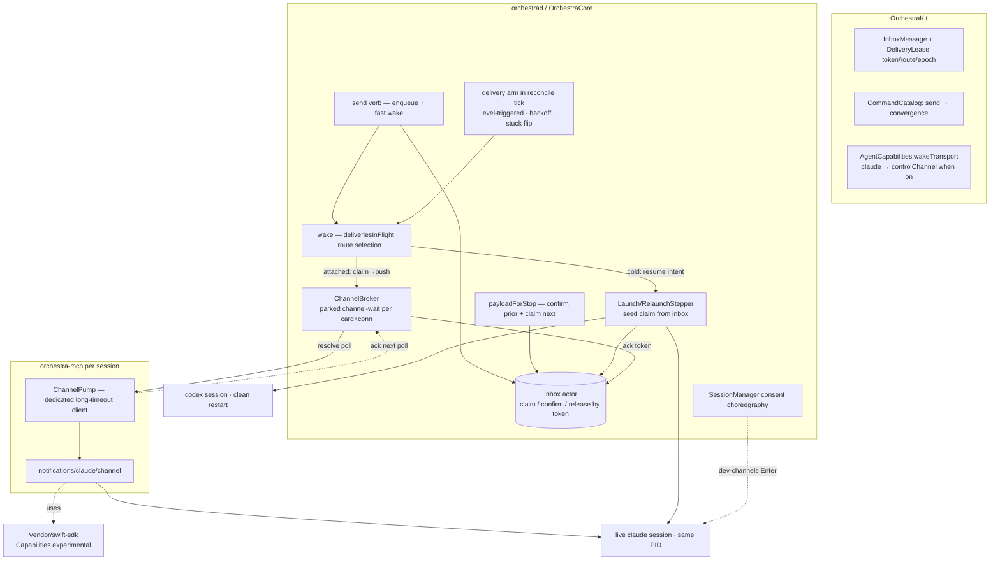
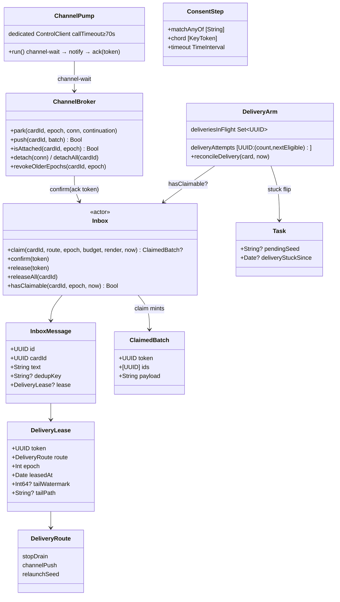

# Layer 2 — Contractual Design: No-restart live wake + reliable send delivery

> The **interfaces** for the remaining work (B → D → E), plugged into the merged
> lifecycle-convergence machinery (`Phase` funnel, reconciler, `PhaseStepper`/`ConvergeContext`,
> `VerbKind`/`phaseGate`). Mechanics and sequencing belong to [[03-implementation]].
> Grounded on `main` @ `c4f80d7`; anchors verified by code survey + two adversarial review
> rounds (Opus 4.8 + GPT-5.6 Terra, 2026-07-10).

## Architecture overview

The delivery model inverts: today "delivered" *means* "removed from the durable inbox," and removal
precedes receipt on every path (three loss windows). The contract makes the **durable inbox the
single source of truth until receipt is confirmed**: every delivery path **atomically claims** a
FIFO batch from the inbox (select + size-fit + lease in one actor call, returning a unique
**lease token**), delivers the rendered payload, and **confirms (removes) only on a
route-specific receipt proof carrying that token**. A crash, lost reply, or dead bridge leaves the
lease to expire and the batch is re-claimed — at-least-once, duplicates over loss, stale confirms
rejected by token.

Delivery becomes **level-triggered**: `send` stays the fast path (enqueue + opportunistic wake),
but a new **delivery arm in the existing reconciler tick** re-drives delivery for any idle card
with deliverable messages, with in-flight/backoff discipline mirroring phase-stepping. `send`
flips `.mutation → .convergence` to name this contract: the persisted intent is the non-empty
inbox itself; the reconciler drives it to empty.

Three **delivery routes** exist behind the `wakeTransport` capability seam (no `if agentId`):
the busy-path **stop-drain** (both agents, unchanged trigger, new confirm), the idle **channel
push** (Claude — `orchestra-mcp` long-polls the daemon and forwards `notifications/claude/channel`
into the live session, PID-stable), and the cold **relaunch-seed** (both agents — the merged
RelaunchStepper folds the claimed batch into the resume/blank argv; this *is* Codex's "clean
restart" idle wake). **Epoch bumps are the lease-invalidation boundary**: a lease carries the
session epoch it was delivered to; once the funnel bumps the card's epoch, prior-epoch leases are
immediately re-claimable (their session is provably gone). When no route can deliver after
backoff, a persisted **delivery-stuck** state surfaces to the human (badge + notification) and
the arm goes quiet until a human or a new send intervenes; `wait`-watchers are already unblocked
by the merged funnel-conclusion path when the card goes terminal.

## Major classes / modules

| Name | Responsibility | Collaborators |
|------|----------------|---------------|
| `DeliveryRoute` + `DeliveryLease` (OrchestraKit) | Route taxonomy `{stopDrain, channelPush, relaunchSeed}` + per-message lease `{token, route, epoch, leasedAt, tailWatermark?}` persisted on `InboxMessage` | `Inbox`, delivery arm, steppers |
| `Inbox` claim API (extends existing actor) | Atomic `claim` (select + whole-message fit + lease, one call), token-scoped `confirm`/`release`, `releaseAll`; editor verbs force-release | delivery arm, `payloadForStop`, steppers, ChannelBroker |
| Delivery arm (extends `reconcile()`) | Per-tick, level-triggered: deliverable card + claimable messages + not in flight + past backoff → `wake`; counts expiry-without-confirm as failure; flips/clears `deliveryStuckSince` | `Inbox`, `wake`, `deliveryAttempts`/`deliveriesInFlight` |
| `wake(_:)` (rewritten internals, same entry) | Single delivery chokepoint: acquires `deliveriesInFlight` synchronously, then route-selects: CLI-wait defer → channel push (attached) → relaunch-seed intent → blank-with-prompt (provisional) | ChannelBroker, `resume`, capability seam |
| `payloadForStop` (replaces `drainForStop`) | Confirms the prior continuation's lease (token + `stopHookActive` proof), then claims + returns the next `decision:block` batch | `Inbox`, `handleHook` |
| `ChannelBroker` (daemon, in-memory) | Parked `channel-wait` continuations keyed `(cardId, epoch, connection)` — current-epoch match only; `push` resolves; ack-in-next-poll confirms by token; detach on socket close, revoke on epoch bump | ControlServer built-ins, `Inbox` |
| `channel-wait` / ControlServer built-in | Bounded long-poll RPC from the bridge `{ref, ack: token?}` → `{token, payload}?`; not a catalog verb (lives beside `hook`/`subscribe`) | ChannelBroker, orchestra-mcp |
| `ChannelPump` (orchestra-mcp) | Dedicated persistent `ControlClient` (`callTimeout ≥ poll bound + slack`) loop: `channel-wait` → `server.notify(claude/channel)` → re-poll with ack; reconnect-with-backoff | vendored swift-sdk, ControlClient |
| swift-sdk vendor patch | `Server.Capabilities.experimental: [String: Value]?` (synthesized Codable, ~3 lines) — SDK moves in-tree (`Vendor/swift-sdk`) | orchestra-mcp |
| `LaunchFlavor.blank(landing:prompt:)` (existing) + seed claim | Steppers claim the seed batch from the inbox at step time (`ctx.inbox`), re-owning their own prior claim; confirm on signal-based readiness | `RelaunchStepper`/`LaunchStepper`, `Inbox` |
| Consent choreography (adapter seam + SessionManager) | `adapter.consentChoreography(ctx) -> [ConsentStep]`; content-match "await pane text → send chord" during bring-up | `finishLaunch`, ClaudeCodeAdapter |
| Claude channels enablement (`ClaudeCodeAdapter`) | Build-probed `--dangerously-load-development-channels`, consent config writes, argv append; `wakeTransport` computed `.controlChannel` when on | AgentCapabilities, SettingsComposer/ClaudeTrust |
| `Task.deliveryStuckSince: Date?` + surfacing | Persisted stuck marker (additive-optional Codable); NeedsYouQueue `AttentionReason` case + `NotifyTrigger` case | delivery arm, OrchestraUI, Push |
| Config knobs (additive-optional) | `deliveryLeaseTimeout` 60s · `deliveryStuckAfter` 300s · `channelAttachGrace` 15s · `claudeChannels` true | Inbox, delivery arm, ClaudeCodeAdapter |

## Function / method contracts

### `Inbox` claim API
```
struct ClaimedBatch { let token: UUID; let ids: [UUID]; let payload: String }

func claim(_ cardId: UUID, route: DeliveryRoute, epoch: Int, budget: Int,
           render: ([InboxMessage]) -> (String, consumed: Int), now: Date)
     throws -> ClaimedBatch?                       // atomic: select + fit + lease, one actor call
func confirm(token: UUID) throws                   // remove — the ONLY removal on a delivery path
func release(token: UUID) throws                   // back to pending (route abandoned)
func releaseAll(_ cardId: UUID) throws             // lifecycle teardown
func hasClaimable(_ cardId: UUID, epoch: Int, now: Date) -> Bool
```
- **Claimable set** (what `claim` may select, FIFO): unleased messages ∪ leases older than
  `deliveryLeaseTimeout` (**constructor-injected into the Inbox actor** at its build site — the
  actor holds no `Config`) ∪ leases whose `epoch < ` the claiming epoch (their session is gone —
  the funnel's epoch bump is the invalidation boundary) ∪ — for a `relaunchSeed` claim — the
  card's own prior `relaunchSeed` lease at any epoch (a retried relaunch **re-owns its in-flight
  batch** instead of hiding it).
- **Fit inside the claim:** the caller passes the route's `render` (whole-message FIFO fit —
  `StopDrain.fit` semantics) and byte `budget`; `claim` leases **exactly the consumed prefix**,
  leaves overflow pending, and returns the rendered payload. No route ever renders outside a
  claim, so a truncated render can never confirm unrendered messages.
- **Re-leasing mints a fresh token** and invalidates the old one; `confirm`/`release` with a
  stale or unknown token are idempotent no-ops. A late ack from a superseded attempt can never
  remove a re-claimed message.
- **Editor verbs** (`inbox-edit`/`inbox-remove`) **force-release** a live lease and proceed —
  the human always wins; an already-rendered in-flight payload may still arrive once (benign,
  disclosed). `inbox-reorder` permutes the card's full message set, leased included (order is
  metadata for *future* renders; live claims are unaffected).
- Existing `enqueue`/`peek` stay; `drain`/`drainFirst` disappear from all delivery paths.
- **On-disk migration (required):** `inbox.json` moves from a bare `[InboxMessage]` array to an
  envelope `{messages, confirmedIds}`. The loader decodes **tolerantly** (lc's `{rev,tasks}`
  precedent): a legacy bare array becomes `messages` with an empty ring — never `.bak`, never an
  empty board on upgrade. `InboxMessage.lease` is additive-optional (legacy rows decode leaseless).

### Route table — the delivery contract (one row per route)

| Route | Trigger | Claim/render | Receipt-confirm signal | On confirm |
|---|---|---|---|---|
| `stopDrain` (busy, both agents) | Stop hook (`handleHook .stop`) | `claim(budget: StopDrain.maxPayloadChars, render: StopDrain.fit)` → `decision:block` | **The continuation's own Stop**: the next same-epoch Stop hook with `stopHookActive == true` (both agents set it on a `decision:block` continuation — L1 loop-guard row) confirms the outstanding token. *Nothing else confirms* — not a human turn, not a statusline push, not a rollout line (fileTail lag would false-confirm) | `confirm(token)`; the same handler then claims the next batch |
| `channelPush` (idle, Claude) | delivery arm / `send` fast path via `wake` | `claim(budget: maxPayloadChars, render: StopDrain.fit)` → `channel-wait` response `{token, payload}` | **Bridge ack**: the bridge's next `channel-wait` carries `ack: token` after `server.notify` returned (bytes written into the live session's stdio) | `confirm(token)` |
| `relaunchSeed` (cold, both agents) | delivery arm / `send` fast path → `resume` intent | Stepper: `claim(route: .relaunchSeed, render: HandoffSeed.compose(handoff: pendingSeed, messages:) — the FINAL argv seed (handoff part + header + messages) composed inside the claim under ONE budget; `batch.payload` is the argv seed **verbatim**, no later fold/truncation; `compose(handoff: nil, …)` degrades to a message-only render)`; provisional card → the **existing** `.blank(landing:prompt:)` flavor with `prompt: batch.payload` and `landing` per the existing prompted-launch rule (`.running` when a prompt is submitted) | **Signal-based readiness**: `.confirmed(via: .signal)` (SessionStart hook / time-scoped rollout meta — the session demonstrably booted with the seed argv) confirms immediately. On `.confirmed(via: .ticks)` (the N-tick liveness fallback) the stepper leaves the token held; a `report()` handler confirms it on the first same-epoch session signal for the now-`.live` card (the persisted lease *is* the held-receipt record) | `confirm(token)` + `deliveryConfirmed(cardId)` + `pendingSeed = nil` in the `→ .live` mutate |

- **No pre-drain anywhere:** `resumeInCard` loses its `inbox.drain` (the L1 crash window closes by
  *removing* the drain); `restart`'s `pendingSeed = nil` no longer strands messages (nothing is
  copied out of the inbox).
- **Failure = lease expiry or epoch bump:** a lost hook reply / dead bridge / failed relaunch
  leaves the token to expire (or be epoch-invalidated); the arm re-claims. Duplicates occur
  exactly when a receipt proof was lost after genuine receipt — accepted (at-least-once).
- **A `.timedOut`/`.superseded` relaunch keeps its lease** — the retry's claim re-owns it
  (claimable-set rule), so a retried relaunch never comes up seedless.
- **Resume-modal suppression (cold path, Claude):** `claude --resume` on an old+large session
  (> ~70min AND > ~100k tokens, thresholds read from the 2.1.209 binary by investigation card
  5866ea; two live cards observed parked at the modal) opens a "Resume from summary/full" dialog
  *instead of* running the seed — a machine-driven resume has no human to answer it, so it can
  only deadlock. `ClaudeCodeAdapter.env` sets `CLAUDE_CODE_RESUME_THRESHOLD_MINUTES` +
  `CLAUDE_CODE_RESUME_TOKEN_THRESHOLD` very high. Fail-soft by construction: undocumented
  internals a different build ignores harmlessly; if the modal still appears, readiness times
  out → the lease survives → the arm retries/stuck-flags (never a silent swallow).
- **Handoff-only relaunch (empty inbox, `pendingSeed ≠ nil`):** a `relaunchSeed` claim returns a
  batch **whenever its render yields a non-empty payload** — with zero consumed messages if need
  be (ids may be empty; `confirm` on a 0-id batch is the usual idempotent no-op). `nil` means
  genuinely nothing to seed (no handoff *and* no claimable message) — a handoff's context can
  never be silently dropped by an empty inbox.
- **`stopHookActive` must reach the daemon as a SIBLING hook-RPC field** (mirroring how `epoch`
  travels — *not* via `Adapter.parse`): `ReportHelper` extracts `stop_hook_active` from the raw
  Stop stdin JSON at the edge and sends it as a new field on the `hook` RPC →
  `ControlServer` → `handleHook`. Unconditional by construction: it arrives even when `parse`
  returns nil (Codex's report-less Stop; Claude's background-work hold), so a continuation that
  yields to background work still confirms its prior lease.
- **Residual accepted windows (disclosed):** channel — claude dies between stdio write and ingest
  (ack sent): loss bounded by one lease timeout, then re-claim (session dead ⇒ epoch bump ⇒
  re-claimable); relaunch — session boots but the CLI drops the argv prompt (no known failure
  mode); both strictly better than today's remove-before-receipt.

### Delivery arm (extends `reconcile()`, mirrors the stepping discipline)
- **Rule (level-triggered, per tick):** deliverable card ∧ `hasClaimable` ∧
  `!deliveriesInFlight.contains(id)` ∧ past `deliveryAttempts[id].nextEligible` ∧
  `deliveryStuckSince == nil` → dispatch `wake(id)` detached (which acquires in-flight
  synchronously — see below).
- **Deliverable card** = `.live(.waiting(.humanTurn))` — *never* `.waiting(.permission)` (a
  permission-parked card is mid-turn; wake mechanisms only latch at turn-end, L1) — **or**
  `.dead` (any reason, not archived) with `isResumable || titleProvisional`, which revives via
  the `resume` intent (L1's behaviour table: dead is cold-fallback territory; the revival edge is
  verb-legal). Dead and not resumable → stuck-eligible directly.
- **Attempt accounting:** an attempt is *charged* on a failed dispatch (wake found no route /
  channel push refused / resume intent rejected) **and — exactly once per dispatched token — when
  that token is observed expired-unconfirmed** (the charge removes that token from the per-card
  set of outstanding dispatched tokens, so an expired lease sitting across ticks is charged once,
  and a re-claim minting a fresh token re-arms it). Attempts reset **only on a confirmed
  delivery** (every confirm chokepoint calls back `deliveryConfirmed(cardId)` — also a new
  `ConvergeContext` callback so the steppers' confirms reach it), never on mere dispatch
  success — an acking-but-not-notifying bridge cannot suppress the stuck flip. The tracker is a
  per-card **set** of outstanding dispatched tokens (a held relaunchSeed lease and a later
  channelPush can coexist at one epoch; a single last-token slot would under-charge).
- **Stuck flip:** attempts ≥ 5 ∧ oldest pending message age > `deliveryStuckAfter` → persist
  `deliveryStuckSince = now` and **stop re-claiming** (stable state — the queue stays editable,
  no lease churn). The flip is a plain `store.update` (not a phase) and must **re-validate its
  guard on the service actor after any suspension, immediately before the write** — `send`'s
  reset zeroes `deliveryAttempts`, so a re-validated guard aborts a stale flip decision (no stuck
  badge on a just-re-armed card). **Cleared, with owners:** the `send` handler
  clears `deliveryStuckSince` and resets `deliveryAttempts` before its opportunistic wake (a new
  send re-arms the whole retry budget — without this a stuck cold card would get exactly one
  doomed wake); every `deliveryConfirmed` clears it; the arm clears it on an emptied inbox. The
  stop-drain path is deliberately *not* stuck-gated — a card that starts a turn on its own still
  drains (the safety net). Age is persisted (`createdAt`), so a daemon restart re-reaches stuck
  after a few failed attempts.
- **While `.running`, the arm never fires** — a busy card's delivery belongs to its Stop hook;
  an in-flight continuation's unexpired lease is therefore never raced by the arm.
- **In-flight vs stepping:** a card relaunching for delivery is driven by the RelaunchStepper
  under `inFlightSteps` (unchanged); the arm re-arms only when the card settles back deliverable.

### `wake(_ id: UUID)` — the single delivery chokepoint
```
guard deliverable(card), !archived, !deliveriesInFlight.contains(id) else { return }
deliveriesInFlight.insert(id)                    // SYNCHRONOUS claim before any await
defer-equivalent: clear on completion
if capabilities.wakeTransport == .nativeReinvoke && activeWaitProcesses[id] != nil { return }  // harness reinvokes
if unexpiredLeaseOutstanding(id, currentEpoch) { return }     // a delivery is mid-confirm — a
                                                              //  channelPush awaiting its ack (poll
                                                              //  gap) OR a held relaunchSeed lease
                                                              //  awaiting its first-signal confirm.
                                                              //  NEVER supersede/cold-restart a
                                                              //  session that just took a delivery
if capabilities.wakeTransport == .controlChannel,
   case .live(.waiting(.humanTurn)) = phase,                  // channel is live-idle-only; a dead
   await channelBroker.isAttached(id, currentEpoch) {         //  card goes straight to cold
    reguard: card still deliverable + same epoch (post-await epilogue) else { return }
    if let batch = claim(.channelPush, epoch) {
        if await channelBroker.push(id, batch) { return }     // in-place, PID-stable
        release(batch.token)                                   // superseded/died in the window —
    }                                                          //  fall through to cold path NOW
}
reguard: card still deliverable + !archived (post-await epilogue) else { return }
if case .live = phase, capabilities.wakeTransport == .controlChannel,
   withinAttachGrace(id) { charge attempt; return }           // ATTACH GRACE: a pump re-polls
                                                              //  within seconds of a daemon/bridge
                                                              //  restart — never mass-cold-restart
                                                              //  healthy live sessions in that
                                                              //  window; grace expiry falls cold
                                                              //  (L1: not-attached ⇒ cold fallback,
                                                              //  so bridge-less setups still deliver)
if isResumable(t) || t.titleProvisional { resume intent (.relaunching) }   // cold / clean restart
else { /* leave pending; arm retries; stuck after threshold */ }
```
- **Every starter routes through `wake`** — `send`'s fast path, the delivery arm, `wakeIfPending`
  (→ live edge), `concludeCard`'s watcher nudges — so `deliveriesInFlight` is the one wake-vs-wake
  guard. **`wakeIfPending`'s gate changes from `!peek.isEmpty` to `hasClaimable`** — a card whose
  only messages ride a held same-epoch lease must not be re-woken on the live edge (the
  `unexpiredLeaseOutstanding` guard backs this up inside `wake`). **`relaunchClaimed` is
  retired**: its wake-claim role is `deliveriesInFlight`; its relaunch-single-winner role is the
  funnel's `.relaunching` epoch bump (both merged mechanisms).
- **The held-relaunch confirm is one atomic Inbox op:** `confirmHeldRelaunch(cardId, epoch)` —
  find-and-confirm the card's `relaunchSeed` lease at exactly that epoch (no-op otherwise);
  `report()` calls it for a `.live` card, then `deliveryConfirmed`. **A confirming signal must
  have post-launch provenance** (a stale pre-kill signal must not confirm the new seed): a hook
  push qualifies by `observedEpoch == lease.epoch`; a rollout fileTail line qualifies only past a
  **persisted tail watermark** — the relaunch captures the rollout's EOF byte offset **after the
  predecessor session is killed and before the new launch** (new duty inside `finishLaunch`) and
  stores it on the lease **together with the rollout path it was captured from**
  (`DeliveryLease.tailWatermark` + `.tailPath`, one persisted record — a line from a *different*
  rollout can never satisfy the offset comparison); a fileTail
  confirm requires the line's byte offset ≥ the watermark. **The plumbing (new interfaces):**
  `RolloutTailer` returns `TailedLine { line: String, startOffset: Int64, path: String }` instead
  of bare strings and gains `eofOffset(path:) -> Int64` (the capture API `finishLaunch` calls
  between kill and launch); `pollTelemetry` threads each line's provenance alongside the parsed
  report so the `confirmHeldRelaunch` call site requires `tailedLine.path == lease.tailPath`
  **and** `startOffset ≥ lease.tailWatermark`. Post-kill capture means the old process cannot append past the
  fence; lease persistence means a daemon restart cannot replay historical lines into a false
  confirm — replayed pre-watermark lines are identifiable by offset and never confirm.
- **Attach grace (live `.controlChannel` cards only):** when no poll is parked, the cold path is
  deferred for `channelAttachGrace` (config knob, default 15s, measured from pump detach or the
  first unattached wake) — a daemon/bridge restart must not cold-restart every healthy live
  Claude session while its pump reconnects (attempts are charged; the arm keeps retrying). Grace
  expiry falls through cold as L1's behaviour table requires, so a bridge-less setup still
  delivers. `.dead` cards and `.relaunch`/`.nativeReinvoke` transports go cold immediately.
- **Never fires on `.running`** (the background-work-safety gate): Claude holds
  `background_tasks`/`session_crons` cards `.running` (type-agnostic non-empty check, pinned by a
  new test); Codex never presents idle with live background work (empirical, L1).
- The push-`false` fallthrough releases the channel claim **before** the cold path claims, so the
  relaunch seed sees the full batch (no self-shadowing).
- **Post-await epilogue (the archive race):** after every `await`, wake re-checks the card is
  still deliverable and non-archived before claiming/pushing (the lc resource-epilogue pattern);
  and every **confirm chokepoint releases instead of confirming when the card is archived** — an
  in-flight ack can never remove a message a reopen was meant to deliver.

### `payloadForStop(_ cardId: UUID, observedEpoch: Int?, stopHookActive: Bool) async -> String?` (replaces `drainForStop`)
- Called from `handleHook .stop` (which gains the sibling `stopHookActive` param end-to-end).
- **Epoch fence first:** a `stopDrain` confirm/claim requires `observedEpoch == card.sessionEpoch`
  — a mismatched **or nil** epoch (a pre-upgrade session lacking `ORCH_EPOCH`) returns nil with no
  confirm and **no claim**, leaving messages durable for the arm's idle routes (mirror of lc's
  nil-epoch discipline: no delivery without session identity; a superseded session's Stop must
  not lease fresh messages into a dead pane).
- **Step 1 — confirm:** if `stopHookActive == true` and a `stopDrain` lease exists for this card
  at the matching epoch, `confirm(token)` + `deliveryConfirmed(cardId)` — the continuation
  provably ran (this Stop *is* its turn-end). `stopHookActive == false` confirms nothing (it may
  follow a lost reply or a human turn).
- **Step 2 — claim next:** `claim(.stopDrain, epoch: observedEpoch, budget: maxPayloadChars,
  render: StopDrain.fit)`; unchanged `injectCounts`/`maxConsecutiveInjects` semantics; return the
  payload (or nil when nothing claimable / guard tripped — leaving messages durable).
- A lost `decision:block` reply leaves the token to expire; the card sits `.waiting(.humanTurn)`
  so the arm re-drives via channel/relaunch after expiry. A continuation that outlives the lease
  timeout is safe: the card reads `.running`, so nothing re-claims until it settles.

### Channel plumbing

**`channel-wait` (ControlServer built-in, not a catalog verb):**
```
request:  { ref: <cardId>, epoch: <Int>, ack: <token>? }   // epoch = the bridge's inherited
                                                           //  ORCH_EPOCH; ack = the token
                                                           //  delivered by the PREVIOUS poll
response: { token: UUID, payload: String }        // held up to ~55s; empty timeout → re-poll
```
- **Attachments are epoch-bound:** the bridge reports its session's `ORCH_EPOCH` (inherited tmux
  env, stamped per launch); the broker parks keyed `(cardId, epoch, connection)`; `isAttached`/
  `push` match only a poll at the card's **current** `sessionEpoch`, and an epoch bump revokes
  older-epoch polls (resolved empty; a stale pump's re-poll never matches again). A pre-relaunch
  bridge can therefore never take — or ack — a new-epoch batch into a dead session.
- On arrival: `ack` token → `inbox.confirm(token:)` + `deliveryConfirmed(cardId)` (subject to the
  token's own epoch validity); then park. A newer poll for the same card supersedes the older
  (which returns empty). Parked polls die with their connection:
  `ControlServer` gains a universal per-connection close hook (EOF and broken-write both call it —
  today only `subscribe` sets `onBroken`) that calls `broker.detach(connection)` **and cancels
  that connection's in-flight handler tasks** (tracked per connection at dispatch). The
  cancellation half closes a CONFIRMED pre-existing silent-drop independent of channels: a killed
  CLI `orchestra wait` (e.g. by archive's session-kill) leaves its handler parked in
  `awaitConclusion` forever — EOF cancels nothing today — leaking `activeWaitProcesses[card] ≥ 1`,
  so every later `.nativeReinvoke` wake to that card no-ops for the daemon's life.
  `awaitConclusion(token:)` already resumes nil on cancellation, which flows through the existing
  `releaseActiveWaitProcess` — task cancellation is the whole fix (investigation card 5866ea;
  mechanism re-verified against `ControlServer.serve`/`handleReaderEOF` + `+Wake.swift:68-92`).
- `ChannelBroker.push(cardId, batch) -> Bool` resolves the parked poll; a failed/absent write
  returns `false` (and detaches). `isAttached(id)` = a poll is currently parked. No parked poll ⇒
  channel route unavailable ⇒ `wake` falls through cold.
- **Reachability guard (NEW work — no such guard exists today):** two layers with distinct
  strength. (1) The bridge's `CallTool` relay gains an allowlist — `params.name ∈
  CommandCatalog.mcpExposed` else reject (today it relays *any* method name) — **this is what
  closes the bridge-relay vector** (an agent driving `channel-wait`/`hook` through its own MCP
  bridge). (2) The pump's dedicated client identifies as a new RPC source `.bridge`, and
  `ControlServer.dispatch` accepts `channel-wait` and `hook` only from their intended sources —
  **defense-in-depth only**: `source` is client-declared and unauthenticated, so it is *not* a
  boundary against a direct-socket caller (an in-card agent already holds `ORCHESTRA_SOCK` and
  full CLI-verb trust — forging `.bridge` grants nothing it can't already do).

**`ChannelPump` (orchestra-mcp):** a **dedicated persistent `ControlClient`** constructed with
`callTimeout ≥ poll bound + slack` (e.g. 55s poll / 70s timeout — the default 15s deadline would
kill every hold; the existing shared relay client keeps its 15s timeout for tool calls). Loop: `channel-wait(ack: lastToken)` →
on payload: `server.notify(ClaudeChannelNotification(payload))` → success sets
`lastToken = token`; failure re-polls with no ack (token expires server-side). Reconnect-with-
backoff on socket loss (daemon-restart survival). The pump runs only when `ORCHESTRA_TASK_ID` is
present (a card-bound bridge) and never blocks tool relaying.

**`ClaudeChannelNotification` (orchestra-mcp):** SDK `Notification` with
`static let name = "notifications/claude/channel"`, params per the empirical probe's shape.
Capability advertised at construction: `capabilities.experimental = ["claude/channel": …]` —
requires the vendored-SDK field.

### Lease lifecycle across card lifecycle (the disposition rules)

| Lifecycle event | Lease/broker disposition |
|---|---|
| Epoch bump (any `.relaunching`/`.creatingWorktree` entry) | Prior-epoch leases become immediately re-claimable (session provably gone); their tokens are dead (stale confirm no-ops) |
| Relaunch step render | `relaunchSeed` claim re-owns the card's prior `relaunchSeed` lease + any stale-epoch leases — a restart absorbs an in-flight stop/channel batch into the seed |
| Archive / teardown | TeardownStepper duty: `inbox.releaseAll(cardId)` + `broker.detachAll(cardId)`; messages stay durable (a reopen relaunch delivers them); post-archive acks reject via dead tokens |
| Handoff (`resumeInCard`) | No inbox touch beyond the epoch-bump rule; the handoff context rides `pendingSeed` as today |
| Daemon restart | Leases persist and expire naturally; parked polls are gone (in-memory) and pumps re-poll on reconnect; attempts reset but persisted message age re-arms the stuck flip |

### Claude channels enablement (`ClaudeCodeAdapter`)
- `channelsSupported` — build probe of `--dangerously-load-development-channels` via `--help`
  (copy `CodexAdapter.probeBypassHookTrust`: cache only definitive success, 5s bound).
- `start`/`resume` argv append the flag when `config.claudeChannels && channelsSupported`.
- Consent: `ClaudeTrust`-style config writes for the three flag-skippable dialogs
  (`hasTrustDialogAccepted` exists; add `bypassPermissionsModeAccepted`,
  `enableAllProjectMcpServers`); the dev-channels warning (no config flag, default **exit**) is
  auto-accepted by the consent choreography below.
- `wakeTransport` is **computed**: `.controlChannel` when channels are on (config + probe), else
  `.nativeReinvoke` — off/unsupported keeps today's behavior byte-identical (research-preview
  containment).

### Consent choreography (agent-agnostic seam)
```
struct ConsentStep { matchAnyOf: [String]; chord: [KeyToken]; timeout: TimeInterval }
protocol Adapter { func consentChoreography(_ ctx: AdapterContext) -> [ConsentStep] }   // default []
SessionManager.awaitPaneMatch(_ name:, window:, matchAnyOf:, timeout:) async -> Bool    // capture-pane poll
```
- Run by `finishLaunch` between session-ensure and readiness-await; **content-match then chord,
  never a blind Enter** (the bypass-warning default is *exit*). A timeout is non-fatal (dialog
  never appeared — flags already accepted) and logged.
- Claude declares one step (the dev-channels warning) when channels are enabled; other agents
  declare none today. Built on the existing `capture`/`sendChord` primitives.

### `send` verb flip + delivery-stuck surfacing
- **Catalog:** `send` → `kind: .convergence`, `phaseGate: gNonArchived` (unchanged gate — a send
  to a dead card persists intent the arm revives). **VerbKind definition amendment (recorded):**
  convergence = "the sync part persists *durable intent* — a `transition()` **or** durable
  side-state (here: the inbox row) — and the reconciler drives convergence"; the delivery arm is
  a reconciler arm rather than a phase-keyed stepper. `VerbContractTests` expectation updates.
- **Handler:** cap check → clear `deliveryStuckSince` + reset `deliveryAttempts` (fresh retry
  budget) → `inbox.enqueue(id:)` → opportunistic `wake` → return the message id + card snapshot.
  **Idempotency:** the message `id` is **required on the wire** (delivers lifecycle-convergence's
  promised send-id half, matching its spawn pattern exactly): CLI/MCP-bridge/BoardStore mint one
  when the caller didn't supply it. Dedup checks pending messages **and a persisted
  confirmed-ids ring** (bounded FIFO, ~256 ids, in `inbox.json` — `confirm` records the id, so a
  retry after a lost response is a no-op even once the message was delivered and removed). The
  dedup no-op returns **before** the stuck-clear/attempt-reset and fires no wake (a replayed
  request must not mutate delivery state). **Rev exception (deliberate, documented):** inbox
  mutations live in `inbox.json` and bump no board `rev` / emit no task event — clients inspect
  via the `inbox` verb as today.
- **Surfacing:** `AttentionReason.deliveryStuck` (NeedsYouQueue, 📪, urgency between `died` and
  `humanTurn`) keyed on `task.deliveryStuckSince`; `NotifyTrigger.deliveryStuck` (+ prefs default
  + `AttentionTransition` branch + APNs body). The queue stays inspectable/clearable via the
  editor verbs (retry = the arm / a new send; clear = `inbox-remove`, which force-releases).
- **Watchers:** no new plumbing — a stuck card that converges terminal already fires
  `concludeCard(.exited(reason))` via the merged funnel; a live-stuck card notifies the human
  only (deliberate: never fabricate a conclusion for a live card).

### Codex clean-restart wake (Layer E — contract is "reuse B, add nothing")
- Codex keeps `wakeTransport: .relaunch`; its idle-cold send takes the `relaunchSeed` route =
  B's clean restart (claim-confirm delivery + merged terminal reconnect + readiness gate).
- **Safety gate is the existing `.live(.waiting(.humanTurn))`-only rule** + a new pinning test
  for Claude's type-agnostic `background_tasks` hold (guards the seam both agents rely on).
- An idle-wake restart emits a dedicated activity line (frequency observability → the data that
  would justify the deferred grace-park). Grace-park and App-Server `turn/start` remain
  documented seams only (L1 decisions — not built).

## Library / framework decisions

| Decision | Why | Rejected |
|----------|-----|----------|
| Vendor swift-sdk in-tree (`Vendor/swift-sdk`, local SwiftPM path dep) + 3-line `experimental` patch | Deterministic offline builds; the patch is visible in-repo; `Package.swift` flips one dependency line | Fork pinned on GitHub (external repo to babysit); upstreaming first (blocks on maintainers) |
| Leases persisted inside `inbox.json` (fields on `InboxMessage`) | One atomic file already exists; lease and message can't drift; reboot keeps leases (expiry + epoch rules handle staleness) | A sidecar lease file (two-file atomicity — the exact bug being fixed) |
| Claim = one atomic Inbox-actor call (select + fit + lease + token) | Kills the select/lease split races (cross-route double-claim, truncated-render over-confirm) found in review | Separate `pendingForDelivery` + `lease` calls (TOCTOU between them) |
| Confirm is token-scoped, not id-scoped | A late ack from a superseded attempt must not remove a re-claimed message | `confirm(ids)` (review CRITICAL: unbound acks) |
| Daemon→bridge push = **long-poll** (`channel-wait` held request + ack-in-next-poll) | Pure client→server request/response — no protocol inversion; matches the MergeWatch held-continuation pattern + the empirical reconnect-loop | Daemon-initiated RPCs to the bridge (inverse-direction framing); subscribing the bridge to the broadcast event stream (no ack, no targeting) |
| Channel confirm = bridge ack (not next-signal) | The ack exists and is cheap; write-into-live-stdio ≈ receipt for an idle event loop; residuals are lease/epoch-covered | Next-signal confirm for channels (wrong-confirm when a user turn races a lost push) |
| Stop-drain confirm = the continuation's own `stopHookActive:true` Stop, only | The sole causal proof *this* continuation ran; "any later signal" false-confirms on human turns (Opus) and lag-reordered rollout lines (both reviewers) | Remove-before-reply (today's top loss window); any-later-signal confirm (round-1 draft — unsound); an agent-side ack hook (new hook surface on both agents) |
| `channel-wait` as a ControlServer built-in + bridge relay allow-list | Bridge infrastructure like `hook`/`subscribe`, not a user verb; the relay filter keeps agents from driving built-ins | A `CommandCatalog` verb (needs a phaseGate story for a non-card actor); an unfiltered relay (parked-poll supersede hole) |
| Stuck = persisted `Task` field, not a `Phase`/`DeadReason` | The card may be genuinely alive (or dead with its own reason); stuck is an orthogonal delivery condition; funnel stays sole phase writer | `dead(.deliveryStuck)` (lies about a live session); a `WaitReason` case (conflates with permission/humanTurn) |
| Stuck state stops the arm (stable until human/new-send) | Guarantees the human's clear/retry window (no lease churn racing the editor); attempts-reset-on-confirm keeps a broken bridge from suppressing the flip | Perpetual background retry (editor races the re-lease; stuck never stabilizes) |

## Diagrams

### Bird's-eye (module dependency — zooms Layer 1's target diagram)



### Detailed (key types)



## Traceability → Layer 1

| L1 goal / item | Covered by |
|---------|-----------|
| Retire restart-for-wake (idle send delivers in-place) | `channelPush` route (Claude, PID-stable); Codex deliberately keeps clean restart (L1 decision) with busy-path stop-drain as the common case |
| Never drop a send (remove only after receipt) | Atomic claim + token-scoped confirm; per-route receipt proofs (route table); no pre-drain anywhere |
| Close the drain→persist crash window | `resumeInCard` drops its `inbox.drain`; steppers claim from the inbox, confirm on signal-based readiness |
| Delivery reconciler (level-triggered retry + backoff + stuck) | Delivery arm contract; attempt accounting; `deliveryStuckSince` + surfacing |
| `send` `.mutation → .convergence` | Catalog flip + VerbKind amendment + idempotent message id + handler returns message id + card |
| Provisional / never-prompted strand | `LaunchFlavor.blank(landing:prompt:)` — arm delivers via first-prompt relaunch |
| Codex idle-lag no-op | Level-triggered arm (next tick observing `.waiting(.humanTurn)` + claimable re-drives) |
| Delivery-stuck: human primary, watchers bonus, no broadcast | `AttentionReason`/`NotifyTrigger` cases; funnel conclusion already covers watchers; no board-wide send |
| Claude channels via orchestra-mcp + control socket | ChannelBroker + `channel-wait` + ChannelPump + vendored-SDK `experimental` |
| Consent auto-accept at spawn | Config writes + `ConsentStep` choreography (content-match, never blind Enter) |
| Background-work safety (never restart mid-work) | `.live(.waiting(.humanTurn))`-only wake gate + Claude `background_tasks` pinning test |
| Agent-agnostic (no `if agentId`) | Everything behind `wakeTransport`/`consentChoreography`/existing capability axes; stop-drain confirm marker (`stopHookActive`) is common to both agents |
| Keep the native TUI | Channels and clean-restart both preserve tmux+SwiftTerm; no app-server |
| Resume-seed stays the cold fallback | `relaunchSeed` route (now claim/confirm-gated) |

## Decisions made

| Decision | Why | Rejected |
|----------|-----|----------|
| Inbox is the delivery SSOT; atomic claims replace every pre-drain | One mechanism closes all three L1 loss windows, incl. `restart` stranding a folded `pendingSeed` | Reordering `resumeInCard` to persist-before-drain (leaves the copy + the stop-drain window open) |
| Stop-drain leasing is in scope (the one addition beyond L1's B-list) | Survey showed remove-before-reply is the *highest-frequency* loss window; L1's "remove only after provably received" demands it; the claim API exists anyway | Scoping B literally to the three listed items (leaves the top loss path open) |
| Epoch bump = lease-invalidation boundary | Reuses the merged funnel's single-winner fence; a bumped epoch *proves* the leased session is gone, enabling immediate re-claim (no 60s stall on restart/handoff) | Time-only expiry (restart waits out the lease); explicit per-verb lease cleanup (forgettable) |
| `send` fast path stays (enqueue + immediate wake) | Latency: the arm's 2s tick is the backstop, not the primary | Arm-only delivery (up to a tick of latency on every send) |
| Dead-card send revives via the arm (any dead reason, resumable, not archived) | L1's behaviour table names dead as cold-fallback territory; revival edge is verb-legal; `.dead(.completed)` included — a send to a completed card is an explicit request for more work | Stranding sends to dead cards until a human resumes (today) |
| Live-stuck never concludes watchers | A conclusion on a live card is a lie; terminal convergence already concludes via the merged funnel | L1's "conclude-as-failed to watchers" taken as a live-card mechanism (refined here) |
| `relaunchClaimed` retired outright | Wake-claim role → `deliveriesInFlight` (acquired synchronously by the one chokepoint); relaunch-single-winner role → the funnel's epoch bump | Keeping three overlapping in-flight sets (review: muddled ownership) |
| Channel transport gated per card on a *parked poll* (`isAttached`) | Liveness is observable, not assumed; unregistered/manual bridges degrade to cold fallback silently | Assuming every card has a channel bridge |
| Claude `wakeTransport` computed from config+probe | Research-preview containment: flag off/unsupported ⇒ byte-identical current behavior | Unconditional flip (breaks on a claude build without the flag) |
| Bridge provisioning stays external (manual MCP registration), probed at runtime | `isAttached` + cold fallback make it safe either way; auto-provisioning (`--mcp-config`) is a follow-up probe, not a dependency | Blocking channels on Orchestra-owned `.mcp.json` injection (pollutes worktrees; consent surface unprobed) |
| `stopHookActive` travels as a sibling `hook`-RPC field extracted at the `_report` edge | Mirrors the `epoch` fence plumbing; unconditional (arrives even when `parse` returns nil — Codex report-less Stop, Claude background-hold), so a bg-yielding continuation still confirms | A `StatusReport`/parse field (structurally impossible for Codex's nil-report Stop; dropped by Claude's bg-hold) |
| Seed composed INSIDE the relaunch claim (`HandoffSeed.compose` as the render) | The claim's consumed-prefix guarantee must cover the *final* argv bytes; a post-claim fold re-truncates and could lease unrendered content (review CRITICAL) | Claim messages then fold outside (round-2 draft) |
| Stop-drain claim is epoch-fenced | A superseded session's Stop must not lease fresh messages into a dead pane (churn + spurious inject) | Unfenced claim (round-2 finding) |
| Confirm chokepoints release-not-confirm on an archived card; wake re-guards after every await | An in-flight wake/ack racing `archive` must never remove a message a reopen should deliver (review CRITICAL); lc's resource-epilogue pattern | Trusting teardown's `releaseAll` alone (runs after the race window) |
| Outstanding same-epoch `channelPush` lease blocks the cold fallback | The pump's resolve→notify→re-poll gap is a real detach window; a second send there must not clean-restart the session that just took an in-place delivery | Treating "no parked poll" as "channel gone" (spurious cold restarts) |
| New `.bridge` RPC source + CallTool allowlist (specified as NEW work) | No source gate exists on built-ins today; the pump needs a legitimate lane while agents are fenced out | Describing the guard as already present (round-2 finding); source-gating without a pump lane (breaks the pump) |
| `send` message id required on the wire, minted at client seams | Matches lc's spawn id contract verbatim (lc names send in the same clause); retry-safe without trusting callers | An optional id (contradicts the approved lc contract) |
| Nil-epoch Stop confirms/claims nothing | No delivery without session identity (lc's nil-epoch discipline); messages stay durable for the arm | Treating nil as "current epoch" (reopens stale-Stop leasing) |
| Any unexpired same-epoch lease blocks `wake`; `wakeIfPending` gates on `hasClaimable` | A held relaunchSeed lease (tick-confirmed readiness) must not be superseded by a live-edge wake before its first-signal confirm | Blocking on channelPush leases only (round-3 finding) |
| Confirmed-ids ring (persisted, bounded) backs send idempotency | `confirm` removes the row, so post-delivery retries need a tombstone; dedup runs before any state mutation | Pending-only dedup (a lost response re-delivers); an unbounded ledger |
| Attach grace before the cold fallback (live `.controlChannel` cards, 15s) | A daemon/bridge restart clears every parked poll for seconds — going cold there would mass-restart healthy live sessions (round-4 finding); grace expiry still falls cold, honoring L1's "not attached ⇒ cold fallback" for bridge-less setups | Never-cold for channel cards (strands bridge-less setups, contradicts L1); immediate cold (the mass-restart regression) |
| `inbox.json` migrates to a `{messages, confirmedIds}` envelope with a tolerant loader | The synthesized array decoder would `.bak` every existing inbox on upgrade — dropping pending sends (round-4 CRITICAL); lc's tolerant-envelope precedent applies | An envelope-only decoder (upgrade data loss); a sidecar ring file (two-file atomicity) |
| Persisted per-lease tail watermark, captured post-kill pre-launch | fileTail lines carry no epoch; the fence must be ordered after predecessor termination (no post-fence appends) and survive daemon restarts (no historical replay) — round-4/5 CRITICALs | Trusting tail arrival order (2s-lag reordering); an in-memory EOF fast-forward (lost at daemon restart); pre-kill capture (old process appends past it); hook-only confirms (Codex resume may emit no early hook) |
| Channel attachments epoch-bound via the bridge's inherited `ORCH_EPOCH` | A pre-relaunch bridge's parked poll must never take or ack a new-epoch batch into a dead session (round-5 P1); epoch bump revokes stale polls | Card-keyed-only parking (stale-bridge ack drops a send) |
| Cold-path resume-modal suppression via adapter env thresholds | A machine-driven `claude --resume` parked on a human modal deadlocks and swallows the seed (5866ea: thresholds read from the 2.1.209 binary, two live cards observed stuck); fail-soft env — a differing build ignores it, and a still-appearing modal degrades to readiness-timeout → retry/stuck, never silence | Answering the modal by send-keys choreography (fragile content-match on a feature-flagged dialog); doing nothing (live deadlock evidence) |
| The close hook cancels the connection's in-flight handler tasks | CONFIRMED leak: a dead `wait` client's parked handler pins `activeWaitProcesses` forever → all future nativeReinvoke wakes to that card silently no-op; `awaitConclusion`'s existing cancellation handler makes cancellation sufficient | Releasing only the counter (leaves the parked task leaked); a `wait` timeout (changes the verb's semantics) |

## Open questions — need your call

- **Channels default-on?** Contract says `claudeChannels` defaults **true** (fail-safe: build-probe
  + attach-probe + cold fallback contain the research-preview risk). Flip to opt-in if you want a
  soak period. *(L1's one unresolved checkbox; recommendation: default on.)*
- **L1 non-goal amendment ack.** L1 listed "not changing the durable inbox / Stop-drain payload
  semantics or caps" as a non-goal; this contract adds lease fields to `InboxMessage` and changes
  *removal timing* (payload format, header, and caps stay byte-identical). Folded back into
  [[01-design]]'s non-goals with a note — flag if you meant the stronger reading.

## Traceability

Sources: [[01-design]] (goals, empirical table, route decisions, delivery-stuck design, anchors);
code survey 2026-07-10 on `main` @ `c4f80d7` (four Explore reports: send/wake/inbox, reconciler/verbs,
MCP bridge/control socket, adapters/surfacing). **Agentic gate: Opus 4.8 + GPT-5.6 Terra, both
clean** — Opus rounds 1–6 (13 → 8 → 7 → 3 → 1 → No complaints), GPT rounds 1–8 (9 → 6 → 3 → 2 →
2 → 1 → 1 → No complaints); every finding resolved and logged in the Decisions tables.
