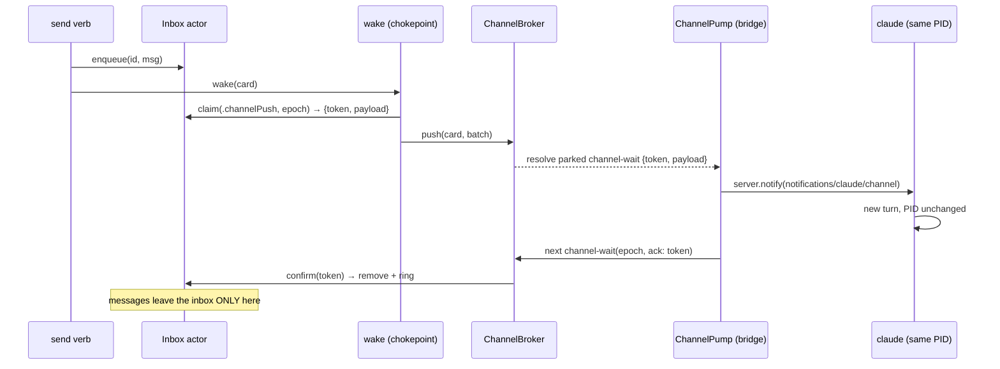
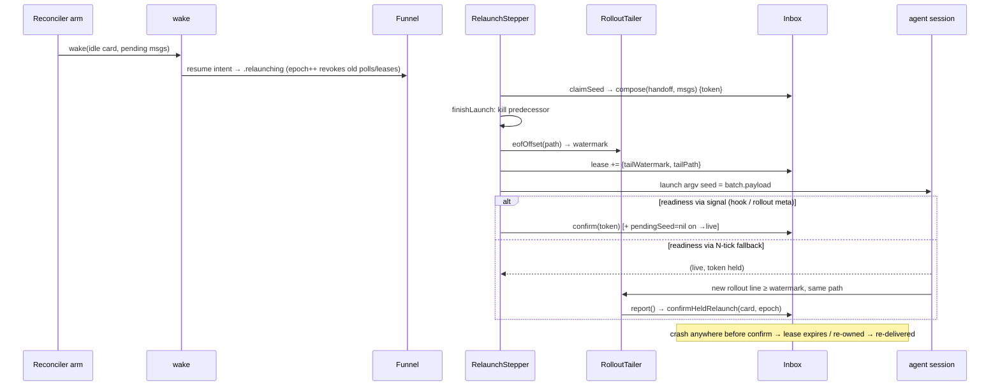

# Layer 3 — Implementation: No-restart live wake + reliable send delivery

> The **how**: mechanics, edge cases, and build order for the approved [[02-contract]]. Written
> with [[04-tests]] and [[05-pr-tree]], reviewed at one combined gate. Anchors verified on
> `main` @ `c4f80d7` (post-merge; symbols are the fallback if lines drift by execution time).

## Implementation approach (per L2 contract)

| L2 contract | How it is built | Where (anchors) |
|---|---|---|
| `DeliveryRoute`/`DeliveryLease` types | New OrchestraKit file beside `InboxMessage`; `DeliveryLease {token, route, epoch, leasedAt, tailWatermark?, tailPath?}` Codable; `InboxMessage` gains additive-optional `lease` | `OrchestraKit/InboxMessage.swift:9-24` |
| Inbox envelope migration | `Inbox.load()` decodes tolerantly: try `{messages, confirmedIds}` envelope, fall back to legacy bare `[InboxMessage]` → empty ring; `.bak` only on top-level-unparseable (lc `{rev,tasks}` precedent); `persist()` writes the envelope atomically as today | `Inbox.swift:17-27` (load), `:113-125` (persist) |
| `claim` (atomic select+fit+lease) | One Inbox-actor method: filter claimable (unleased ∪ `leasedAt` older than `leaseTimeout` ∪ `lease.epoch <` claiming epoch ∪ same-card `relaunchSeed` re-own), FIFO; run the route's `render` closure (whole-message fit); overwrite leases on the consumed prefix with a fresh token; persist; return `ClaimedBatch`. RelaunchSeed rule: non-nil whenever render's payload is non-empty (ids may be `[]`) | `Inbox.swift` new; fit precedents `StopDrain.swift:60-74` |
| `confirm`/`release`/`releaseAll`/`hasClaimable`/`confirmHeldRelaunch` | Token-scoped removals/lease-clears; `confirm` records ids into the bounded `confirmedIds` ring (~256, FIFO evict); stale token → no-op; `confirmHeldRelaunch(cardId, epoch)` = find `relaunchSeed` lease at epoch → confirm | `Inbox.swift` new |
| Seed render | New `HandoffSeed.compose(handoff:messages:budget:) -> (payload, consumed)` — final argv text (handoff part + inbox header + numbered messages), whole-message fit under one budget; `fold` retires with the last pre-drain caller | `HandoffSeed.swift:14-25`; header/render from `StopDrain.swift:25-53` |
| `stopHookActive` sibling field | `ReportHelper` reads `stop_hook_active` from the raw Stop stdin JSON and adds it to the `hook` RPC params (exactly how `epoch` rides today); `ControlServer` `"hook"` case forwards; `handleHook` gains the param | `ReportHelper.swift:35-61`, `ControlServer.swift:155-170`, `OrchestraService.swift:695-713` |
| `payloadForStop` | Replaces `drainForStop`: epoch fence (mismatch/nil → nil, no claim) → confirm prior `stopDrain` lease iff `stopHookActive` → `claim(.stopDrain, budget: StopDrain.maxPayloadChars)`; `injectCounts`/`maxConsecutiveInjects` byte-identical | `OrchestraService.swift:662-673` |
| Delivery arm | New branch in `reconcile()`'s per-card pass: `.live(.waiting(.humanTurn))` or revivable `.dead` → `hasClaimable` ∧ `!deliveriesInFlight` ∧ past backoff ∧ `deliveryStuckSince == nil` → detached `wake`; expiry-charge via per-card outstanding-token set; stuck flip re-validates guard on-actor pre-write | `OrchestraService+Reconcile.swift:95-163` (the phase switch), backoff shape `:200-208` |
| `wake` rewrite | Same entry; sync `deliveriesInFlight` insert; route ladder per the L2 pseudocode (CLI-wait defer → outstanding-lease return → channel claim/push/release → attach grace → resume intent); post-await re-guards; `resumeSeedWake` + `relaunchClaimed` deleted | `OrchestraService+Wake.swift:162-209`; `wakeIfPending` → `hasClaimable` `+Recovery.swift:416-420` |
| `resumeInCard` de-drain | Drop `inbox.drain` + fold — body becomes `resume(seed:)` (handoff context only); the L1 crash window ceases to exist | `+Recovery.swift:51-56` |
| Stepper seed claims | `deriveLaunchFlavor`/steppers call a new `ConvergeContext.claimSeed(card, epoch)` (actor callback → Inbox claim with `HandoffSeed.compose`); `.blank(landing:prompt:)` for provisional; on `.confirmed(via: .signal)` → `ctx.confirmDelivery(token)`; `.ticks` → hold; `.timedOut`/`.superseded` keep the lease | `PhaseStepper.swift:98-206`; `ConvergeContext` `:35-71`; `convergeContext()` `OrchestraService.swift:1173-1186` |
| Tail watermark | `finishLaunch` (relaunch flavor): after the predecessor kill inside `sessions.ensure`, before agent launch — `tailer.eofOffset(path:)` → stored on the lease (`tailWatermark`+`tailPath`) via an Inbox update in the same claim record | `OrchestraService+Converge.swift` (`finishLaunch`), `RolloutTailer.swift:16-35` |
| `TailedLine` provenance | `RolloutTailer.newLines` returns `[TailedLine {line, startOffset, path}]`; `pollTelemetry` threads provenance to `report()`'s fileTail path; `report()` calls `confirmHeldRelaunch` when `path == lease.tailPath && startOffset ≥ tailWatermark` (hook path: `observedEpoch == lease.epoch`) | `RolloutTailer.swift:16-35`, `OrchestraService.swift:339-369`, `+Report.swift:91-137` |
| `send` flip + required id | Catalog `kind: .convergence` (gate unchanged); params gain required `id` (CLI `--id`/mint, bridge + BoardStore stamp-if-absent — the PR6a spawn pattern); handler: dedup (pending ∪ ring) early-return → clear stuck + reset attempts → enqueue → `wake` → return `{messageId, card}` | `CommandCatalog.swift:92-95`, `CommandRegistry.swift:105-110`, `OrchestraService.swift:609-621` |
| Delivery-stuck surfacing | `Task.deliveryStuckSince: Date?` (5-point Codable template like `pendingSeed`); `AttentionReason.deliveryStuck` (📪, between `died` and `humanTurn`) + `reason(for:)` branch; `NotifyTrigger.deliveryStuck` + defaults + `AttentionTransition` + APNs body; iOS/mac render via NeedsYou row (no `DisplayState` change) | `Model.swift:406,501,547,605`; `NeedsYouQueue.swift:13-70`; `NotificationPrefs.swift:12-65`; `Push.swift:37-47,152-158` |
| Teardown duties | TeardownStepper gains `inbox.releaseAll(cardId)` + `broker.detachAll(cardId)` before the flip to complete | `PhaseStepper.swift:211-243` |
| Config knobs | `deliveryLeaseTimeout` 60 · `deliveryStuckAfter` 300 · `channelAttachGrace` 15 · `claudeChannels` true — additive-optional `Int`/Bool via the custom decoder (PR3a precedent) | `OrchestraKit/Config.swift` |
| Vendored SDK + `experimental` | Move the pinned `swift-sdk` checkout in-tree (`Vendor/swift-sdk`), flip `Package.swift` to a path dependency, add `public var experimental: [String: Value]? = nil` to `Server.Capabilities` (+ init param; synthesized Codable) | `Package.swift:73-77`; SDK `Server.swift:109-132` |
| `channel-wait` + `ChannelBroker` | ControlServer built-in beside `hook`: parse `{ref, epoch, ack?}`, confirm ack, park in a new `ChannelBroker` (in-memory actor: `(cardId, epoch, conn)`-keyed continuations, supersede, ~55s server timer, `revokeOlderEpochs` on funnel epoch bump via a service hook); universal per-connection close hook (set `onBroken` for every conn; `handleReaderEOF` → `broker.detach`) | `ControlServer.swift:14,63-76,105-126,279-318` |
| `.bridge` source + allowlist | `ActivitySource` gains `bridge`; dispatch accepts `channel-wait` from `.bridge` only, rejects built-ins from `.mcp` (defense-in-depth — the real guard is the bridge relay allowlist `params.name ∈ mcpExposed`) | `RPC.swift:4-17`, `ControlServer.swift:80-82`, `orchestra-mcp/main.swift:38-105` |
| `ChannelPump` | New task in orchestra-mcp `main.swift`: dedicated `ControlClient(callTimeout: 70, source: .bridge)`, loop `channel-wait(ref: ORCH_TASK_ID, epoch: ORCH_EPOCH, ack: lastToken)` → `server.notify(ClaudeChannelNotification(payload))` → set/clear `lastToken`; reconnect-with-backoff; runs only when env present | `orchestra-mcp/main.swift:9,21-25,108-110`; `ControlClient.swift:64` (constructor timeout) |
| Claude channels enablement | `channelsSupported` `--help` probe (copy `probeBypassHookTrust` incl. definitive-only caching); argv flag in `start`/`resume`; `~/.claude.json` writes for `bypassPermissionsModeAccepted` + `enableAllProjectMcpServers` (extend `ClaudeTrust.grant`); `capabilities` computed: `.controlChannel` iff `config.claudeChannels && channelsSupported` | `ClaudeCodeAdapter.swift:209-232,314-332`; probe model `CodexAdapter.swift:208-222`; `AgentCapabilities.swift:135-146` |
| Consent choreography | `Adapter.consentChoreography(ctx) -> [ConsentStep]` (default `[]`); `SessionManager.awaitPaneMatch` = bounded `capture` poll (~500ms cadence) then `sendChord`; run inside `finishLaunch` between ensure and readiness-await; timeout logged non-fatal | `Adapter.swift:31-64`; `SessionManager.swift:222-269` |
| E — clean-restart hardening | Claude bg-hold pin test (subagent-type fixture); cold idle-wake emits a dedicated activity line (`.info`, "idle wake → clean restart") in `wake`'s cold branch; docs notes for grace-park + app-server deferred seams | `ClaudeCodeAdapter.swift:79-87`; `ReportTests.swift:107-133`; docs |

## Key mechanics (the load-bearing "how")

- **One confirm helper on the service actor** — `confirmDelivery(token, cardId)`: checks
  `!card.archived` (else `release`), calls `inbox.confirm`, records ring, clears
  `deliveryStuckSince` if set, resets `deliveryAttempts`, removes the token from the per-card
  outstanding set. Every chokepoint (Stop confirm, channel ack, stepper readiness, held-relaunch
  handler) funnels through it — the archive guard and attempt-reset can't be forgotten at one site.
- **Claim epoch always comes from the card's current `sessionEpoch`** read on the service actor
  at dispatch (wake/payloadForStop/stepper) — the Inbox never guesses epochs.
- **The arm charges expiry exactly once:** `outstandingTokens[cardId]` is populated at dispatch
  (claim success); each tick the arm intersects it with the inbox's live leases — a token no
  longer live (expired/re-owned) and never confirmed → charge + remove. Confirm removes it first,
  so no double-charge.
- **Attach-grace bookkeeping:** `channelUnattachedSince[cardId]` stamps when a `.controlChannel`
  live card first fails the attach check (cleared on attach/park); the cold path requires
  `now - stamp > channelAttachGrace`.
- **Epoch-bump lease invalidation needs no new hook:** claims re-own stale-epoch leases lazily;
  the only *eager* action on bump is `broker.revokeOlderEpochs`, called from the funnel's
  epoch-bump branch (one line next to the existing bump).
- **`priorSessionIds`/restart interplay:** `restart` still sets `pendingSeed = nil` (no handoff
  on blank) — inbox messages are untouched and deliver via wake-on-live after the blank lands.
- **Consent steps run before readiness:** the dev-channels dialog appears pre-prompt, so
  `awaitPaneMatch` runs after `sessions.ensure` returns and before `awaitReadiness` arms; a card
  without channels has zero steps and zero added latency.
- **orchestra-mcp stays daemon-code-free:** the pump uses only OrchestraKit (`ControlClient`) —
  the `Package.swift` dependency set is unchanged.

## Edge cases & error handling

| Case | Handling |
|---|---|
| Lost `decision:block` reply | Lease expires (60s); card sits `.waiting(.humanTurn)`; arm re-drives via channel/cold — duplicate only if the reply actually landed *and* the session died pre-signal |
| Continuation runs > lease timeout | Card reads `.running` → arm gated out; the confirming Stop accepts an expired-but-token-matched lease (token survives until re-claim) |
| Continuation interrupted (ESC) mid-turn | No `stopHookActive` Stop arrives; lease expires; re-delivery (disclosed duplicate) |
| Bridge acks but `server.notify` failed | Pump re-polls without ack; token expires; charge + retry; stuck flip can't be suppressed (reset only on confirm) |
| Bridge process dies mid-park | Socket close → universal close hook → `broker.detach` → unattached; grace then cold |
| Daemon restarts with parked polls | Polls are gone (in-memory); pumps reconnect + re-poll; leases persist and expire; attach grace prevents a mass cold restart |
| Two same-card polls (pump restart race) | Newer poll supersedes; older resolves empty; single parked poll invariant |
| `claim` under `maxConsecutiveInjects` | Guard checked before the claim (as today) — messages stay durable, counter resets on a human prompt |
| Archived mid-wake | Post-await re-guard abandons; a late ack hits `confirmDelivery`'s archive check → release; teardown `releaseAll` covers the rest |
| Corrupt `inbox.json` | Top-level-unparseable only → `.bak` + empty (existing behavior); envelope/legacy/lease-less rows all decode tolerantly |
| Send to `.dead(.completed)` | Arm revives via resume intent (L2 decision: a send to a completed card is a work request) |
| Send while `.waiting(.permission)` | Enqueued; arm skips (mid-turn); delivered at the turn's Stop or after the permission resolves |
| Rollout file rotates between watermark and confirm | `tailPath` mismatch → no confirm; lease expires → duplicate-not-loss |
| Channels flag disappears in a future claude | Probe fails definitively → capability computes `.nativeReinvoke` → byte-identical old behavior |
| Dev-channels dialog copy changes | `awaitPaneMatch` times out non-fatally → launch proceeds; if the dialog actually blocked, readiness times out → `dead(.spawnFailed)` with pane evidence (existing startup-abort path) — flag content strings live in one const for cheap re-probing |

## Sequencing / build order

Nine PRs, correctness-first — full split in [[05-pr-tree]]:

1. **B1 inbox-claim-api** — types, envelope migration, claim/confirm/release/ring, compose. The
   API ships with its battery; no caller flips yet (old drain paths still compile + pass).
2. **B2 stop-drain-lease** — sibling field end-to-end + `payloadForStop` + confirm chokepoint.
   Flips the busy path to claim/confirm.
3. **B3 relaunch-seed-claims** — de-drain `resumeInCard`, stepper claims, watermark +
   `TailedLine`, held-relaunch confirm, `ReadinessResult.via`. Flips the cold path.
4. **B4 delivery-arm-wake** — `wake` rewrite (retire `resumeSeedWake`/`relaunchClaimed`), the arm,
   attempts/stuck state, knobs. The channel branch lands dark (no adapter declares the transport).
5. **B5 send-flip-surfacing** — catalog flip + required id + handler reshape; stuck badge +
   notification; editor force-release semantics.
6. **D1 channel-broker-pump** — vendored SDK + `experimental`; `channel-wait`/`ChannelBroker` +
   close hook + `.bridge` + relay allowlist; `ChannelPump` + notification. Transport complete,
   still dark.
7. **D2 claude-channels-on** — probe + argv + consent writes + choreography + computed
   `wakeTransport` flip + attach grace. Channels go live behind `claudeChannels`.
8. **E1 codex-clean-restart** — bg-hold pin test, idle-wake activity line, deferred-seam docs.
9. **F e2e-docs** — isolated-stack delivery smoke (both agents) + docs/ sweep.

Rationale for the two non-obvious orderings: the **arm lands after both confirm paths exist**
(B2/B3) so a level-triggered retry never re-drives a path that still pre-drains; the **channel
branch ships dark in B4** and lights up only when D2 flips the capability — each PR is
independently green and behavior-gated.

## Diagrams

### Bird's-eye (channel push — the flagship no-restart flow)

### Detailed (relaunch-seed with watermark — crash-proof cold delivery)

## Traceability → Layer 2 contracts

| L2 contract | Implemented by (PR) |
|-------------|---------------------|
| Inbox claim API + envelope + ring + compose | B1 |
| Route: stopDrain (sibling field, fence, confirm) | B2 |
| Route: relaunchSeed (de-drain, stepper claims, watermark, held confirm) | B3 |
| Delivery arm + attempts + stuck + wake chokepoint + knobs | B4 |
| `send` flip + required id + rev exception + surfacing + editor semantics | B5 |
| ChannelBroker/`channel-wait`/close hook/`.bridge`/allowlist/pump/SDK patch | D1 |
| Claude enablement (probe, argv, consent, computed transport, attach grace) | D2 |
| E — safety-gate pin + observability + deferred seams | E1 |
| Confirm helper (archive guard, resets) | B2 introduces, B3/B4/D1 reuse |
| Lease lifecycle disposition (teardown, epoch revoke) | B4 (teardown duties, funnel hook) |

## Decisions made

| Decision | Why | Rejected |
|----------|-----|----------|
| One `confirmDelivery` helper funnels every confirm | The archive guard + attempt-reset + ring-record are per-site bugs waiting to happen otherwise | Per-chokepoint inline logic |
| The arm lands after both confirm paths (B2/B3 before B4) | A level-triggered retry over a still-pre-draining path would multiply the very loss being fixed | Arm-first (would need throwaway compat shims) |
| Channel branch ships dark in B4, lit by D2's capability flip | Route selection is B-machinery; keeping the flip config+probe-gated makes every PR independently green and revertable | Landing wake's channel branch inside D |
| Vendor move = plain checkout copy + path dep (no submodule) | Deterministic, offline, patch-in-diff; the SDK is pinned anyway | git submodule (adds clone friction for zero benefit) |
| `ConsentStep` strings live in one adapter const | The dev-channels dialog copy is research-preview volatile; one place to re-probe | Scattered literals |
| Stuck badge renders from `Task.deliveryStuckSince` directly in NeedsYou | Avoids widening the `displayState(phase:connection:)` signature for one field | A `DisplayState.deliveryStuck` field (signature churn across 3 clients) |

## Concerns / decisions for review

- **Biggest churn:** B4 (wake rewrite + arm) touches the wake tests
  (`SendWakeTests`/`CodexWakeTests`) that assume `resumeSeedWake` semantics — they migrate to the
  route ladder in the same PR. Second: B1's inbox envelope (every inbox fixture).
- **Empirical probes inside PRs** (cheap, pre-wired by the L1 research): D1 re-runs the minimal
  swift-sdk channel probe against the vendored copy; D2 re-verifies the dev-channels dialog copy
  + `stop_hook_active` presence on current builds before flipping defaults.
- Deviations discovered during implementation fold back into this vault's Decisions tables.
