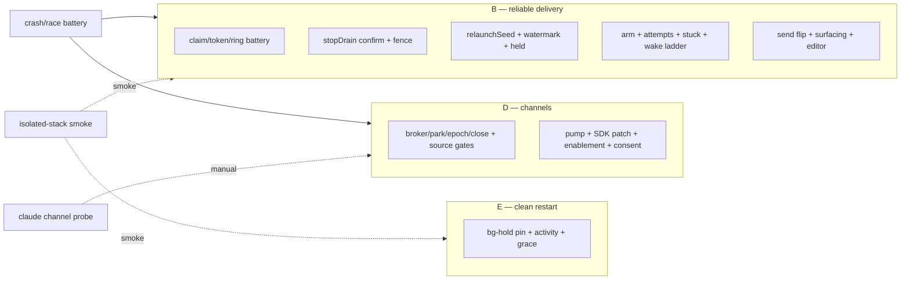

# Layer 3 — Test Design: No-restart live wake + reliable send delivery

> Written with [[03-implementation]], reviewed at the same gate. Deterministic stubs are the
> regression guard (lc doctrine); E2E is smoke. Every delivery-route test runs for **both agents**
> via the capability seam (`AgentCapabilities.stub` variants / `StubAdapter`).

## Test strategy & philosophy

- **The core guarantee under test is the confirm ledger:** for every route, a message leaves the
  durable inbox *only* through `confirmDelivery`, and every failure injection (lost reply, dead
  bridge, crash, epoch bump, archive race) ends in *re-delivery or durable retention — never
  silence*. Loss-shaped assertions ("message gone + never delivered") are the battery's spine.
- **Crash-equivalence:** leases and watermarks are persisted, so every crash test is a
  `TestEnv.remake(base:)` reload asserting the reconciler/arm converges from disk.
- **Tiered per the merged suite redesign:** unit tier (FakeProc/TestClock, mirror layout) is the
  regression guard; two contract pins for the real-socket seams; E2E stays smoke. Change-scoped
  runs per task, `--all` only at each PR's merge gate.
- **Both-agent matrix:** stop-drain and relaunch-seed tests parameterize over claude-like
  (hooksPush, `.controlChannel`/`.nativeReinvoke`) and codex-like (fileTail, `.relaunch`)
  capability stubs; channel-plumbing tests are transport-level (agent-free).
- **Deliberately not tested:** real MCP wire framing (SDK-owned); claude's channel *ingestion*
  (research preview — covered by the manual E2E probe, not CI); UI pixels.

## Framework / tooling (re-grounded on the merged tiered suite, 2026-07-14)

| Thing | Choice |
|---|---|
| Runner + cadence | `./scripts/test.sh` — **unit tier per task**; `--contract`/`--e2e` additively when touching git/tmux command generation or binaries; **`--all` (+ `scripts/lint-tests.sh`) once at each PR's merge gate**. Never mandate full-suite runs per task (project rule) |
| Tier placement | Every battery below is **UnitTests** (FakeProc + TestClock, private roots, no forks) in the **mirror position of its source file** (Inbox battery → `Tests/UnitTests/OrchestraCore/InboxTests.swift`; wake/arm → `.../Service/SendWakeTests.swift` etc.). **ContractTests** only where realness IS the assertion: the `channel-wait` round trip over a real UDS `ControlServer` (mirror of `ControlRoundTripTests`) + the `.bridge` source gate on the real dispatch. **E2ETests**: the isolated-stack smoke |
| Harness | `TestEnv.make()/remake()` (`Tests/UnitTests/Support/TestEnv.swift` — FakeProc + emulator by default, per-test private roots), `StubSessions`/`StubAdapter`/`StubWorktrees` (same dir), `seedPhase`, `setStepBackoff`, `reconcileToLive` |
| **Time discipline (lint-enforced)** | Every time-based assertion — lease expiry (60s), backoff, stuck age (300s), attach grace (15s), the ~55s poll hold — is a **`TestClock.advance`** against the injected clock/`now` seams, synchronized via `parked(_:deadlineAtLeast:)`, never a wall-clock wait; race windows use `Gate`/`SyncGate`, readiness polls use `pollUntil` (all in `Tests/TestSupport`) |
| New stub seams | `StubChannelBridge` (unit: drives the broker + a stub transport; contract: a raw `ControlClient(source: .bridge)` against the real server); pane-text scripting for `awaitPaneMatch` (`StubSessions.setPaneText`); rollout fixture files for `TailedLine`/watermark; probe tests via `FakeProc` argv-intent assertions (`channelsSupported` never forks in the unit tier) |
| Fixtures | Legacy bare-array `inbox.json`; envelope with leased/lease-less rows; rollout `.jsonl` with pre/post-watermark lines; pre-change hook params (no `stopHookActive`) |

## Unit tests (per L2 contract)

| L2 contract | Test cases |
|-------------|-----------|
| Claim atomicity + fit | `test_claimLeasesExactConsumedPrefix` (over-budget tail stays pending), `test_claimFifoWholeMessages`, `test_claimMintsFreshTokenOnReclaim` |
| Token scoping | `test_staleTokenConfirmNoops`, `test_staleTokenReleaseNoops`, `test_confirmIdempotent` |
| Claimable set | `test_expiredLeaseReclaimable`, `test_staleEpochLeaseReclaimableImmediately`, `test_relaunchSeedReownsOwnLease`, `test_freshLeaseNotClaimableByOtherRoute` |
| Handoff-only batch | `test_relaunchClaimNonNilOnHandoffOnly` (empty inbox + pendingSeed → batch, ids `[]`), `test_claimNilOnlyWhenNothingToSeed` |
| Envelope migration | `test_legacyInboxArrayMigrates` (bare array → messages + empty ring, no `.bak`), `test_leaselessRowsDecode`, `test_corruptInboxStillBaks` |
| Confirmed-ids ring | `test_sendRetryAfterDeliveryNoops` (ring dedup), `test_ringBounded` (evicts FIFO at cap), `test_dedupNoopSkipsStuckClearAndWake` |
| Editor semantics | `test_inboxRemoveForceReleasesLease`, `test_reorderPermutesFullSetIncludingLeased` |
| stopDrain confirm | `test_stopHookActiveConfirmsPriorLease` (token+epoch matched), `test_plainStopConfirmsNothing`, `test_humanTurnSignalsNeverConfirm`, `test_bgYieldContinuationStillConfirms` (parse-nil + sibling field) |
| stopDrain fence | `test_nilEpochStopClaimsNothing`, `test_staleEpochStopClaimsNothing`, `test_lostReplyLeaseExpiresAndArmRedrives` |
| stopDrain payload | `test_payloadForStopKeepsInjectCountSemantics`, `test_confirmingStopClaimsNextBatchSameCall` |
| Sibling field plumbing | `test_reportHelperExtractsStopHookActive` (both agents' raw payloads), `test_hookRpcCarriesStopHookActive` |
| relaunchSeed | `test_stepperClaimsSeedAtRender`, `test_retryReownsInflightBatch` (timeout → re-step → same messages), `test_signalReadinessConfirms`, `test_ticksReadinessHoldsToken` |
| Held confirm + watermark | `test_heldLeaseConfirmedByPostWatermarkLine`, `test_preWatermarkLineNeverConfirms`, `test_wrongRolloutPathNeverConfirms`, `test_daemonRestartReplayNeverConfirms` (remake + reread from offset 0), `test_hookEpochMatchConfirmsHeld` |
| De-drain | `test_resumeInCardNoLongerDrains` (crash between intent and launch loses nothing), `test_restartBlankPreservesInbox` (messages deliver after blank lands) |
| Provisional delivery | `test_provisionalBlankLaunchCarriesPrompt` (argv positional = payload; lands `.running`), `test_neverPromptedStrandKilled` (arm delivers without a human) |
| Delivery arm | `test_armRedrivesIdleLagNoop` (level trigger), `test_armSkipsPermissionWaiting`, `test_armSkipsRunning`, `test_armRevivesDeadResumable`, `test_deadUnresumableGoesStuck`, `test_armBackoffCapped` |
| Attempt accounting | `test_expiryChargedOncePerToken`, `test_confirmResetsAttempts`, `test_ackWithoutNotifyCannotSuppressStuck` |
| Stuck lifecycle | `test_stuckFlipStableStopsClaims`, `test_sendClearsStuckAndResetsBudget`, `test_stuckGuardRevalidatedOnActor` (send-reset vs stale flip), `test_stuckSurvivesRestartViaAge` (**remake**; persisted `createdAt` age + persisted `deliveryStuckSince` re-read from disk) |
| wake chokepoint | `test_deliveriesInFlightSingleWinner`, `test_activeCliWaitDefers` (nativeReinvoke), `test_outstandingLeaseBlocksColdFallback` (channel ack gap + held relaunch), `test_pushFalseReleasesThenColdSameCall`, `test_archiveRaceReleasesNotConfirms`, `test_relaunchClaimedRemoved` (symbol gone; behavior via single-winner test) |
| wakeIfPending | `test_liveEdgeGatesOnHasClaimable` (held lease → no re-wake) |
| Attach grace | `test_unattachedChannelCardDefersColdWithinGrace`, `test_graceExpiryFallsCold` (bridge-less delivers) — B4-runnable against the constant-false skeleton; `test_attachClearsGraceStamp` **lands with D1** (needs `park`) |
| ChannelBroker | `test_parkSupersedesOlderPoll`, `test_pushResolvesParked`, `test_ackConfirmsToken`, `test_socketCloseDetaches` (universal close hook), `test_epochBumpRevokesOlderPolls`, `test_oldEpochPollNeverMatchesPush`, `test_pollTimeoutRepolls` |
| Source gating | `test_channelWaitRejectedFromMcp`, `test_bridgeSourceAccepted`, `test_relayAllowlistRejectsBuiltins` (CallTool filter) |
| ChannelPump | `test_pumpLongTimeoutOutlivesHold` (stub transport, 55s hold vs 70s deadline), `test_pumpRepollsWithoutAckOnNotifyFailure`, `test_pumpReconnectsWithBackoff` |
| SDK patch | `test_capabilitiesEncodeExperimental` (omitted-when-nil; round-trips `["claude/channel": …]`) |
| Claude enablement | `test_channelsProbeCachesOnlySuccess`, `test_argvGainsFlagWhenOn`, `test_capabilityComputesNativeReinvokeWhenOff` (byte-identical argv/behavior), `test_consentConfigWritesNewKeys`, `test_registryInjectsChannelsEnabledFromConfig` (construction-time plumbing; restart-scoped) |
| Consent choreography | `test_awaitPaneMatchThenChord` (scripted pane text; content-match, never blind Enter), `test_consentTimeoutNonFatal`, `test_noStepsZeroLatency` |
| `send` verb | `test_sendKindConvergence` (VerbContractTests update), `test_sendRequiresId` + stamp-if-absent at CLI/bridge/BoardStore seams, `test_sendReturnsMessageIdAndCard`, `test_sendEmitsNoTaskEvent` (rev exception pinned) |
| Surfacing | `test_needsYouShowsDeliveryStuck` (urgency slot), `test_pushTriggerDeliveryStuck` (prefs default + transition + payload body), `test_stuckClearsBadge`, **tracker one-shot battery**: `test_stuckNotifiesOnceOnFlip`, `test_stuckRepeatUpsertsSuppressed`, `test_unstickClearsTrackerState`, `test_reflipNotifiesAgain` (the `AttentionTracker` per-card stuck state); plus `test_mergeStalledSurfacesInNeedsYou` + `test_pushTriggerMergeStalled` for card 5c0a1e's `TreeStat.mergeStalled: Bool` flag riding the same seam (predicate `treeStat?.mergeStalled == true`; assert stall outranks staleness in `reason(for:)`; skipped-with-note if that branch hasn't merged when B5b lands) |
| Teardown | `test_teardownReleasesAllLeasesAndDetaches`, `test_reopenDeliversRetainedMessages` |
| E — safety pin | `test_backgroundTasksHoldIsTypeAgnostic` (subagent-type fixture keeps `.running`), `test_idleWakeRestartEmitsActivity` |
| Config | `test_deliveryKnobDefaults`, `test_configForwardCompat` (old config decodes) |

## Crash / race battery (the guarantee's spine)

| Scenario | Tests |
|---|---|
| Crash between resume intent and launch | `test_seedSurvivesCrashBeforeLaunch` (remake; lease re-owned; messages delivered) |
| Crash between claim and push | `test_channelClaimCrashExpiresAndRedelivers` (**remake**; lease read back from `inbox.json`, expiry drives re-delivery on the fresh service) |
| Crash after confirm, before ring persist visibility | `test_confirmIsSingleAtomicWrite` (confirm+ring one persist; **remake** asserts the on-disk envelope carries both or neither) |
| Relaunch mid-continuation | `test_epochBumpMidContinuationRedeliversNotLoses` (stale confirm no-ops; seed re-owns) |
| Concurrent send + arm + Stop | `test_concurrentStartersSingleClaim` (one batch, no double-lease — mirrors `SpawnRaceTests` style) |
| Archive during in-flight wake | `test_archiveMidWakeRetainsMessages` (release-not-confirm; reopen delivers) |
| Daemon restart with every lease kind live | `test_remakeConvergesAllLeaseStates` (stopDrain expired / channel unacked / relaunch held × remake → all re-delivered or retained) |

## Integration / end-to-end (smoke, per doctrine)

- **Isolated-stack delivery smoke (F, both agents):** queued send to a busy card drains at
  turn-end and is *removed only after* the continuation's Stop; idle Codex send → clean restart
  delivers the seed and the terminal reattaches; kill the daemon mid-relaunch → message survives.
- **Claude channel manual probe (D2, not CI):** real claude ≥2.1.206 with channels — idle send
  delivers in-place, `tmux` PID unchanged, ack empties the inbox. Scripted but human-run
  (research-preview build dependency).

## Coverage map

## Traceability → the Layer-1 defects

| L1 defect / goal | Killed by |
|---|---|
| Drain-before-confirm data loss (all 3 windows) | claim/token battery + `test_lostReplyLeaseExpiresAndArmRedrives` + `test_seedSurvivesCrashBeforeLaunch` + `test_resumeInCardNoLongerDrains` |
| Provisional / never-prompted strand | `test_neverPromptedStrandKilled`, `test_provisionalBlankLaunchCarriesPrompt` |
| Codex idle-lag no-op | `test_armRedrivesIdleLagNoop` |
| Restart-for-wake (Claude) | ChannelBroker/pump battery + manual PID-stable probe |
| Restart discards folded messages | `test_restartBlankPreservesInbox` |
| Delivery-stuck visibility (human primary) | stuck lifecycle + surfacing tests |
| Background-work safety | `test_backgroundTasksHoldIsTypeAgnostic` + `test_armSkipsRunning` |
| Mass-restart on daemon/bridge bounce | attach-grace tests + `test_remakeConvergesAllLeaseStates` |

## Decisions made

| Decision | Why | Rejected |
|----------|-----|----------|
| Loss-shaped assertions as the spine | The failure being fixed is *silent* loss; "gone + never delivered" is the only honest oracle | Delivery-happened assertions alone (pass on lossy code) |
| `StubChannelBridge` over mocking the broker | Exercises the real `channel-wait` dispatch, source gate, and close hook | Broker unit tests only (misses the wire seam) |
| Claude channel E2E is manual, not CI | Requires a research-preview flag on a real claude build; CI flake risk | CI-gating on an external preview feature |
| Crash tests via `TestEnv.remake` | Leases/watermarks are persisted; reload-and-converge is the lc-proven crash oracle | In-process cancellation games |

## Open questions — need your call

- (none — batteries derive from the L2 contract rows; every route × failure × agent cell is
  enumerated above)
