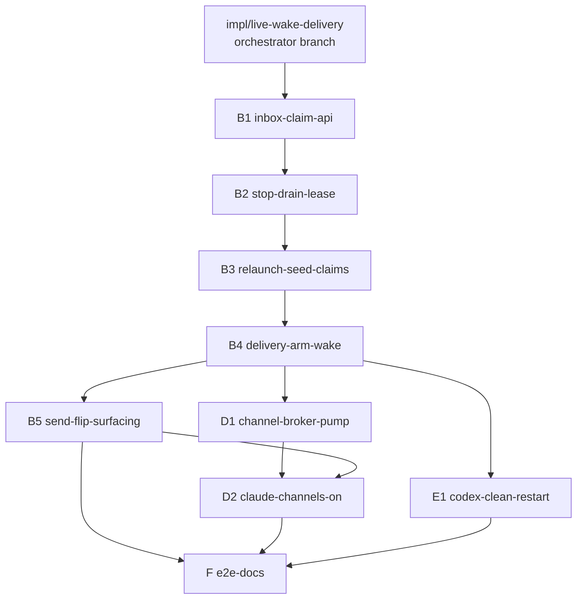

# Layer 3 — PR Tree: No-restart live wake + reliable send delivery

> The change split into independently-reviewable PRs, with the order they must be created in.
> Reviewed at the combined Layer-3 gate with [[03-implementation]] + [[04-tests]]. Mirrors the
> lifecycle-convergence tree's execution model.

## Execution model (Allen's standing workflow)

- An **orchestrator card** (Opus 4.8) on branch `impl/live-wake-delivery` fans out one child PR
  card per row below (`spawn --base <parent PR branch>` — branch-tree lineage).
- Each PR card plans with `superpowers:writing-plans` (grounded in this vault + its row), has the
  plan reviewed by **Opus 4.8 + GPT-5.6 Terra** until clean, implements via
  `superpowers:subagent-driven-development` (high effort), has the diff reviewed by both models
  until clean, then files a `merge-request` to the orchestrator.
- **`swift test` green at every PR**; both-agent coverage wherever the PR touches agent behavior
  (project rule: claude-code AND codex).
- After all PRs merge: the orchestrator runs a final whole-branch review (Opus + GPT until clean)
  and lands in the Review column for Allen.

## The PRs

| # | Branch | Base | Contents ([[03-implementation]] rows / [[04-tests]] batteries) | Independently green because |
|---|--------|------|----------------------------------------------------------------|------------------------------|
| B1 | `lwd/b1-inbox-claim-api` | `impl/live-wake-delivery` | `DeliveryRoute`/`DeliveryLease` types; inbox envelope migration + tolerant loader; `claim`/`confirm`/`release`/`releaseAll`/`hasClaimable`/`confirmHeldRelaunch`; confirmed-ids ring; `HandoffSeed.compose` | Pure additive API + its battery; no delivery path flips yet |
| B2 | `lwd/b2-stop-drain-lease` | B1 | `stopHookActive` sibling field end-to-end (ReportHelper → hook RPC → handleHook); `payloadForStop` replaces `drainForStop` (epoch fence, confirm-then-claim); the shared `confirmDelivery` helper | Busy path flips whole; loss-shaped battery ships with it |
| B3 | `lwd/b3-relaunch-seed-claims` | B2 | `resumeInCard` de-drain; stepper seed claims + `.blank(landing:prompt:)` provisional delivery; `TailedLine` + `eofOffset` + persisted watermark/path; `ReadinessResult.via`; held-relaunch confirm in `report()`; `ConvergeContext` callbacks | Cold path flips whole; crash battery (remake) ships with it |
| B4 | `lwd/b4-delivery-arm-wake` | B3 | `wake` route-ladder rewrite (retire `resumeSeedWake`/`relaunchClaimed`; post-await re-guards; outstanding-lease + attach-grace guards; channel branch **dark**); the delivery arm (attempts, expiry charge, stuck flip); `wakeIfPending → hasClaimable`; teardown lease duties; funnel `revokeOlderEpochs` hook; Config knobs | Arm lands only after both confirm paths exist; channel branch unreachable (no adapter declares the transport) |
| B5 | `lwd/b5-send-flip-surfacing` | B4 | `send` → `.convergence` + required message id (CLI/bridge/BoardStore stamping) + handler reshape (dedup-first, stuck-clear, `{messageId, card}`); `Task.deliveryStuckSince`; NeedsYou 📪 + `NotifyTrigger` + APNs; editor force-release | Wire + UI layer over B4's stable state; VerbContractTests updated in-PR |
| D1 | `lwd/d1-channel-broker-pump` | B4 | Vendor `swift-sdk` in-tree + `experimental` capability patch; `channel-wait` built-in + `ChannelBroker` (epoch-keyed park, supersede, revoke, universal close hook); `.bridge` source + CallTool relay allowlist; `ChannelPump` + `ClaudeChannelNotification` | Transport complete but dark (no adapter declares `.controlChannel`); ⇉ parallel with B5 |
| D2 | `lwd/d2-claude-channels-on` | D1 (+B5 merged) | `channelsSupported` probe + argv flag; consent config writes + `ConsentStep` choreography (`awaitPaneMatch`); computed `wakeTransport` flip; `channelAttachGrace` wiring; manual PID-stable E2E probe script | Everything behind `claudeChannels` + build probe — off ⇒ byte-identical |
| E1 | `lwd/e1-codex-clean-restart` | B4 | Claude bg-hold type-agnostic pin test; idle-wake activity line; grace-park + app-server deferred-seam docs notes | Test + observability + docs only; ⇉ parallel with B5/D1 |
| F | `lwd/f-e2e-docs` | merged tip | Isolated-stack delivery smoke (both agents: busy-drain confirm timing, codex idle clean-restart, daemon-kill mid-relaunch) + docs/ sweep | Exercises B+E end-to-end; smoke by doctrine |

## The tree (creation order top-down; ⇉ = parallelizable)

- **Merge order into the orchestrator branch:** B1 → B2 → B3 → B4 → {B5 ⇉ D1 ⇉ E1} → D2 → F.
  Children restack (branch-tree `synced`) when a parent merges.
- **Sizing:** 9 PRs. B4 is the big one (wake rewrite + arm + the `SendWakeTests`/`CodexWakeTests`
  migration) — irreducible because the route ladder and the arm share the in-flight/guard state.

## Why these split points (and not others)

| Call | Why |
|---|---|
| B1 is API-only | The claim battery reviews in isolation; three later PRs consume one reviewed primitive |
| B2 before B3 | `confirmDelivery` (archive guard, resets) is introduced on the simpler busy path, then reused |
| The arm (B4) strictly after B2+B3 | A level-triggered retry over a still-pre-draining path multiplies loss — ordering encodes the contract's own constraint |
| Channel branch dark in B4, transport in D1, flip in D2 | Each channel PR is revertable behind the capability/probe/config gates; D1 parallelizes with B5 |
| E1 is tiny and parallel | E is deliberately "reuse B, add nothing" (L1 decision) — tests + observability + docs |
| E2E last | The smoke exercises B/E paths that B4/D2 rewrite; landing earlier tests scaffolding |

## Traceability → [[03-implementation]] / [[04-tests]]

| PR | L3 mechanics | L4 batteries |
|---|---|---|
| B1 | Types, envelope, claim/confirm/ring, compose | claim/token/claimable/handoff-only/migration/ring/editor |
| B2 | Sibling field, `payloadForStop`, confirm helper | stopDrain confirm + fence + payload + plumbing |
| B3 | De-drain, stepper claims, watermark, held confirm | relaunchSeed + watermark + de-drain + provisional + crash (remake) |
| B4 | Wake ladder, arm, stuck, teardown duties, knobs | arm/attempts/stuck/wake/wakeIfPending/attach-grace/teardown + races |
| B5 | Send flip + id + surfacing + editor | send verb + surfacing + ring-dedup no-op |
| D1 | SDK patch, broker, `channel-wait`, `.bridge`, allowlist, pump | broker/source-gating/pump/SDK batteries |
| D2 | Probe, argv, consent, computed transport, grace wiring | enablement/consent/capability tests + manual probe |
| E1 | Pin test, activity line, docs seams | E-battery |
| F | — | isolated-stack smoke |

## Decisions made

| Decision | Why | Rejected |
|----------|-----|----------|
| Linear B-spine with a three-way parallel fan after B4 | The delivery state machine accretes in dependency order; B5/D1/E1 touch disjoint regions | Full parallel fan-out (conflict storms in `OrchestraService+Wake`/`Reconcile`) |
| 9 PRs at route/subsystem granularity | Each is independently green, revertable behind a gate, and single-battery reviewable | Per-task PRs (~25, review overhead) or B-as-one-mega-PR (~3× review surface) |
| D2 waits for B5 | D2's attach-grace + stuck interplay assumes the surfacing/state from B5; avoids a restack race on `OrchestraService` state | D2 straight after D1 (restack churn) |

## Open questions — need your call

- (none — the split derives from the contract's own ordering constraints)
