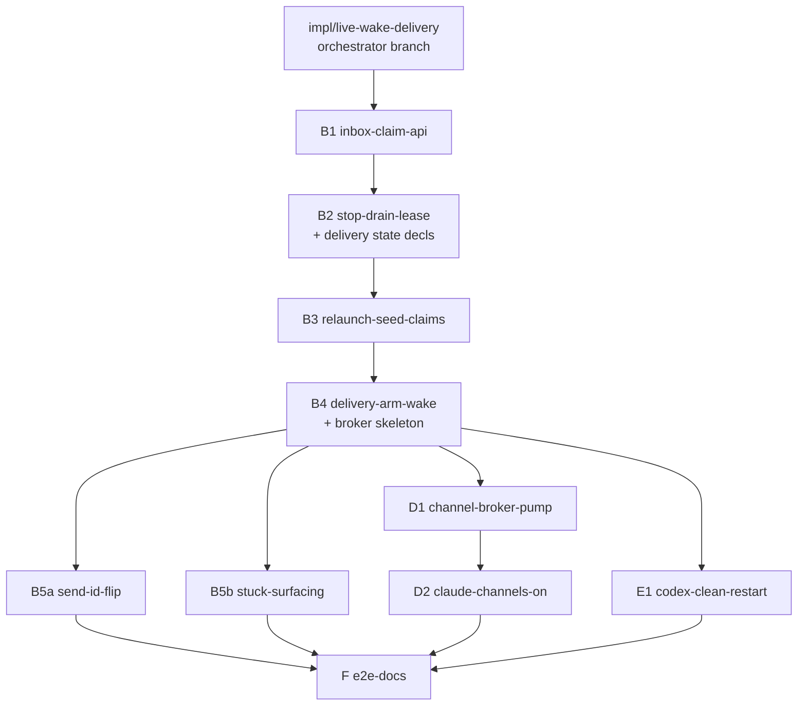

# Layer 3 — PR Tree: No-restart live wake + reliable send delivery

> The change split into independently-reviewable PRs, with the order they must be created in.
> Reviewed at the combined Layer-3 gate with [[03-implementation]] + [[04-tests]]. Mirrors the
> lifecycle-convergence tree's execution model. **Placement rule (gate finding): every symbol is
> declared in the PR of its first reference** — state/type skeletons ship early, behavior and
> surfacing ship where they belong; the orchestrator re-audits cross-PR symbol references before
> fan-out.

## Execution model (Allen's standing workflow)

- An **orchestrator card** (Opus 4.8) on branch `impl/live-wake-delivery` fans out one child PR
  card per row below (`spawn --base <parent PR branch>` — branch-tree lineage, ONE base each).
- Each PR card plans with `superpowers:writing-plans` (grounded in this vault + its row), has the
  plan reviewed by **Opus 4.8 + GPT-5.6 Terra** until clean, implements via
  `superpowers:subagent-driven-development` (high effort), has the diff reviewed by both models
  until clean, then files a `merge-request` to the orchestrator.
- **`swift test` green at every PR**; both-agent coverage wherever the PR touches agent behavior
  (project rule: claude-code AND codex).
- After all PRs merge: the orchestrator runs a final whole-branch review (Opus + GPT until clean)
  and lands in the Review column for Allen.

## The PRs

| # | Branch | Base | Contents ([[03-implementation]] rows / [[04-tests]] batteries) | Independently green because |
|---|--------|------|----------------------------------------------------------------|------------------------------|
| B1 | `lwd/b1-inbox-claim-api` | `impl/live-wake-delivery` | `DeliveryRoute`/`DeliveryLease` types; inbox envelope migration + tolerant loader; `claim`/`confirm`/`release`/`releaseAll`/`hasClaimable`/`confirmHeldRelaunch`; confirmed-ids ring; `HandoffSeed.compose`; **`deliveryLeaseTimeout` Config knob + its constructor injection at the `Inbox(…)` build site** (the claimable set reads it — first-reference rule) | Pure additive API + its battery; no delivery path flips yet |
| B2 | `lwd/b2-stop-drain-lease` | B1 | **All delivery-tracking state declarations** (`Task.deliveryStuckSince` persisted field — Codable only, no UI; `deliveryAttempts`; `outstandingTokens`; the full `confirmDelivery` helper incl. resets; `ConvergeContext.confirmDelivery` callback); `stopHookActive` sibling field end-to-end; `payloadForStop` replaces `drainForStop` (epoch fence, confirm-then-claim) | Busy path flips whole; state it touches is declared here (first-reference rule); nothing reads `deliveryStuckSince` yet |
| B3 | `lwd/b3-relaunch-seed-claims` | B2 | `resumeInCard` de-drain; stepper seed claims + `.blank(landing:prompt:)` provisional delivery; `TailedLine` + `eofOffset` + persisted watermark/path; `ReadinessResult.via`; held-relaunch confirm in `report()` | Cold path flips whole; confirms funnel through B2's helper; crash battery (remake) ships with it |
| B4 | `lwd/b4-delivery-arm-wake` | B3 | **`ChannelBroker` type + service property as a starved skeleton** (`isAttached`/`push`/`detach`/`detachAll`/`revokeOlderEpochs`; nothing ever parks, so `isAttached` is constant-false); `wake` route-ladder rewrite (retire `resumeSeedWake`/`relaunchClaimed`; post-await re-guards; outstanding-lease + attach-grace guards); the delivery arm (dispatch, expiry charge, stuck flip); `wakeIfPending → hasClaimable`; teardown lease duties; funnel `revokeOlderEpochs` hook; the three service-read Config knobs (`deliveryStuckAfter`/`channelAttachGrace`/`claudeChannels`); idle-wake activity line | Arm lands only after both confirm paths exist; the channel branch compiles against the in-PR skeleton and is unreachable (no adapter declares the transport, nothing parks) |
| B5a | `lwd/b5a-send-id-flip` | B4 | `send` → `.convergence` + required message id (CLI `--id` / bridge + BoardStore stamp-if-absent) + handler reshape (dedup-first via ring, stuck-clear + attempt-reset, `{messageId, card}` return); editor force-release semantics; `VerbContractTests` update | Wire layer over B4's stable state; ⇉ parallel with B5b/D1/E1 |
| B5b | `lwd/b5b-stuck-surfacing` | B4 | Delivery-stuck surfacing: `AttentionReason.deliveryStuck` (📪) + `reason(for:)`; `AttentionTracker` per-card stuck state (one-shot fire, clear on unstick/archive); `NotifyTrigger.deliveryStuck` + prefs defaults + APNs body; mac/iOS NeedsYou render | Reads B4-stable `deliveryStuckSince`; UI/notify only; ⇉ parallel |
| D1 | `lwd/d1-channel-broker-pump` | B4 | Vendor `swift-sdk` in-tree + `experimental` capability patch; **new `OrchestraMCPBridge` library target** (ChannelPump + `ClaudeChannelNotification`; `orchestra-mcp` becomes a thin main) + its test target; `channel-wait` built-in wiring the B4 broker (epoch-keyed park, supersede, revoke, ~55s timer); universal per-connection close hook; `.bridge` `ActivitySource` case (+ exhaustive-switch consumers: `SurfaceGrantResolver` denies, `ActivityPopover` color); CallTool relay allowlist | Transport complete but dark (no adapter declares `.controlChannel`); broker type already exists (B4); ⇉ parallel |
| D2 | `lwd/d2-claude-channels-on` | D1 | `channelsSupported` probe + argv flag; adapter constructed with `channelsEnabled` (registry built from config — restart-scoped, like all config); consent config writes + `ConsentStep` choreography (`awaitPaneMatch`); computed `wakeTransport` flip; `channelAttachGrace` wiring; manual PID-stable E2E probe script | Everything behind `claudeChannels` + build probe — off ⇒ byte-identical |
| E1 | `lwd/e1-codex-clean-restart` | B4 | Claude bg-hold type-agnostic pin test (subagent-type fixture); grace-park + app-server deferred-seam docs notes | Test + docs only; ⇉ parallel |
| F | `lwd/f-e2e-docs` | merged tip | Isolated-stack delivery smoke (both agents: busy-drain confirm timing, codex idle clean-restart, daemon-kill mid-relaunch) + docs/ sweep | Exercises B+E end-to-end; smoke by doctrine |

## The tree (creation order top-down; ⇉ = parallelizable)

- **Merge order into the orchestrator branch:** B1 → B2 → B3 → B4 → {B5a ⇉ B5b ⇉ D1 ⇉ E1} →
  D2 → F. Children restack (branch-tree `synced`) when a parent merges; every PR has exactly one
  base parent.
- **Sizing:** 10 PRs. **B4 is the big one** (wake rewrite + arm + the
  `SendWakeTests`/`CodexWakeTests` migration to the route ladder) — irreducible because the
  ladder and the arm share the in-flight/guard state. B5a+B5b together span daemon + kit + CLI +
  bridge + two client UIs — that breadth is why they are two PRs, not one.

## Why these split points (and not others)

| Call | Why |
|---|---|
| B1 is API-only | The claim battery reviews in isolation; three later PRs consume one reviewed primitive |
| Delivery state declared in B2, not B4/B5 | `confirmDelivery` (B2) resets attempts / clears stuck / prunes tokens — first-reference rule; a later declaration is a compile error (gate CRITICAL) |
| B2 before B3 | `confirmDelivery` (archive guard, resets) is introduced on the simpler busy path, then reused |
| The arm (B4) strictly after B2+B3 | A level-triggered retry over a still-pre-draining path multiplies loss — ordering encodes the contract's own constraint |
| `ChannelBroker` skeleton in B4, wiring in D1, flip in D2 | B4's wake ladder and teardown duties call broker methods — the type must exist where referenced (gate CRITICAL); "dark" = unreachable, not undeclared |
| B5 split (wire vs surfacing) | Disjoint regions (verb/CLI/bridge vs UI/notify); each reviews small; both parallel after B4 |
| Pump in a library target | An executable target can't be imported by tests; `OrchestraMCPBridge` makes the pump/notification unit-testable (gate MAJOR) |
| D2 bases on D1 alone | Its real deps (grace/stuck state) are B4's, already under D1; the earlier B5 co-dependency was unsubstantiated |
| E1 is tiny and parallel | E is deliberately "reuse B, add nothing" (L1 decision) — tests + docs; the activity line ships with B4's wake ladder |
| E2E last | The smoke exercises B/E paths that B4/D2 rewrite; landing earlier tests scaffolding |

## Traceability → [[03-implementation]] / [[04-tests]]

| PR | L3 mechanics | L4 batteries |
|---|---|---|
| B1 | Types, envelope, claim/confirm/ring, compose | claim/token/claimable/handoff-only/migration/ring/editor |
| B2 | State decls + confirm helper; sibling field; `payloadForStop` | stopDrain confirm + fence + payload + plumbing |
| B3 | De-drain, stepper claims, watermark, held confirm | relaunchSeed + watermark + de-drain + provisional + crash (remake) |
| B4 | Broker skeleton; wake ladder; arm; stuck flip; teardown duties; service knobs; activity line | arm/attempts/stuck-flip/wake/wakeIfPending/attach-grace (minus `test_attachClearsGraceStamp` → D1)/teardown + races + `test_idleWakeRestartEmitsActivity` |
| B5a | Send flip + id + editor semantics | send-verb battery + ring-dedup no-op |
| B5b | Surfacing + tracker one-shot | surfacing battery (first flip / suppression / clear / re-flip) |
| D1 | SDK patch, bridge target, `channel-wait` wiring, close hook, `.bridge` + consumers, allowlist | broker/source-gating/pump/SDK batteries |
| D2 | Probe, injected config, argv, consent, computed transport, grace wiring | enablement/consent/capability tests + manual probe |
| E1 | Pin test, docs seams | E-battery (minus the B4-owned activity test) |
| F | — | isolated-stack smoke |

## Decisions made

| Decision | Why | Rejected |
|----------|-----|----------|
| Linear B-spine with a four-way parallel fan after B4 | The delivery state machine accretes in dependency order; the fan PRs touch disjoint regions | Full parallel fan-out (conflict storms in `OrchestraService+Wake`/`Reconcile`) |
| 10 PRs at route/subsystem granularity | Each independently compilable + green (first-reference rule), revertable behind a gate, single-battery reviewable | Per-task PRs (~25) or B-as-one-mega-PR (~3× review surface) |
| Symbol-placement audit before fan-out | Both gate reviewers found first-use-before-declaration splits; the orchestrator re-checks every cross-PR reference against this table | Trusting the prose split |
| D2 waits only for D1 | Single-base lineage; B5 co-dependency was disproven at the gate | The earlier dual-parent D2 (inexpressible in `spawn --base`) |

## Open questions — need your call

- (none — the split derives from the contract's ordering constraints + the gate's placement rule)
