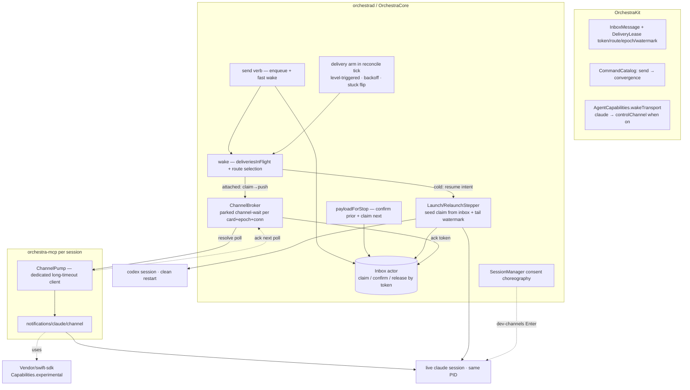

# live-wake-delivery — Design Index

Replace **restart-based wake** (kill + `--resume` / `codex resume`) with **in-place delivery** and
make send delivery **reliable at-least-once**: the durable inbox stays the source of truth until a
route-specific receipt proof confirms delivery (atomic token claims), a level-triggered delivery
arm in the merged reconciler re-drives stuck deliveries, Claude wakes idle via MCP **channels**
(PID-stable), and Codex's idle-cold wake is a **clean restart** riding the same guarantee.
Builds on the merged lifecycle-convergence foundation (`f52e640`).

**Sources of truth this vault deepens:** [[01-design]] (the empirically-grounded research + design,
Claude 2.1.206 / Codex 0.144.1). Gate mode: **agentic** (Opus 4.8 + GPT-5.6 Terra loop until no
complaints; human review of the whole plan at the end — Allen's standing instruction).

## Layers

| Layer | Document | Status |
|-------|----------|--------|
| 1 — Initial design | [[01-design]] | approved (research phase; re-baselined on post-merge `main`, 2026-07-10) |
| 2 — Contract | [[02-contract]] | approved (agentic gate: Opus 4.8 + GPT-5.6 Terra clean after 6/8 rounds, 2026-07-10) |
| 3 — Implementation | [[03-implementation]] | not started |
| 3 — Tests | [[04-tests]] | not started |
| 3 — PR tree (execution order) | [[05-pr-tree]] | not started |

<!-- Status values: not started · draft · in-review · approved · skipped -->

## Scope (remaining work — A and C already merged)

- **B — reliable at-least-once delivery** (the backbone): atomic inbox claims + token-scoped
  confirms, delivery reconciler arm, `send` → `.convergence`, delivery-stuck surfacing.
- **D — Claude no-restart wake via channels**: vendored-SDK `experimental` capability,
  `channel-wait` long-poll broker, `ChannelPump` in orchestra-mcp, consent choreography.
- **E — Codex clean-restart wake**: reuses B's `relaunchSeed` route + merged terminal reconnect;
  grace-park and App-Server `turn/start` stay documented seams only.

## Current picture (Layer 2 — modules; the L1 route reframe lives in [[01-design]])

## Open questions (rolled up — for Allen at the final gate)

- **Channels default-on?** L2 recommends `claudeChannels` default **true** (build-probe +
  attach-probe + cold fallback contain the research-preview risk); flip to opt-in for a soak
  period if preferred.
- **L1 non-goal amendment ack:** stop-drain *removal timing* now changes (payload format/caps
  byte-identical) — folded into L1's non-goals; flag if the stronger reading was intended.
