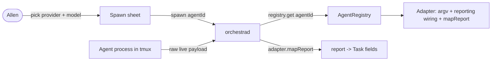
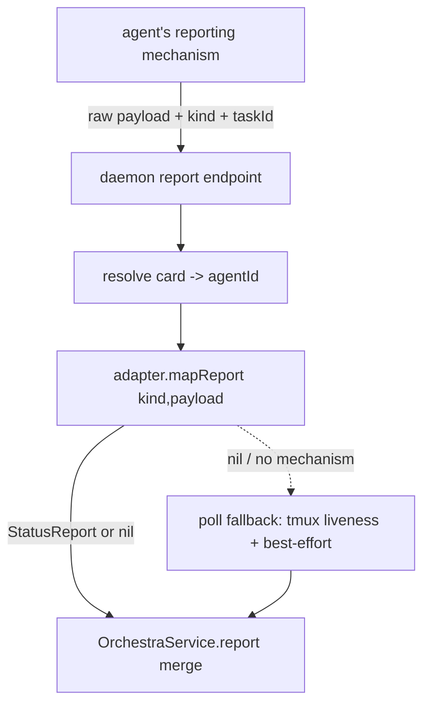

# Layer 1 — Initial Design: Multiple Model Providers

> The **what**: a second (third, …) agent provider should slot into the existing `Adapter` seam without
> rewriting the daemon, the report channel, or the UI.

## Purpose & problem

Orchestra already has the right shape for this: an `Adapter` protocol, an `AgentRegistry`, a
provider-agnostic `AgentModel` (with a `family` bucket), `SpawnInput.agentId`, and
`Config.defaultAgentId`. The card even persists `agentId`. **But three things are still Claude-shaped:**

| Claude-shaped today | Where |
|---------------------|-------|
| Live-state report mapping | `ReportHelper.map(kind:payload:)` parses Claude hook JSON shapes |
| Live-state launch wiring | `claude-hooks.json` + `--settings` + `HooksRenderer` are Claude's mechanism |
| The terminal status bar | `statusLineMode` reproduces Claude's statusLine |

Transcript/session identity is already correctly behind the adapter (`ClaudeCodeAdapter.sessionInfo` /
`discover` / the `~/.claude/projects` path scheme). So the remaining work is to push the **report path**
and **launch-reporting wiring** behind the adapter too, and to let the registry hold more than one
enabled adapter.

## Goals / non-goals

**Goals**
- Adding a provider = **implement `Adapter` + register it**; no edits to the daemon, `_report`, or views.
- The **report ingestion path is provider-agnostic**: a provider declares how its agent reports live
  state and how to map that to `StatusReport` (or declares it can't push, falling back to the poll).
- **Session-id is two-mode:** *seed-then-track* (Claude `--session-id`) **or** *discover-then-track*
  (Codex has no seedable id — the id is learned post-launch from the first report / newest rollout file).
  The daemon must tolerate a **nil `agentSessionId` until the first report**.
- **Derived live fields:** a provider that doesn't push a ready value (Codex has no context-% field) can
  have its adapter **compute** it (tokens ÷ model context window) inside `mapReport`.
- The **registry holds multiple enabled adapters**; the Spawn sheet lets you pick the provider, then its
  models (already `family`-accented).
- A provider that pushes **no** live state still works (poll fallback: tmux liveness + best-effort) — and
  the poll is **load-bearing** for providers (like Codex) with no clean session-end event.

**Non-goals (this axis)**
- Shipping a *specific* second provider — this designs the seam, not a concrete OpenAI/Gemini adapter.
- ACP / rich structured agent UI.
- Full per-provider **auth/credential management** UI (note the seam; defer the UI).
- Changing the tmux/worktree substrate (a provider still runs as a tmux window command).

## Scope

**In scope:** generalizing `Adapter` (report mapping + reporting launch wiring), making `_report`/daemon
provider-agnostic, registry support for multiple/registered + enable-able adapters, the Spawn-sheet
provider picker.

**Out of scope:** a concrete new adapter, auth UI, ACP, substrate changes, the status-bar generalization
(kept Claude-specific for now — see open questions).

## Inputs & outputs

| Direction | Description | Type / shape | Notes |
|-----------|-------------|--------------|-------|
| Input | Provider selection at spawn | `agentId` (already in `SpawnInput`) | picker lists enabled adapters |
| Input | Live-state events from an agent | raw provider payload + `kind` + taskId | mapped via the card's adapter |
| Input | Enabled providers | `Config` (enable/disable, user-registered) | daemon-owned |
| Output | Launch argv + reporting wiring | `[String]` + adapter-declared env/settings | per provider |
| Output | Models for the sheet | `[AgentModel]` per adapter | `family` drives accent |

## Expected behaviour

- **Spawn:** if >1 provider is enabled, the sheet shows a provider picker; its `models()` populate the
  model picker. With one provider (today) the picker can stay hidden.
- **Live state:** the agent's reporting mechanism pushes a raw payload tagged with the card; the daemon
  resolves the card's `agentId` → adapter → `mapReport` → a `StatusReport`, merged exactly as today.
- **Claude unchanged:** `ClaudeCodeAdapter` keeps its hooks/`--settings`/statusLine behaviour; the
  generalization is a refactor that leaves Claude's behaviour identical (regression-tested).
- **Non-reporting provider:** no mapping registered → the poll fallback supplies `running` + best-effort
  `desc`/`ctxPct`; the gauge hides rather than fabricating.

## Reference provider: Codex CLI (grounds the seam)

Investigated 2026-06-26 against the official Codex docs (developers.openai.com/codex) + openai/codex. The
abstraction is shaped so this concrete second provider fits — not just a hypothetical one. Per-method map:

| Adapter method | Claude Code | Codex CLI | Fit |
|----------------|-------------|-----------|-----|
| `newSessionId()` | mint UUID → `--session-id` | **no seedable id** → return `nil`, discover post-launch | seam already allows `nil` |
| `start(ctx)` | `claude … "<prompt>"` | `codex "<prompt>"` (or `codex exec`) | direct |
| `resume(ctx)` | `claude --resume <id>` | `codex resume <id>` / `codex exec resume <id>` (inert) | direct |
| `startInFlags` (plan/impl) | `--permission-mode auto` (plan) | `--sandbox read-only` (plan) / `workspace-write` (impl) | adapter-specific (already is) |
| **`access` (read-only card)** | 3-layer barrier (`--disallowedTools` + strict sandbox `denyWrite` + auto-mode `hard_deny` policy) | `--sandbox read-only` (native) | adapter-specific — see "read-only" note below |
| **`trustCwd` (scratch pre-trust)** | `ClaudeTrust.grant(cwd)` in `prepareToLaunch` | `~/.codex/config.toml` `trust_level="trusted"` | adapter-specific (already is) |
| reporting wiring | `--settings <hooks file>` + env | `-c hooks=…` / project `.codex/hooks.json` + `notify`; **requires trust** | generalize to {argv, env, files} |
| `mapReport` desc | Pre/PostToolUse hooks | Pre/PostToolUse hooks (`tool_name`/`tool_input`) | direct (coverage caveat) |
| `mapReport` status | Notification/Stop/UserPromptSubmit | UserPromptSubmit/Stop/PermissionRequest hooks; `notify` turn-complete | direct |
| `mapReport` ctxPct | statusLine `used_percentage` | **none** → compute tokens ÷ model window (from `--json`/rollout) | derived (new) |
| `sessionInfo` transcript | `~/.claude/projects/<slug>/<id>.jsonl` | `~/.codex/sessions/YYYY/MM/DD/rollout-*-<uuid>.jsonl` | adapter-specific (already is) |
| session-end | SessionEnd hook | **none** → tmux/PID exit via the poll | poll fallback |
| terminal status bar | `statusLine` command | **none** (TUI-internal) | Claude-only; N/A for Codex |
| `prepareToLaunch` trust | `~/.claude.json hasTrustDialogAccepted` | `~/.codex/config.toml [projects] trust_level` | adapter-specific (already is) |
| steer | tmux `send-keys` | tmux `send-keys`, **or** `codex mcp-server` `turn/steer` | default tmux; MCP is an option (axis 3) |

**Three things Codex forces on the abstraction** (a Claude-only design would have missed all three):
1. **Id is optional** — `newSessionId() -> nil` is a first-class path; `agentSessionId` is nil until the
   first report. (The seam allows it; the daemon flow must be verified to tolerate it.)
2. **ctxPct is adapter-derived** — `mapReport` may *compute* a field; `AgentModel` needs a context-window
   capacity so Codex can turn token counts into a percentage. The gauge hides if even that's unavailable.
3. **Reporting wiring ≠ one file** — it's {extra argv, env, worktree-local files} plus **trust as a
   prerequisite** (Codex won't run project hooks in an untrusted dir), so `prepareToLaunch` must run first.

**Reconciliation — `AdapterContext` grew on `main` (2026-06-29).** When this was written `AdapterContext`
carried `cwd/repo/model/startIn/sessionId/prompt/name/hooksPath` and nothing else. It now has **10 fields**
(`Adapter.swift:4–23`), adding two that every provider must translate:

- **`access: CardAccess` (read-only).** Read-only is no longer a two-part flag — Claude expresses it as a
  **three-layer barrier** (`ReadOnlyLaunch.swift`): (1) `--disallowedTools Edit Write MultiEdit NotebookEdit`;
  (2) a **strict** OS sandbox (`filesystem.denyWrite:[cwd,gitDir]`, `allowUnsandboxedCommands:false`,
  `failIfUnavailable:true` — so `dangerouslyDisableSandbox` is a no-op); (3) an **auto-mode `hard_deny`
  classifier policy** that semantically denies mutations (covering `excludedCommands` like `git` that run
  unsandboxed). **Layer 3 is Claude-Code-specific** — a `CodexAdapter` expresses read-only natively via
  `--sandbox read-only`, with no classifier-policy equivalent. So "how a provider expresses read-only" is
  itself an adapter concern the seam must carry, distinct from the `startIn` plan/impl axis.
- **`trustCwd: Bool` (scratch pre-trust).** When Orchestra owns the cwd (a scratch dir it created),
  `prepareToLaunch` pre-trusts it outright (`ClaudeTrust.grant`) rather than mirroring repo trust. A
  `CodexAdapter`'s trust step (`config.toml trust_level`) needs the same outright-vs-mirror branch.

**Keystone carried through this seam — `additionalContext` (axis 3, still UNBUILT).** The single planned
field `AdapterContext.additionalContext: String?` must be threaded through **every** adapter's `start` and
`resume`, since handoff / fork / fan-out all reduce to "start or restart an agent with an authored context
seed" ([[context-passing-topologies]]). Delivery is **per-adapter**: Claude injects it as `SessionStart`
`additionalContext`; Codex has no equivalent, so its adapter delivers the seed as an initial prompt or a
`--context` file. This axis must reserve that carry-through even though the field doesn't exist in code yet.

## Complexity & risks

| Risk | Note |
|------|------|
| De-Claude-ifying `_report` | Today `_report` knows Claude's event shapes; moving mapping behind the adapter (ideally server-side) must not regress Claude's live fields. |
| Reporting-wiring abstraction | Not "one settings file": Codex needs config overrides + a worktree-local hooks file + trust. Generalize to {argv, env, files} without forcing every provider to fake a hooks file. |
| Nil id until first report | Codex has no seedable id; spawn must persist a card with `agentSessionId == nil` and let the first report fill it. Verify recovery/`sessions`/resume all tolerate the nil window. |
| Derived ctxPct | Codex has no context-% field; `mapReport` computes it from tokens ÷ model window → `AgentModel` needs a context-window capacity, and the gauge hides when even that's missing. |
| Attribution | The `ORCHESTRA_TASK_ID`/`cwd` attribution chain is Claude-env-specific; a new provider needs its own equivalent (Codex: env into hooks + rollout `cwd`/`thread-id`). |
| Hook trust gate | Codex won't run project hooks in an untrusted worktree, so `prepareToLaunch` (trust mirror) is a *reporting prerequisite*, ordered before launch. |
| Status bar | `statusLineMode` is intrinsically Claude's statusLine; Codex has none (TUI) — stays Claude-only. |

Rough sizing: **medium** — a careful refactor of an already-good seam, with three subtle pieces the Codex
study surfaced (nil-id window, derived ctxPct, generalized wiring). Risk is regressing Claude's live
fields, so it's test-guarded; building the actual Codex adapter is a follow-on, not this axis.

## Diagrams

### Bird's-eye (context)

### Detailed (report path, generalized)

## Decisions made

| Decision | Why | Rejected |
|----------|-----|----------|
| Keep the `Adapter` seam; generalize report + wiring onto it | Most of the abstraction already exists | A parallel non-adapter provider path |
| Map provider payloads via the **adapter**, not hardcoded in `_report` | Removes the last Claude assumption from the shared channel | Per-provider `_report` forks |
| Session/transcript identity stays in the adapter | Already correct (`sessionInfo`/`discover`) | Move it to the core |
| Validate the design against **Codex** as the reference 2nd provider | Grounds the seam in a real agent, not a hypothetical | Design against Claude alone (would miss nil-id / derived-ctx / wiring) |
| Id assignment is **optional**; tracking via report is mandatory | Codex can't seed an id | Require seedable id (excludes Codex) |
| `mapReport` may **derive** fields; `AgentModel` gains a context-window | Codex has no context-% to pass through | Pass-through only (no Codex gauge) |
| Don't ship a concrete 2nd provider here | This axis is the seam, not a provider | Build the Codex adapter now (scope creep) |

## Open questions — need your call

- [ ] **Where does mapping run?** Server-side (daemon resolves adapter from the card's `agentId` and maps
  the raw payload) vs in `_report` (looks up the adapter itself). (Recommend: server-side — it de-Claudes
  `_report` to a dumb forwarder and centralizes provider logic in the daemon where the registry lives.)
- [ ] **Auth/availability:** scope a minimal "is this provider/model usable" signal now, or defer entirely?
- [ ] **Status bar:** leave `statusLineMode` as a Claude-adapter concern (recommended), or design a generic
  provider terminal-bar abstraction now?
