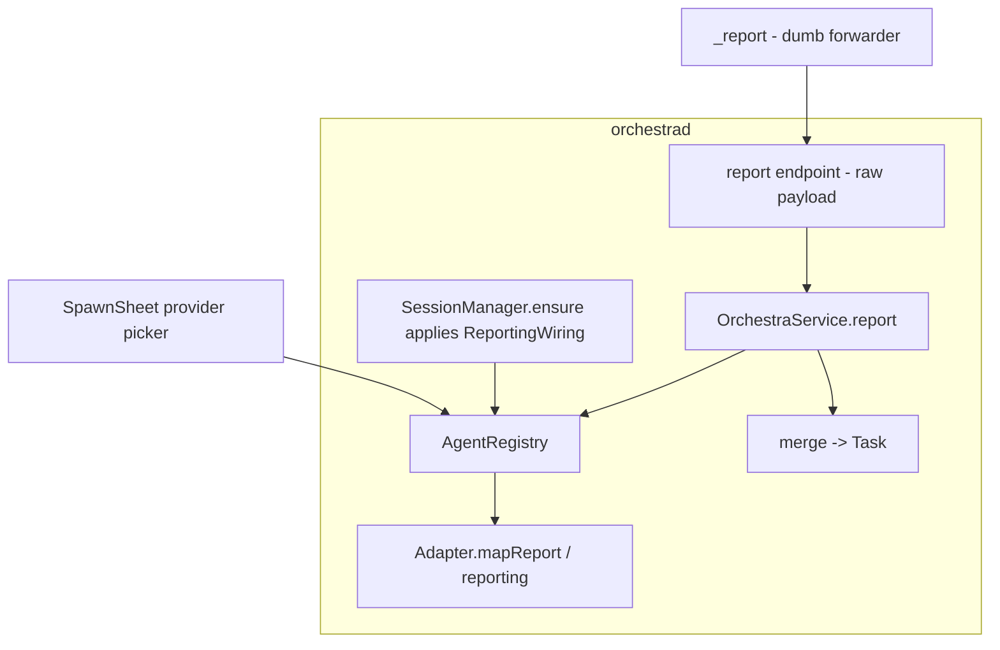
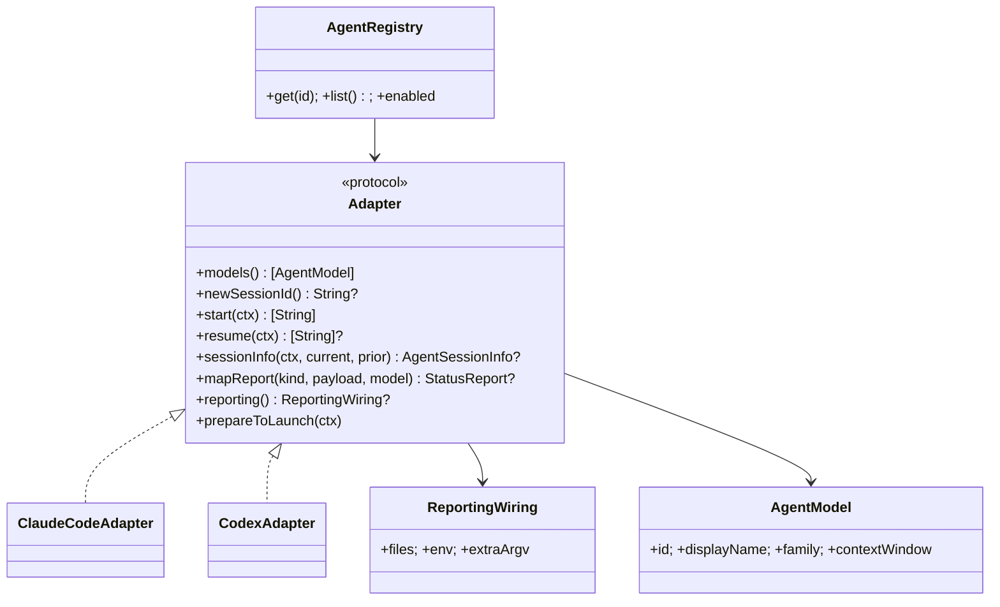

# Layer 2 — Contractual Design: Multiple Model Providers

> The **interfaces**: what to add to `Adapter`, how `report` resolves a provider, and registry changes.

## Architecture overview

Three additions to the existing `Adapter` protocol carry all the provider-specific behaviour that's
currently hardwired: **(1)** `mapReport` turns a raw provider event payload into a `StatusReport`;
**(2)** a `reporting` descriptor declares the launch-time wiring a provider needs to push live state
(Claude: a managed `--settings` hooks file + env; others: their own, or none); **(3)** session/transcript
identity already lives behind `sessionInfo`. The daemon's `report` endpoint becomes provider-agnostic: the
`_report` helper forwards a raw `{taskId, kind, payload}`, and `OrchestraService.report` resolves the
card's `agentId` → adapter → `mapReport` before merging. `AgentRegistry` gains enable/disable + user
registration. The UI gains a provider picker driven by `registry.list()`.

## Major classes / modules

| Name | Responsibility | Collaborators |
|------|----------------|---------------|
| `Adapter` (extend) | + `mapReport(kind:payload:model:)`, + `reporting` wiring; clarify `newSessionId()->nil` path | `OrchestraService`, `SessionManager` |
| `AgentModel` (extend) | + `contextWindow: Int?` (token capacity) so adapters can derive `ctxPct` | `mapReport` |
| `ClaudeCodeAdapter` (refactor) | Move its `_report` mapping + hooks-file wiring behind the new methods | `HooksRenderer` |
| `CodexAdapter` (future, sketched) | Reference 2nd provider: discover id, derive ctxPct, `.codex/hooks.json` wiring | (built in a follow-on) |
| `OrchestraService.report` (change) | Accept a raw payload; resolve adapter; call `mapReport`; merge | `AgentRegistry` |
| `_report` CLI (simplify) | Forward `{taskId, kind, raw payload}`; (Claude statusLine display stays) | `ControlClient` |
| `AgentRegistry` (extend) | Multiple adapters; enable/disable; user-registered | `Config` |
| `SpawnSheet` (change) | Provider picker when >1 enabled; then that adapter's `models()` | `BoardModel` |

## Function / method contracts

### `Adapter.mapReport(kind: String, payload: JSONValue, model: AgentModel) -> StatusReport?`
- **Does:** translate one of the provider's live-state events into the shared `StatusReport` (the same
  snapshot/event split `OrchestraService.report` already merges). May **derive** fields — Codex computes
  `ctxPct` from the payload's token counts ÷ `model.contextWindow`. `nil` = nothing / unknown kind.
- **Inputs:** an event `kind`, the raw payload, and the card's `model` (for derivation).
- **Outputs:** a `StatusReport` (or `nil`).
- **Side-effects / errors:** pure mapping; the Claude implementation is today's `ReportHelper.map` moved here.

### `Adapter.reporting -> ReportingWiring?`
- **Does:** declare what the daemon must set up at launch so this provider can push live state.
- **Shape:** `ReportingWiring { files: [(path, contents)]; env: [String:String]; extraArgv: [String] }` —
  general enough for either delivery style. Claude returns one managed hooks file + `--settings` argv +
  `ORCHESTRA_TASK_ID`/`ORCHESTRA_SOCK` env. Codex returns a worktree-local `.codex/hooks.json` (+ a
  `notify` override via `-c`) + env. A provider with no push mechanism returns `nil` → poll fallback.
- **Side-effects / errors:** pure description; `SessionManager.ensure` applies it at launch. Files may be
  worktree-local, so they're written under the (allowlisted) worktree. **Ordering:** `prepareToLaunch`
  (trust) runs *before* launch, because some providers (Codex) won't run project hooks in an untrusted dir.

### `Adapter.newSessionId() -> String?` (existing — contract clarified)
- **Does:** mint a launch id if the provider accepts one (Claude), else return `nil` (Codex).
- **Contract:** a `nil` return is a **supported path** — the card persists with `agentSessionId == nil`,
  and the first report (SessionStart / a discovered rollout id) fills it via the existing rollover logic.
  Recovery (`isResumable`), `sessions`, and `resume` must all tolerate the nil window (an unresumable card
  with no id + no transcript is just marked `.dead`, exactly as today).

### `OrchestraService.report(_ id:, kind: String, payload: JSONValue)`
- **Does:** resolve `task.agentId` → adapter → `adapter.mapReport(kind, payload)`; if non-nil, merge via
  the existing report logic (seq guard, transitions, etc. unchanged).
- **Inputs:** card id, event kind, raw payload.
- **Outputs:** none (emits `taskUpserted`/activity as today).
- **Side-effects / errors:** unknown agent → drop (best-effort, logged); never fails the agent.

### `AgentRegistry` (extend)
- `init(adapters:)` already exists; add `enabled` filtering from `Config` and a path to register a
  user-declared adapter (e.g. a generic "command adapter" described in config).

## Library / framework decisions

| Decision | Choice | Rationale | Alternatives considered |
|----------|--------|-----------|-------------------------|
| Report mapping location | On the `Adapter`, invoked **server-side** | De-Claudes the shared `_report`/`report` path; logic sits with the registry | Keep mapping in `_report` (per-provider forks) |
| Launch reporting wiring | Declarative `ReportingWiring {files, env, argv}` | Codex needs a worktree-local hooks file + `-c` overrides, not one `--settings` | Hardcode hooks-file rendering for all |
| Context % for providers w/o a field | `mapReport` derives it; `AgentModel.contextWindow` | Codex emits token counts, not a % | Hide the gauge for all non-Claude |
| Provider identity | Existing `agentId` on `Task`/`SpawnInput` | Already persisted + plumbed | New per-provider type |
| Status bar | Stays a Claude-adapter concern (this axis) | `statusLineMode` is intrinsically Claude's statusLine | Generic terminal-bar abstraction now (premature) |

## Diagrams

### Bird's-eye (components)

### Detailed (classes)

## Codex adapter sketch (the seam, exercised)

What a `CodexAdapter` returns from each method — proof the contract above is sufficient (built later):

| Method | Returns |
|--------|---------|
| `newSessionId()` | `nil` (no seedable id) |
| `start(ctx)` | `["codex", sandboxFlag(ctx.startIn), modelFlag, ctx.prompt?]` (`read-only` for plan, `workspace-write` for impl) |
| `resume(ctx)` | `["codex", "resume", ctx.sessionId!]` (or `exec resume`) — needs the id discovered first |
| `reporting` | `files: [(".codex/hooks.json", <hooks→orchestra _report>)]`, `extraArgv: ["-c","notify=…"]`, `env: ORCHESTRA_*` |
| `mapReport("tool", p, m)` | `StatusReport(desc: toolDesc(p.tool_name,…), status: .running)` |
| `mapReport("turn-complete", p, m)` | `StatusReport(status: .waiting, ctxPct: 100 * tokens(p) / m.contextWindow)` |
| `sessionInfo(ctx,…)` | id from newest `~/.codex/sessions/**/rollout-*-<uuid>.jsonl`; transcript = that path |
| `prepareToLaunch(ctx)` | set `~/.codex/config.toml [projects."<wt>"] trust_level="trusted"` (mirror), enabling hooks |
| session-end | (none) → relies on the poll's liveness reconcile to mark `.dead` |

## Traceability → Layer 1

| L1 goal | Covered by |
|---------|-----------|
| Add a provider = implement `Adapter` + register | Extended `Adapter` + `AgentRegistry` enable/register |
| Report path provider-agnostic | `Adapter.mapReport` + server-side `report(kind:payload:)` |
| Session-id two-mode (seed / discover) | `newSessionId()->nil` path + report-driven id fill (clarified contract) |
| Derived live fields (Codex ctxPct) | `mapReport(…, model:)` + `AgentModel.contextWindow` |
| Reporting wiring beyond one file | `ReportingWiring { files, env, extraArgv }` + trust-ordered `prepareToLaunch` |
| Multiple enabled adapters + provider picker | `AgentRegistry.enabled` + `SpawnSheet` picker |
| Non-reporting provider still works; poll load-bearing | `reporting -> nil` → poll fallback (+ liveness reconcile = Codex death detection) |
| Claude behaviour unchanged | `ClaudeCodeAdapter` keeps wiring; refactor is regression-tested |
| Seam validated on a real 2nd provider | The Codex adapter sketch (above) |

## Decisions made

| Decision | Why | Rejected |
|----------|-----|----------|
| `mapReport` + `reporting` added to `Adapter` | Carry the last Claude-specific bits per provider | Subclass/branch in the core |
| `report` resolves the adapter server-side | One place; `_report` becomes a dumb forwarder | Adapter lookup inside `_report` |
| `ReportingWiring` is `{files, env, argv}` (not one settings file) | Codex needs a worktree-local hooks file + `-c` overrides | A single `--settings`-style file (Claude-only) |
| `mapReport` takes `model` + may derive | Codex computes ctxPct from tokens ÷ window | Pass-through-only mapping |
| `AgentModel.contextWindow` added | Needed to derive a % from token counts | Hide the gauge for all non-Claude providers |
| `newSessionId()->nil` is first-class | Codex can't seed an id | Require a seedable id (excludes Codex) |
| Status bar stays Claude-specific (this axis) | Codex has no external status line | Generalize the terminal bar now |

## Open questions — need your call

_Resolved at the 2026-06-26 gate (after the Codex study):_ server-side mapping **yes** · auth/availability
**deferred** · status bar **stays Claude-specific**.

- [ ] When the Codex adapter is actually built, confirm hook tool-coverage + the `--ask-for-approval`/
  `--sandbox` flag set against the installed Codex version (both are active, version-varying areas).
