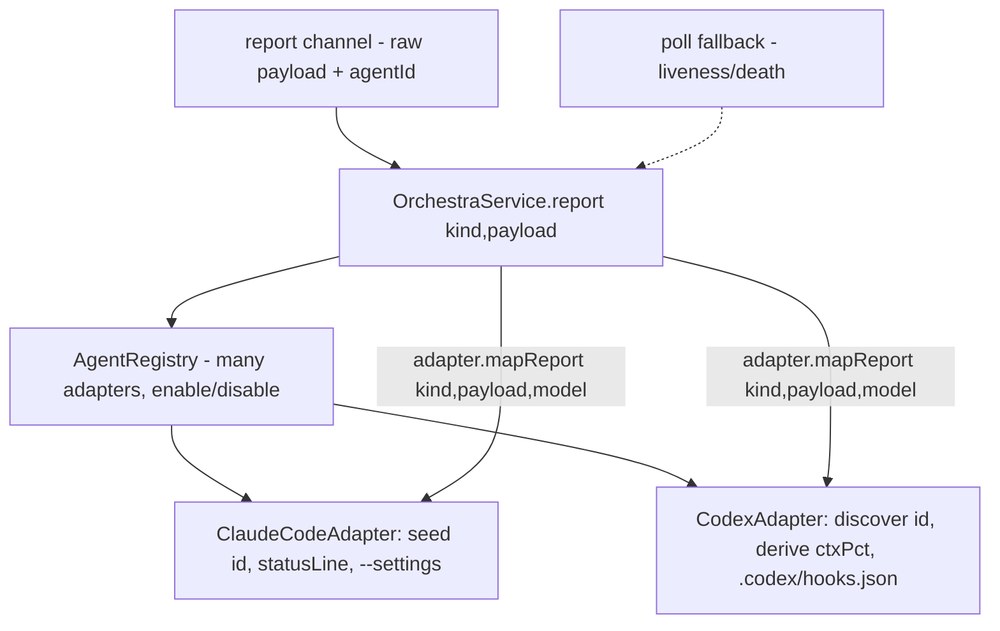

# Multiple Model Providers — Design Index

> Make adding a coding agent beyond Claude Code (a different CLI agent / model provider) a matter of
> writing one `Adapter` + registering it — with **no Claude-specific assumptions leaking** into the
> daemon, the `_report` channel, or the UI. Part of the [[extensibility-roadmap/index|extensibility roadmap]] (axis 2).

## Status vs `main` (2026-06-29)

This axis is still **design-only / unbuilt** — `mapReport`, `reporting`/`ReportingWiring`,
`AgentModel.contextWindow`, multi-adapter registry filtering, and the Spawn provider picker do **not**
exist in code yet. But the central abstraction it generalizes, `AdapterContext`, has **grown on `main`
since this was written** and now matters to any second provider:

- **`AdapterContext` now has 10 fields** (`Adapter.swift:4–23`): the old `cwd/repo/model/startIn/sessionId/`
  `prompt/name/hooksPath` set **plus `access: CardAccess` (read-only gating) and `trustCwd: Bool`
  (scratch pre-trust)**. Both are provider-relevant — a `CodexAdapter` must express each in Codex's own
  vocabulary. Docs below that enumerated the old field set are reconciled.
- **Read-only is now a THREE-layer barrier** (tool denial + strict OS sandbox + auto-mode `hard_deny`
  classifier policy — `ReadOnlyLaunch.swift`). The classifier layer is **Claude-Code-specific**; a
  `CodexAdapter` would express read-only via its own native `--sandbox read-only` instead. This is
  distinct from the `startIn` plan/impl axis.
- The **`additionalContext` keystone (axis 3) is still UNBUILT** but elevated: it must be carried through
  every adapter's `start`/`resume`, delivered per-provider (Claude: `SessionStart` additionalContext;
  Codex: a seed prompt / `--context` file). See [[../agent-integration/02-contract]] and
  [[context-passing-topologies]].
- The **3 Codex design points** this axis already records (two-mode session ids, adapter-derived ctxPct
  via `AgentModel.contextWindow`, reporting wiring = `{files, env, argv}` + trust, not one `--settings`)
  remain accurate and consistent with the synthesis notes.

## Layers

| Layer | Document | Status |
|-------|----------|--------|
| 1 — Initial design | [[01-design]] | approved |
| 2 — Contract | [[02-contract]] | approved |
| 3 — Implementation | [[03-implementation]] | not started (design-only pass) |
| 3 — Tests | [[04-tests]] | not started (design-only pass) |

> Design-only pass: L1+L2 approved 2026-06-26 (Codex-grounded). **Committed follow-on:** build the
> `CodexAdapter` as the first consumer once the seam lands (its own task; not this design-only pass).

> Design grounded against **Codex CLI** as the reference 2nd provider (investigated 2026-06-26) — see
> 01-design's "Reference provider" table + 02-contract's "Codex adapter sketch".

## Current picture

## Open questions (rolled up)

_Resolved at the 2026-06-26 gate (post-Codex study):_ mapping is **server-side** · auth/availability
**deferred** · status bar **stays Claude-specific**. Id is **two-mode** (seed/discover); ctxPct is
**adapter-derived** where unavailable.

- [ ] At Codex-adapter build time: pin hook tool-coverage + `--ask-for-approval`/`--sandbox` flags to the
  installed Codex version (active, version-varying areas).
