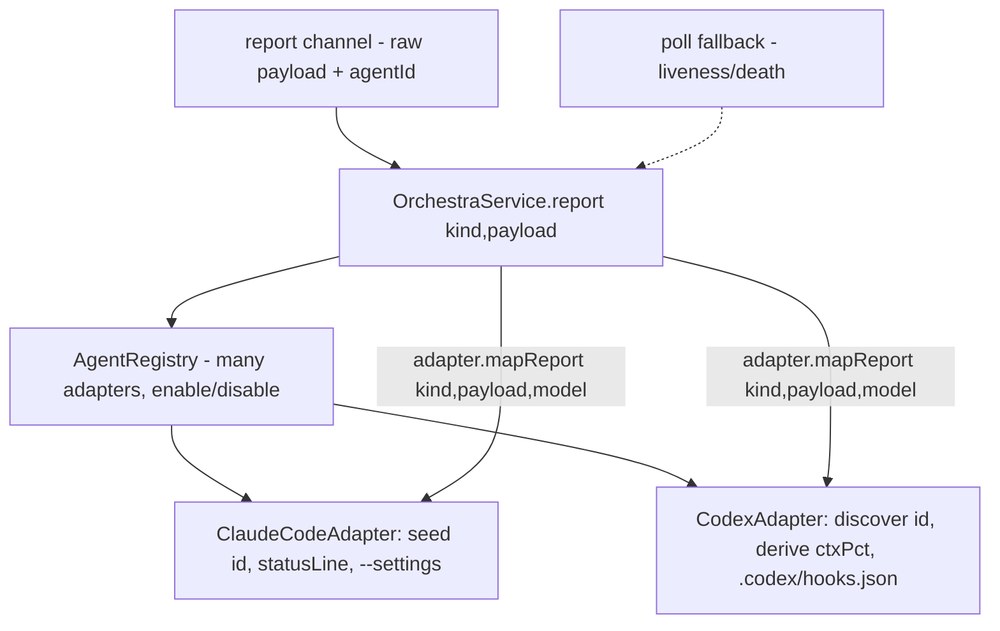

# Multiple Model Providers — Design Index

> Make adding a coding agent beyond Claude Code (a different CLI agent / model provider) a matter of
> writing one `Adapter` + registering it — with **no Claude-specific assumptions leaking** into the
> daemon, the `_report` channel, or the UI. Part of the [[extensibility-roadmap/index|extensibility roadmap]] (axis 2).

## Layers

| Layer | Document | Status |
|-------|----------|--------|
| 1 — Initial design | [[01-design]] | approved |
| 2 — Contract | [[02-contract]] | approved |
| 3 — Implementation | [[03-implementation]] | not started (design-only pass) |
| 3 — Tests | [[04-tests]] | not started (design-only pass) |

> Design-only pass: L1+L2 approved 2026-06-26 (Codex-grounded). **Committed follow-on:** build the
> `CodexAdapter` as the first consumer once the seam lands (its own task; not this design-only pass).

> Design grounded against **Codex CLI** as the reference 2nd provider (investigated 2026-06-26) — see
> 01-design's "Reference provider" table + 02-contract's "Codex adapter sketch".

## Current picture

## Open questions (rolled up)

_Resolved at the 2026-06-26 gate (post-Codex study):_ mapping is **server-side** · auth/availability
**deferred** · status bar **stays Claude-specific**. Id is **two-mode** (seed/discover); ctxPct is
**adapter-derived** where unavailable.

- [ ] At Codex-adapter build time: pin hook tool-coverage + `--ask-for-approval`/`--sandbox` flags to the
  installed Codex version (active, version-varying areas).
