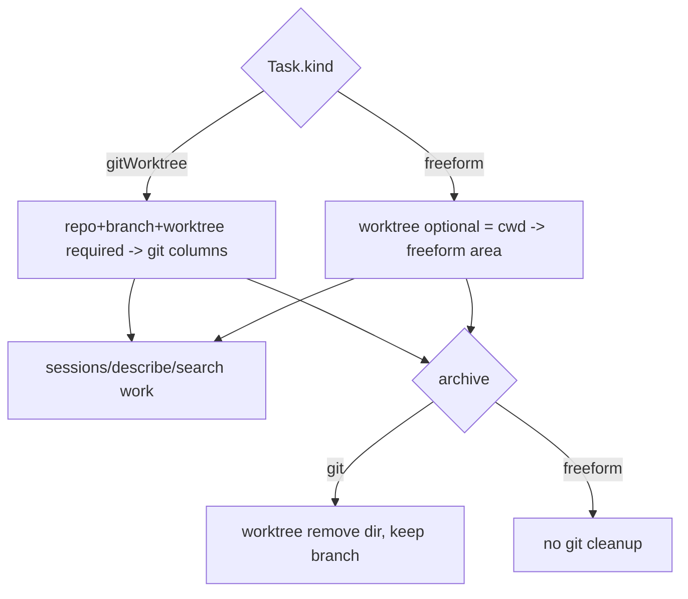

# Layer 1 — Initial Design: Non-git Cards + Searchability

> The **what**: let an agent exist without a git worktree, give those cards their own area, and make all
> cards findable (search + debug handles).

> **Reconcile (2026-06-29): the non-git-cards half SHIPPED.** Freeform/borrowed/scratch cards are real
> board citizens via [[../freeform-and-borrowed-cards/index|freeform-and-borrowed-cards]]: `Task.cwd` +
> `Task.origin: CardOrigin { worktree, scratch, borrowed }` + `Task.access`, `SpawnInput.cwd/scratch/access`,
> a standalone freeform region, and origin-guarded archive cleanup. So this doc's `CardKind`/`kind` is the
> shipped **`origin`** enum (3-way, not 2-way), the freeform area is **standalone** (not an axis-1 lane),
> and the run-dir is `cwd` (the `Task.worktree` string was removed). **Searchability is the part still
> unbuilt** — treat the search goals below as the live scope.

## Purpose & problem

Two gaps, grouped because they share the same model change (loosening the git-centric `Task`):

1. **Everything is git-bound.** *(Now addressed — shipped.)* When written, `Task.repo`/`branch`/`worktree`
   were required and `spawn` always ran `git worktree add`. Freeform/borrowed/scratch cards
   ([[../freeform-and-borrowed-cards/index|freeform-and-borrowed-cards]]) removed that constraint:
   `origin` distinguishes `.worktree`/`.scratch`/`.borrowed`, `repo`/`branch` are optional, and the agent
   runs in `cwd`. Quick/scratch agents and agents in an existing dir now exist.
2. **No search.** As cards accumulate (live + archived), there's no text search/filter. `sessions` gives
   excellent *debug* handles for a known card, but no way to *find* a card by what it's about.

## Goals / non-goals

**Goals** (✓ = now shipped via [[../freeform-and-borrowed-cards/index|freeform-and-borrowed-cards]])
- ✓ A **card-kind axis** — shipped as **`Task.origin: CardOrigin { worktree, scratch, borrowed }`**
  (richer than the 2-way `CardKind { gitWorktree, freeform }` sketched here) plus `Task.access`.
  `repo`/`branch` are **optional**; the run-dir is `cwd` (the `worktree` string was removed).
- ✓ **Spawn handles both**: git cards go through `WorktreeManager`; freeform cards (`SpawnInput.cwd`/
  `scratch`) skip it and run in `cwd` — a borrowed dir (sandbox is the trust boundary, **no allowlist**)
  or an auto scratch dir (`~/.orchestra/scratch/<id>`).
- ✓ A **separate viewing area** for freeform cards — shipped as a **standalone `FreeformRegionView`**,
  deliberately *not* a [[../configurable-columns/index|axis 1]] column/lane (a card *category*, not a
  workflow stage; see [[../freeform-and-borrowed-cards/index|freeform-and-borrowed-cards]] §4.4).
- **Search** *(still unbuilt — the live scope of this axis)*: `list` gains a `query`; a new `find` verb
  returns matching refs; the app gets a search field (over title/desc/repo/branch/initialPrompt,
  optionally archived + notes/progress).
- ✓ **Debugging stays first-class**: `sessions` + `inspect`/`describe` work for freeform cards too
  (a card with no worktree just has `cwd` = its scratch/borrowed dir).

**Non-goals (this axis)**
- A full-text **index engine** — a simple substring/fuzzy scan over `tasks.json` fields suffices at this scale.
- Multiple boards / workspaces.
- Re-homing a freeform card into git later. Per [[../context-passing-topologies|context-passing-topologies]]
  §7 this is a **promotion** (spawn a new `.worktree` card seeded from the freeform card, + optional
  `git diff` patch), **not** an in-place mutation — `origin` is per-card and immutable. The
  [[../agent-integration/index|axis 3]] `link` verb can relate the two cards.

## Scope

**In scope:** `CardKind` + optional git fields; freeform spawn path + cwd policy; the freeform area;
`list?query` + `find` verb + app search. **Out of scope:** indexing engine, multi-board, freeform→git
migration.

## Inputs & outputs

| Direction | Description | Type / shape | Notes |
|-----------|-------------|--------------|-------|
| Input | Spawn a freeform card | `SpawnInput` with `kind: freeform`, optional `cwd` | skips WorktreeManager |
| Input | Search | `list(query)` / `find(query, includeArchived?)` | server-side substring/fuzzy |
| Output | Freeform area | cards where `kind == freeform` | own column/lane or list |
| Output | Matches | `[Task]` / `[ref]` ranked | feeds app search + agent discovery |

## Expected behaviour

- **Freeform spawn:** *(shipped)* `origin == .borrowed`/`.scratch` (+ optional `cwd`) → no `git worktree
  add`; the agent runs in the chosen `cwd` (sandbox is the trust boundary, **no allowlist** — the doc's
  later "allowlisted cwd" wording is superseded) or an auto scratch dir (`~/.orchestra/scratch/<id>`). All
  else (tmux session, report channel, recovery) is identical; `cwd` is the run-dir.
- **Separate area:** *(shipped)* freeform cards render in a **standalone `FreeformRegionView`**, filtered
  by `origin != .worktree` — *not* an axis-1 column whose `semantic` scopes it (that coupling was dropped).
- **Search:** typing in the app search field filters cards (and archived) live; an agent calls `find` to
  discover cards by topic (e.g. "find my auth cards"). Matches rank title > desc > prompt.
- **Debug:** `sessions`/`describe` return handles for freeform cards (tmux target + transcript if the
  provider wrote one); a card with no worktree just has cwd = scratch dir.
- **Degrade:** existing git cards are unchanged; `CardKind` defaults to `gitWorktree` on decode.

## Complexity & risks

| Risk | Note |
|------|------|
| Optional git fields | Code paths assume `worktree` non-empty (recovery, `sessions`, archive cleanup). Audit each for the freeform/no-worktree case. |
| cwd security | A freeform `cwd` must still pass `PathResolver.assertAllowed`; the scratch dir lives under an allowlisted root. |
| Archive cleanup | Freeform archive must NOT `git worktree remove` (there's none) — guard on `kind`. |
| Recovery | A freeform card has no branch/worktree to recreate; resume/restart still recreate the tmux session in the cwd. |
| Search scope creep | Keep it a simple ranked substring scan; don't build an index. Decide archived/notes inclusion. |

Rough sizing: **medium** — `CardKind` + optional fields is a focused model change with a careful audit of
git-assuming paths; search is a small additive feature.

## Diagrams

### Bird's-eye (context)

```mermaid
flowchart LR
    Spawn[spawn kind: git | freeform] --> D[orchestrad]
    D -->|git| WT[WorktreeManager -> worktree]
    D -->|freeform| Cwd[scratch/chosen cwd - allowlisted]
    WT --> SM[tmux session + agent]
    Cwd --> SM
    Find[find / list query] --> D
    D --> App[Board: git columns + freeform area + search]
```

### Detailed (card kinds + placement)



## Decisions made

| Decision | Why | Rejected |
|----------|-----|----------|
| Card-kind axis; git fields optional | One model serves both; defaults keep git cards unchanged | Two separate task types |
| ~~Freeform cwd = allowlisted (scratch by default)~~ → **shipped as free-path; sandbox is the trust boundary (no allowlist)** | Friction-light; sandbox already confines writes everywhere (see [[../freeform-and-borrowed-cards/index\|freeform-and-borrowed-cards]] §4.1) | Pre-registered allowlist (too rigid) |
| ~~Separate area via axis-1 column/lane~~ → **shipped as a standalone freeform region** | Freeform is a card *category*, not a workflow stage; avoids chaining to the larger axis-1 feature | An axis-1 column/lane (conflates the two) |
| Search = simple ranked substring scan | Right scale for a personal tool | A full-text index engine |
| Debug handles unchanged | `sessions`/`describe` already general | Special freeform debug path |

## Open questions — need your call

_All resolved at the 2026-06-26 gate:_ freeform cwd = **scratch dir by default + a chosen allowlisted
dir** (chat-only deferred) · separate area = **an axis-1 lane keyed off `CardKind`** · search covers
**live + archived**, extending to **notes/progress** once axis 3 lands.
