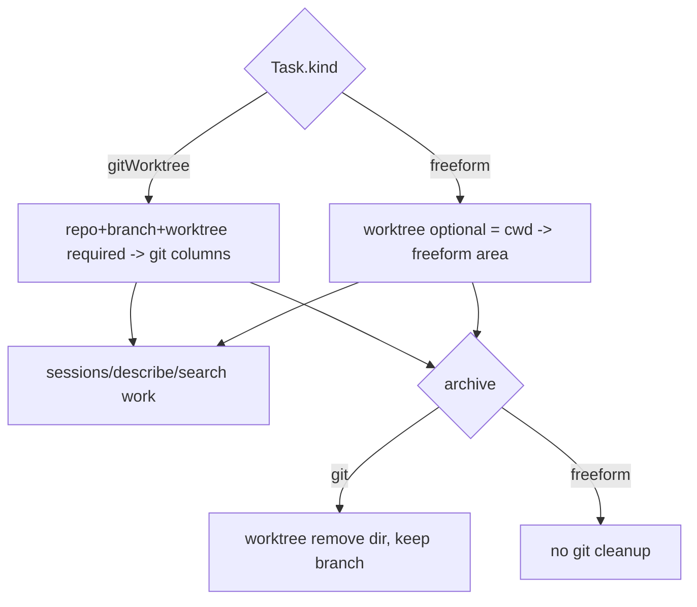

# Layer 1 — Initial Design: Non-git Cards + Searchability

> The **what**: let an agent exist without a git worktree, give those cards their own area, and make all
> cards findable (search + debug handles).

## Purpose & problem

Two gaps, grouped because they share the same model change (loosening the git-centric `Task`):

1. **Everything is git-bound.** `Task.repo`/`branch`/`worktree` are required; `spawn` always runs
   `git worktree add`. There's no way to run a quick/scratch agent, or an agent in an existing dir, or a
   chat-only agent — every card *must* be a worktree on a branch.
2. **No search.** As cards accumulate (live + archived), there's no text search/filter. `sessions` gives
   excellent *debug* handles for a known card, but no way to *find* a card by what it's about.

## Goals / non-goals

**Goals**
- A **`CardKind`**: `gitWorktree` (today's behaviour) or `freeform` (no worktree; agent runs in a chosen
  or scratch cwd). `repo`/`branch`/`worktree` become **optional** for freeform cards.
- **Spawn handles both**: git cards go through `WorktreeManager`; freeform cards skip it and run in an
  allowlisted cwd (a scratch dir by default).
- A **separate viewing area** for freeform cards so they don't clutter the git board (realized as a
  column/lane via [[../configurable-columns/index|axis 1]], or a distinct list).
- **Search**: `list` gains a `query`; a new `find` verb returns matching refs; the app gets a search field
  (over title/desc/repo/branch/initialPrompt, optionally archived + notes/progress).
- **Debugging stays first-class**: `sessions` (existing) + `describe` (axis 3) work for freeform cards too.

**Non-goals (this axis)**
- A full-text **index engine** — a simple substring/fuzzy scan over `tasks.json` fields suffices at this scale.
- Multiple boards / workspaces.
- Re-homing a freeform card into git later (note as future; `link` from axis 3 can relate them).

## Scope

**In scope:** `CardKind` + optional git fields; freeform spawn path + cwd policy; the freeform area;
`list?query` + `find` verb + app search. **Out of scope:** indexing engine, multi-board, freeform→git
migration.

## Inputs & outputs

| Direction | Description | Type / shape | Notes |
|-----------|-------------|--------------|-------|
| Input | Spawn a freeform card | `SpawnInput` with `kind: freeform`, optional `cwd` | skips WorktreeManager |
| Input | Search | `list(query)` / `find(query, includeArchived?)` | server-side substring/fuzzy |
| Output | Freeform area | cards where `kind == freeform` | own column/lane or list |
| Output | Matches | `[Task]` / `[ref]` ranked | feeds app search + agent discovery |

## Expected behaviour

- **Freeform spawn:** `kind: freeform` (+ optional `cwd`) → no `git worktree add`; the agent runs in the
  given allowlisted cwd, or an auto scratch dir (`dataDir/scratch/<id>`). All else (tmux session, report
  channel, recovery) is identical; `worktree` is just the cwd.
- **Separate area:** freeform cards render in their own section/lane, not mixed into the git columns. With
  axis 1 this is a column whose `semantic` (or a `CardKind` filter) scopes it.
- **Search:** typing in the app search field filters cards (and archived) live; an agent calls `find` to
  discover cards by topic (e.g. "find my auth cards"). Matches rank title > desc > prompt.
- **Debug:** `sessions`/`describe` return handles for freeform cards (tmux target + transcript if the
  provider wrote one); a card with no worktree just has cwd = scratch dir.
- **Degrade:** existing git cards are unchanged; `CardKind` defaults to `gitWorktree` on decode.

## Complexity & risks

| Risk | Note |
|------|------|
| Optional git fields | Code paths assume `worktree` non-empty (recovery, `sessions`, archive cleanup). Audit each for the freeform/no-worktree case. |
| cwd security | A freeform `cwd` must still pass `PathResolver.assertAllowed`; the scratch dir lives under an allowlisted root. |
| Archive cleanup | Freeform archive must NOT `git worktree remove` (there's none) — guard on `kind`. |
| Recovery | A freeform card has no branch/worktree to recreate; resume/restart still recreate the tmux session in the cwd. |
| Search scope creep | Keep it a simple ranked substring scan; don't build an index. Decide archived/notes inclusion. |

Rough sizing: **medium** — `CardKind` + optional fields is a focused model change with a careful audit of
git-assuming paths; search is a small additive feature.

## Diagrams

### Bird's-eye (context)

```mermaid
flowchart LR
    Spawn[spawn kind: git | freeform] --> D[orchestrad]
    D -->|git| WT[WorktreeManager -> worktree]
    D -->|freeform| Cwd[scratch/chosen cwd - allowlisted]
    WT --> SM[tmux session + agent]
    Cwd --> SM
    Find[find / list query] --> D
    D --> App[Board: git columns + freeform area + search]
```

### Detailed (card kinds + placement)



## Decisions made

| Decision | Why | Rejected |
|----------|-----|----------|
| `CardKind` (git / freeform); git fields optional | One model serves both; defaults keep git cards unchanged | Two separate task types |
| Freeform cwd = allowlisted (scratch by default) | Keeps the `PathResolver` security boundary | Arbitrary cwd (escape risk) |
| Separate area via axis-1 column/lane | Reuse configurable columns; no parallel board concept | A bespoke second board |
| Search = simple ranked substring scan | Right scale for a personal tool | A full-text index engine |
| Debug handles unchanged | `sessions`/`describe` already general | Special freeform debug path |

## Open questions — need your call

_All resolved at the 2026-06-26 gate:_ freeform cwd = **scratch dir by default + a chosen allowlisted
dir** (chat-only deferred) · separate area = **an axis-1 lane keyed off `CardKind`** · search covers
**live + archived**, extending to **notes/progress** once axis 3 lands.
