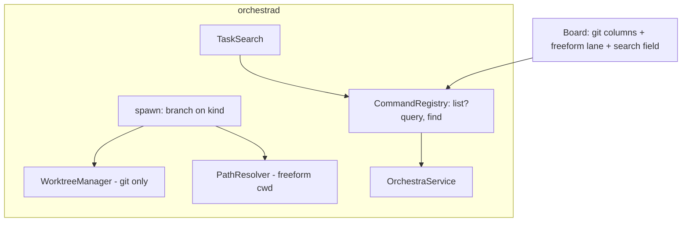
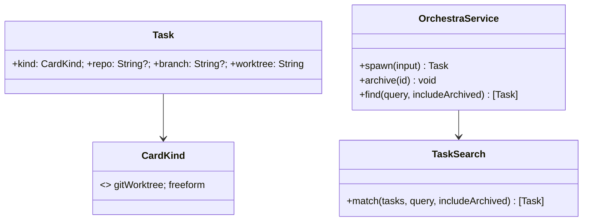

# Layer 2 — Contractual Design: Non-git Cards + Searchability

> The **interfaces**: `CardKind` + optional git fields, the freeform spawn path, and the search verbs.

## Architecture overview

`Task` gains a `kind: CardKind` and makes `repo`/`branch`/`worktree` optional (a freeform card stores its
cwd in `worktree`, but with no git semantics). `OrchestraService.spawn` branches on `kind`: git cards run
`WorktreeManager.ensure`; freeform cards resolve a cwd (a scratch dir under an allowlisted root by
default, or a chosen allowlisted dir) and skip git. `archive` guards git cleanup on `kind`. A pure
`search(tasks:query:)` helper backs a `find` verb and a `query` param on `list`; the app adds a search
field. The freeform area is a board section keyed off `kind` (a column/lane once [[../configurable-columns/index|axis 1]] lands).

## Major classes / modules

| Name | Responsibility | Collaborators |
|------|----------------|---------------|
| `CardKind` (new, `Model.swift`) | `gitWorktree` \| `freeform` | `Task`, spawn, archive |
| `Task` (change) | `kind`; `repo`/`branch` optional; `worktree` = cwd for freeform | `TaskStore` |
| `OrchestraService.spawn` (change) | Branch on `kind`; freeform cwd resolution | `WorktreeManager`, `PathResolver` |
| `OrchestraService.archive` (change) | Skip `git worktree remove` for freeform | `WorktreeManager` |
| `TaskSearch` (new, pure) | Ranked substring/fuzzy match over card text | `find`, `list` |
| `CommandRegistry` (extend) | `list?query`, new `find` verb (via axis-3 single source) | `OrchestraService` |
| `BoardModel`/`BoardView` (change) | Freeform area + a search field | control plane |

## Data model

```swift
public enum CardKind: String, Codable, Sendable { case gitWorktree, freeform }
```

`Task` changes (migration via decoder defaults, like `AgentModel`/`columnId`):

| Field | Before | After |
|-------|--------|-------|
| `kind` | — | `CardKind` (decode default `.gitWorktree`) |
| `repo` | `String` | `String?` (nil for freeform) |
| `branch` | `String` | `String?` (nil for freeform) |
| `worktree` | `String` (git path) | `String` (git worktree **or** freeform cwd) |

`SpawnInput` gains `kind: CardKind = .gitWorktree` and `cwd: String?` (freeform only). For git cards
`repo`/`branch` stay required; for freeform they're optional and `cwd` (or a scratch default) is used.

## Function / method contracts

### `OrchestraService.spawn` (extended)
- **Does:** for `.gitWorktree` → today's path. For `.freeform` → resolve cwd = `input.cwd` (assertAllowed)
  or `dataDir/scratch/<id>` (created, under an allowlisted root); skip `WorktreeManager`; everything else
  (session, report wiring, card) identical with `repo`/`branch` nil.
- **Errors:** freeform cwd not allowlisted → `pathNotAllowed`; git path unchanged.

### `OrchestraService.archive` (extended)
- **Does:** for `.freeform`, skip `git worktree remove` entirely (no git); just kill the session + mark
  done/archived. Git path unchanged (remove dir, keep branch, keep dirty).

### `TaskSearch.match(_ tasks:, query:, includeArchived:) -> [Task]`
- **Does:** rank cards by a substring/fuzzy match over title > desc > initialPrompt > repo/branch (+ notes/
  progress once axis 3 lands); returns ranked matches.
- **Inputs:** all tasks, a query, an archived flag. **Outputs:** ranked `[Task]`. **Side-effects:** none.

### `find` / `list` (registry verbs)
- `find {query, includeArchived?}` → `[Task]` (ranked) — agent/CLI discovery by topic.
- `list` gains an optional `query` → filtered list (the app's search field uses this or filters locally).

## Library / framework decisions

| Decision | Choice | Rationale | Alternatives considered |
|----------|--------|-----------|-------------------------|
| Card typing | A `CardKind` enum + optional git fields | One model, default keeps git cards unchanged | Separate freeform task type |
| Freeform cwd | Allowlisted; scratch default under a root | Preserves `PathResolver` boundary | Arbitrary cwd |
| Search | Pure ranked substring/fuzzy over fields | Right scale; no infra | SQLite FTS / index engine |
| Freeform area | Board section keyed off `kind` (axis-1 lane) | Reuse columns; no second board | Bespoke board |

## Diagrams

### Bird's-eye (components)



### Detailed (classes)



## Traceability → Layer 1

| L1 goal | Covered by |
|---------|-----------|
| `CardKind` git/freeform; optional git fields | `CardKind` + optional `repo`/`branch` + migrating decoder |
| Spawn handles both | `spawn` branch on `kind` + freeform cwd resolution |
| Separate freeform area | Board section keyed off `kind` (axis-1 lane) |
| Search (list query + find + app field) | `TaskSearch` + `find`/`list?query` verbs + search field |
| Debug stays first-class for freeform | `sessions`/`describe` already general (cwd = worktree) |
| Archive guards git cleanup | `archive` branch on `kind` |

## Decisions made

| Decision | Why | Rejected |
|----------|-----|----------|
| Optional git fields via decoder defaults | Zero-migration like `AgentModel`/`columnId` | A data rewrite |
| Freeform cwd assertAllowed (scratch default) | Keep the security boundary | Unbounded cwd |
| Search is a pure helper + verbs | Reuses axis-3 single-source registry; agent-discoverable | App-only filter |
| Freeform area reuses axis-1 columns | No second board concept | Bespoke lane system |

## Open questions — need your call

_All resolved at the 2026-06-26 gate:_ scratch-by-default cwd + chosen allowlisted dir (chat-only later) ·
freeform area = an axis-1 lane · search includes archived (+ notes/progress once axis 3 lands).
