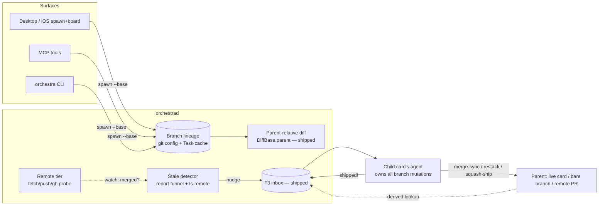
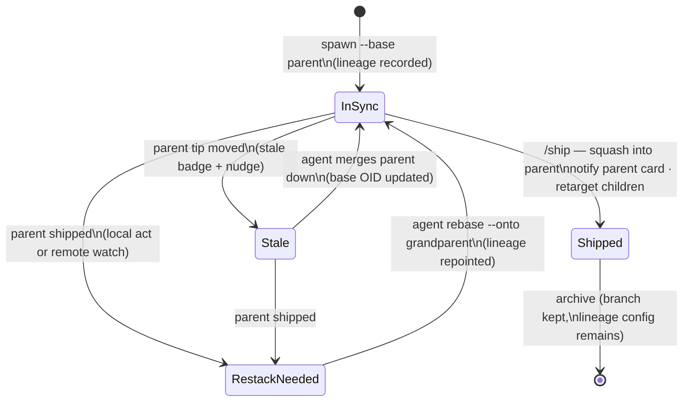

# Layer 1 — Initial Design: Parent Card / Branch Linking

> The **what**, not the how. A card's branch can be based on any other branch — another card's,
> a bare local branch, or a remote PR branch — and the card's whole lifecycle (diff, sync, ship,
> redirect, notify) runs **relative to that parent** instead of `main`.

## Purpose & problem

Today every card branches off local `HEAD` (effectively `main`) and ships to `main`. Real work
stacks: a follow-up starts before its base merges, a big feature splits into dependent slices,
a local card builds on a colleague's open PR. Without first-class parents, the diff view shows
the parent's work as the child's, ship targets the wrong branch, and a merged parent silently
strands its children on a dead base.

The foundational call is already made ([[../stacked-branches-and-guardian-handoff|stacked-branches]]):
enforced 1:1 card↔worktree, one card per branch, stacks = one card per stack entry. This design
finalizes the parent link itself and everything that hangs off it.

## The model (resolved with owner, 2026-07-06)

| Principle | Meaning |
|---|---|
| **Parent = a branch ref, card-optional** | The persisted link names a *branch*. "The parent card" is a **derived lookup**: the active card with matching `repo`+`branch` (unique under 1:1). No stored card pointer, nothing to go stale. |
| **Lineage lives on the branch** | Repo git config: `branch.<child>.orchestra-parent` (name) + `orchestra-parent-base` (parent OID at last sync/restack). Survives card churn, daemon reinstalls, and is readable by plain git. `Task.parentBranch` becomes a cache derived at spawn. |
| **Topology: tree, not DAG** | Single parent per branch; a parent may have many children. Unanimous prior art (Graphite, git-town, git-spr, Sapling, GitHub native stacks); multi-parent breaks merge-base diffs, ship semantics, and `rebase --onto` redirection. "Need two parents' work" = explicit one-shot *merge sibling in*, no lineage change. |
| **Sync: merge down, rebase only to re-parent** | Routine parent→child sync = `git merge` (no rewrites, no force-push, no grandchild cascade, abortable; triple-dot diff stays correct). `rebase --onto <new-base> <recorded-base>` only at **re-parent** events (parent shipped). Squash at ship keeps parent history clean and merge-bases unique. |
| **The owning agent performs; the daemon requests** | Never mutate a branch from outside its worktree (Graphite's 1.8.4 data-loss lesson). Sync/restack are performed by the child card's own agent in its own tree, prompted via the F3 inbox. |
| **Merges are Orchestra acts, not observed events** | Ship-into-parent is performed by the child's agent, which then notifies + retargets. The daemon never polls local git for merges. The sole observer is the opt-in **remote parent watch** (goal 8), where no local agent performs the merge. |
| **Remote parents are refs, not branches** | A card-less remote parent (PR branch) is fetched read-only into a private namespace (`refs/orch/parents/…`) — never materialized as a local branch. Works identically for fork PRs via `refs/pull/N/head`. |

## Goals / non-goals

**Goals** (numbering = owner's ask)

1. **Parent-relative diffs everywhere** — inspector diff, "View changes" (Zed multi-diff),
   open-notes changed-set, and the card-footer `Nf +X −Y` stat all reflect only the child's own
   work (merge-base vs parent), for stacked cards.
2. **Spawn on a branch** — new card based on any existing branch (local or remote parent), from
   desktop UI, iOS UI, MCP, and CLI; lineage recorded at spawn.
3. **Parent→child sync** — children learn the parent moved (stale signal + inbox nudge) and
   merge it down themselves. DAG investigated and rejected in favor of the tree (see model).
4. **Merge redirection** — when a parent ships, children re-parent to the grandparent
   (`rebase --onto` with the recorded base OID) and their lineage config is repointed.
5. **Ship into parent** — a stacked card's ship targets its parent branch, not `main`.
6. **Child informs parent** — on ship, the parent branch's owning card (derived lookup) gets an
   F3 inbox message; no card ⇒ no-op (pure-git degradation).
7. **Board affordances** — stack grouping/indentation on the card, jump-to-parent, stale badge.
8. **Remote PR parents** — a remote PR branch as parent: read-only baseline for diff/spawn,
   opt-in merge watch (`gh` ladder), publish-child-as-stacked-PR; push-into-parent where allowed.

**Non-goals**

- No multi-parent branches; no octopus lineage (rejected — see model).
- No daemon-side rewriting of any branch; no central auto-restack service.
- No general PR-review machinery (that is [[../pr-review-phase/index|axis 5]]); no webhooks.
- No cross-repo parents (parent and child are branches of the same repo).
- Restack *content* automation beyond nudges — conflict resolution is the owning agent's job.

## Scope

**In:** lineage schema (git config + Task cache) · spawn-with-base across 4 surfaces ·
parent-relative diff baselines (all 4 diff consumers) · stale detection + sync nudge ·
ship-into-parent + notify + retarget cascade · remote parent refs, fetch, watch ladder,
stacked-PR publish · board/inspector affordances · agent guidance (ship/sync skills for both
Claude and Codex via the shared prompt/command seam).

**Out:** merge queues · webhook listeners · fork-PR write access (`maintainerCanModify` push) ·
rewriting docs/ship flows for non-stacked cards (unchanged defaults).

## Inputs & outputs

| Direction | Description | Type / shape | Notes |
|-----------|-------------|--------------|-------|
| Input | Spawn request + parent | existing `SpawnInput` + `base` (branch name or PR ref) | All 4 surfaces |
| Input | Parent tip movement | git OID change (local: report funnel; remote: `ls-remote` poll) | Drives stale signal |
| Input | Parent merged | child agent's ship act (local) · `gh pr view` state (remote) | Never local git polling |
| Output | Lineage | git config pair on the child branch + `Task.parentBranch` cache | Branch-durable |
| Output | Parent-relative diff | existing `DiffBase.parent` pipeline + footer stat | Mostly plumbed today |
| Output | Inbox nudges | F3 `InboxMessage` to child (sync/restack) and parent (child shipped) | Existing channel |
| Output | Remote actions | fetch into `refs/orch/parents/…` · `git push` · `gh pr create/edit/view` | New daemon verbs, capability-probed |

## Expected behaviour

### Spawn (goal 2)
- Spawn sheet (desktop/iOS) gains a **base picker** (default `main` = today's behavior); MCP/CLI
  gain a `base` param. Choosing a base ≠ default records lineage in git config and sets
  `Task.parentBranch`.
- New branch: `git worktree add -b child <wt> <base>` (fixes the `WorktreeManager.swift:38` gap).
  Existing branch: checkout as today, lineage **derived from git config** if present.
- Spawning **onto** a branch that has a live card refuses with jump-to-card (1:1 rule, per the
  foundational doc). Spawning onto a card-less branch just works (owner's churn requirement).

### Diff (goal 1)
- For a card with a parent: inspector default baseline, Zed "View changes", open-notes changed
  set, and the footer diffstat all use merge-base vs parent. Baseline picker keeps
  Working/Branch/Parent for comparison.
- Remote parent: baseline ref is `refs/orch/parents/…`, refreshed on demand (diff open, spawn,
  ship) — never blocks rendering on the network; shows last-fetched + staleness hint.

### Sync (goal 3)
- Daemon notices a parent tip ≠ child's recorded base (it already recomputes diffstats off the
  report funnel) → child card shows a **stale badge**; optionally an inbox nudge "parent moved,
  merge it down".
- The child's agent runs `git merge <parent>` in its own tree; conflicts are its to resolve
  (or abort). The recorded base OID updates after a successful sync.
- Auto-sync is a per-card toggle (default: nudge only) — an unattended agent may merge on nudge;
  an attended one leaves it to the user's timing.

### Ship + notify + redirect (goals 4, 5, 6)
- `/ship` on a stacked card targets the **parent**: squash-merge child into parent branch
  (ephemeral checkout if the parent has no worktree), then archive as today.
- Ship then: (a) inbox message to the parent's owning card, if any — "child <branch> merged
  into you: 
"; (b) for each of the child's own children: repoint git-config lineage to
  the grandparent + inbox nudge "your parent shipped; restack onto <new parent>".
- The restack is `git rebase --onto <new-parent> <recorded-base> child`, run by each child's
  agent in its own tree, clean-tree-gated (commit WIP first).
- A parent shipping to `main` is the same flow with grandparent = `main` — goal 4 falls out.

### Remote parents (goal 8)
- Parent may be `origin`-relative: a same-repo branch or a PR number (covers fork PRs via
  `refs/pull/N/head`). Fetched read-only into `refs/orch/parents/…` with force-refspec.
- **Merge detection ladder** (opt-in watch, stop at first hit): `gh pr view … state==MERGED`
  (authoritative, squash-proof) → fetch-prune branch-deleted heuristic ("probably shipped") →
  `merge-base --is-ancestor` (proof-positive only). Detection fires the same redirect flow as a
  local ship, with new base = the PR's `baseRefName` target.
- Ship for a remote-parented child: publish as **stacked PR** (`gh pr create --base <parent>`);
  direct push-into-parent only for same-repo, write-permitted branches. On parent merge, verify
  and repair the child PR's base (GitHub's auto-retarget is unreliable via API deletion).
- `gh` is a **capability probe** (like Zed today): absent ⇒ degrade to pure-git tier (ls-remote,
  branch-deleted heuristic); never a hard dependency.

### Degradation table (the card-optional thread)

| Parent state | Diff | Sync nudge | Ship target | Notify |
|---|---|---|---|---|
| Live card on parent | ✓ merge-base | ✓ stale + inbox | parent branch (its worktree) | ✓ inbox to card |
| Bare local branch | ✓ merge-base | ✓ stale badge | parent branch (ephemeral checkout) | no-op |
| Remote branch / PR | ✓ vs `refs/orch/parents/…` | ✓ via ls-remote poll | stacked PR / push | no-op locally |
| Parent = `main` | today's behavior, unchanged | — | main | — |

## Complexity & risks

| Risk | Why it bites | Mitigation |
|---|---|---|
| Restack conflicts handled by unattended agents | rebase stops per commit, mid-rebase state | clean-tree gate + commit-WIP-first; fall back to merge + abort; nudge-not-auto by default |
| Lost base OID → phantom conflicts after squash | redirection is impossible without it (Graphite lesson) | record `orchestra-parent-base` at spawn and update on every sync/restack |
| Daemon blocking on git credential prompts | non-TTY daemon hangs | `GIT_TERMINAL_PROMPT=0` on every remote verb, classify failures |
| Criss-cross merge-bases corrupting parent diffs | child↔parent merged both directions | ship = squash only; child retires (or re-forks) after shipping into parent |
| Stale derived parent-card lookup racing archive | notify lands nowhere | F3 inbox is durable per-card; no card ⇒ documented no-op, activity item instead |
| Scope: 8 goals × 4 surfaces | big blast radius | strictly layered PRs (schema → spawn → diff → ship/sync → remote), each independently shippable |

Effort sizing: core (schema, spawn, diff, ship/notify) is mostly wiring into shipped seams; the
genuinely new machinery is the remote tier (3 new git verbs + gh probe + watch loop) and the
restack choreography.

## Diagrams

### Bird's-eye (context)

### Detailed — stacked card lifecycle

## Decisions made

| Decision | Why | Rejected |
|----------|-----|----------|
| Parent = branch ref, card derived (option A) | no stale pointers; covers main/bare/remote uniformly | stored `parentCardId` (B); enforced parent card (C) |
| Lineage in repo git config (name + base OID) | survives card churn; plain-git readable; git-town/Graphite pattern | Task-only field (dies with card); refs namespace (overkill locally) |
| Tree topology, single parent | unanimous prior art; merge-base/ship/redirect stay well-defined | true DAG (needs jj-class machinery git lacks) |
| Merge-down sync, rebase only at re-parent | safe for concurrent agents: no rewrites/force-push/cascade | routine rebase-restack (Graphite default — human-attended) |
| Squash at ship-into-parent | unique merge-base; clean parent history; erases sync merge clutter | merge-commit ship (criss-cross risk); ff-only (too restrictive) |
| Owning agent performs all mutations | git forbids cross-worktree branch mutation; Graphite 1.8.4 lesson | daemon-side central restacker |
| Merge = Orchestra act; observation only for remote | no local git polling; ship self-reports | daemon merge-watcher for local branches |
| Remote parents in `refs/orch/parents/…`, never local branches | read-only by construction; fork-safe; no namespace pollution | `gh pr checkout` (materializes branches); remote-tracking refs (same-repo only) |
| `gh` behind a capability probe | works without it (degraded tier); agent-agnostic seam rule | hard gh dependency |

## Open questions — need your call

- [ ] **Footer diffstat for stacked cards:** switch the card's `Nf +X −Y` to parent-relative
      (recommended — "this card's own work"), or show both (`vs parent · vs main`)?
- [ ] **Sync nudge default:** stale badge only, badge + inbox nudge (recommended), or
      auto-merge-down for unattended cards? (Per-card toggle proposed; what's the default?)
- [ ] **Ship-into-parent = squash** — confirmed as the default? (Current `/ship` to main uses a
      merge commit; stacked ship would differ deliberately.)
- [ ] **Remote-parent v1 scope:** include push-into-parent for write-permitted same-repo
      branches, or keep v1 read-only (baseline + watch + stacked-PR publish)? (Recommend the
      latter — smaller, and stacked-PR publish covers the real workflow.)

## Traceability

First layer — traces forward to Layer 2 contracts. Owner's 8 goals ↔ sections: 1→Diff, 2→Spawn,
3→Sync, 4/5/6→Ship+notify+redirect, 7→Board affordances (goals) , 8→Remote parents.
