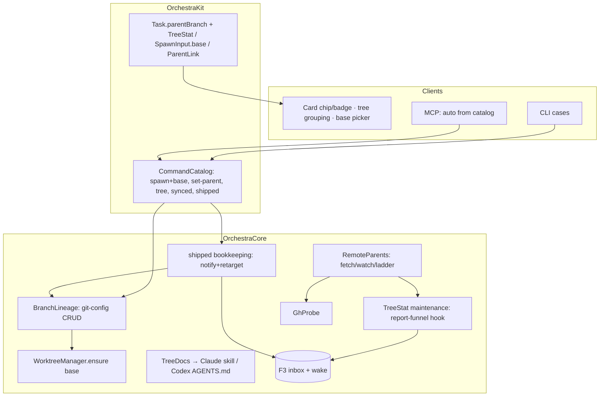
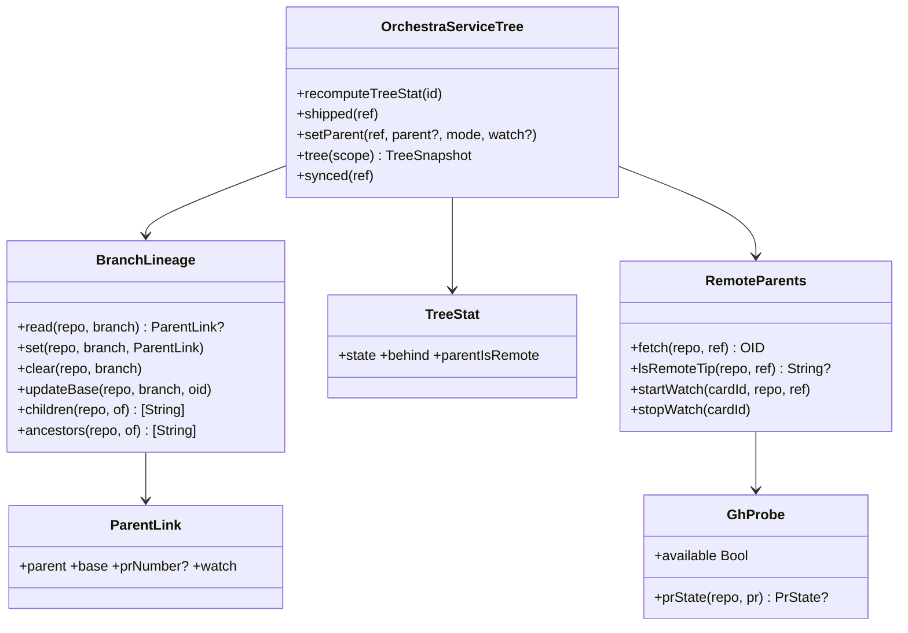

# Layer 2 — Contractual Design: Branch Tree

> The **interfaces**: the units, their contracts, and the surface changes — matched to house
> patterns (catalog/registry pairing, `Proc` git calls, capability probes, `DelegationDocs`
> installer, inbox+wake nudge idiom).

## Architecture overview

Five small units carry the whole feature. **`BranchLineage`** owns the durable parent link
(git-config read/write) — the single source of truth. **Spawn threading** adds one `base` param
end-to-end and one start-point argument in `WorktreeManager.ensure`. **`TreeStat`** derives
per-card parent state (stale/behind/restack-needed) off the existing report funnel, exactly like
`diffStat`. **Ship choreography** is skill-driven (agents act) with one bookkeeping RPC
(`shipped`) that notifies + retargets. **`RemoteParents`** is the isolated remote tier: private
ref fetches, an `ls-remote`/`gh` watch loop, and the merge-detection ladder — behind a `gh`
capability probe. UI/MCP/CLI changes are thin consumers of these.

A key L2 refinement of the owning-agent rule (L1): **writes to a branch are performed by its
owner; an unowned branch is borrowed ephemerally.** Concretely, ship-into-parent has two shapes:
- **Live parent card ⇒ the parent merges the child** (goal 6's "or perhaps the parent card
  merges it" — yes): the child's ship sends a merge-request to the parent's inbox + wake; the
  parent's agent runs the squash-merge in its own worktree. Git itself forces this: a branch
  checked out in another worktree cannot be advanced from outside it.
- **Bare parent branch ⇒ the child borrows it**: ephemeral checkout, squash-merge, reclaim.

## Data model

```
# git config, per child branch (repo-local; the durable lineage)
branch.<child>.orchestra-parent        = feature-a | origin/feature-b   # parent ref string
branch.<child>.orchestra-parent-base   = <OID>                          # parent tip at last sync/restack
branch.<child>.orchestra-parent-pr     = 12                             # optional, remote parents only
branch.<child>.orchestra-parent-watch  = true                           # optional, remote watch opt-in

# Task (cache + derived; persisted in tasks.json)
Task.parentBranch : String?      # EXISTS (Model.swift:187) — canonical parent ref string, set at spawn/set-parent
Task.treeStat     : TreeStat?    # NEW — daemon-maintained, like diffStat

struct TreeStat: Codable {       # NEW (OrchestraKit/Model.swift)
    var state: TreeState         # inSync | stale | restackNeeded | parentMerged
    var behind: Int              # commits parent is ahead of recorded base (the ↓N badge)
    var parentIsRemote: Bool
}
```

Parent ref string forms: plain `name` = local branch; `origin/name` = remote (slash implies
remote; the PR number rides its own key). `refs/orch/parents/…` never appears in config — it is
the *fetch destination* derived from the remote form.

## Major units

| Name | Responsibility | Collaborators |
|------|----------------|---------------|
| `BranchLineage` (new, OrchestraCore) | git-config lineage CRUD + tree queries + cycle guard | `Proc` |
| `WorktreeManager.ensure(base:)` (edit) | start-point on branch creation | `BranchLineage` (caller wires) |
| Spawn threading (edits) | `base` param across catalog/registry/`SpawnInput`/service/CLI/stores | `BranchLineage`, `WorktreeManager` |
| `TreeStat` maintenance (new, OrchestraService+Tree) | derive child state off report funnel; badge data | `BranchLineage`, `TaskStore`, report funnel |
| Ship choreography (skill + 1 RPC) | merge-request routing, `shipped` bookkeeping (notify + retarget) | inbox+wake, `BranchLineage` |
| `RemoteParents` (new, OrchestraCore) | private-ref fetch, watch loop, merge-detection ladder | `Proc`, `GhProbe`, `TreeStat` |
| `GhProbe` (new, tiny) | `gh` capability probe + typed `pr view` call | `Proc.toolExists` pattern |
| `TreeDocs` (new, Resources) | sync/restack/ship guidance installed for **both** Claude & Codex | `DelegationDocs` pattern |
| UI affordances (edits) | parent chip, ↓N stale badge, jump-to-parent, tree grouping | `BoardStore`, `CardView`, `BoardCardCell` |

## Function / method contracts

### `BranchLineage` (actor, OrchestraCore/BranchLineage.swift)

```swift
struct ParentLink { var parent: String; var base: String; var prNumber: Int?; var watch: Bool }

func read(repo: String, branch: String) -> ParentLink?          // git config --get x3
func set(repo: String, branch: String, link: ParentLink) throws // validates + writes keys
func clear(repo: String, branch: String) throws                 // --unset all orchestra-* keys
func updateBase(repo: String, branch: String, oid: String) throws
func children(repo: String, of parent: String) -> [String]      // --get-regexp '^branch\..*\.orchestra-parent$'
func ancestors(repo: String, of branch: String) -> [String]     // walk parent chain (cycle-safe)
```

- **Side-effects/errors:** config writes only — never touches refs or trees. `set` throws
  `invalidParams` on self-parent or cycle (`ancestors` walk), `unknownBranch` if the local
  parent doesn't exist. All calls `Proc.run(["git","-C",repo,"config",…])`.
- **Note:** read-only cards already have `git config` hard-blocked (`ReadOnlyLaunch.swift:18`);
  lineage writes happen daemon-side, so that stays intact.

### Spawn threading

```swift
SpawnInput.base: String?                       // + manual init(from:) default nil (Model.swift:655)
CommandCatalog "spawn" params += "base": strProp("Parent ref to branch from (local name or origin/name)")
CommandRegistry "spawn" handler: base: p.optString("base")
OrchestraService.spawn: if let base { lineage.set(...); parentBranch = canonical(base) }
WorktreeManager.ensure(repo:branch:base: String?) // new-branch arm only: ["git","-C",repo,"worktree","add","-b",branch,wt] + [startPoint]
CLIRunner "spawn" case += --base flag; BoardStore.spawn(..., base: String?)
```

- **Behavioral contract:** `base` applies only when the branch is *created*; spawning onto an
  existing branch ignores `base` and instead **derives** `parentBranch` from `lineage.read`
  (churn-proof per L1). Remote base ⇒ `RemoteParents.fetch` first, start-point =
  `refs/orch/parents/…`, recorded base = fetched OID. MCP picks the param up from the catalog
  automatically; iOS/desktop sheets add a **base picker** (existing branches list + "PR #N…"
  field), defaulting to none (= today's HEAD behavior).

### New registry commands (catalog + registry pairs, exposure `.all`)

```swift
"set-parent" {ref, parent?, mode?, watch?}
    // parent omitted ⇒ clear. mode: "adopt" (default) = metadata-only relink,
    //   base := merge-base(parent, HEAD), history untouched.
    // mode "move" = TRANSPLANT the branch's commits onto the new parent:
    //   daemon repoints lineage + TreeStat := restackNeeded + nudges the owning
    //   agent, which runs `rebase --onto <new-parent> <recorded-old-base>` in its
    //   own tree and reports `synced`. Children cascade (same as `shipped` (b)).
"tree"       {ref? | repo?}           // lineage query: parents/children/TreeStat per card — feeds MCP/CLI/UI
"synced"     {ref}                    // agent reports completed sync/restack → updateBase(parent tip) + recompute TreeStat
"shipped"    {ref}                    // post-merge bookkeeping — see ship choreography
```

- All four are also CLI `case`s; MCP inherits from the catalog. `tree` output is the shared
  shape both boards + agents consume (goal 7 grouping + goal 2's "link that branch's card").

### `TreeStat` maintenance (OrchestraService+Tree.swift)

```swift
func recomputeTreeStat(_ id: UUID) async          // idempotent, persists+emits only on change (diffStat pattern)
// hook: report funnel (+Report.swift:139): after scheduleDiffStat(id), also
//   for child in lineage.children(repo, of: task.branch) → scheduleTreeStat(childCard)
//   plus scheduleTreeStat(id) itself (its own parent may have moved)
```

- `behind` = `rev-list --count <recorded-base>..<parent-tip>`; `restackNeeded` when recorded
  base is no longer the parent tip's ancestor **or** `shipped`/watch marked the parent merged.
- **Stale nudge:** on `inSync → stale` transition only (not per commit), enqueue inbox nudge +
  `wake` — the `concludeCard` two-line idiom (`+Wake.swift:70-71`). Per-card `autoSync` opt-in
  makes the nudge text an imperative ("merge parent down now").

### Ship choreography (skill-driven + `shipped` RPC)

```
child /ship (tree-aware, via TreeDocs):
  1. commit; 2. resolve parent state via `orchestra tree`:
     • live parent card  → `orchestra send <parent> "merge-request: <child>, squash …"` (+ wake) — parent agent
       squash-merges in ITS worktree, then calls `orchestra shipped <child>`
     • bare local parent → child performs ephemeral checkout + `git merge --squash` + commit, then `orchestra shipped <child>`
     • parent == main    → today's /ship, unchanged
     • remote parent     → publish path: push -u + `gh pr create --base <parent>` (no merge), no `shipped`

daemon `shipped {ref}`:
  a. notify: derived parent-card lookup (active card, repo+branch) → inbox+wake "child <branch> merged: <summary>" (no card ⇒ activity item)
  b. retarget: for each lineage.children(of: child) → lineage rewrite parent := child's parent (grandparent), keep their recorded base; TreeStat := restackNeeded; inbox nudge "parent shipped — restack onto <grandparent>"
  c. mark child's own TreeStat parentMerged=false/clear; child archives itself as today
```

- Restack itself stays agent-performed: `git rebase --onto <new-parent> <recorded-base>` in the
  child's own tree, clean-tree-gated (commit WIP first), then `orchestra synced`.

### `RemoteParents` (actor) + `GhProbe`

```swift
func fetch(repo: String, _ ref: RemoteParentRef) throws -> String   // +refspec into refs/orch/parents/…, returns OID
func lsRemoteTip(repo: String, _ ref: RemoteParentRef) -> String?   // nil = branch gone (shipped heuristic)
func startWatch(cardId: UUID, repo: String, ref: RemoteParentRef)   // Task while-loop; 60s active/5min idle; cancellation dict (diffStatDebounce pattern)
func stopWatch(cardId: UUID)
struct GhProbe { static var available: Bool { Proc.toolExists("gh") }
                 func prState(repo: String, pr: Int) -> PrState? }   // gh pr view --json state,mergedAt,mergeCommit,baseRefName
```

- Every remote `Proc` call carries `env: ["GIT_TERMINAL_PROMPT": "0"]`; failures classify, never
  hang. Detection ladder on each tick: `GhProbe.prState == MERGED` → authoritative; tip vanished
  → "probably shipped" (confirm via gh if available, else surface warning-level activity);
  ancestry check proof-positive only. On merged: daemon runs the `shipped` bookkeeping with
  grandparent := PR's `baseRefName`, and repairs the child PR's base if published (GitHub
  auto-retarget is unreliable). No `gh` ⇒ tiers degrade exactly one step; feature still works.

### Diff baseline switch (goal 1 — mostly shipped)

| Consumer | Change |
|---|---|
| Footer diffstat | `recomputeDiffStat(id, base: t.parentBranch != nil ? .parent : .branch)` (`+Diff.swift:31`) |
| Inspector default (desktop+iOS) | `@State base` initial value `.parent` when `task.parentBranch != nil` |
| Zed "View changes" | `Launcher.branchDiffDirs` gains the parent merge-base (today default-branch only, `Launcher.swift:188-238`) |
| Open-notes changed set | same baseline substitution in `changedNotes` |
| Remote parent | `parentBranch` resolves to `refs/orch/parents/…` before hitting `DiffBaseline.range` — the resolver takes any commit-ish |

### `TreeDocs` (both agents — project rule)

`DelegationDocs` pattern verbatim: `tree-skill.md` (Claude → `<cwd>/.claude/skills/orchestra-tree/SKILL.md`)
+ `tree-agents.md` (Codex → merged into Orchestra-owned `CODEX_HOME/AGENTS.md` — requires
generalizing the Codex installer to compose sections rather than overwrite). Installed from both
adapters' `prepareToLaunch`, spawn + recovery paths. Content: sync (merge parent, `synced`),
restack (`rebase --onto`, clean-tree gate, `synced`), tree-aware ship (choreography above).
Repo-level `.claude/commands/ship.md` gains the tree-aware branch (Claude slash-command surface).

### UI affordances (desktop + iOS, thin)

- `CardView` / `BoardCardCell`: **parent chip** (`⤴ feature-a`, tap/click = jump-to-parent via
  derived lookup `BoardStore.parentCard(of:)`) + **stale badge** `↓N` / restack badge, driven by
  `task.treeStat` (views read `Task` directly — no store plumbing).
- `BoardStore.cards(in:)` layering: group children after their parent within a column, indent
  level = tree depth (`worktreeSiblings` precedent, `BoardStore.swift:262`).
- Spawn sheets: base picker (branch list reuses existing `spawnBranches` RPC + "PR #N" entry).

## Diagrams

### Bird's-eye (components)



### Detailed (classes)



## Traceability → Layer 1

| L1 goal | Covered by |
|---------|-----------|
| 1 Parent-relative diffs | Diff baseline switch table (4 consumers) |
| 2 Spawn on a branch (4 surfaces) | Spawn threading + base picker + catalog auto-MCP + CLI case |
| 3 Sync + stale signal | `TreeStat` maintenance + stale nudge + `synced` + TreeDocs sync section |
| 4 Merge redirection | `shipped` step (b) retarget + restack nudge; remote: watch ladder → same path |
| 4b Manual re-parenting (owner, 2026-07-06) | `set-parent mode:"move"` — the redirect primitive with a user-chosen target |
| 5 Ship into parent | Ship choreography (parent-merges / ephemeral-borrow / publish) |
| 6 Child informs parent | `shipped` step (a) derived-lookup inbox+wake |
| 7 Board affordances | parent chip, ↓N badge, jump-to-parent, tree grouping, `tree` command |
| 8 Remote PR parents | `RemoteParents` + `GhProbe` + publish path + PR-base repair |

## Decisions made

| Decision | Why | Rejected |
|----------|-----|----------|
| Live parent's branch is advanced **by the parent's agent** (merge-request via inbox) | git forbids advancing a branch checked out elsewhere; owning-agent rule | child cd-ing into parent's cwd (ownership violation); `update-ref` plumbing (desyncs parent's tree) |
| `shipped` as one bookkeeping RPC | notify+retarget must be atomic-ish and identical for local/remote paths | folding into `archive` (fires too late/optionally); pure skill-side (racy, duplicated per agent) |
| `TreeStat` as persisted Task field | identical lifecycle to shipped `diffStat`; views read Task directly | on-demand RPC per render (chatty over SSH transport) |
| Lineage CRUD daemon-side only | keeps read-only-card `git config` block intact; one writer | agents writing config keys directly (drift, trust) |
| `tree`/`set-parent`/`synced`/`shipped` exposure `.all` | agents need them (MCP) and CLI mirrors registry by house rule | app-only ControlServer arms (agents locked out) |
| Watch loop = per-card `Task` while-loop + cancellation dict | no timer machinery exists; matches `diffStatDebounce` state pattern | daemon-global poller (couples cards, complicates lifecycle) |
| Codex installer generalized to compose `AGENTS.md` sections | second doc (TreeDocs) must not clobber delegation doc | separate AGENTS.md files (Codex reads one per scope) |
| Re-parenting = `set-parent` modes, `adopt` default | move rewrites history — explicit intent; adopt is non-destructive | separate `reparent` command (verb sprawl); move-by-default (surprising rewrite) |

## Open questions — resolved at the L2 gate (2026-07-07, owner approved all)

- [x] **Ship-when-parent-is-live = parent merges child** (merge-request inbox → parent agent
      squash-merges, then `shipped`) — confirmed; resolves goal 6's "or perhaps the parent
      merges it" as *yes, when a parent card exists*.
- [x] **Command names** `set-parent` / `tree` / `synced` / `shipped` — confirmed.
- [x] **Remote watch defaults** — off; auto-on for cards spawned with a remote base
      (60 s active / 5 min idle backoff).
- [x] **Tree grouping v1** — children indent under their parent within the same column only.
- [x] **Re-parenting** — `set-parent mode: adopt|move` (owner request, 2026-07-06).
