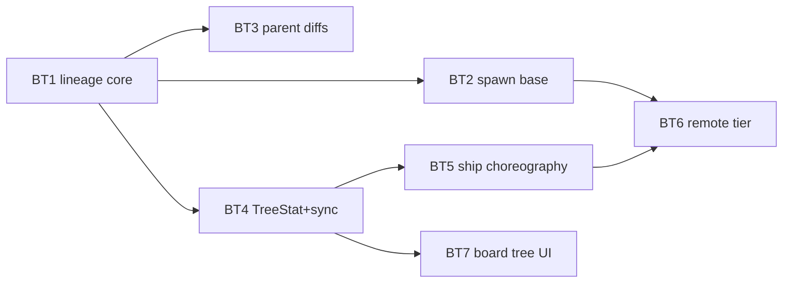

# Layer 3 — Implementation: Branch Tree

> The **how**, written with [[04-tests]] for one combined gate. Implementation lands as
> **main-based PRs after the mobile branch merges** — this doc is the plan, not a diff.

## Implementation approach (per component)

### 1. Model additions (`Sources/OrchestraKit/Model.swift`)

- `TreeStat { state: TreeState, behind: Int, parentIsRemote: Bool }`, `TreeState` enum
  (`inSync/stale/restackNeeded/parentMerged`) — next to `DiffStat` (`:158`).
- `Task.treeStat: TreeStat?` — decode-with-default `nil` (the `diffStat` migration pattern,
  docs/03 §schema-migration). `Task.parentBranch` already exists (`:187`).
- `SpawnInput.base: String?` — plus the manual `init(from:)` default (`:684-696`).

### 2. `BranchLineage` (new `Sources/OrchestraCore/BranchLineage.swift`, actor)

- All ops = `Proc.run(["git","-C",repo,"config",…])` (house git idiom, `WorktreeManager` style).
  Reads: `--get branch.<b>.orchestra-parent` etc.; writes: plain `config` set; `clear` =
  `--unset` each key, tolerating exit 5 (unset key).
- Canonical parent string: `origin/<name>` ⇒ remote (split on first `/` against the repo's
  remote list via `git remote`), else local. PR number rides `orchestra-parent-pr`.
- `children(repo,of:)` = `--get-regexp '^branch\..*\.orchestra-parent$'` + suffix match;
  `ancestors` walks `read` with a visited-set (cycle-safe); `set` rejects self/cycle with
  `OrchestraError.invalidParams`.
- Base OID at `set`: `merge-base` for adopt (via `Proc` in the child worktree), the fetched
  tip for spawn-with-base, caller-supplied for `synced`.

### 3. `WorktreeManager.ensure(repo:branch:base:)` (`WorktreeManager.swift:20-49`)

- New-branch arm only (`:38`): `argv += [base]` when non-nil ⇒
  `git worktree add -b <branch> <wt> <base>`. Validate first: local base via `branchExists`
  (`:71`), remote base = already-fetched `refs/orch/parents/…` via `rev-parse --verify`.
  Unknown ⇒ `invalidParams("base branch not found")`. Existing-branch arm ignores `base`.

### 4. Spawn threading

- Catalog (`CommandCatalog.swift:35`): `"base": strProp(…)` on `spawn` (+ `batch-spawn`).
- Registry (`CommandRegistry.swift:37`): `base: p.optString("base")` → `SpawnInput`.
- `OrchestraService.spawn` (`OrchestraService.swift:212`): before `worktrees.ensure` —
  remote base ⇒ `RemoteParents.fetch` (get OID); after task build: `base` given ⇒
  `lineage.set` + `task.parentBranch = canonical`; no `base` but branch pre-existed ⇒
  `task.parentBranch = lineage.read()?.parent` (**churn derivation**). Then
  `scheduleTreeStat(id)`.
- CLI (`CLIRunner.swift:24`): `--base` flag. `BoardStore.spawn` (`BoardStore.swift:648`):
  `base: String?` param. MCP: free via catalog.
- Spawn sheets: desktop (`App/Views/SpawnSheet.swift`) + iOS (`App-iOS/Views/SpawnSheet.swift`)
  add a **base picker** under the branch combo — same `spawnBranches` RPC source, plus a free
  "PR #N" text entry (remote). Default empty = today's behavior.

### 5. Diff baseline switch (goal 1)

- Footer: `recomputeDiffStat(id, base:)` call sites pass
  `t.parentBranch != nil ? .parent : .branch` (`OrchestraService+Diff.swift:31,57`).
- Inspector defaults: `DiffInspectorView.swift:18` + `DiffTab.swift:15` initial
  `base = task.parentBranch != nil ? .parent : .branch` (picker keeps all three).
- Zed: `Launcher.branchDiffDirs` (`Launcher.swift:188-238`) — `mergeBase(…)` gains a
  `parentBranch` override mirroring `DiffBaseline.range`.
- Open-notes: same substitution where `changedNotes` computes its baseline.
- Remote parent: `parentBranch` resolves to `refs/orch/parents/…` in one helper
  (`resolvedParentRef(task)`) used by all four consumers.

### 6. `TreeStat` maintenance (new `OrchestraService+Tree.swift`)

- `scheduleTreeStat(_ id:)` — clone of the diffStat debounce (`+Diff.swift:57`,
  `diffStatDebounce` dict at `OrchestraService.swift:72`) with its own dict.
- `recomputeTreeStat`: read lineage; parent tip = `rev-parse` (local) or last-fetched OID
  (remote); `behind = rev-list --count <base>..<tip>`; `restackNeeded` when
  `merge-base --is-ancestor <base> <tip>` fails or a `shipped`/watch event flagged it;
  persist+emit only on change (idempotent).
- Funnel hook (`OrchestraService+Report.swift:139`): alongside `scheduleDiffStat(id)` —
  `scheduleTreeStat(id)` and, via `lineage.children(repo, of: task.branch)` mapped through the
  branch→card lookup, `scheduleTreeStat(childId)` for each live child card.
- **Stale nudge on transition only:** old `state == .inSync && new == .stale` ⇒
  `inbox.enqueue(id, …)` + `wake(id)` (the `concludeCard` idiom, `+Wake.swift:70-71`).

### 7. Commands `set-parent` / `tree` / `synced` / `shipped`

- Catalog + registry pairs (exposure `.all`; the pairing test enforces both halves), thin
  handlers over new service methods:
  - `setParent(ref, parent?, mode, watch)` — adopt: lineage.set(base = merge-base); move:
    lineage.set + `treeStat = .restackNeeded` + restack nudge (enqueue+wake); clear on nil.
  - `tree(scope)` — assemble `TreeSnapshot` (per card: branch, parent, children, treeStat,
    derived parent-card id) from `lineage` + `TaskStore`; serves board grouping + agents.
  - `synced(ref)` — `lineage.updateBase(parent tip)` + `recomputeTreeStat`.
  - `shipped(ref)` — §8.
- CLI: four new `case`s (`CLIRunner.swift` switch).

### 8. Ship choreography

- `shipped(ref)` service method: (a) derived parent-card lookup — active task where
  `repo == t.repo && branch == link.parent` — ⇒ `inbox.enqueue + wake` ("child <branch>
  merged: <summary>"); no card ⇒ `activity(.warning…)` item. (b) for each child of the shipped
  branch: `lineage` rewrite parent := shipped branch's own parent (grandparent), set
  `treeStat = .restackNeeded`, enqueue restack nudge + wake. Idempotent (re-run no-ops).
- **TreeDocs** (new `Agents/TreeDocs.swift` + `Resources/tree-skill.md` / `tree-agents.md`,
  `.copy` in `Package.swift:65`): `DelegationDocs` clone. Claude →
  `<cwd>/.claude/skills/orchestra-tree/SKILL.md` (`ClaudeCodeAdapter.swift:153` call site);
  Codex → **generalize the installer**: `CodexAdapter.swift:214` currently owns
  `CODEX_HOME/AGENTS.md` wholesale — change to compose named sections (delegation + tree)
  behind `<!-- orchestra:section -->` markers, rewrite-idempotent.
- Skill content (both agents): sync (`git merge` parent → `orchestra synced`), restack
  (commit WIP → `rebase --onto <new-parent> <recorded-base>` → `synced`), ship-into-parent
  (resolve via `orchestra tree`: live parent ⇒ `send` merge-request + stop; bare ⇒ ephemeral
  `worktrees.ensure`-style checkout, `merge --squash`, commit, `shipped`, reclaim; main ⇒
  today's flow; remote ⇒ publish path). Parent-side: on merge-request, squash-merge in own
  tree → `orchestra shipped <child>`.
- Repo `.claude/commands/ship.md`: add the tree-aware branch (checked-in, Claude slash surface).

### 9. `RemoteParents` (new actor) + `GhProbe`

- `fetch`: `git fetch origin '+<src>:refs/orch/parents/<name>'` where src =
  `refs/pull/N/head` (PR) or `refs/heads/<b>`; env `GIT_TERMINAL_PROMPT=0`; `Proc` timeout;
  returns `rev-parse` of the private ref.
- `lsRemoteTip`: `git ls-remote origin refs/heads/<b> refs/pull/N/head` — empty ⇒ deleted.
- Watch loop: per-card `Task { while … Task.sleep }` held in a cancellation dict (the
  `diffStatDebounce` state pattern); 60 s active / 300 s idle backoff; tick = ls-remote →
  (tip moved ⇒ fetch + `scheduleTreeStat`) → ladder: `GhProbe.prState == MERGED` ⇒ run
  `shipped`-equivalent redirect with grandparent := PR `baseRefName` + repair child PR base
  (`gh pr edit --base`); tip vanished & no gh ⇒ warning activity ("parent branch gone —
  likely merged").
- `GhProbe`: `Proc.toolExists("gh")` + `gh pr view N --json state,mergedAt,mergeCommit,baseRefName`
  decoded via `JSONDecoder`; auth errors classify to a warning, never retry-spin.
- Lifecycle: `startWatch` on spawn-with-remote-base (and `set-parent watch:true`); `stopWatch`
  on archive/clear; daemon restart ⇒ watches rebuilt at startup scan from lineage config of
  live cards.

### 10. Board affordances

- `BoardStore`: `parentCard(of:) -> Task?` (derived lookup), `treeDepth/childrenByParent`
  computed off `tasks` + `tree` snapshot; `cards(in:)` (`BoardStore.swift:247`) orders
  children after their parent (same column only, per gate), depth capped at 3 indents.
- `CardView.swift` (footer region `:135-177`) + `BoardCardCell.swift` (`:71`): parent chip
  `⤴ <parent>` (click/tap ⇒ select parent card) + `↓N` / `⟲ restack` badge off
  `task.treeStat`. Views read `Task` directly — no store plumbing.

## Edge cases & error handling

- **Cycle / self-parent:** rejected in `lineage.set` (`invalidParams`) — covers `set-parent`
  and spawn.
- **Unknown base at spawn:** validated pre-`ensure`; remote fetch failure surfaces the
  classified `Proc` error; card is not created half-linked.
- **Spawn onto a branch owned by a live card:** unchanged `branchInUse` (1:1 rule).
- **Dirty child at restack/sync:** skill mandates commit-WIP-first; a failed
  merge ⇒ `git merge --abort` and report; never autostash.
- **Parent card archived between merge-request and consumption:** inbox is durable, but the
  branch went bare — parent-side skill step is lost. The child's ship skill re-resolves via
  `tree` on wake/timeout and falls back to the ephemeral-checkout path.
- **Ephemeral checkout races a new spawn on the parent branch:** `worktree add` ⇒
  `branchInUse` ⇒ ship falls back to merge-request (a card now owns it). Retry loop ≤1.
- **`shipped`/redirect idempotence:** re-running repoints already-repointed children to the
  same grandparent (no-op) and re-enqueues nothing new (nudge keyed on state transition).
- **Daemon restart mid-choreography:** lineage (git config), inbox, and tasks.json are all
  durable; `TreeStat` recomputed on next funnel event; watch loops rebuilt at startup.
- **Parent branch deleted locally (not shipped):** `recomputeTreeStat` can't resolve the tip ⇒
  `restackNeeded` + warning activity; user resolves via `set-parent`.
- **Remote auth/hang:** every remote `Proc` call has `GIT_TERMINAL_PROMPT=0` + timeout;
  failure ⇒ warning activity + backoff, watch never busy-loops.
- **gh absent:** ladder degrades one tier (documented in TreeDocs so agents don't invent
  detection).

## Sequencing / build order (main-based PRs)

| PR | Contents | Depends on |
|----|----------|-----------|
| **BT1 — lineage core** | `BranchLineage` + Model additions + `set-parent`(adopt/clear)/`tree` + churn derivation in spawn + CLI cases | — |
| **BT2 — spawn base** | `SpawnInput.base` threading, `ensure(base:)`, catalog/registry/CLI, both base pickers (local bases) | BT1 |
| **BT3 — parent diffs** | 4 diff consumers switch (footer/inspectors/Zed/notes) | BT1 |
| **BT4 — TreeStat + sync** | `TreeStat` field, recompute + funnel hook, stale nudge, `synced`, card badges | BT1 |
| **BT5 — ship choreography** | `shipped` RPC, `set-parent move`, TreeDocs (Claude+Codex installer generalization), ship.md | BT1, BT4 |
| **BT6 — remote tier** | `RemoteParents`, `GhProbe`, watch loop + ladder, remote base in spawn/pickers, publish path, PR-base repair | BT2, BT4, BT5 |
| **BT7 — board tree UI** | grouping/indent, jump-to-parent, `tree`-fed affordances polish | BT1, BT4 |

BT2/BT3/BT4 are parallelizable after BT1; BT7 anytime after BT4.

## Diagrams

### Bird's-eye (build order)



### Ship into a live parent (key flow)

```mermaid
sequenceDiagram
    participant C as Child agent
    participant D as orchestrad
    participant P as Parent agent
    C->>C: commit; orchestra tree → parent has live card
    C->>D: send(parent, "merge-request: child …") 
    D->>P: inbox + wake
    P->>P: git merge --squash child; commit (own worktree)
    P->>D: shipped(child)
    D->>D: notify parent card (self) · children of child: lineage → grandparent, TreeStat=restackNeeded
    D-->>C: (child archives as today)
    D->>D: nudge grandchildren: "restack onto <grandparent>"
```

### Remote parent merges (goal 8 → goal 4)

```mermaid
sequenceDiagram
    participant W as RemoteParents watch
    participant GH as GhProbe/git
    participant D as orchestrad
    participant A as Child agent
    W->>GH: ls-remote tips (60s/300s)
    GH-->>W: parent tip vanished / moved
    W->>GH: gh pr view --json state…
    GH-->>W: MERGED, baseRefName=main
    W->>D: redirect(child): lineage parent := main, TreeStat=restackNeeded
    D->>A: inbox "parent PR merged — restack onto main" + wake
    A->>A: commit WIP; rebase --onto main <recorded-base>; push --force-with-lease
    A->>D: synced → base OID updated; D repairs child PR base if published
```

## Traceability → Layer 2 contracts

| L2 contract | Implemented by (§) |
|-------------|--------------------|
| `BranchLineage` API | §2 |
| Data model (`TreeStat`, `SpawnInput.base`, config keys) | §1, §2 |
| Spawn threading + `ensure(base:)` | §3, §4 |
| Diff baseline switch (4 consumers) | §5 |
| `TreeStat` maintenance + stale nudge | §6 |
| `set-parent`(adopt/move)/`tree`/`synced`/`shipped` | §7, §8 |
| Ship choreography + `TreeDocs` (Claude+Codex) | §8 |
| `RemoteParents` + `GhProbe` + ladder + publish | §9 |
| UI affordances + grouping | §10 |

## Concerns / decisions for review

- **Codex `AGENTS.md` composition** is the one refactor with blast radius outside this feature
  (delegation doc shares the file) — isolated as the first commit of BT5.
- **`tree` payload growth** on big boards: scoped queries (`ref`/`repo`) and the board consumes
  its own `tasks` + lineage cache, not repeated `tree` calls.
- **Watch-loop rebuild at startup** scans only live cards' lineage config — no global repo scan.

## Open questions — need your call

- [ ] None blocking — both L3 docs gate together; see [[04-tests]].
