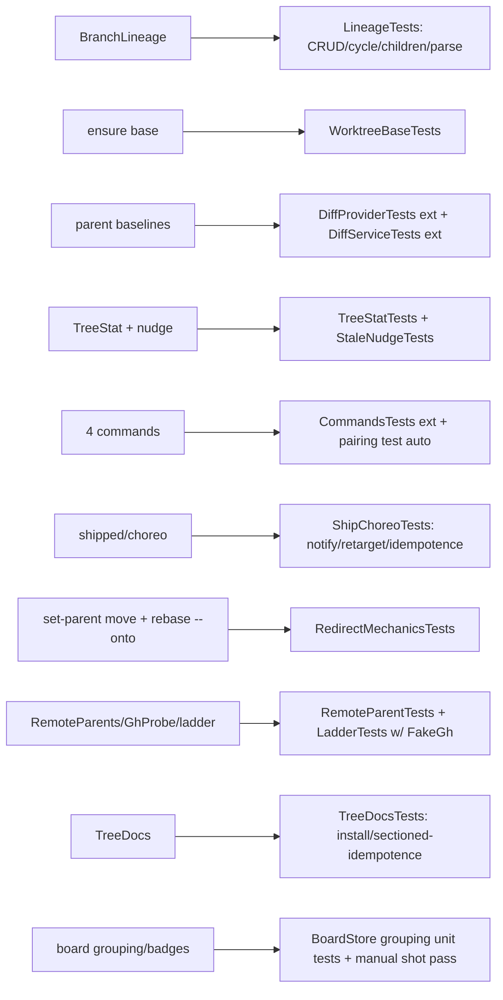

# Layer 3 — Test Design: Branch Tree

> Written with [[03-implementation]]; one combined gate. Tests are written before/with each
> BT-PR's code, never after.

## Test strategy & philosophy

- **Unit-heavy on real git.** The house pattern (`DiffProviderTests.makeRepo()`,
  `Tests/OrchestraCoreTests/DiffProviderTests.swift:11-27`) builds throwaway repos with `Proc`
  — lineage, tree-stat, worktree-base, and redirect mechanics all get *real* `git` fixtures,
  no git mocking.
- **No network, ever.** "Remote" = a local **bare repo added as `origin`** (`file://`), with
  `refs/pull/N/head` created by hand — `fetch`/`ls-remote`/branch-deletion behave identically
  to GitHub. `gh` sits behind a `GhClient` protocol with a `FakeGh` — the probe's absence tier
  is a test case, not a mock gap.
- **Service-level integration** over real `TaskStore`/`Inbox` in temp dirs (existing
  `OrchestraServiceTests`/`InboxTests`/`MoveNotifyTests` pattern) for choreography: shipped,
  nudges, churn.
- **Deliberately untested:** agent skill *prose* (TreeDocs content beyond install mechanics),
  real GitHub behavior (covered by the ladder's design sources), UI pixel layout (manual
  `orch-ui-shot.sh` pass per BT7).

## Framework / tooling

swift-testing (`#expect`, `@Test`) in `Tests/OrchestraCoreTests/`, run via `swift test`
(offline). Shared fixture helpers extend the `makeRepo` idiom:
`makeRepo()` · `makeChild(repo, parent:, commits:)` · `makeBareOrigin(repo)` (adds `origin`,
pushes, can mint `refs/pull/N/head`) · `FakeGh(state:)`.

## Unit tests (per contract)

| L2 contract | Test cases |
|-------------|-----------|
| `BranchLineage` CRUD | set/read round-trip (local, remote, PR keys) · clear removes all keys · updateBase · unknown branch read ⇒ nil |
| Cycle guard | self-parent rejected · A→B→C then C.parent=A rejected · diamond attempt rejected (single-parent) |
| `children`/`ancestors` | fan-out of 3 children found · chain walk order · config with foreign keys untouched |
| Canonical parse | `feature-a` local · `origin/feature-b` remote · PR number round-trip |
| `ensure(base:)` | new branch starts at base tip (`rev-parse` equality) · existing branch ignores base · unknown base throws, no worktree dir left |
| `DiffBaseline.parent` (exists) | extend `parentFallsBackToBranch` (`DiffProviderTests.swift:96`): parent set ⇒ range is parent merge-base · after merge-sync the merge-base advances (triple-dot correctness) |
| `TreeStat` compute | inSync (base == tip) · stale behind=2 · restackNeeded (base not ancestor, i.e. amended parent) · parent branch deleted ⇒ restackNeeded |
| Stale transition nudge | inSync→stale enqueues exactly once (second recompute silent) · stale→stale no-op · nudge = enqueue+wake pair |
| `synced` | base OID := parent tip · treeStat back to inSync |
| `shipped` (a) notify | live parent card gets inbox msg + wake · bare parent ⇒ activity item, no throw |
| `shipped` (b) retarget | 2 children repoint to grandparent · treeStat=restackNeeded · idempotent re-run |
| `set-parent move` | lineage repointed + restack nudge enqueued · adopt: base = merge-base, no nudge |
| Redirect mechanics | scripted `rebase --onto grandparent <recorded-base>` in fixture ⇒ only child's own commits transplanted (squash-merged parent, the phantom-conflict case) |
| `RemoteParents.fetch` | PR ref lands in `refs/orch/parents/pr-N` · force-refspec survives remote rewrite · `GIT_TERMINAL_PROMPT=0` in env |
| `lsRemoteTip` | tip OID · deleted branch ⇒ nil |
| Detection ladder | FakeGh MERGED ⇒ redirect fired with PR baseRefName · gh absent + branch deleted ⇒ warning tier · ancestry true ⇒ WARN-only (proof-positive; never auto-redirects — only gh names the base) · ancestry false + squash ⇒ NOT treated as unmerged when gh says MERGED |
| `GhProbe` | toolExists gate · JSON decode of state/mergedAt/baseRefName · malformed/auth-error ⇒ nil + classified |
| Catalog/registry pairing | `CommandRegistryCatalogTests` extends automatically to the 4 new commands (pairing is asserted by the existing test) |
| Spawn param | `SpawnInput` decode with/without `base` (back-compat) · registry handler threads `base` |
| `TreeDocs` install | Claude path written under `.claude/skills/orchestra-tree/` · Codex sectioned AGENTS.md: both delegation + tree sections survive reinstall (idempotent, `DelegationDocsTests` pattern) |

## Integration / end-to-end tests

- **Spawn-with-base:** `spawn(base: parent)` ⇒ worktree HEAD == parent tip, lineage keys
  written, `task.parentBranch` set. (treeStat is nil until the first report recompute — spawn does
  not compute it.)
- **Churn derivation (the owner's requirement):** spawn child w/ base → archive → respawn same
  branch *without* base ⇒ `parentBranch` re-derived from config; diff baseline still parent.
- **Sync round-trip:** parent card commits (report funnel fired) ⇒ child treeStat stale +
  nudge; fixture-merge parent into child + `synced` ⇒ inSync, footer diffStat excludes
  parent's work.
- **Ship (bare parent):** ephemeral checkout squash-merge in fixture + `shipped` ⇒ parent
  branch contains squash commit · child's children repointed + nudged.
- **Ship (live parent):** merge-request lands in parent inbox; after fixture parent merge +
  `shipped` ⇒ notify/retarget as above.
- **Remote redirect:** bare-origin fixture, PR ref, FakeGh flips to MERGED ⇒ watch tick
  redirects child lineage to `main`, nudge enqueued.
- **Daemon-restart durability:** rebuild service over same temp HOME ⇒ lineage/inbox/watch
  set reconstructed (watch derived from live cards' config).
- **Manual (not CI):** `scripts/iso-stack.sh` session — spawn a 3-card tree, drive
  sync/ship end-to-end with a real agent; `orch-ui-shot.sh` for BT7 board grouping screenshots
  (desktop + iOS sim).

## Edge & error cases

Covered above where they live; explicitly: cycle rejection · unknown base · `branchInUse` on
ephemeral-checkout race (fixture: pre-create worktree) · dirty-tree merge abort restores state ·
double-`shipped` idempotence · archived-parent merge-request fallback (re-resolve ⇒ bare path) ·
watch backoff on `Proc` failure (no busy-loop: tick count asserted with short intervals).

## Fixtures / mocks / test data

- `makeRepo()` (exists) + new helpers above; worktrees cut under `NSTemporaryDirectory()`.
- Bare-origin fixture: `git init --bare` + `remote add origin file://…` + hand-minted
  `refs/pull/N/head` (`git update-ref` in the bare repo).
- `FakeGh: GhClient` — scripted `PrState` sequence per test; also "unavailable" variant.
- No tmux/agent processes anywhere in unit/integration tiers (service tests already run
  tmux-free by constructing `OrchestraService` directly).

## Coverage map

## Traceability → L2 contracts + L3 components

| Contract / component | Covering tests |
|----------------------|----------------|
| `BranchLineage` (§2) | LineageTests |
| Model/`SpawnInput` (§1) | decode/back-compat cases in ModelTests ext |
| `ensure(base:)` (§3) | WorktreeBaseTests |
| Spawn threading (§4) | spawn-with-base + churn integration |
| Diff switch (§5) | DiffProviderTests/DiffServiceTests extensions |
| TreeStat (§6) | TreeStatTests, StaleNudgeTests, sync round-trip |
| Commands (§7) | CommandsTests ext, pairing auto, `synced`/`set-parent` units |
| Ship choreography (§8) | ShipChoreoTests, both ship integrations, TreeDocsTests |
| Remote tier (§9) | RemoteParentTests, LadderTests, remote-redirect integration |
| Board UI (§10) | BoardStore grouping units + manual visual pass |

## Decisions made

| Decision | Why | Rejected |
|----------|-----|----------|
| Real git fixtures, no git mocks | mechanics (merge-base, rebase --onto, worktrees) are the risk | mocked Proc (tests the mock) |
| Bare `file://` origin as "remote" | fetch/ls-remote/PR-refs identical to GitHub, offline | live-network tests (flaky, authed) |
| `GhClient` protocol + FakeGh | ladder tiers testable incl. absence | shelling real gh (auth, network) |
| Redirect mechanics tested as scripted git | proves the phantom-conflict fix independent of agents | only-via-agent e2e (slow, nondeterministic) |
| UI = store-logic units + manual shot pass | grouping logic is testable; pixels aren't worth CI | snapshot tests (new infra, brittle) |

## Open questions — need your call

- [ ] None — gate together with [[03-implementation]].
