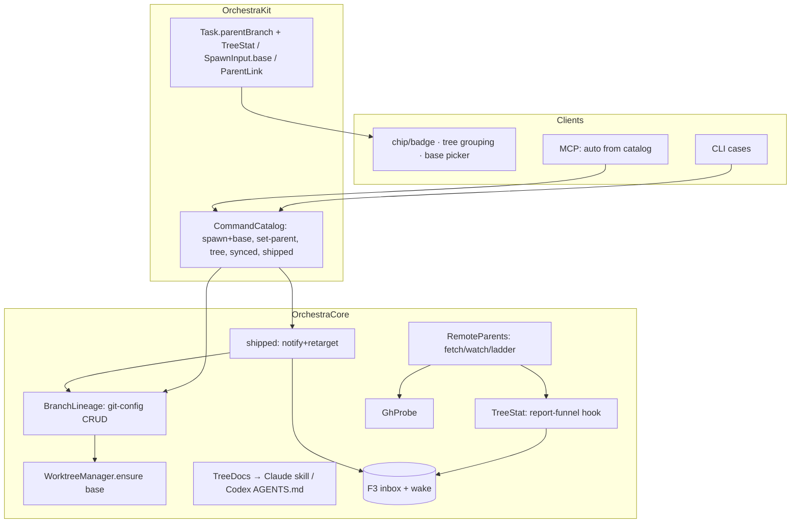

# Parent Card / Branch Linking — Design Index

> **Branch trees** for Orchestra: a card's branch based on another branch (card-optional parent),
> parent-relative diffs, spawn-on-branch across UI/MCP/CLI, parent→child sync, merge redirection,
> ship-into-parent, child-informs-parent, and remote PR-branch parents.
> Finalizes [[../stacked-branches-and-guardian-handoff|stacked-branches-and-guardian-handoff]] §2
> — renamed: the topology is a **tree** (parent/child cards), not a linear stack; "stacked PRs"
> survives only as GitHub's name for the remote publishing workflow.

## Resolved framing (2026-07-06, with owner)

- **Card-optional parent (option A):** the parent is a **branch ref**; "the parent card" is a
  live lookup (active card whose `repo`+`branch` match — unique under the 1:1 invariant), never
  a stored pointer. Degrades to pure-git behavior when no card owns the branch.
- **Lineage survives card churn:** the parent link is persisted **on the branch** in repo git
  config (`branch.<child>.orchestra-parent`), git-town/Graphite style; `Task.parentBranch` is a
  cache derived at spawn, not the source of truth.
- **Merges are Orchestra acts, not observed events** (local story): ship-into-parent notifies
  the parent's owning card via the F3 inbox and retargets grandchildren. Remote PR parents
  (goal 8) are the one place needing observation — scoped as opt-in `gh`-based checks.

## Layers

| Layer | Document | Status |
|-------|----------|--------|
| 1 — Initial design | [[01-design]] | **approved** (2026-07-06 gate) |
| 2 — Contract | [[02-contract]] | **approved** (2026-07-07 gate) |
| 3 — Implementation | [[03-implementation]] | **approved** (2026-07-07 gate) |
| 3 — Tests | [[04-tests]] | **approved** (2026-07-07 gate) |

<!-- Status values: not started · draft · in-review · approved · skipped -->

## Current picture

## Investigation verdicts (2026-07-06)

- **Topology: tree, single parent** — unanimous prior art; true DAG needs jj-class machinery git lacks.
- **Sync: merge-down routine + `rebase --onto` only at re-parent + squash at ship** — safest for
  concurrent agents; requires persisting the parent **base OID** (Graphite's `parentBranchRevision` lesson).
- **Remote parents:** fetch into `refs/orch/parents/…` (fork-safe, read-only); merge-detection ladder
  `gh pr view` → branch-deleted heuristic → ancestry (proof-positive only); never trust GitHub auto-retarget.

## Open questions (rolled up)

**None — all four layers approved** (L1 2026-07-06; L2+L3 2026-07-07). Gate resolutions live in
each doc's Open-questions section.

## Implementation status (2026-07-07)

**All seven PRs (BT1–BT7) are implemented and merged onto `plan/parent-card-branch-linking`**
via orchestrated child cards, each with its own plan (`notes/plans/2026-07-07-bt*.md`), TDD
pass, and ≥1 review-fix round. Final gate: 631 tests / 126 suites — green except the
pre-existing environmental PTY-exhaustion flake in the two real-tmux suites (untouched by this
work; see memory `swift-test-tmux-pty-exhaustion`). Remaining step: merge this branch to `main`
after `mobile-impl-orchestration` lands (the original main-based-PRs plan collapses to one
integration merge).
