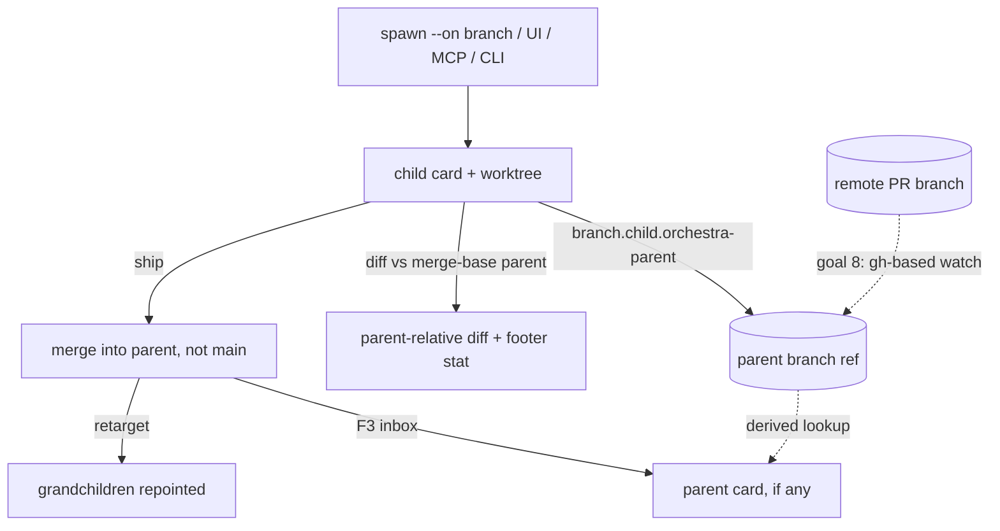

# Parent Card / Branch Linking — Design Index

> Stacked & DAG branches for Orchestra: a card's branch based on another branch (card-optional
> parent), parent-relative diffs, spawn-on-branch across UI/MCP/CLI, parent→child sync, merge
> redirection, ship-into-parent, child-informs-parent, and remote PR-branch parents.
> Finalizes [[../stacked-branches-and-guardian-handoff|stacked-branches-and-guardian-handoff]] §2.

## Resolved framing (2026-07-06, with owner)

- **Card-optional parent (option A):** the parent is a **branch ref**; "the parent card" is a
  live lookup (active card whose `repo`+`branch` match — unique under the 1:1 invariant), never
  a stored pointer. Degrades to pure-git behavior when no card owns the branch.
- **Lineage survives card churn:** the parent link is persisted **on the branch** in repo git
  config (`branch.<child>.orchestra-parent`), git-town/Graphite style; `Task.parentBranch` is a
  cache derived at spawn, not the source of truth.
- **Merges are Orchestra acts, not observed events** (local story): ship-into-parent notifies
  the parent's owning card via the F3 inbox and retargets grandchildren. Remote PR parents
  (goal 8) are the one place needing observation — scoped as opt-in `gh`-based checks.

## Layers

| Layer | Document | Status |
|-------|----------|--------|
| 1 — Initial design | [[01-design]] | in-review |
| 2 — Contract | [[02-contract]] | not started |
| 3 — Implementation | [[03-implementation]] | not started |
| 3 — Tests | [[04-tests]] | not started |

<!-- Status values: not started · draft · in-review · approved · skipped -->

## Current picture

## Investigation verdicts (2026-07-06)

- **Topology: tree, single parent** — unanimous prior art; true DAG needs jj-class machinery git lacks.
- **Sync: merge-down routine + `rebase --onto` only at re-parent + squash at ship** — safest for
  concurrent agents; requires persisting the parent **base OID** (Graphite's `parentBranchRevision` lesson).
- **Remote parents:** fetch into `refs/orch/parents/…` (fork-safe, read-only); merge-detection ladder
  `gh pr view` → branch-deleted heuristic → ancestry (proof-positive only); never trust GitHub auto-retarget.

## Open questions (rolled up)

- [ ] Footer diffstat for stacked cards: parent-relative only, or both baselines?
- [ ] Sync nudge default: badge only vs badge+inbox (rec.) vs auto-merge?
- [ ] Ship-into-parent = squash — confirm.
- [ ] Remote-parent v1: read-only tier only (rec.), or include push-into-parent?
