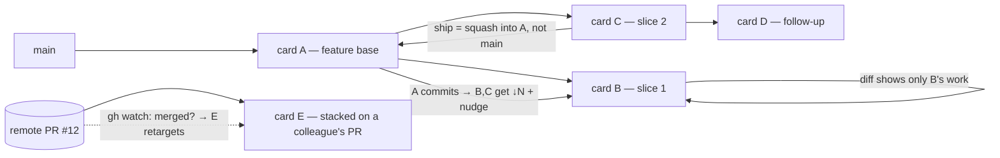
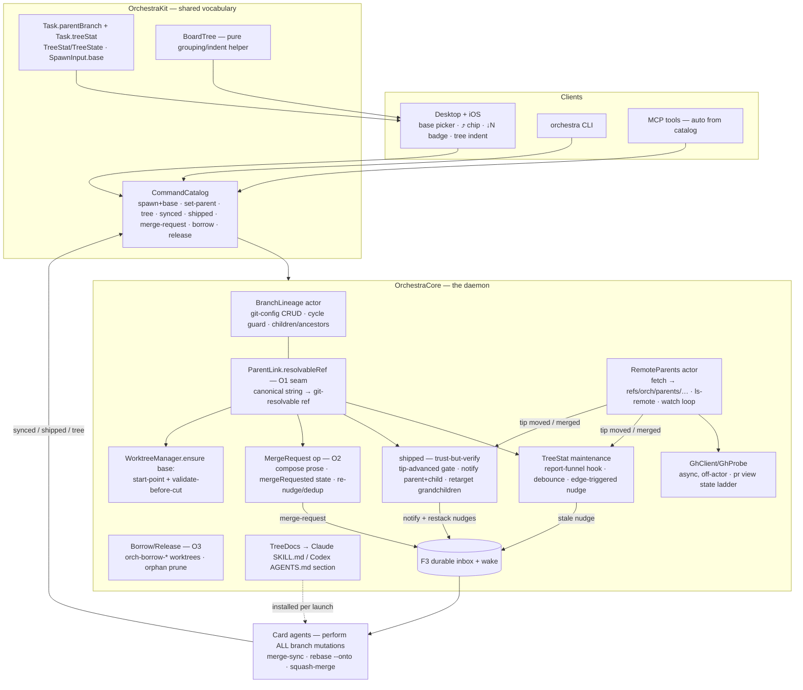

# Branch Tree — what this branch changes, end to end

> Reviewer-oriented overview of `plan/parent-card-branch-linking` vs its base
> (`mobile-impl-orchestration`): the **branch tree** feature — a card's branch can be based on
> any other branch (another card's, a bare local branch, or a remote GitHub PR), and the card's
> whole lifecycle (diff, sync, ship, redirect, notify) runs relative to that **parent**.
> Includes the deep-review fix round (all findings + overhauls O1–O4). 661 tests green.

## 1. Simple diagram



One sentence: **cards form a family tree; each card sees, syncs with, and ships into its
parent — and the tree self-repairs when any parent lands.**

## 2. Complex diagram



## 3. Inventory — everything added

### New components (files)

| Component | File | Role |
|---|---|---|
| `BranchLineage` (actor) | `Sources/OrchestraCore/BranchLineage.swift` | git-config lineage CRUD, cycle/self-parent guard, `children`/`ancestors` walks |
| `ParentLink` (+ `resolvableRef`) | same file | the link value: `parent` (canonical), `base` (anchor OID), `prNumber?`, `watch`; O1's canonical→resolvable seam |
| Tree service | `Sources/OrchestraCore/OrchestraService+Tree.swift` | `setParent` (adopt/move/clear), `tree`, `synced`, TreeStat recompute + debounce + nudges |
| ParentRef helper | `Sources/OrchestraCore/OrchestraService+ParentRef.swift` | forwarder mapping a Task's parent to its diff-baseline ref |
| Merge-request op | `Sources/OrchestraCore/OrchestraService+MergeRequest.swift` | O2: first-class merge-request (state, re-nudge, dedup, cleared by `shipped`) |
| Borrow lifecycle | `Sources/OrchestraCore/OrchestraService+Borrow.swift` | O3: `borrow`/`release` ephemeral worktrees (`orch-borrow-*`) + orphan prune |
| Remote tier | `Sources/OrchestraCore/RemoteParents.swift`, `RemoteParentRef.swift`, `OrchestraService+Remote.swift` | private-ref fetch, ls-remote tri-state, per-card watch loop, redirect on merge |
| gh probe | `Sources/OrchestraCore/GhProbe.swift` | `GhClient` protocol + gh-CLI implementation (async, off-actor), capability-probed |
| Agent guidance | `Sources/OrchestraCore/Agents/TreeDocs.swift` + `Resources/tree-{skill,agents}.md` | sync/restack/ship instructions for Claude (skill) and Codex (AGENTS.md section, via the generalized sectioned composer) |
| Board tree helper | `Sources/OrchestraKit/BoardTree.swift` | pure in-column grouping/indent/parent-lookup used by both boards |

### Key internal interfaces (the seams)

```swift
// BranchLineage (actor) — the lineage SSOT
read(repo:branch:) -> ParentLink?          set(repo:branch:link:)  // cycle-guarded, atomic
clear(repo:branch:)                        updateBase(repo:branch:oid:)
children(repo:of:) -> [String]             ancestors(repo:of:) -> [String]

// ParentLink — the O1 seam every git verb resolves through
parent: String  base: String  prNumber: Int?  watch: Bool
resolvableRef: String     // local → refs/heads/<b> · remote → refs/orch/parents/<name>

// TreeStat maintenance
scheduleTreeStat(id)      recomputeTreeStat(id)   // idempotent, change-gated, edge-nudge

// RemoteParents (actor)
fetch(repo:ref:) -> OID   lsRemoteTip(repo:ref:) -> RemoteTip(.at/.gone/.unavailable)
startWatch(cardId:…)      stopWatch(cardId)       // generation-token lifecycle

// GhClient (protocol; GhProbe = gh-CLI impl, FakeGh in tests)
prState(repo:pr:) async -> PrState?        // state/mergedAt/mergeCommit/baseRefName
```

### New/changed commands (registry + CLI + MCP — the external interface)

| Command | What it does |
|---|---|
| `spawn`/`batch-spawn` + `base` param | create the card's branch ON a parent (local name, `origin/<b>`, or `pr#N`); records lineage |
| `set-parent {ref, parent?, mode, watch?}` | adopt (relink, base = merge-base) · move (transplant: repoint + restack nudge) · clear; remote parents + watch opt-in |
| `tree {ref?\|repo?}` | lineage snapshot: parent, children, `TreeNode.base` (the rebase anchor), treeStat, derived parent-card id |
| `synced {ref}` | agent's "I merged the parent down" — records the **verified merge-base**, recomputes |
| `shipped {ref}` | post-merge bookkeeping: sanity-gate (parent tip advanced), notify parent card + shipped child, retarget grandchildren, clear merge-request |
| `merge-request {child}` | O2: daemon composes the canonical merge-request to the parent card, records `mergeRequested`, re-nudges/dedups |
| `borrow {ref}` / `release {ref}` | O3: daemon-managed ephemeral checkout of a bare parent for the agent to merge in |

### Schema / storage

| Store | Addition |
|---|---|
| repo git config (durable lineage SSOT) | `branch.<child>.orchestra-parent` (canonical name) · `orchestra-parent-base` (anchor OID, updated on sync/restack) · `orchestra-parent-pr` · `orchestra-parent-watch` |
| git refs (read-only namespace) | `refs/orch/parents/<name>` — private fetch destination for remote parents (force-refspec, fork-PR-capable via `refs/pull/N/head`) |
| filesystem | `orch-borrow-*` ephemeral worktrees (daemon-created, swept on release/archive/startup) |
| `tasks.json` (`Task`) | `parentBranch: String?` (cache of canonical), `treeStat: TreeStat?` (`state ∈ inSync/stale/restackNeeded/mergeRequested`, `behind`, `parentIsRemote`) — both decode-with-default (wire-safe) |
| `SpawnInput` | `base: String?` |

### Messages (all ride the existing F3 durable inbox + wake)

| Message | Trigger → recipient |
|---|---|
| stale nudge | parent tip moved past recorded base (inSync→stale edge only) → child card |
| merge-request | child ships under a live parent → parent card (re-nudged on timer, deduped) |
| child-shipped notify | `shipped` → the shipped child ("your merge landed — archive") and the parent card |
| restack nudge | parent shipped / `set-parent move` / remote parent merged → each child ("rebase --onto <new-parent> <anchor>, then `orchestra synced`") |
| activity warnings (latched) | bare-parent ship with no card · remote parent gone/closed-unmerged · multiplicity warning |

### UI (desktop + iOS)

Base picker in both spawn sheets (local branches + remote/PR entry) · `⤴ parent` chip with
jump-to-parent · `↓N` / restack / merge-requested badges · same-column tree indentation ·
parent-relative diff **by default** in both inspectors, the footer diffstat, Zed "view changes",
and open-notes (baseline labeled for legibility).

## 4. Major design decisions — and what was discarded

| Decision | Why | Discarded alternative |
|---|---|---|
| Parent = **branch ref**; parent *card* always derived by lookup | no stale pointers; uniformly covers main / bare branch / remote PR; survives card churn | stored `parentCardId` (lifecycle repair burden); enforced parent card (board clutter, inverts the remote case) |
| Lineage lives in **repo git config** | survives card/daemon churn; migrates on `git branch -m`, deletes on `-D`; plain-git debuggable; git-town/Graphite precedent | Task-only field (dies with card); refs/notes metadata (overkill, opaque) |
| **Tree, not DAG** (single parent, many children) | merge-base diffs, `--onto` redirect, and ship semantics stay well-defined; unanimous prior art | true multi-parent DAG (needs jj-class conflict machinery git lacks); one-shot "merge sibling in" covers the real need |
| **Merge-down sync; `rebase --onto` only at re-parent; squash at ship** | no rewrites/force-push/cascades between concurrent agents; unique merge-bases; the recorded **base OID** makes squash-redirects phantom-conflict-free | routine rebase-restack (Graphite default — human-attended); merge-commit ship (criss-cross merge-bases); ff-only (too restrictive) |
| **Owning agent performs all branch mutations; daemon only records + nudges** | git forbids cross-worktree branch updates; avoids Graphite's 1.8.4-era data loss; daemon provably never touches refs | daemon-side central restacker / first-class daemon merges |
| Live parent ⇒ **parent merges child** (merge-request); bare parent ⇒ child borrows | the branch's checkout owner is the only safe merge performer; unowned branches have no owner to violate | child cd-ing into parent's worktree; `update-ref` plumbing (desyncs the parent's working tree) |
| **Trust-but-verify choreography** (O2, post-review) | agent prose compliance is the weakest hop; one-line git checks (`merge-base`, tip-advanced) put an integrity floor under `synced`/`shipped` | trusting reports verbatim (original draft — review showed silent corruption paths); full daemon-performed merges (rejected, see above) |
| One **canonical→resolvable seam** on the link (O1) | every git verb resolves the same way (`refs/heads/` pinned, remote → private ref); consumers can't get it wrong individually | per-consumer resolution helpers (the original shape — the review showed half the consumers missed it) |
| Remote detection ladder: **gh authoritative → branch-gone heuristic → ancestry proof-positive-only** | squash merges are invisible to pure git; never auto-redirect on a guess | ancestry-only detection (false "unmerged" forever on squash); webhooks (not viable for a local daemon) |
| `gh` and remote names behind probes (**capability + generalized remote**, O4) | works without gh (degrades one tier); non-`origin` remotes error clearly instead of silently misclassifying | hard gh dependency; hardcoded `origin` (config format would ossify) |
| Agent guidance as installed docs (TreeDocs) for **both** Claude and Codex | one substance, two delivery formats; no `if agent ==` in shared code | Claude-only slash command; daemon-enforced workflows (agents act on text) |

## 5. Upsides / downsides of the design

**Upsides**
- **Churn-proof by construction:** the branch carries its own lineage; cards, sessions, and the
  daemon can all die and recreate without losing the tree.
- **Concurrent-agent-safe:** no history rewrites in routine operation, no force-pushes, no
  cross-worktree mutations; every destructive op is performed by the branch's owner in its own tree.
- **Correct diffs everywhere, cheaply:** one merge-base seam feeds the card pill, both
  inspectors, Zed, and open-notes; a parent advancing never leaks into a child's diff.
- **Degrades gracefully along every axis:** no parent card → activity item; no gh → heuristic
  tier; no network → last-fetched ref with staleness hint; old clients → unknown fields default.
- **Observable:** `tree` exposes the whole family (including the rebase anchor); mergeRequested/
  stale/restack states are visible on the card face; warnings are latched, not spammed.

**Downsides**
- **Choreography rides agent compliance.** Sync/restack/ship are performed by LLM agents
  following installed prose; O2's verification gates bound the damage but can't force action —
  a non-compliant agent stalls its subtree (visible, but stalled).
- **git config is repo-local:** lineage doesn't travel to clones/remotes (fine for Orchestra's
  local-first model; a limitation if trees ever need to be shared across machines).
- **Polling, not push, for remote parents:** 60s/300s ls-remote+gh ticks per watched card —
  bounded and cheap, but merge detection latency is up to a tick.
- **More states to reason about:** a card can now be inSync/stale/restackNeeded/mergeRequested ×
  local/remote parent × live/bare parent — the matrix is tested, but it's real complexity.
- **Squash-at-ship loses child commit granularity on the parent** (full history remains on the
  archived child's branch).

## 6. Where bugs are most likely (watch these in review/beta)

1. **The choreography state machine under adversarial timing** — merge-request pending while
   the parent archives / the child re-parents / a second `shipped` races. The fix round closed
   the found races (dedup, sanity gates, stopMergeRequestNudge on re-parent), but this is the
   largest reachable-state surface; new interleavings are the most probable bug source.
2. **Remote watch loop lifecycle** — generation-token cancel/install is careful concurrency
   code; leaks or double-loops would show as duplicate redirects or lingering gh calls after
   archive/clear.
3. **Recorded-base (anchor) drift** — everything (restack correctness, ↓N, redirect) hangs on
   `orchestra-parent-base` being updated at exactly sync/restack/ship. An agent doing manual git
   without `synced` leaves a stale anchor; behavior degrades to restackNeeded (fail-safe) but
   the ↓N count can mislead until then.
4. **1:1 uniqueness assumptions** — derived lookups now warn on multiplicity and spawn refuses
   onto owned branches, but out-of-band branch checkouts (user-made worktrees) can still create
   ambiguity the board can't see.
5. **Borrow sweep vs concurrent spawn** — `orch-borrow-*` pruning and `branchInUse` interplay
   (a crashed borrow blocking a spawn was O3's whole reason; the prune runs on archive/startup —
   mid-session stales are still possible).
6. **iOS/desktop drift** — the tree UI logic is shared (`BoardTree`), but chip/indent rendering
   is per-platform; visual regressions won't fail tests (manual `orch-ui-shot` pass is the gate).
7. **Cross-version daemons** — schema is wire-safe, but an OLD daemon rendering hooks or
   handling `tree`-era cards ignores lineage entirely (harmless, but a mixed-version machine
   can look like "the feature stopped working").

## 7. Workflows — how a real flow moves through the components

### W1 — Build a stack, stay in sync, ship a slice (all local, live parent)

1. **Spawn:** UI/CLI/MCP → `spawn {branch: "b", base: "a"}` → catalog/registry →
   `OrchestraService.spawn` validates, `WorktreeManager.ensure` cuts `b` at `a`'s tip
   (`git worktree add -b b <wt> refs/heads/a`), `recordSpawnBase` writes
   `branch.b.orchestra-parent=a` + anchor OID via `BranchLineage`; `Task.parentBranch="a"`.
   Board shows card B indented under A with a `⤴ a` chip.
2. **Parent commits:** A's agent activity → report funnel → `scheduleTreeStat(B)` →
   `recomputeTreeStat`: `rev-list --count <anchor>..refs/heads/a` = 2 → treeStat
   `stale ↓2`; edge inSync→stale fires ONE inbox nudge + wake to B.
3. **Child syncs:** B's agent (guided by TreeDocs): `git merge a` in its own worktree, resolves,
   then `orchestra synced b` → daemon records `merge-base(b, a)` as the new anchor (verified,
   not claimed) → treeStat inSync. B's diff pill still shows only B's own work (merge-base
   advanced through the sync commit).
4. **Child ships:** B's agent: commit, `orchestra tree` → parent has a live card →
   `orchestra merge-request b` → daemon composes the request into A's inbox (+wake), sets B's
   treeStat `mergeRequested` (visible "waiting" badge), re-nudges A on a timer if ignored.
5. **Parent merges:** A's agent: `git merge --squash b`, commit, `orchestra shipped b` → daemon
   sanity-gates (did A's tip actually advance?), notifies B ("your merge landed") + wakes it,
   retargets B's children (if any) onto A with restack nudges, clears the merge-request. B
   archives; branch `b` (with full history) survives.

### W2 — Parent lands on main; the family self-repairs (goal 4)

1. A's agent ships A to main (`/ship`, tree-aware) and calls `orchestra shipped a`.
2. Daemon: A's children (B, C) each get lineage repointed `parent := main` (grandparent),
   treeStat `restackNeeded`, and an inbox nudge with the exact command:
   `git rebase --onto main <recorded-anchor>` — the anchor is why only B's/C's own commits
   transplant even though main got A as one squash commit (no phantom conflicts).
3. Each child's agent rebases **in its own worktree**, runs `orchestra synced` → verified new
   anchor → inSync. No daemon ref was ever touched.

### W3 — Stacked on a colleague's PR (remote parent, goal 8)

1. **Spawn:** `spawn {branch: "e", base: "pr#12"}` → `RemoteParentRef.parse` (remote list, not
   hardcoded origin) → `RemoteParents.fetch` pulls `refs/pull/12/head` into
   `refs/orch/parents/pr-12` (force-refspec, `GIT_TERMINAL_PROMPT=0`, 20 s cap) → worktree cut
   at that OID; lineage stores canonical + `pr=12` + `watch=true`; watch loop starts.
2. **Diffs:** every consumer resolves the parent via `ParentLink.resolvableRef` →
   `refs/orch/parents/pr-12` — E's card shows only E's delta vs the PR.
3. **Watch tick (60 s/300 s):** `ls-remote` — tip moved ⇒ refetch + treeStat stale (same nudge
   path as local). Tip **gone** ⇒ ladder: `GhClient.prState` (async, off-actor) says MERGED with
   `baseRefName=main` ⇒ daemon runs the W2 redirect with grandparent := main and repairs E's
   published PR base (`gh pr edit`) — GitHub's auto-retarget is not trusted. CLOSED-unmerged ⇒
   latched warning, no redirect. No gh installed ⇒ latched "parent branch gone — likely merged;
   confirm and set-parent" warning; nothing automatic.
4. **Ship:** E never merges into the PR — it publishes: `git push -u origin e` +
   `gh pr create --base <pr-head-branch>` (TreeDocs publish path).

### W4 — Card churn on a branch (the survival property)

Spawn B on base A → archive B (worktree reclaimed, branch + config keys stay) → weeks later,
spawn a new card on existing branch `b` with **no base argument** → spawn's churn-derivation
reads `branch.b.orchestra-parent` from git config → the new card wakes up already knowing its
parent, with correct diffs, badges, and ship target. Nothing was stored on the dead card.

### W5 — Ship into a bare parent (no card owns it)

B ships; `orchestra tree` shows parent `a` has no live card → B's agent: `orchestra borrow a` →
daemon creates `orch-borrow-a` worktree (registered, crash-swept) → agent squash-merges B into
it, commits, `orchestra release a` + `orchestra shipped b` → daemon reclaims the borrow,
does the W1-step-5 bookkeeping (activity item instead of a parent-card notify).
