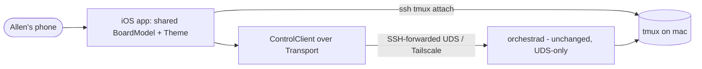
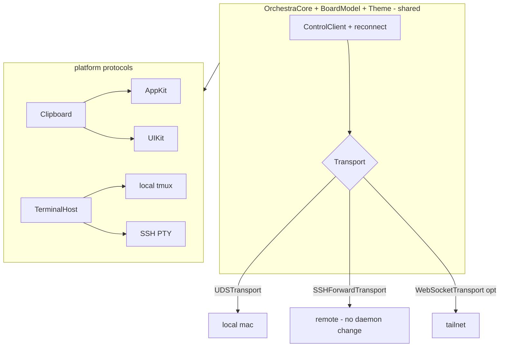

# Layer 1 — Initial Design: Phone Client

> The **what**: reach Orchestra from a phone — view the board, steer agents, see terminals — reusing the
> daemon unchanged, by landing the seams the shipped design already planned for.

## Purpose & problem

Allen wants to check and steer his agents from his phone. The shipped architecture was **shaped for this**:
the control plane is transport-agnostic JSON-RPC, remote access is designed as **SSH-over-Tailscale**
forwarding the daemon's UDS (so **no new daemon network surface**), and terminals ride **SSH's own PTY**.
`BoardModel` + `Theme` are already platform-neutral. What's missing are the concrete seams: the client is
hard-wired to raw-fd UDS (no `Transport` abstraction), there's **no reconnect** (fatal on mobile), and the
views are AppKit-bound (`NSViewRepresentable`, `NSPasteboard`, `NSWorkspace`, window chrome).

## Goals / non-goals

**Goals**
- A **`Transport` abstraction** under `ControlClient`/`ControlServer` (read-frame/write-frame/close) so the
  same client speaks over: **local UDS**, an **SSH-forwarded UDS** (remote, no daemon change), or an
  optional **WebSocket** (tailnet) — the shipped design's two remote options.
- **Reconnect + re-subscribe** in `ControlClient` (backoff) — essential on a flaky mobile link (and it
  fixes the desktop go-stale-after-daemon-restart class from the review).
- **Shared core**: an iOS target reuses `OrchestraCore` (models, `ControlClient`) + `BoardModel` + `Theme`;
  **platform bits behind protocols** (clipboard, terminal host, "reveal/open", window config) so each OS
  supplies its own.
- **iOS terminals over SSH PTY**: SwiftTerm-iOS attaching `ssh mac tmux attach …` (the designed path), so
  the daemon still proxies no bytes.
- **Auth = SSH keys** (per-device) as primary; the WS transport (tailnet trust) is the fallback only.

**Non-goals (this axis)**
- Building the full **iOS app UI** — design the seams + the shared-core split; the app is a follow-on.
- A **daemon network listener** as the primary path — SSH-forward keeps the daemon UDS-only; the WS
  listener is an opt-in fallback if a pure-WS client is ever wanted.
- **Push notifications** / background refresh — note as future.
- **Offline mode** — the phone is a thin remote client; no local daemon.

## Scope

**In scope:** the `Transport` protocol + UDS/SSH-forward/WS conformers; `ControlClient` reconnect; the
shared-core/platform-protocol split; the iOS terminal-over-SSH design; SSH-key auth. **Out of scope:** the
iOS app UI build, push, offline, a primary network listener.

## Inputs & outputs

| Direction | Description | Type / shape | Notes |
|-----------|-------------|--------------|-------|
| Input | Remote control calls | JSON-RPC over `Transport` | same protocol as local |
| Input | SSH credentials | per-device SSH key | Tailscale + SSH (already set up) |
| Output | Board state on phone | shared `BoardModel` over `ControlClient` | reuses desktop logic |
| Output | Terminals on phone | SwiftTerm-iOS over SSH PTY | no daemon proxy |
| Output | Platform actions | clipboard/open via iOS impls | behind protocols |

## Expected behaviour

- **Connect:** the phone reaches the daemon over **SSH-forwarded UDS** (Tailscale) — the *same* JSON-RPC
  the desktop uses, just over a different `Transport`. The daemon is unchanged (still UDS-only).
- **Resilience:** on a dropped link, `ControlClient` reconnects with backoff and re-subscribes; the board
  reflects connecting/offline/online (the desktop gets this too).
- **Board + steer:** the phone renders the shared `BoardModel` — list/spawn/move/send/archive all work as
  registry calls; provider/model pickers, search (axis 4), progress (axis 3), diffs (axis 7) come for free
  since they're daemon-side.
- **Terminals:** tapping a card attaches a SwiftTerm-iOS view to `ssh mac tmux -L orchestra attach -t …`.
- **Platform:** clipboard/open/terminal-host resolve to iOS implementations behind the shared protocols;
  the macOS app keeps its AppKit ones.
- **Degrade:** no connectivity → offline state with retry; no fabricated data.

## Complexity & risks

| Risk | Note |
|------|------|
| `Transport` refactor | `ControlClient`/`ControlServer` are raw-fd today; extract a `Transport` without regressing local UDS (the NDJSON framing is already reusable). |
| Reconnect correctness | Backoff, re-subscribe, de-dupe in-flight calls, surface state — must not double-resume (see the client bug fixed in review). |
| Platform split | Audit every AppKit use (`NSViewRepresentable`, `NSPasteboard`, `NSWorkspace`, window chrome, `NSFont`) and hide behind protocols / `#if os`. |
| iOS terminal over SSH | SwiftTerm-iOS + an SSH PTY (bundled SSH lib or system) — the heaviest new integration. |
| SSH key handling on iOS | Secure storage (Keychain/Secure Enclave); per-device keys; Tailscale on iOS. |
| WS fallback security | If ever used: tailnet-bound, no token (per shipped design) — keep it opt-in + documented. |

Rough sizing: **large** (mostly the iOS app, deferred). The *seam* work in scope here — `Transport`,
reconnect, the platform split — is **medium** and independently valuable (reconnect + the split improve the
desktop too).

## Diagrams

### Bird's-eye (context)

### Detailed (transport + sharing)

## Decisions made

| Decision | Why | Rejected |
|----------|-----|----------|
| `Transport` abstraction under the client/server | One client, many links; realizes the shipped plan | Keep raw-fd UDS only |
| Remote = **SSH-forwarded UDS** primary | No new daemon surface; SSH-key auth; already set up | A primary network listener |
| Reconnect + re-subscribe in `ControlClient` | Mobile needs it; fixes desktop staleness too | Per-caller reconnection |
| Share core; **platform bits behind protocols** | Reuse `BoardModel`/`Theme`; thin per-OS layer | Reimplement the client on iOS |
| iOS terminals over **SSH PTY** | Daemon proxies no bytes (shipped design) | Daemon WS `attachTerminal` proxy |

## Open questions — need your call

_All resolved at the 2026-06-26 gate:_ remote transport = **SSH-forwarded UDS primary, WebSocket documented
fallback** (not built now) · scope = **the shared-core seams** (Transport/reconnect/platform split/iOS-terminal
design); iOS app UI build is a **follow-on** · **pull `ControlClient` auto-reconnect ahead** as a near-term
standalone improvement (also hardens the desktop, deepening the shipped B5 fix).
