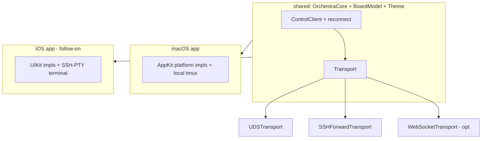
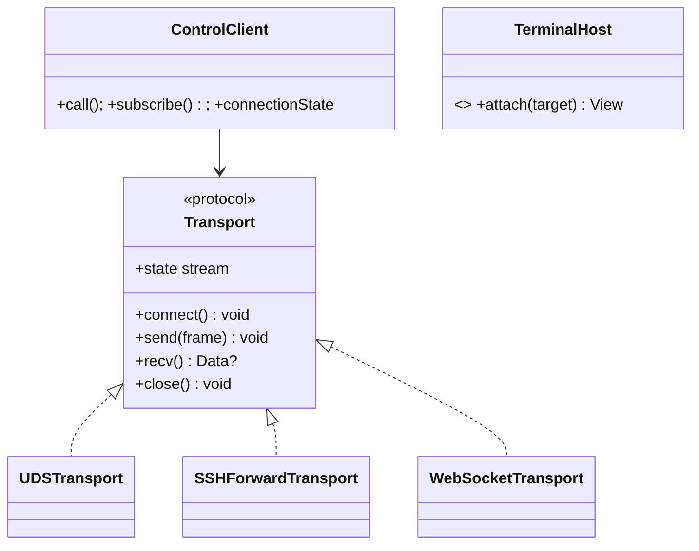

# Layer 2 — Contractual Design: Phone Client

> The **interfaces**: the `Transport` protocol + conformers, `ControlClient` reconnect, and the
> platform-abstraction protocols that let `OrchestraCore`/`BoardModel`/`Theme` be shared.

## Architecture overview

A `Transport` protocol (frame read/write/close + a connect/state signal) is extracted from the raw-fd code
in `ControlClient`/`ControlServer`; the existing NDJSON framing (`RPCCodec`) sits on top unchanged. Three
conformers: `UDSTransport` (today's local path, refactored), `SSHForwardTransport` (connect to an
SSH-forwarded UDS — no daemon change), and an optional `WebSocketTransport` (tailnet). `ControlClient` gains
a reconnect loop (backoff, re-subscribe, connection-state stream). A set of small **platform protocols**
(`Clipboard`, `TerminalHost`, `SystemOpener`, `WindowConfig`) abstract the AppKit bits so the iOS target
supplies its own (e.g. `TerminalHost` = SSH PTY on iOS, local `tmux attach` on macOS). `BoardModel` +
`Theme` move into shared code consumed by both targets.

## Major classes / modules

| Name | Responsibility | Collaborators |
|------|----------------|---------------|
| `Transport` (new protocol) | `connect`, `send(frame)`, `recv() -> frame`, `close`, state | `ControlClient`/`ControlServer` |
| `UDSTransport` (refactor) | Today's local UDS, behind `Transport` | `UDS` |
| `SSHForwardTransport` (new) | Connect to an SSH-forwarded UDS path (remote) | SSH/Tailscale |
| `WebSocketTransport` (new, opt) | Tailnet WS (fallback only) | (WS lib) |
| `ControlClient` (extend) | Reconnect + re-subscribe + connection-state stream | `Transport` |
| `Clipboard`/`TerminalHost`/`SystemOpener`/`WindowConfig` (new protocols) | Platform bits | mac + iOS impls |
| `BoardModel` / `Theme` (move to shared) | Reused by both targets | platform protocols |
| iOS target (new, follow-on) | SwiftUI views + iOS platform impls | shared core |

## Function / method contracts

### `Transport` (protocol)
- `func connect() async throws` — establish the link (UDS connect / SSH forward / WS open).
- `func send(_ frame: Data) async throws` / `func recv() async throws -> Data?` — one NDJSON frame
  (the `\n`-delimited framing already used). `nil` = closed.
- `func close()` + `var state: AsyncStream<TransportState>` (`connecting/open/closed`).
- **Conformers:** `UDSTransport` wraps the current fd logic; `SSHForwardTransport` points at the forwarded
  socket path; `WebSocketTransport` is opt-in.

### `ControlClient` (extend — reconnect)
- **Does:** on transport close, transition to `connecting`, reconnect with capped backoff, **re-subscribe**,
  and resume accepting calls; surface a `connectionState` stream the UI binds to. Reuses the
  double-resume-safe pending handling (fixed in the review).
- **Side-effects:** re-establishes the event stream so the board never silently goes stale (desktop benefit too).

### Platform protocols
- `Clipboard.copy(_ String)` — macOS `NSPasteboard`, iOS `UIPasteboard`.
- `TerminalHost.attach(target:) -> View` — macOS local `tmux attach`; iOS `ssh … tmux attach` (SwiftTerm-iOS).
- `SystemOpener.open(path:)` — macOS `NSWorkspace`/Zed; iOS a sensible no-op/alternative.
- `WindowConfig` — macOS title-bar chrome; iOS no-op.
- Injected into shared views via the environment so each target wires its own.

## Library / framework decisions

| Decision | Choice | Rationale | Alternatives considered |
|----------|--------|-----------|-------------------------|
| Remote transport | **SSH-forwarded UDS** (Tailscale), `Transport` seam | No daemon network surface; SSH-key auth; shipped plan | Primary WS listener |
| Framing | Reuse NDJSON `RPCCodec` over `Transport` | Already transport-agnostic | New wire format |
| iOS terminal | SwiftTerm-iOS over **SSH PTY** | Daemon proxies no bytes | Daemon WS `attachTerminal` |
| Code sharing | Shared `OrchestraCore`/`BoardModel`/`Theme` + platform protocols | One source of truth; thin per-OS layer | Reimplement on iOS |
| Auth | SSH keys per device | Stronger than tailnet-wide trust | Token / tailnet trust (WS only) |

## Diagrams

### Bird's-eye (components)

### Detailed (classes)

## Traceability → Layer 1

| L1 goal | Covered by |
|---------|-----------|
| `Transport` abstraction (local/SSH/WS) | `Transport` + `UDSTransport`/`SSHForwardTransport`/`WebSocketTransport` |
| Reconnect + re-subscribe | `ControlClient` reconnect loop + `connectionState` |
| Shared core; platform bits behind protocols | `BoardModel`/`Theme` shared + `Clipboard`/`TerminalHost`/… |
| iOS terminals over SSH PTY | `TerminalHost` iOS impl (SwiftTerm-iOS + SSH) |
| Daemon unchanged / network-free | SSH-forwarded UDS; no listener |
| SSH-key auth | `SSHForwardTransport` over the existing Tailscale+SSH |

## Decisions made

| Decision | Why | Rejected |
|----------|-----|----------|
| Extract `Transport`; keep NDJSON framing | Realizes the shipped transport-agnostic plan | Raw-fd only |
| SSH-forwarded UDS primary; WS opt-in | No daemon network surface; per-device keys | Primary WS listener |
| Reconnect lives in `ControlClient` (shared) | Mobile needs it; desktop benefits | Per-caller logic |
| Platform protocols, shared `BoardModel`/`Theme` | Reuse; thin per-OS layer | Reimplement client on iOS |
| Pull **reconnect** ahead as a standalone improvement | It also fixes the desktop go-stale bug | Bundle it only with iOS |

## Open questions — need your call

_All resolved at the 2026-06-26 gate:_ SSH-forwarded UDS primary + WS documented fallback · scope = the
seams (iOS app build is a follow-on) · pull `ControlClient` auto-reconnect ahead as a standalone fix.
