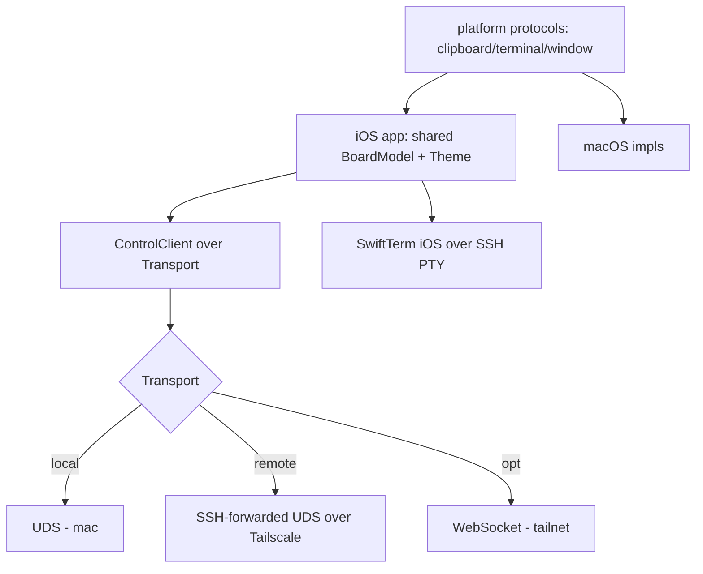

# Phone Client — Design Index

> A phone (iOS) client for Orchestra. The shipped design already anticipates it (transport-agnostic
> JSON-RPC; remote = SSH-over-Tailscale forwarding the UDS; terminals over SSH PTY). This axis adds the
> concrete seams: a **`Transport` abstraction**, **reconnect** in `ControlClient`, **platform-bit
> abstraction** so `OrchestraCore`/`BoardModel`/`Theme` are shared, and an **iOS terminal over SSH**.
> Part of the [[extensibility-roadmap/index|extensibility roadmap]] (axis 9).

## Status vs `main` (2026-06-29)

- **Still essentially unbuilt and unchanged.** The `Transport` seam this axis is built on does **not** exist
  yet — `Control/*` (`ControlClient`/`ControlServer`) is still raw-fd UDS only — so every goal here remains
  accurate and forward-looking. Reconnect is likewise still missing.
- **One shift to the shared surface:** the macOS board has grown since these docs, so the shared
  `BoardModel`/views an iOS target would reuse are slightly larger — they now include the **freeform region**
  (`FreeformRegionView`, `BoardModel.freeformTasks`, axis 4 shipped) and the **being-retired**
  shared-worktree badges (`SharedWorktreeBadge`/footer count — retired per
  [[stacked-branches-and-guardian-handoff]]'s enforced 1:1 worktree↔card). Net: the platform-split audit has
  a touch more surface to cover, and a couple of those views will disappear rather than need an iOS impl.
- **No conflict** with the two 2026-06-29 synthesis notes; they don't touch transport, reconnect, or the
  shared-core split.

## Layers

| Layer | Document | Status |
|-------|----------|--------|
| 1 — Initial design | [[01-design]] | approved |
| 2 — Contract | [[02-contract]] | approved |
| 3 — Implementation | [[03-implementation]] | not started (design-only pass) |
| 3 — Tests | [[04-tests]] | not started (design-only pass) |

> Design-only pass: L1+L2 approved 2026-06-26. SSH-forwarded UDS primary; scope = shared-core seams
> (iOS app build follow-on); pull ControlClient auto-reconnect ahead as a standalone fix.

## Related notes

- [[../2026-07-03-phone-agent-terminal-ux-design|Phone Agent & Terminal UX + the shared-tmux sizing
  problem]] (2026-07-03) — how the phone's **Agent** and **Terminal** tabs should work, and how to keep
  a narrow phone client from resize-thrashing the desktop agent's size-sensitive TUI. Headline: the
  phone reads the agent **structurally over RPC** (never a PTY attach to the agent window), and its
  live shell (when used) runs in a **phone-owned window** — per-window tmux sizes are independent.

## Current picture

## Open questions (rolled up)

_Resolved at the 2026-06-26 gate:_ SSH-forwarded UDS primary (WS fallback, not built now) · iOS terminals
via SSH PTY (SwiftTerm-iOS) · scope = shared-core seams, iOS app build follow-on · pull reconnect ahead.
