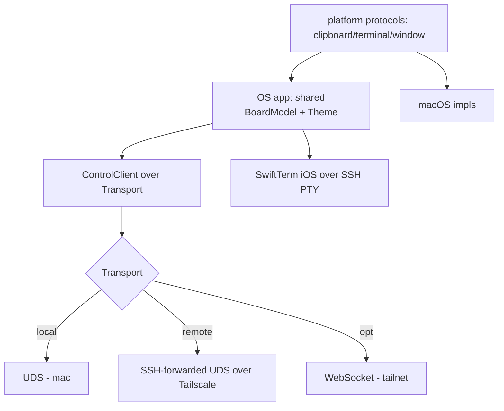

# Phone Client — Design Index

> A phone (iOS) client for Orchestra. The shipped design already anticipates it (transport-agnostic
> JSON-RPC; remote = SSH-over-Tailscale forwarding the UDS; terminals over SSH PTY). This axis adds the
> concrete seams: a **`Transport` abstraction**, **reconnect** in `ControlClient`, **platform-bit
> abstraction** so `OrchestraCore`/`BoardModel`/`Theme` are shared, and an **iOS terminal over SSH**.
> Part of the [[extensibility-roadmap/index|extensibility roadmap]] (axis 9).

## Layers

| Layer | Document | Status |
|-------|----------|--------|
| 1 — Initial design | [[01-design]] | approved |
| 2 — Contract | [[02-contract]] | approved |
| 3 — Implementation | [[03-implementation]] | not started (design-only pass) |
| 3 — Tests | [[04-tests]] | not started (design-only pass) |

> Design-only pass: L1+L2 approved 2026-06-26. SSH-forwarded UDS primary; scope = shared-core seams
> (iOS app build follow-on); pull ControlClient auto-reconnect ahead as a standalone fix.

## Current picture

## Open questions (rolled up)

_Resolved at the 2026-06-26 gate:_ SSH-forwarded UDS primary (WS fallback, not built now) · iOS terminals
via SSH PTY (SwiftTerm-iOS) · scope = shared-core seams, iOS app build follow-on · pull reconnect ahead.
