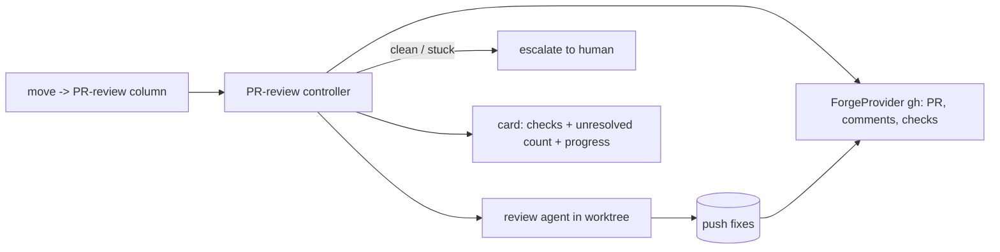
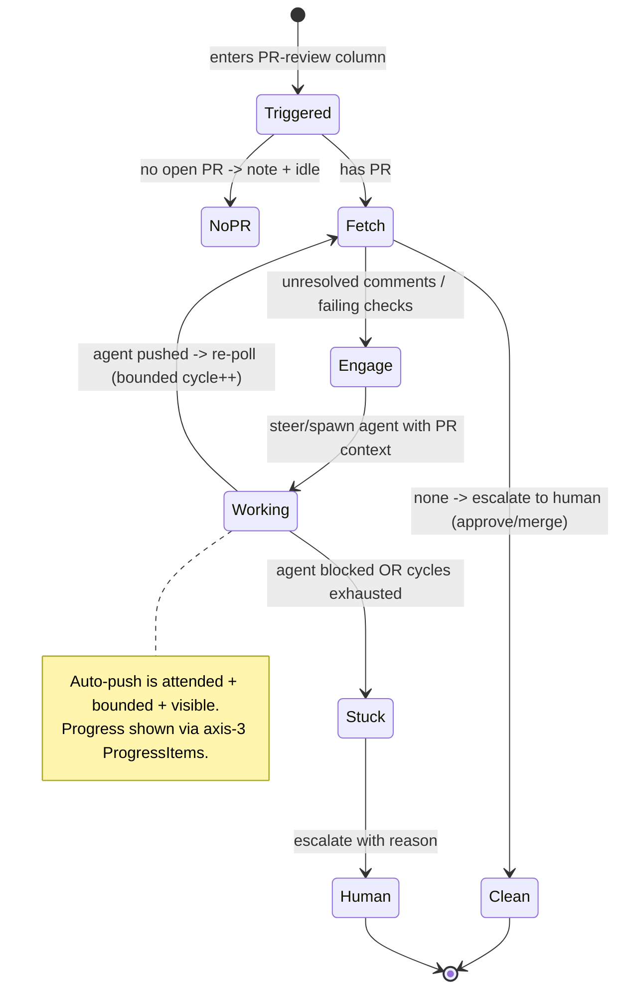

# Layer 1 — Initial Design: Automated PR-Review Phase

> The **what**: a board stage where an agent automatically works a card's pull request — addressing
> review comments and failing checks — instead of (or before) a human doing it.

## Purpose & problem

Today the **Review** column means *Allen* reviews. But much PR review work is mechanical: address a
reviewer's inline comment, fix a failing lint/test check, rebase. Allen wants a stage where an **agent**
picks up the card's PR and **deals with its issues automatically**, looping until the PR is clean (or it
genuinely needs a human), so human attention is reserved for judgment, not chores.

The pieces exist: each card already has a worktree on a branch (→ a PR), an agent + adapter, and (with
axes 1 + 3) configurable columns + progress reporting + context injection. This axis adds **PR awareness**
and a **column-entry automation policy** that drives a review agent.

> **The review agent is a lifecycle *phase* of the one card, not a second card co-tenant on its worktree.**
> Worktree↔card stays **1:1** throughout ([[../stacked-branches-and-guardian-handoff|stacked-branches-and-guardian-handoff]]
> §3). Two shapes: **(a)** the *same* card (same worktree, same or steered agent) continues into a review
> column — the default this axis describes; or **(b)** a **fresh-context successor** card via handoff
> ([[../context-continuity/index|context-continuity]] new-linked-card mode) — a baton pass where the
> successor inherits the worktree by **ownership transfer** (not sharing) and the predecessor retires, so
> there is **exactly one live owner at every instant**. Neither shape is N:1.

## Goals / non-goals

**Goals**
- A **column-entry automation policy** (generalizes the hook foreshadowed in axis 1): a column can carry an
  `onEnter` action; the first such action is "run PR review".
- **PR awareness**: resolve a card's branch → its GitHub PR; fetch **review threads** + **check runs**
  (via `gh`), behind a `ForgeProvider` seam so other forges can follow.
- A **review agent run**: spawn or steer an agent in the card's worktree, fed the PR context (unresolved
  comments + failing checks) via the prompt / axis-3 `additionalContext`; it pushes fixes.
- A **loop with escalation**: re-engage on new comments/failures; stop + **mark for human** when the PR is
  clean, the agent declares done, or it's stuck (no progress after N cycles).
- **Surface PR state on the card**: checks ✓/✗, unresolved-comment count (feeds axis 7's board review view).

**Non-goals (this axis)**
- **Merging** or **approving** the PR — that stays a human decision.
- A general CI system — read GitHub check status via `gh`; don't run CI ourselves.
- Non-GitHub forges in v1 — design the `ForgeProvider` seam, implement GitHub only.
- Unattended/headless operation — auto-push runs under attended use, same posture as `exec`.

## Scope

**In scope:** the column `onEnter` policy mechanism; a GitHub `ForgeProvider` (PR/comments/checks via
`gh`); the review-agent spawn/steer + context feed; the loop/escalation controller; PR state on the card.
**Out of scope:** merge/approve, running CI, non-GitHub forges, unattended mode.

## Inputs & outputs

| Direction | Description | Type / shape | Notes |
|-----------|-------------|--------------|-------|
| Input | Card enters the PR-review column | `move` → column with `onEnter: prReview` | trigger |
| Input | PR state | `gh` → `PRInfo {number, reviewThreads, checks, state}` | polled |
| Input | Agent progress / done | axis-3 `progress` items / status | drives the loop |
| Output | Review agent run | spawn/steer in the worktree with PR context | pushes commits |
| Output | Card PR state | checks ✓/✗ + unresolved count on the card | board + inspector |
| Output | Escalation | card flagged for human (status/Activity) | when clean or stuck |

## Expected behaviour

- **Trigger:** moving a card into the PR-review column (or an explicit "Auto-review" action) starts the
  policy. The card must have a branch with an open PR; if none, the policy no-ops with a clear note.
- **Engage:** Orchestra fetches unresolved review threads + failing checks, composes a task ("address
  these comments; fix these failing checks"), and **steers the existing agent** (preferred — it has
  context) or **spawns a fresh review agent** in the worktree, feeding the PR context.
- **Work + report:** the agent edits, pushes, and reports `progress` items ("Addressing comment #3",
  "Fixing failing test"); the card shows them live.
- **Loop:** Orchestra re-polls the PR; new failures/comments re-engage the agent; resolved ones drop off.
- **Escalate / finish:** when checks pass and threads are resolved → mark the card **for human** (final
  approval/merge). If the agent stalls (no progress after N cycles, or it declares it needs a human) →
  also escalate, with the reason.
- **Safety:** auto-push is attended; the loop is bounded (max cycles) and visible in the Activity feed.

## Complexity & risks

| Risk | Note |
|------|------|
| Auto-push safety | An agent pushing to a PR is powerful; keep attended, bounded cycles, visible, and gated like `exec`. Maybe a per-card opt-in. |
| `gh` auth + availability | Needs `gh` authenticated; degrade clearly if absent/unauthed (no fabrication). |
| Loop control | Must not thrash (push→CI→push). Cap cycles; require observable progress; back off. |
| "Needs human" detection | Distinguish "addressed" from "can't / shouldn't" — rely on the agent declaring done/blocked (axis-3 progress states) + a cycle cap. |
| Forge coupling | Keep PR access behind `ForgeProvider` so GitHub specifics don't leak into the controller. |
| Comment-resolution fidelity | Marking a GitHub review thread resolved vs just replying — decide what "resolved" means for the loop. |
| Keystone dependency (`additionalContext`) | The PR-context feed rides the **`AdapterContext.additionalContext` seed** — the one keystone field shared by handoff/fork/fan-out, still **unbuilt** in `main` ([[../context-passing-topologies]] §1). Until it lands, the context can only be re-handed via a fresh prompt. |
| Handoff-shape prerequisites (bugs) | The fresh-context successor shape (b) leans on `restart`/`require`, which today have two known gaps: `require()` doesn't reject **archived** cards (can resurrect a retired predecessor), and concurrent `restart` is **not serialized** (DB `agentSessionId` can diverge from the live tmux). Note only — not fixed here. |

Rough sizing: **large** — a stateful controller + a forge integration + agent orchestration. The riskiest
new surface is the loop/escalation logic and the auto-push safety posture.

## Diagrams

### Bird's-eye (context)

### Detailed (review loop state)

## Decisions made

| Decision | Why | Rejected |
|----------|-----|----------|
| A column **`onEnter` policy**, PR-review the first | Generalizes; other automations reuse it | Hardcode PR-review into the board |
| **Steer existing agent** first, spawn fresh if needed | The original agent has context | Always spawn a new reviewer |
| `ForgeProvider` seam, **GitHub via `gh`** v1 | Decouple forge specifics; future forges follow | Hardcode GitHub API calls |
| **Escalate, never merge/approve** | Merge is a human judgment call | Auto-merge on green |
| **Bounded, attended, visible** loop | Auto-push safety | Unbounded/headless auto-fixing |

## Open questions — need your call

_All resolved at the 2026-06-26 gate:_ trigger = **per-card auto-review toggle that engages on column
entry** · auto-push = **attended + bounded, with a per-card "confirm each push" option** · clean =
**checks green + threads resolved via `gh`** (then escalate to human for approve/merge).
