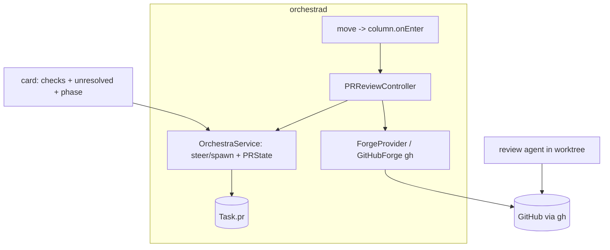
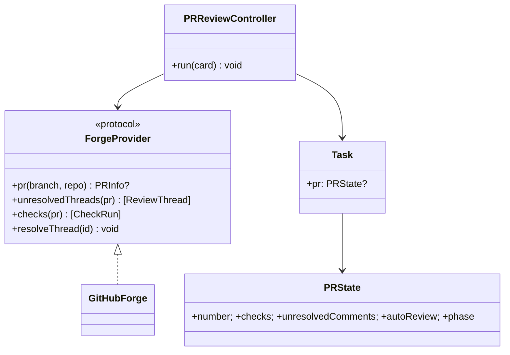

# Layer 2 — Contractual Design: Automated PR-Review Phase

> The **interfaces**: the column `onEnter` policy, the `ForgeProvider` (GitHub/`gh`), and the review-loop
> controller.

## Architecture overview

A `ColumnDef` (axis 1) gains an optional `onEnter` action. When `move` lands a card in a column whose
`onEnter == .prReview`, the daemon starts a `PRReviewController` for that card. The controller uses a
`ForgeProvider` (GitHub via `gh`) to resolve the card's branch → PR and fetch unresolved review threads +
failing checks, composes a task, and **steers the card's existing agent** (or spawns a fresh review agent)
with that context — fed via axis-3 `additionalContext`. It watches the agent's progress (axis-3
`ProgressItem`s) + re-polls the PR in a bounded loop, updating card PR-state, and escalates (marks for
human) when the PR is clean or the agent stalls. Auto-push is attended, bounded, and visible.

## Major classes / modules

| Name | Responsibility | Collaborators |
|------|----------------|---------------|
| `ColumnDef.onEnter` (extend axis 1) | Optional automation action per column (`prReview`, …) | `move`, controller |
| `PRReviewController` (new) | The bounded review loop per card; engage/poll/escalate | `ForgeProvider`, `OrchestraService` |
| `ForgeProvider` (new protocol) | Resolve PR + comments + checks; mark resolved | `GitHubForge` (gh) |
| `GitHubForge` (new) | `gh` implementation of `ForgeProvider` | `Proc` |
| `PRInfo` / `ReviewThread` / `CheckRun` (new models) | PR state snapshot | controller, card |
| `Task` (extend) | `pr: PRState?` (number, checks, unresolved count, autoReview flag) | board, inspector |
| `OrchestraService` (extend) | Start/stop controller on `move`; expose PR state | `PRReviewController` |

## Data model

```swift
public enum ColumnAction: String, Codable, Sendable { case none, prReview }   // ColumnDef.onEnter

public struct PRState: Codable, Sendable, Equatable {
    public var number: Int?            // resolved PR for the card's branch (nil = none found)
    public var checks: CheckSummary    // passing/failing/pending counts
    public var unresolvedComments: Int
    public var autoReview: Bool        // per-card opt-in (see open Q)
    public var phase: PRPhase          // idle | engaging | working | escalatedHuman | stuck
    public var lastReason: String?     // why escalated/stuck
}

public enum PRPhase: String, Codable, Sendable { case idle, engaging, working, escalatedHuman, stuck }
public struct CheckSummary: Codable, Sendable, Equatable { public var passing, failing, pending: Int }
```

`ReviewThread`/`CheckRun`/`PRInfo` are transient (fetched, not persisted); only the summarized `PRState`
lives on the card.

> **`onEnter` carrier (open):** whether the review column reuses the existing `Column.review` case or a new
> configurable-columns column with an `onEnter` policy is still open — see
> [[../stacked-branches-and-guardian-handoff|stacked-branches-and-guardian-handoff]] §8. Either way the
> controller is started **on the one card** (the review *phase*), not a co-tenant on its worktree (1:1).
>
> **Keystone (unbuilt):** the PR-context feed (below) rides `AdapterContext.additionalContext` — the single
> keystone seed field shared by handoff/fork/fan-out, **still absent from `main`**
> ([[../context-passing-topologies]] §1). The fresh-context-successor variant of the review phase is a
> *handoff* in that family's terms; building the seed first unblocks both.

## Function / method contracts

### `ForgeProvider` (protocol)
- `func pr(forBranch:in repo:) async throws -> PRInfo?` — resolve the open PR for a branch (nil if none).
- `func unresolvedThreads(_ pr:) async throws -> [ReviewThread]` — open review comments.
- `func checks(_ pr:) async throws -> [CheckRun]` — CI/check status.
- `func resolveThread(_ id:) async throws` — mark a thread resolved (GitHub).
- **GitHubForge:** all via `gh` (`gh pr view/list`, `gh api`) through `Proc`; typed error if `gh`
  missing/unauthed (degrade, never fabricate PR state).

### `PRReviewController.run(card:) async`
- **Does:** the bounded loop — fetch PR → if clean escalate-human; else compose context, steer/spawn the
  agent (`additionalContext`), wait for a push/progress, re-poll, increment cycle; on cycle-cap or
  agent-blocked → `stuck`/escalate. Updates `Task.pr` (PRState) + emits Activity at each phase change.
- **Inputs:** the card. **Outputs:** none (event-driven). **Side-effects:** spawns/steers an agent; pushes
  happen *in the agent*, not here. **Errors:** no PR / no `gh` → idle + note, not a throw.

### `OrchestraService.move` (extend)
- After the normal move, if the target column's `onEnter == .prReview` and the card's `pr.autoReview` is
  on, start `PRReviewController.run(card:)` (cancel any prior run for that card). Leaving the column cancels.

### `OrchestraService` PR surface
- `prState(ref) -> PRState?` (describe extension / `describe` includes it); `setAutoReview(ref, on:)`.

## Library / framework decisions

| Decision | Choice | Rationale | Alternatives considered |
|----------|--------|-----------|-------------------------|
| Forge access | `gh` CLI behind `ForgeProvider` | Already authed locally; argv via `Proc`; forge-agnostic seam | GitHub REST in-process (token mgmt) |
| Automation trigger | Column `onEnter` action (axis 1) | Reuses configurable columns; general | Hardcoded review-column behaviour |
| Agent engagement | Steer existing, else spawn review agent | Preserve context; spawn only when needed | Always a fresh reviewer |
| Loop safety | Bounded cycles + attended + visible + per-card opt-in | Auto-push is powerful | Unbounded/headless |
| PR state persistence | Summarized `PRState` on the card; threads transient | Keep `tasks.json` small | Persist full PR payloads |

## Diagrams

### Bird's-eye (components)



### Detailed (classes)



## Traceability → Layer 1

| L1 goal | Covered by |
|---------|-----------|
| Column `onEnter` automation policy | `ColumnDef.onEnter` (axis 1 extension) + `move` hook |
| PR awareness (comments + checks) | `ForgeProvider`/`GitHubForge` + `PRInfo`/`ReviewThread`/`CheckRun` |
| Review agent run with PR context | `PRReviewController` steer/spawn + axis-3 `additionalContext` |
| Bounded loop + escalation | `PRReviewController` cycle cap + `PRPhase.escalatedHuman`/`stuck` |
| PR state on the card | `Task.pr: PRState` (checks + unresolved + phase) |
| Never merge/approve | Controller escalates to human; no merge path |

## Decisions made

| Decision | Why | Rejected |
|----------|-----|----------|
| `ForgeProvider` seam, `gh` impl | Forge-agnostic; reuse local auth | Hardcode GitHub REST |
| Summarized `PRState` on the card | Small persistence; enough for board + loop | Persist full PR payloads |
| Reuse axis-3 `additionalContext` to feed PR context | One injection mechanism | Re-handed prompt each cycle |
| Escalate-only (no merge/approve) | Human keeps the final call | Auto-merge on green |

## Open questions — need your call

_All resolved at the 2026-06-26 gate:_ per-card auto-review toggle engaging on column entry · attended +
bounded auto-push (+ per-card confirm-each-push) · clean = checks green + threads resolved via `gh`.
