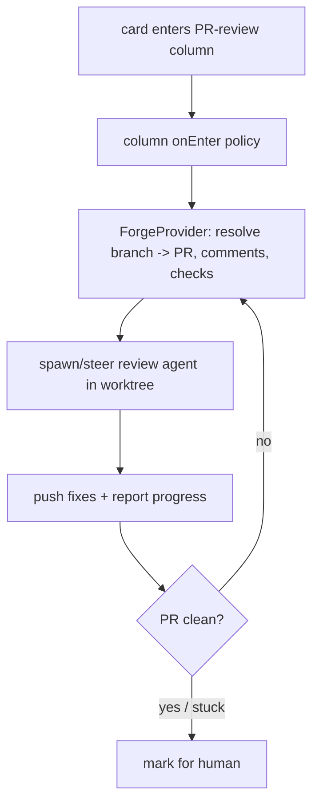

# Automated PR-Review Phase — Design Index

> Turn a board column into an **automated PR-review stage**: when a card enters it, an agent picks up the
> card's pull request, addresses review comments + failing checks in the worktree, pushes fixes, and loops
> until clean or it escalates to a human. Part of the [[extensibility-roadmap/index|extensibility roadmap]]
> (axis 5). Depends on [[../configurable-columns/index|configurable-columns]] (the column + `semantic`)
> and [[../agent-integration/index|agent-integration]] (progress reporting + context injection).

## Status vs `main` (2026-06-29)

> **Unbuilt** (design-only) — but two synthesis notes now frame it. The guardian/review agent is a
> **lifecycle phase of the one card, not a co-tenant on its worktree** — worktree↔card stays **1:1**
> throughout ([[../stacked-branches-and-guardian-handoff|stacked-branches-and-guardian-handoff]] §3). The
> phase has two shapes: (a) the **same card** continues into a review column (this axis), or (b) a
> **fresh-context successor** via handoff ([[../context-continuity/index|context-continuity]] new-linked-card
> mode) — a baton pass with exactly **one live owner at every instant**. The PR-context feed still rides the
> keystone **`AdapterContext.additionalContext` seed**, which remains **unbuilt** (the one missing field;
> [[../context-passing-topologies]] §1). The review column is a configurable-columns `onEnter` instance —
> open whether it reuses `Column.review` or a new configurable column. Two prerequisite bugs bear on the
> handoff shape (b): `require()` doesn't reject archived cards, and concurrent `restart` isn't serialized
> (see [[01-design]] risks).

## Layers

| Layer | Document | Status |
|-------|----------|--------|
| 1 — Initial design | [[01-design]] | approved |
| 2 — Contract | [[02-contract]] | approved |
| 3 — Implementation | [[03-implementation]] | not started (design-only pass) |
| 3 — Tests | [[04-tests]] | not started (design-only pass) |

> Design-only pass: L1+L2 approved 2026-06-26. Per-card auto-review toggle; attended bounded auto-push;
> clean = checks green + threads resolved via gh; escalate-only (no merge). Depends on axes 1 + 3.

## Current picture

## Open questions (rolled up)

_Resolved at the 2026-06-26 gate:_ per-card auto-review toggle engaging on column entry · attended +
bounded auto-push (+ confirm-each-push option) · clean = checks green + threads resolved via `gh` ·
GitHub via `gh` behind a `ForgeProvider` seam.

_Opened by the 2026-06-29 synthesis:_ does the review column reuse the existing `Column.review` case or a
new configurable column? ([[../stacked-branches-and-guardian-handoff|stacked-branches-and-guardian-handoff]]
§8.) · for the handoff shape (b), the successor inherits the worktree via an ownership transfer, not
sharing ([[../context-passing-topologies]] §3).
