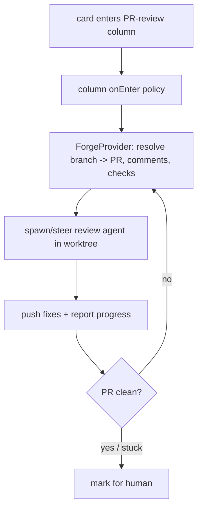

# Automated PR-Review Phase — Design Index

> Turn a board column into an **automated PR-review stage**: when a card enters it, an agent picks up the
> card's pull request, addresses review comments + failing checks in the worktree, pushes fixes, and loops
> until clean or it escalates to a human. Part of the [[extensibility-roadmap/index|extensibility roadmap]]
> (axis 5). Depends on [[../configurable-columns/index|configurable-columns]] (the column + `semantic`)
> and [[../agent-integration/index|agent-integration]] (progress reporting + context injection).

## Layers

| Layer | Document | Status |
|-------|----------|--------|
| 1 — Initial design | [[01-design]] | approved |
| 2 — Contract | [[02-contract]] | approved |
| 3 — Implementation | [[03-implementation]] | not started (design-only pass) |
| 3 — Tests | [[04-tests]] | not started (design-only pass) |

> Design-only pass: L1+L2 approved 2026-06-26. Per-card auto-review toggle; attended bounded auto-push;
> clean = checks green + threads resolved via gh; escalate-only (no merge). Depends on axes 1 + 3.

## Current picture

## Open questions (rolled up)

_Resolved at the 2026-06-26 gate:_ per-card auto-review toggle engaging on column entry · attended +
bounded auto-push (+ confirm-each-push option) · clean = checks green + threads resolved via `gh` ·
GitHub via `gh` behind a `ForgeProvider` seam.
