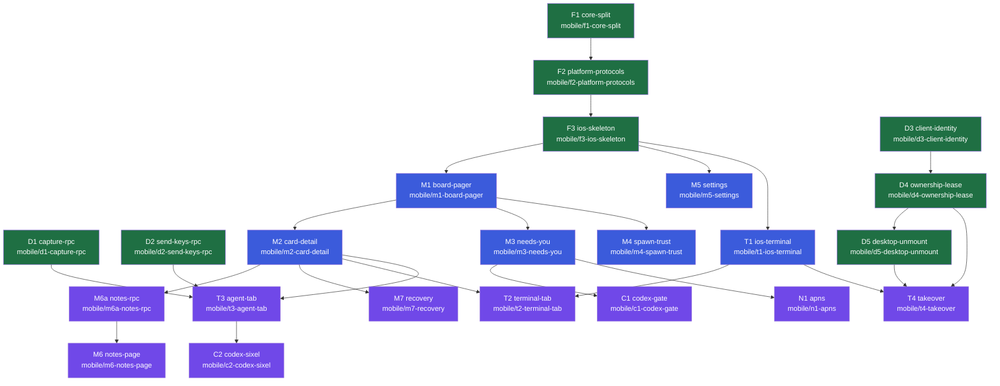

# Mobile Orchestra — Canonical PR Dependency Tree

> **This is the authoritative build order.** The orchestrator card (`c5056a`) and every plan/impl
> card MUST follow it. Full PR scope lives in
> [`2026-07-04-mobile-orchestra-implementation-forest.md`](2026-07-04-mobile-orchestra-implementation-forest.md);
> this file is the *dependency contract* — what stacks on what, and in what wave it plans/builds.

## Dependency graph

## Depends-on table (the contract)

| PR | Branch | Depends on (stacks on) | Plan wave |
|----|--------|------------------------|-----------|
| **F1** | `mobile/f1-core-split` | — (base) | **1** |
| **F2** | `mobile/f2-platform-protocols` | F1 | **1** |
| **F3** | `mobile/f3-ios-skeleton` | F2 | **1** |
| **D1** | `mobile/d1-capture-rpc` | — | **1** |
| **D2** | `mobile/d2-send-keys-rpc` | — | **1** |
| **D3** | `mobile/d3-client-identity` | — | **1** |
| **D4** | `mobile/d4-ownership-lease` | D3 | **1** |
| **D5** | `mobile/d5-desktop-unmount` | D4 | **1** |
| M1 | `mobile/m1-board-pager` | F3 | 2 |
| M5 | `mobile/m5-settings` | F3 | 2 |
| T1 | `mobile/t1-ios-terminal` | F3 | 2 |
| M2 | `mobile/m2-card-detail` | M1 | 2 |
| M3 | `mobile/m3-needs-you` | M1 | 2 |
| M4 | `mobile/m4-spawn-trust` | M1 | 2 |
| M6a | `mobile/m6a-notes-rpc` | M2 | 3 |
| M6 | `mobile/m6-notes-page` | M6a | 3 |
| M7 | `mobile/m7-recovery` | M2 | 3 |
| T2 | `mobile/t2-terminal-tab` | T1, M2 | 3 |
| T3 | `mobile/t3-agent-tab` | M2, D1, D2 | 3 |
| T4 | `mobile/t4-takeover` | T1, D4, D5 | 3 |
| C1 | `mobile/c1-codex-gate` | M3 | 3 |
| C2 | `mobile/c2-codex-sixel` | T3 | 3 |
| N1 | `mobile/n1-apns` | M3 | 3 |

## Wave schedule (planning AND implementation follow this)

- **Wave 1 (now):** F1, F2, F3, D1, D2, D3, D4, D5 — the foundation + daemon spine. Fan out plan
  cards; background-wait; spot-check coherence (esp. F1's `OrchestraKit` module boundary, which
  F2/F3 and every iOS card consume).
- **Wave 2 (after Wave 1 plans land + reconcile):** M1, M5, T1, then M2, M3, M4.
- **Wave 3 (after Wave 2):** M6a→M6, M7, T2, T3, T4, C1, C2, N1.

## Implementation stacking rule (Phase C)

A PR's implementation branch is cut **off its dependency's branch**, not off `main`, wherever the
depends-on column names a PR (e.g. `mobile/f2-*` is cut off `mobile/f1-*`; `mobile/t4-*` is cut off
`mobile/t1-*` and must also carry D4/D5's daemon changes — merge order: D-track before T4). Where a
PR has **multiple** dependencies (T2, T3, T4), it is cut off the **primary code dependency** (the iOS
branch) and the others (daemon RPCs) must already be **merged to main** first. The orchestrator
sequences merges so daemon PRs (D1–D5) land before the iOS PRs that consume them.
